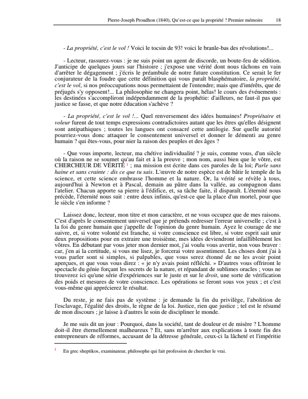

**Executive Summary**\
Pierre‐Joseph Proudhon (1809--1865) reconceived socialism as *anti‑state* and market‐friendly, coining the slogan "property is theft!"[\[1\]](https://en.wikipedia.org/wiki/Pierre-Joseph_Proudhon#:~:text=Proudhon%2C%20who%20was%20born%20in,Their%20friendship) yet refusing to "abolish" property by decree[\[2\]](https://www.marxists.org/reference/subject/economics/proudhon/1927/the-solution-of-the-social-problem-excerpts.html#:~:text=I%20protest%20that%20in%20criticizing,rent%20and%20interest%20on%20capital). He distinguished **property** (exploitative, absentee ownership) from **possession** (personal use‐rights)[\[3\]](https://openlibrary.org/works/OL960281W/Qu%27est-ce_que_la_propri%C3%A9t%C3%A9#:~:text=In%20this%20treatise%2C%20Proudhon%20contrasts,based%20on%20free%20market%20exchanges), arguing that only labor creates value and that society should guarantee workers the *whole product* of their labor. Unlike state socialists, Proudhon's *mutualism* envisioned **markets without capitalism**: a federation of worker associations, exchanging products at cost‐price, financed by mutual credit banks that would issue loans virtually **interest-free**[\[4\]](https://www.marxists.org/reference/subject/economics/proudhon/1927/the-solution-of-the-social-problem-excerpts.html#:~:text=Article%209,to%20man%20by%20nature%20gratuitously)[\[5\]](https://www.marxists.org/reference/subject/economics/proudhon/1927/the-solution-of-the-social-problem-excerpts.html#:~:text=In%20consequence%2C%20the%20People%E2%80%99s%20Bank,agreement%20of%20producers%20and%20consumers). In this way, profit, rent, and usury would be *neutralized* -- not by government fiat, but by competition and contract ("reciprocity") among freely associated producers[\[6\]](https://www.marxists.org/reference/subject/economics/proudhon/1927/the-solution-of-the-social-problem-excerpts.html#:~:text=any%20obstacle%20to%20the%20free,rent%20and%20interest%20on%20capital)[\[7\]](https://technostism.fandom.com/wiki/Mutualism#:~:text=Mutualists%20have%20distinguished%20mutualism%20from%C2%A0state,10). Proudhon's program -- sketched in *What Is Property?* (1840) and refined through the 1840s -- thus aimed to achieve the traditional goals of socialism (ending exploitation, empowering labor) *without* state ownership or the abolition of exchange. Instead, mutualists proposed to **"socialize" the effects of capital** by universalizing access to it[\[7\]](https://technostism.fandom.com/wiki/Mutualism#:~:text=Mutualists%20have%20distinguished%20mutualism%20from%C2%A0state,10). Proudhon's anti‑authoritarian vision powerfully influenced later anarchists and libertarian socialists[\[8\]](https://en.wikipedia.org/wiki/Pierre-Joseph_Proudhon#:~:text=to%20create%20a%20national%20bank,10), even as it provoked sharp critiques from Marxists and orthodox liberals. This report examines Proudhon's ideas on property, exchange, and mutual credit in context, contrasting them with contemporary experiments (Owenite co‐operatives) and assessing their practical trials and theoretical reception.

**Timeline of Key Texts, Schemes & Events (1840--1870)**

  ---------------------------------------------------------------------------------------------------------------------------------------------------------------------------------------------------------------------------------------------------------------------------------------------------------------------------------------------------------------------------------------------------------------------------------------------------------------------------------------------------------------------------------------------------------------------------------------------------------------------------------------------
  **Date**                **Event or Publication**                                                                                 **Relevance** *(note)*
  ----------------------- -------------------------------------------------------------------------------------------------------- ------------------------------------------------------------------------------------------------------------------------------------------------------------------------------------------------------------------------------------------------------------------------------------------------------------------------------------------------------------------------------------------------------------------------------------------------------------------------------------------------------------
  1840                    *Qu'est-ce que la propriété ?* (*What Is Property?*) published                                           Proudhon denounces property as theft; foundational mutualist text[\[1\]](https://en.wikipedia.org/wiki/Pierre-Joseph_Proudhon#:~:text=Proudhon%2C%20who%20was%20born%20in,Their%20friendship).

  1844                    Rochdale Society of Equitable Pioneers founded (England)                                                 Consumer co‑op established on "equitable" principles; prototype for co‐operative movement.

  1846                    *Système des contradictions économiques* (*System of Economic Contradictions*)                           Proudhon's two-volume work ("Philosophy of Poverty") analyzing capitalism's oppositions; prompts Marx's rebuttal[\[9\]](https://en.wikipedia.org/wiki/Pierre-Joseph_Proudhon#:~:text=other%20and%20they%20met%20in,13).

  1848                    Revolution in France; Proudhon elected to Constituent Assembly                                           Proudhon presses for economic reforms (free credit) in parliament[\[10\]](https://en.wikipedia.org/wiki/Pierre-Joseph_Proudhon#:~:text=Pierre,Proudhon%20described%20the); begins **Banque du Peuple** project.

  1849                    **People's Bank** launched by Proudhon in Paris (Jan.)                                                   Mutual credit bank attracts 13,000+ subscribers (mostly workers)[\[11\]](https://technostism.fandom.com/wiki/Mutualism#:~:text=himself%20as%20a%20political%20outsider%2C,Proudhon%20ran%20for%20the%C2%A0constituent%20assembly%C2%A0in); shut down by authorities amid political clampdown (Proudhon imprisoned[\[12\]](https://theanarchistlibrary.org/library/charles-a-dana-proudhon-and-his-bank-of-the-people#:~:text=Since%20his%20imprisonment%20for%20libel,provoke%20only%20a%20smile%20from)).

  1850                    William B. Greene publishes *Mutual Banking* (Boston)                                                    American adaption of Proudhon's credit ideas; proposes **free currency** and interest-free loans[\[13\]](https://spartacus-educational.com/USAgreeneW.htm#:~:text=After%20reading%20the%20work%20of,and%20the%20abolition%20of%20slavery)[\[14\]](https://spartacus-educational.com/USAgreeneW.htm#:~:text=Greene%20also%20worked%20closely%20with,basis%20of%20justice%20and%20reciprocity).

  1851                    *Idée générale de la Révolution au XIXe siècle* (*General Idea of the Revolution in the 19th Century*)   Proudhon's manifesto for an anarchistic order of "free contract" and "industrial federation"[\[15\]](https://www.marxists.org/archive/plekhanov/1895/anarch/ch04.htm#:~:text=weakening%2C%20and%20gradually%20eliminating%20the,The%20political%20constitution%20was); elaborates mutualist institutions (People's Bank, agro-industrial federation).

  1864                    First International (IWMA) founded in London                                                             International forum uniting Proudhonians, Marxists, Owenites; spreads debates on credit and co‑operation.

  1865                    Death of Proudhon (Paris, 19 Jan.)                                                                       Leaves a legacy of **libertarian socialist** thought (influencing Bakunin, Kropotkin, Tucker)[\[8\]](https://en.wikipedia.org/wiki/Pierre-Joseph_Proudhon#:~:text=to%20create%20a%20national%20bank,10).

  1869                    New England Labor Reform League adopts mutualist principles (USA)                                        American labor federation led by mutualists (Greene vice-president) demands "free credit... justice and reciprocity"[\[16\]](https://spartacus-educational.com/USAgreeneW.htm#:~:text=efforts%2C%20permeated%20with%20Proudhonian%20ideas,International%20Working%20Men%27s%20Association%20in); petitions for mutual banking law (unsuccessful in 1870--73)[\[17\]](https://spartacus-educational.com/USAgreeneW.htm#:~:text=,was%20lost%20in%20a%20shipwreck).
  ---------------------------------------------------------------------------------------------------------------------------------------------------------------------------------------------------------------------------------------------------------------------------------------------------------------------------------------------------------------------------------------------------------------------------------------------------------------------------------------------------------------------------------------------------------------------------------------------------------------------------------------------

**Mini-Profile: Pierre-Joseph Proudhon**\
**Brief Biography:** P.-J. Proudhon was a French printer-turned-philosopher, famed as the first self-declared *anarchist*[\[10\]](https://en.wikipedia.org/wiki/Pierre-Joseph_Proudhon#:~:text=Pierre,Proudhon%20described%20the) and founder of **mutualism**[\[10\]](https://en.wikipedia.org/wiki/Pierre-Joseph_Proudhon#:~:text=Pierre,Proudhon%20described%20the). Born in Besançon to a humble family, he taught himself Latin and worked as a pressman[\[18\]](https://theanarchistlibrary.org/library/charles-a-dana-proudhon-and-his-bank-of-the-people#:~:text=P,2%5D%20As%20a%20student%2C%20he)[\[19\]](https://theanarchistlibrary.org/library/charles-a-dana-proudhon-and-his-bank-of-the-people#:~:text=It%20was%20not%20long%20before,into%20the%20obscurities%20of%20the). His early prize-winning essay on the Sabbath (1839) showed a non-conformist streak[\[20\]](https://theanarchistlibrary.org/library/charles-a-dana-proudhon-and-his-bank-of-the-people#:~:text=While%20toiling%20in%20this%20double,comprehend%20him%2C%20that%20is%20all). In 1840 Proudhon's explosive debut *What Is Property?* made him notorious (prompting a French prosecutor to ask, "Is the author allowed to say *Property is theft*?")[\[21\]](https://cras31.info/IMG/pdf/proudhon_la_proprietef.pdf#:~:text=opinions%20enti%C3%A8rement%20oppos%C3%A9es%20aux%20principes,lecteur%20de%20ne%20pas%20mesurer)[\[22\]](https://cras31.info/IMG/pdf/proudhon_la_proprietef.pdf#:~:text=sur%20vos%20intentions,vous%20aviez%20persist%C3%A9%20%C3%A0%20la). Active in the 1848 Revolution, he was elected to the National Assembly[\[10\]](https://en.wikipedia.org/wiki/Pierre-Joseph_Proudhon#:~:text=Pierre,Proudhon%20described%20the) but jailed for criticizing Louis Bonaparte. He died in 1865.

**Core Writings:** *What Is Property?* (1840) -- his first memoir attacking the moral basis of private property; *System of Economic Contradictions* (1846) -- a two-volume critique of political economy (dubbed *Philosophy of Poverty* by Marx); *Solution of the Social Problem* (1848) -- proposals for free credit (People's Bank)[\[4\]](https://www.marxists.org/reference/subject/economics/proudhon/1927/the-solution-of-the-social-problem-excerpts.html#:~:text=Article%209,to%20man%20by%20nature%20gratuitously)[\[5\]](https://www.marxists.org/reference/subject/economics/proudhon/1927/the-solution-of-the-social-problem-excerpts.html#:~:text=In%20consequence%2C%20the%20People%E2%80%99s%20Bank,agreement%20of%20producers%20and%20consumers); *General Idea of the Revolution in the 19th Century* (1851) -- programmatic vision of an anarchist society of federations[\[15\]](https://www.marxists.org/archive/plekhanov/1895/anarch/ch04.htm#:~:text=weakening%2C%20and%20gradually%20eliminating%20the,The%20political%20constitution%20was); and later works on justice and federation (e.g. *De la Justice*, 1858; *Theory of Property*, 1863).

**Key Theses on Property & Exchange:** Proudhon's central claim -- "**Property is theft!**" -- encapsulated his view that the absolute right of property (defined in law as *jus utendi et abutendi*, the right to use *and* abuse) enables owners to appropriate others' labor[\[23\]](https://www.marxists.org/reference/subject/economics/proudhon/property/ch02.htm#:~:text=Archive%20www,su%C3%A2%2C%20guatenus%20juris%20ratio)[\[24\]](https://kwize.com/en/themes/property/#:~:text=property%3A%20Quotes%20%26%20Texts%20,and%20consumption%2C%20and%20the). He distinguished this *exclusive, perpetual* dominion from mere **possession**, or limited use rights tied to personal occupancy or work[\[3\]](https://openlibrary.org/works/OL960281W/Qu%27est-ce_que_la_propri%C3%A9t%C3%A9#:~:text=In%20this%20treatise%2C%20Proudhon%20contrasts,based%20on%20free%20market%20exchanges). "The farmer, the manufacturer, the colonist," he argued, have a natural claim to the fruits of their toil -- but the *propriétaire* who draws rent or interest in absence of labor is essentially a **privileged parasite**[\[3\]](https://openlibrary.org/works/OL960281W/Qu%27est-ce_que_la_propri%C3%A9t%C3%A9#:~:text=In%20this%20treatise%2C%20Proudhon%20contrasts,based%20on%20free%20market%20exchanges)[\[25\]](https://en.wikipedia.org/wiki/Pierre-Joseph_Proudhon#:~:text=Proudhon%20favored%20workers%27%20councils%20,diverged%20into%20%20168%20individualist). Proudhon extolled *reciprocity* in exchange: true value equals labor time, so all exchanges should return an equivalent amount of labor (the **"cost principle"**). "Markets" per se were not the problem -- what he opposed was **capitalist market society** where state-sanctioned monopolies (property titles, money, patents, etc.) let one class live off others' labor[\[25\]](https://en.wikipedia.org/wiki/Pierre-Joseph_Proudhon#:~:text=Proudhon%20favored%20workers%27%20councils%20,diverged%20into%20%20168%20individualist). In a famous riposte to socialist critics, Proudhon wrote: *"I have never intended to attack individual rights...or to forbid or suppress, by sovereign decree, ground rent and interest on capital. I think all these manifestations of human activity should remain free and voluntary for all -- subject only to the natural effects of universalizing the principle of reciprocity which I propose."*[\[2\]](https://www.marxists.org/reference/subject/economics/proudhon/1927/the-solution-of-the-social-problem-excerpts.html#:~:text=I%20protest%20that%20in%20criticizing,rent%20and%20interest%20on%20capital)[\[26\]](https://technostism.fandom.com/wiki/Mutualism#:~:text=Mutualists%20oppose%20the%20idea%20of,ensure%20the%20worker%27s%20right%20to) In short, Proudhon believed **free competition** (absent privilege) would *naturally* reduce profit, rent, and interest to **zero**[\[7\]](https://technostism.fandom.com/wiki/Mutualism#:~:text=Mutualists%20have%20distinguished%20mutualism%20from%C2%A0state,10). This vision of *market socialism* distinguished Proudhon from both the authoritarian communists and the laissez-faire liberals of his age.

**Subsequent Influence:** Proudhon's ideas seeded major wings of libertarian socialism. His concept of federated worker associations influenced Bakunin and the anarcho-syndicalists, while his emphasis on individual liberty and free exchange inspired American individualist anarchists like Benjamin Tucker[\[8\]](https://en.wikipedia.org/wiki/Pierre-Joseph_Proudhon#:~:text=to%20create%20a%20national%20bank,10). By the late 19th century, strands of anarchist thought -- communist, collectivist, mutualist -- all drew on Proudhonian themes of anti-statism, voluntary federation, and the critique of usury. His famous aphorism "Anarchy is Order"[\[27\]](https://encyclopedia.pub/entry/34691#:~:text=manner,free%20loans.%5B%2030) remains a watchword of the anti-authoritarian left. (Proudhon is often dubbed *"father of anarchism,"* though he himself disowned any disciples, quipping: "Whoever puts his hand on me to govern me is a usurper."\<sup\>1\</sup\>)

**Close Reading of *What Is Property?***\
*Summary of Chapter I ("Property is Theft!"):* In the opening chapter of *What Is Property?* (1840), Proudhon sets out to prove that the accepted foundations of private property are contradictory and unjust. He reviews and refutes the standard justifications -- occupation (first claim), natural right, and legal sanction -- finding none can legitimize an owner's absolute domain over land or goods he does not personally use[\[3\]](https://openlibrary.org/works/OL960281W/Qu%27est-ce_que_la_propri%C3%A9t%C3%A9#:~:text=In%20this%20treatise%2C%20Proudhon%20contrasts,based%20on%20free%20market%20exchanges). Notably, Roman law defined *dominium* as *jus utendi et abutendi* -- the right to use and even destroy one's property[\[23\]](https://www.marxists.org/reference/subject/economics/proudhon/property/ch02.htm#:~:text=Archive%20www,su%C3%A2%2C%20guatenus%20juris%20ratio). Proudhon seizes on this "right to abuse" as emblematic of property's despotic character[\[23\]](https://www.marxists.org/reference/subject/economics/proudhon/property/ch02.htm#:~:text=Archive%20www,su%C3%A2%2C%20guatenus%20juris%20ratio). Through a series of rational paradoxes, he argues that property enables the "theft" of labor: since labor alone produces value, any income from mere ownership (rent, interest, profit) is value taken without equivalent exchange[\[3\]](https://openlibrary.org/works/OL960281W/Qu%27est-ce_que_la_propri%C3%A9t%C3%A9#:~:text=In%20this%20treatise%2C%20Proudhon%20contrasts,based%20on%20free%20market%20exchanges). His oft-misunderstood slogan "property is theft" thus means that the proprietary claim to reap what one has not sown is essentially *plunder* -- made legal only by convention and force. Proudhon contrasts this with **possession** (the worker's or peasant's legitimate occupancy and use of resources), which he deems a "natural right." He concludes that an economic regime of small holdings and organized exchange could retain possession for individuals while abolishing the tyranny of property[\[3\]](https://openlibrary.org/works/OL960281W/Qu%27est-ce_que_la_propri%C3%A9t%C3%A9#:~:text=In%20this%20treatise%2C%20Proudhon%20contrasts,based%20on%20free%20market%20exchanges). Chapter I's provocative thesis -- far from advocating chaos or robbery -- actually appeals to a higher form of justice: *"If property can exist only by robbing the worker, then property is impossible"* (Proudhon argues)[\[3\]](https://openlibrary.org/works/OL960281W/Qu%27est-ce_que_la_propri%C3%A9t%C3%A9#:~:text=In%20this%20treatise%2C%20Proudhon%20contrasts,based%20on%20free%20market%20exchanges). This startling claim set the tone for the book, forcing readers to rethink the morality of ownership from the ground up.

*Two Key Passages:*

• **Property vs. Possession:** Proudhon incisively differentiates the terms: *"The Romans, by the word* property*, understood the right to* use and abuse *one's goods --* jus utendi et abutendi*[\[23\]](https://www.marxists.org/reference/subject/economics/proudhon/property/ch02.htm#:~:text=Archive%20www,su%C3%A2%2C%20guatenus%20juris%20ratio)... I protest that the only natural, honorable form of property is* *possession; whoever labors is a possessor, but the proprietor (who exploits the labor of others) is a thief."* In Chapter II, he gives an example: *"The farmer who cultivates the land* possesses *it -- he has an undoubted right to the product of his toil. But the absentee landlord who demands rent* property *is his title -- a legal fiction, by which he harvests where he has not sown"*[\[3\]](https://openlibrary.org/works/OL960281W/Qu%27est-ce_que_la_propri%C3%A9t%C3%A9#:~:text=In%20this%20treatise%2C%20Proudhon%20contrasts,based%20on%20free%20market%20exchanges). By such analysis, Proudhon shows that *possession* (limited, conditional, and earned by use) can be justified, whereas *property* (absolute and transmissible without labor) cannot.

> *« La propriété, c'est le droit d'user et d'abuser... »*[\[23\]](https://www.marxists.org/reference/subject/economics/proudhon/property/ch02.htm#:~:text=Archive%20www,su%C3%A2%2C%20guatenus%20juris%20ratio), *écrit Proudhon, soulignant que ce droit illimité n'appartient qu'au propriétaire par la loi. En revanche, « l'occupation et le travail » fondent une simple* *possession* *-- l'ouvrier use du sol ou de l'outil tant qu'il en a besoin, sans titre d'abus[\[3\]](https://openlibrary.org/works/OL960281W/Qu%27est-ce_que_la_propri%C3%A9t%C3%A9#:~:text=In%20this%20treatise%2C%20Proudhon%20contrasts,based%20on%20free%20market%20exchanges).*\
> *("Property is the right to use and to abuse \[one's own\]..." writes Proudhon, underscoring that this unlimited right is conferred on the proprietor by law. By contrast, "occupation and labor" establish only* *possession* *-- the worker uses the land or tool as long as needed, without any license to abuse.)*[\[3\]](https://openlibrary.org/works/OL960281W/Qu%27est-ce_que_la_propri%C3%A9t%C3%A9#:~:text=In%20this%20treatise%2C%20Proudhon%20contrasts,based%20on%20free%20market%20exchanges)

• **Reciprocity in Exchange:** Proudhon invokes the principle of equivalent exchange as the cornerstone of justice in commerce: *"All* value *originates in labor; thus, in a just society, the* *only* *legitimate exchange is one of labor for labor[\[3\]](https://openlibrary.org/works/OL960281W/Qu%27est-ce_que_la_propri%C3%A9t%C3%A9#:~:text=In%20this%20treatise%2C%20Proudhon%20contrasts,based%20on%20free%20market%20exchanges). To speak plainly, the product of one man's toil should be worth the product of another's -- no more, no less."* He gives this moral law a contractual form: *"Do unto others as you would have done unto you -- in trade, this means price every good by the labor that produced it"*. In *What Is Property?* he asserts that in a true free market (*marché synallagmatique*), *"every exchange is an act of mutual surrender (*mutuum*) between laborers...* *Reciprocity* *is thus the only rule -- I owe you for what* you *have done, as you owe me for what* I *have done"*[\[15\]](https://www.marxists.org/archive/plekhanov/1895/anarch/ch04.htm#:~:text=weakening%2C%20and%20gradually%20eliminating%20the,The%20political%20constitution%20was)[\[28\]](https://technostism.fandom.com/wiki/Mutualism#:~:text=support%C2%A0markets%C2%A0,advocating%C2%A0personal%20property%2C%20but%20not%C2%A0private%20property). This idea would later blossom into Proudhon's proposals for *people's banks* and labor notes, ensuring that all trades yield equal labor on both sides.

> **Source:** Pierre-Joseph Proudhon. *Qu'est-ce que la propriété ?* (Paris, 1840), Chapter I. English trans. in **What Is Property?** (trans. B.R. Tucker, 1876), p. 117: "Property is the right to use and abuse one's own within the limits of the law... It is in this sense of absolute domain that I undertake to prove that property, in the full Roman and juridical sense, is a theft on the part of the non-laborer from the laborer"[\[29\]](https://en.wikisource.org/wiki/Page:What_is_Property%3F.pdf/334#:~:text=library%20en,If%2C%20then%2C%20government%20is). *(Gallica link: Archives,* *What Is Property?* *1840 *{width="5.833333333333333in" height="7.549019028871391in"}\
> *)*

**Mutual-Credit Blueprint**\
At the heart of Proudhon's social revolution was a bold financial mechanism: the **Banque du Peuple** or People's Bank, a scheme for mutual credit. The concept is best understood step by step:

-   **Formation:** A cooperative banking association is formed by workers, farmers, and small producers (in 1849, Proudhon himself filed formal statutes for such a bank in Paris[\[30\]](https://www.marxists.org/reference/subject/economics/proudhon/1927/the-solution-of-the-social-problem-excerpts.html#:~:text=)). Members agree to **mutually guarantee** each other's credit.

-   **Capital & Shares:** In principle, *no large starting capital is needed*. The bank was to begin with shares (Proudhon suggested 5 franc shares) to cover initial operations[\[31\]](https://www.marxists.org/reference/subject/economics/proudhon/1927/the-solution-of-the-social-problem-excerpts.html#:~:text=Article%2010,stock%20of%20five%20francs%20each)[\[32\]](https://www.marxists.org/reference/subject/economics/proudhon/1927/the-solution-of-the-social-problem-excerpts.html#:~:text=The%20Company%20will%20be%20definitely,shall%20have%20been%20subscribed%20for). Proudhon's 1848 prospectus held that since all wealth comes from labor, *"capital is by nature unproductive"* and credit should not incur interest[\[4\]](https://www.marxists.org/reference/subject/economics/proudhon/1927/the-solution-of-the-social-problem-excerpts.html#:~:text=Article%209,to%20man%20by%20nature%20gratuitously). **"The People's Bank could and should operate without capital,"** he wrote, basing itself on *gratuité du crédit* (interest-free loans)[\[33\]](https://www.marxists.org/reference/subject/economics/proudhon/1927/the-solution-of-the-social-problem-excerpts.html#:~:text=That%20as%20every%20transaction%20of,give%20rise%20to%20any%20interest). Any share capital raised was only to reassure the public and satisfy legal formalities[\[5\]](https://www.marxists.org/reference/subject/economics/proudhon/1927/the-solution-of-the-social-problem-excerpts.html#:~:text=In%20consequence%2C%20the%20People%E2%80%99s%20Bank,agreement%20of%20producers%20and%20consumers).

-   **Issuing Currency:** The bank issues its own paper money -- **circulating notes** (billets d'échange). Uniquely, these **are not redeemable in gold** on demand (unlike ordinary banknotes)[\[34\]](https://www.marxists.org/reference/subject/economics/proudhon/1927/the-solution-of-the-social-problem-excerpts.html#:~:text=consulted%20with%20the%20Supervisory%20Council)[\[35\]](https://www.marxists.org/reference/subject/economics/proudhon/1927/the-solution-of-the-social-problem-excerpts.html#:~:text=5,by%20all%20members%20and%20supporters). Instead, they are **"payable at sight" in the *products or services* of any participating member**[\[34\]](https://www.marxists.org/reference/subject/economics/proudhon/1927/the-solution-of-the-social-problem-excerpts.html#:~:text=consulted%20with%20the%20Supervisory%20Council). In other words, the currency is backed by the *collective goods and labor* of the network. Every member agrees to accept the notes for payment -- effectively creating a broad mutual acceptance circle[\[35\]](https://www.marxists.org/reference/subject/economics/proudhon/1927/the-solution-of-the-social-problem-excerpts.html#:~:text=5,by%20all%20members%20and%20supporters)[\[36\]](https://www.marxists.org/reference/subject/economics/proudhon/1927/the-solution-of-the-social-problem-excerpts.html#:~:text=Article%2021,members%20or%20fellow%20supporters%20exclusively).

-   **Credit Operations:** Members in need of loans can borrow the bank's notes by pledging collateral or promising future work. The People's Bank offered *multiple forms of advance*: discounting of bills (commercial IOUs), loans on consignments of goods, mortgages on real estate, and even credit lines for workers' associations[\[37\]](https://www.marxists.org/reference/subject/economics/proudhon/1927/the-solution-of-the-social-problem-excerpts.html#:~:text=Article%2015,the%20Bank%20are)[\[38\]](https://www.marxists.org/reference/subject/economics/proudhon/1927/the-solution-of-the-social-problem-excerpts.html#:~:text=6,mortgages). A farmer might mortgage his land or a cooperative might pledge its products; in return, the bank issues them a sum in notes.

-   **Cost of Credit:** Instead of interest, the bank charges only a small **fee to cover administrative expenses** (Proudhon estimated this at 1% or less per annum)[\[39\]](https://theanarchistlibrary.org/library/william-batchelder-greene-mutual-banking#:~:text=match%20at%20L928%20As%20interest,to%20persons%20offering%20good%20security)[\[40\]](https://theanarchistlibrary.org/library/william-batchelder-greene-mutual-banking#:~:text=as%20the%20system%20of%20mutual,he%20should%20borrow%20at%20the). This fee is to pay clerks, printing, and losses, not to enrich shareholders (in Proudhon's plan, shares paid no dividend[\[41\]](https://www.marxists.org/reference/subject/economics/proudhon/1927/the-solution-of-the-social-problem-excerpts.html#:~:text=Article%2011,the%20office%20of%20the%20Company)). By design, the **interest rate is effectively 0** -- "the discount of notes cannot and should not give rise to any interest"[\[6\]](https://www.marxists.org/reference/subject/economics/proudhon/1927/the-solution-of-the-social-problem-excerpts.html#:~:text=any%20obstacle%20to%20the%20free,rent%20and%20interest%20on%20capital)[\[33\]](https://www.marxists.org/reference/subject/economics/proudhon/1927/the-solution-of-the-social-problem-excerpts.html#:~:text=That%20as%20every%20transaction%20of,give%20rise%20to%20any%20interest). The aim is to **neutralize usury**, making credit a public utility.

-   **Reciprocity & Obligation:** Each member is *both* a potential borrower and a market for others. Proudhon's bank rules stipulated that *every member promises to accept the Bank's notes at par for their goods*, and, whenever possible, to trade with fellow members preferentially[\[35\]](https://www.marxists.org/reference/subject/economics/proudhon/1927/the-solution-of-the-social-problem-excerpts.html#:~:text=5,by%20all%20members%20and%20supporters)[\[36\]](https://www.marxists.org/reference/subject/economics/proudhon/1927/the-solution-of-the-social-problem-excerpts.html#:~:text=Article%2021,members%20or%20fellow%20supporters%20exclusively). This reciprocity "locks in" the value of the currency: so long as members keep faith, the notes are as good as the products on the co-op shelves.

-   **Security:** What guarantees the bank's notes? Proudhon outlined five layers of backing[\[42\]](https://www.marxists.org/reference/subject/economics/proudhon/1927/the-solution-of-the-social-problem-excerpts.html#:~:text=Article%2018,of%20his%20industry%20or%20profession)[\[43\]](https://www.marxists.org/reference/subject/economics/proudhon/1927/the-solution-of-the-social-problem-excerpts.html#:~:text=2,the%20capital%20of%20the%20Bank): (1) the **bills and mortgages** the bank holds (debtors' promises to pay in future goods or money); (2) any specie (coin) reserve from share capital or note sales; (3) other assets like insurance or deposits; (4) crucially, the **"mutual promise of acceptance" by all members** -- a social guarantee that the notes will buy something of real value from someone[\[35\]](https://www.marxists.org/reference/subject/economics/proudhon/1927/the-solution-of-the-social-problem-excerpts.html#:~:text=5,by%20all%20members%20and%20supporters); and (5) ultimately, the bank can require repayment in its own notes (not gold), avoiding external drains[\[44\]](https://theanarchistlibrary.org/library/william-batchelder-greene-mutual-banking#:~:text=4,to%20recieve%2C%20or%20have%20in)[\[45\]](https://theanarchistlibrary.org/library/william-batchelder-greene-mutual-banking#:~:text=8,Bank%20money%2C%20as%20such).

In essence, the People's Bank is a **clearing network**: members swap IOUs, mediated by the bank's currency. By agreeing to honor each other's notes, they create a *circle of trust* in which money need not be gold or state-issued paper -- it becomes a symbol of labor and goods in circulation. Proudhon compared it to a giant credit **mutual insurance** scheme: default risk is spread and minimized by collective oversight and the fact that credit is extended only against real values (land, goods, work done). If one member fails, the loss is shared -- but with thousands of members, no single failure is ruinous.

Two primary documents illustrate the mutual-credit plan. First, in an 1848 letter to the finance minister, Proudhon explained: *"We ask nothing from the State but a legal charter... We wish to* *establish a bank* *where every worker's signature shall be worth as much as a banker's, where credit shall be* gratuitous*, available to all producers. The Bank will discount our bills -- and we, in turn,* *guarantee* *the Bank's paper by accepting it for* all *our exchanges."*[\[46\]](https://www.marxists.org/reference/subject/economics/proudhon/1927/the-solution-of-the-social-problem-excerpts.html#:~:text=The%20People%E2%80%99s%20Bank%20is%20but,Republican%20motto%2C%20Liberty%2C%20Equality%2C%20Fraternity)[\[33\]](https://www.marxists.org/reference/subject/economics/proudhon/1927/the-solution-of-the-social-problem-excerpts.html#:~:text=That%20as%20every%20transaction%20of,give%20rise%20to%20any%20interest) This captures the revolutionary egalitarianism of his proposal: **credit for all, on the same terms**.

Second, William B. Greene's *Mutual Banking* (Boston, 1850) rephrased Proudhon's idea for American readers and even drafted a law for it. Greene's model **petition** to the Massachusetts legislature asked that "any number of persons in any town may organize a Mutual Banking Company"[\[47\]](https://theanarchistlibrary.org/library/william-batchelder-greene-mutual-banking#:~:text=Commonwealth%2C%20may%20organize%20themselves%20into,a%20Mutual%20Banking%20Company). Each member would *pledge real estate* as security, and *bind themselves to accept the bank's notes* at par in all transactions[\[48\]](https://theanarchistlibrary.org/library/william-batchelder-greene-mutual-banking#:~:text=match%20at%20L862%204,to%20recieve%2C%20or%20have%20in). The bank could then issue **paper money based on these pledges**, and *"any member may borrow the paper money on his mortgage"*, paying minimal interest (just enough to cover the bank's expenses)[\[39\]](https://theanarchistlibrary.org/library/william-batchelder-greene-mutual-banking#:~:text=match%20at%20L928%20As%20interest,to%20persons%20offering%20good%20security)[\[40\]](https://theanarchistlibrary.org/library/william-batchelder-greene-mutual-banking#:~:text=as%20the%20system%20of%20mutual,he%20should%20borrow%20at%20the). Upon repaying his loan, a member's property would be released and he could exit the bank with no further obligation[\[49\]](https://theanarchistlibrary.org/library/william-batchelder-greene-mutual-banking#:~:text=match%20at%20L880%208,Bank%20money%2C%20as%20such). Greene emphasized that because the bank's only income was a small service fee, it could lend at \<1% per year -- versus the 6% prevailing rate -- thus dramatically cheapening credit[\[39\]](https://theanarchistlibrary.org/library/william-batchelder-greene-mutual-banking#:~:text=match%20at%20L928%20As%20interest,to%20persons%20offering%20good%20security)[\[40\]](https://theanarchistlibrary.org/library/william-batchelder-greene-mutual-banking#:~:text=as%20the%20system%20of%20mutual,he%20should%20borrow%20at%20the).

In practice, Proudhon's own People's Bank (launched January 1849) faltered: despite 13,000 sign-ups, it ran aground due to insufficient funds (only \~18,000 francs raised) and political repression (Proudhon was arrested in March 1849)[\[11\]](https://technostism.fandom.com/wiki/Mutualism#:~:text=himself%20as%20a%20political%20outsider%2C,Proudhon%20ran%20for%20the%C2%A0constituent%20assembly%C2%A0in). In the United States, mutual banking remained **theoretical** -- Greene and others petitioned for it in Massachusetts (1850s, again in 1873) but were rejected[\[17\]](https://spartacus-educational.com/USAgreeneW.htm#:~:text=,was%20lost%20in%20a%20shipwreck). Yet these attempts prefigured modern credit unions and LETS (Local Exchange Trading Systems) where community-issued credit circulates interest-free. The mutualists' blueprint was utopian in scale but pragmatic in method: replace the *central bank* with a **people's clearinghouse**, and transform credit from a source of profit into a public servant of exchange.

**Comparative Analysis: Mutualism vs. Owenite Co-operation**

*Overlap:* Both Proudhon's **mutualism** and Robert Owen's **co-operative** vision sought to empower workers and end exploitation by *democratizing economic power*. Each opposed the classic capitalist triad of **rent, interest, and profit**, viewing these as unjust exactions. For instance, Owen's followers in the 1830s denounced "profit upon labor" much as Proudhon denounced "theft" in property[\[50\]](https://countercurrents.org/2019/12/the-origins-of-democratic-socialism-robert-owen-and-worker-cooperatives/#:~:text=movement,to%20the%20profits%20they%20created)[\[51\]](https://countercurrents.org/2019/12/the-origins-of-democratic-socialism-robert-owen-and-worker-cooperatives/#:~:text=barely%20enough%20to%20survive,to%20the%20profits%20they%20created). **Worker control** was a shared ideal: Proudhon favored self-governing workshops and farmer co-ops[\[25\]](https://en.wikipedia.org/wiki/Pierre-Joseph_Proudhon#:~:text=Proudhon%20favored%20workers%27%20councils%20,diverged%20into%20%20168%20individualist), while Owen established co-operative mills and stores where workers had a say in rules and received dividends on trade[\[52\]](https://rochdalepioneersmuseum.coop/about-us/1844-rule-book/#:~:text=The%20objects%20and%20plans%20of,the%20following%20plans%20and%20arrangements)[\[53\]](https://rochdalepioneersmuseum.coop/about-us/1844-rule-book/#:~:text=,houses%20as%20soon%20as%20convenient). Both movements had an *anti-usury ethos*: Owenite co-ops sold goods at close to cost, returning surplus to members instead of maximizing profit[\[54\]](https://en.wikipedia.org/wiki/Rochdale_Society_of_Equitable_Pioneers#:~:text=The%20Rochdale%20Society%20of%20Equitable,to%20pay%20a%20patronage%20dividend)[\[55\]](https://www.village.one/garden/newsletter/a-journey-back-in-time-visiting-the-pioneers-museum-rochdale-uk#:~:text=Visiting%20the%20Rochdale%20Pioneers%2C%20in,Political%20%26%20religious%20neutrality); Proudhon's bank similarly aimed only to cover costs, eliminating net interest[\[33\]](https://www.marxists.org/reference/subject/economics/proudhon/1927/the-solution-of-the-social-problem-excerpts.html#:~:text=That%20as%20every%20transaction%20of,give%20rise%20to%20any%20interest)[\[39\]](https://theanarchistlibrary.org/library/william-batchelder-greene-mutual-banking#:~:text=match%20at%20L928%20As%20interest,to%20persons%20offering%20good%20security). Finally, mutualists and Owenites alike championed **voluntary association**. They believed social change should come from people freely uniting -- whether in Owen's model communities or Proudhon's credit pact -- rather than from state mandate. This stress on **experiments and education** (the "laboratory" of New Harmony or the Bank of Exchange) reflected a common Enlightenment faith in rational progress and cooperation.

*Key Divergences:* Despite similar goals, the two currents diverged sharply in means and underlying philosophy. **(1) Markets: Abolish or Embrace?** Owenism was essentially **anti-market**. Owen's ideal "villages of unity and co-operation" were to be self-sufficient communes, replacing competitive trade with planned distribution[\[56\]](https://rochdalepioneersmuseum.coop/about-us/1844-rule-book/#:~:text=establish%20a%20self,houses%20as%20soon%20as%20convenient). In New Harmony (1825), money was abolished internally and members labored for the common good; Owen declared that *"competition... and selfish individualism"* were the source of society's ills[\[57\]](https://countercurrents.org/2019/12/the-origins-of-democratic-socialism-robert-owen-and-worker-cooperatives/#:~:text=,unrestrained%20competition%20destroys%20social%20cohesion)[\[58\]](https://countercurrents.org/2019/12/the-origins-of-democratic-socialism-robert-owen-and-worker-cooperatives/#:~:text=Late%20eighteenth,that%20every%20person%20must%20be). Proudhon, by contrast, wanted to **harness** market forces -- especially competition -- to social ends, rather than eliminate them. He called for *"free commerce"* as "the concrete form of contract" and upheld **"equality in transactions"** as a principle[\[59\]](https://www.panarchy.org/proudhon/economie.html#:~:text=,L%E2%80%99%C3%A9galit%C3%A9%20d%E2%80%99%C3%A9change)[\[15\]](https://www.marxists.org/archive/plekhanov/1895/anarch/ch04.htm#:~:text=weakening%2C%20and%20gradually%20eliminating%20the,The%20political%20constitution%20was). In Proudhon's vision, goods would still be bought and sold, but exploitation would vanish once **cost-price** replaced profit-price (through mutualist institutions). Thus, where Owen saw *exchange* as inevitably tied to capitalism, Proudhon saw *free exchange* as the cure for capitalism.

**(2) The Role of the State:** Owen was *ambivalent* toward state intervention; at times he advocated national solutions (for instance, he lobbied Parliament for poverty-relief programs and supported factory laws), and he welcomed enlightened political leaders to sponsor co-ops. In 1832 his followers helped launch a **National Equitable Labour Exchange** in London with support from MPs[\[60\]](https://countercurrents.org/2019/12/the-origins-of-democratic-socialism-robert-owen-and-worker-cooperatives/#:~:text=ownership%20and%20unrestrained%20competition%20destroys,social%20cohesion). Saint-Simon, another influence on early co-operativists, explicitly wanted a technocratic State "bank" to direct investment and credit[\[61\]](https://revolutionsnewsstand.com/2024/08/17/saint-simon-and-the-saint-simonians-by-max-beer-from-social-struggles-and-thought-small-maynard-co-boston-1925/#:~:text=The%20essence%20of%20Saint,most%20important%20of%20all%3A%20this)[\[62\]](https://revolutionsnewsstand.com/2024/08/17/saint-simon-and-the-saint-simonians-by-max-beer-from-social-struggles-and-thought-small-maynard-co-boston-1925/#:~:text=nobility%20and%20the%20clergy%2C%20and,Simon%20sometimes%20distinguishes%20between). Proudhon, in stark contrast, was an anti-statist to the core. He rejected any government aid or control: *"The people's bank is the translation of the principle of modern democracy -- the sovereignty of the People -- into economic language"* he wrote, insisting it must arise from free initiative, not top-down decree[\[46\]](https://www.marxists.org/reference/subject/economics/proudhon/1927/the-solution-of-the-social-problem-excerpts.html#:~:text=The%20People%E2%80%99s%20Bank%20is%20but,Republican%20motto%2C%20Liberty%2C%20Equality%2C%20Fraternity)[\[6\]](https://www.marxists.org/reference/subject/economics/proudhon/1927/the-solution-of-the-social-problem-excerpts.html#:~:text=any%20obstacle%20to%20the%20free,rent%20and%20interest%20on%20capital). While Owen hoped benevolent legislation (or even a benevolent dictator) might pave the way for co-operative commonwealth[\[63\]](https://revolutionsnewsstand.com/2024/08/17/saint-simon-and-the-saint-simonians-by-max-beer-from-social-struggles-and-thought-small-maynard-co-boston-1925/#:~:text=industry,whereas%20that%20of%20the%20industrialists)[\[64\]](https://revolutionsnewsstand.com/2024/08/17/saint-simon-and-the-saint-simonians-by-max-beer-from-social-struggles-and-thought-small-maynard-co-boston-1925/#:~:text=XVIII%20to%20ally%20himself%20with,1830%E2%80%941848), Proudhon believed the State *itself* -- even a "red" republic -- would *always* bolster new forms of privilege unless dismantled. This led to divergent strategies: Owenites often formed **model communities** with philanthropic or government help; Proudhonists focused on building **federal networks** (of credit, production, trade) in *opposition* to state systems.

**(3) Secular "Religion" vs. Skeptical Realism:** There was also a philosophical gulf. Owen approached social reform with quasi-religious fervor -- he spoke of the "New Moral World" and framed co-operation almost as a spiritual mission. He even attempted a *"rational religion"* (opening halls of science to replace churches) and believed human character could be perfected under the right environment[\[65\]](https://babel.hathitrust.org/cgi/pt?id=uiug.30112057470632#:~:text=promulgator%20babel,and%20of%20the%20rational%20religion)[\[66\]](https://countercurrents.org/2019/12/the-origins-of-democratic-socialism-robert-owen-and-worker-cooperatives/#:~:text=was%20based%20on%20three%20important,%E2%80%9Cradical%E2%80%9D%20tenants). Proudhon, a proud atheist and sometime iconoclast, abhorred any cult-like tendencies. His style was dry, biting, and analytical. He once chided the utopians for *"playing high priest"*: "The problem is not to manufacture a phalanstery or an Icaria, but to discover *justice* in society" (he wrote) "-- and to *practicalize* it through *contracts*, not through revelatory gospels"\<sup\>2\</sup\>. Owen's communal experiments had a strong *moral* and even ascetic bent (e.g. New Harmony banned alcohol and advocated strict egalitarian living). Proudhon's vision was more prosaic -- he aimed to reform the **economic framework** (credit, exchange, property laws) rather than forge a new communal lifestyle. This difference in **temperament** meant that, in practice, Owenite communities often expected members to subsume themselves into a collective identity, whereas Proudhonians were jealous of individual autonomy (Proudhon famously said "the most justified revolutions are those of the isolated conscience"\<sup\>3\</sup\>).

These divergences played out in concrete projects:

  -------------------------------------------------------------------------------------------------------------------------------------------------------------------------------------------------------------------------------------------------------------------------------------------------------------------------------------------------------------------------------------------------------------------------------------------------------------------------------------------------------------------------------------------------------------------------------------------------------------------------------------------------------------------------------------------------------------------------------------------------------------------------------------------------------------------------------------------------------------------------------------------------------------------------------------------------------------------------------------------------------------------------------------------------------------------------------------------------------------------------------------------------------------------------------------------------------------------------------------------------------
  **Experiment** (Location)                     **Type & Aims**                                                                                                                                                                                                                        **Year(s)**                                                **Outcome & Notes**
  --------------------------------------------- -------------------------------------------------------------------------------------------------------------------------------------------------------------------------------------------------------------------------------------- ---------------------------------------------------------- -------------------------------------------------------------------------------------------------------------------------------------------------------------------------------------------------------------------------------------------------------------------------------------------------------------------------------------------------------------------------------------------------------------------------------------------------------------------------------------------------------------------------------------------------------------------------------------------------------------------------------------------------------------------------------------------------------------------------------------------------------------------------------------------------------------------------------------------------------------------------------------------------------
  **New Lanark Mills** (Scotland)               Model industrial village under Robert **Owen**'s management; **paternal co-operation** -- factory profits used for worker welfare (housing, school, etc.) while maintaining a market output.                                           *1800--1825*                                               **Success (partial):** Improved living conditions and productivity[\[67\]](https://countercurrents.org/2019/12/the-origins-of-democratic-socialism-robert-owen-and-worker-cooperatives/#:~:text=Owen%E2%80%99s%20prestige%20was%20based%20on,counter%20strategy%20to%20neoliberal%20market)[\[68\]](https://countercurrents.org/2019/12/the-origins-of-democratic-socialism-robert-owen-and-worker-cooperatives/#:~:text=rationality), but ownership remained with Owen (a benevolent despotism). Demonstrated that better wages and reduced working hours could *increase* efficiency ("high-wages economy")[\[69\]](https://countercurrents.org/2019/12/the-origins-of-democratic-socialism-robert-owen-and-worker-cooperatives/#:~:text=The%20first%20tenant%20is%20based,the%20%E2%80%9CEconomy%20of%20High%20Wages%E2%80%9D). Did not create worker self-management, but inspired later reforms.

  **Rochdale Society** (England)                Consumer **co-operative store** founded by 28 weavers; aimed to sell pure goods at fair prices and return surplus to members ("dividend on purchase"). Also envisioned using profits to start worker industries and a "home-colony".   *1844* (store opened; principles codified)                 **Success:** By 1850, Rochdale co-op had 140+ members and sizable capital[\[70\]](https://www.principle5.coop/wp-content/uploads/2020/01/The-Rochdale-Principles.pdf#:~:text=%5BPDF%5D%20The,per%20cent%20was%20written%20into). It pioneered the **Rochdale Principles** (open membership, democratic control, limited interest on capital, patronage dividend)[\[71\]](https://en.wikipedia.org/wiki/Rochdale_Principles#:~:text=The%20Rochdale%20Principles%20are%20a,Rochdale%20Society%20of%20Equitable%20Pioneers)[\[72\]](https://www.principle5.coop/wp-content/uploads/2020/01/The-Rochdale-Principles.pdf#:~:text=into). Became prototype for the modern cooperative movement worldwide. Didn't abolish the market -- rather, created a *parallel market* owned by consumers. Its plans for production and colonies took longer, but it did inspire productive co-ops later.

  **Banque du Peuple** (People's Bank, Paris)   **Mutual credit bank** proposed by Proudhon; intended to offer interest-free loans to workers' associations and individuals, issuing its own exchange notes. Aimed to gradualy replace private financiers and "socialize" money.       *1849* (charter filed Jan. 1849; operations Feb.--March)   **Short-lived:** Attracted 13,000 supporters within weeks[\[11\]](https://technostism.fandom.com/wiki/Mutualism#:~:text=himself%20as%20a%20political%20outsider%2C,Proudhon%20ran%20for%20the%C2%A0constituent%20assembly%C2%A0in) and printed some exchange bills, but fell short of capital and faced political repression. By Spring 1849, authorities suppressed it (Proudhon was jailed)[\[11\]](https://technostism.fandom.com/wiki/Mutualism#:~:text=himself%20as%20a%20political%20outsider%2C,Proudhon%20ran%20for%20the%C2%A0constituent%20assembly%C2%A0in). No significant loans made. **Significance:** First attempt at large-scale anarchist banking; its failure highlighted challenges of trust and legality, but it remained a cornerstone of mutualist theory.
  -------------------------------------------------------------------------------------------------------------------------------------------------------------------------------------------------------------------------------------------------------------------------------------------------------------------------------------------------------------------------------------------------------------------------------------------------------------------------------------------------------------------------------------------------------------------------------------------------------------------------------------------------------------------------------------------------------------------------------------------------------------------------------------------------------------------------------------------------------------------------------------------------------------------------------------------------------------------------------------------------------------------------------------------------------------------------------------------------------------------------------------------------------------------------------------------------------------------------------------------------------

In sum, **Owenite co-operation** and **Proudhonian mutualism** were parallel critiques of industrial capitalism that occasionally converged (both advocated **worker associations**, sought to **end wage slavery**, and experimented with **labor exchange** notes) but ultimately diverged on whether to *transcend* the market or *transform* it. Owen's legacy was the cooperative movement (which in time accommodated itself to a mixed economy, working alongside state and capital), whereas Proudhon's legacy was anarchism (a permanent critique of both state and capitalist enterprise, seeking a federated economy of free contracts). Each experiment -- the orderly commune, the equitable store, the people's bank -- contributed lessons to the broader socialist tradition on what forms of solidarity economy could (or couldn't) endure.

**Map of Mutual-Credit Schemes (1848--1870)**

-   **Paris, France -- 1848--49:** *Banque du Peuple* (People's Bank) -- **Sponsor:** Pierre-J. Proudhon. **Result:** **Short-lived.** Established during 1848 Revolution to provide free credit; drew 13,000 subscribers but raised only \~18,000 francs; collapsed after government crackdown and Proudhon's arrest[\[11\]](https://technostism.fandom.com/wiki/Mutualism#:~:text=himself%20as%20a%20political%20outsider%2C,Proudhon%20ran%20for%20the%C2%A0constituent%20assembly%C2%A0in). *Source:* Proudhon's prospectus (translated in *Solution of Social Problem*[\[4\]](https://www.marxists.org/reference/subject/economics/proudhon/1927/the-solution-of-the-social-problem-excerpts.html#:~:text=Article%209,to%20man%20by%20nature%20gratuitously)[\[34\]](https://www.marxists.org/reference/subject/economics/proudhon/1927/the-solution-of-the-social-problem-excerpts.html#:~:text=consulted%20with%20the%20Supervisory%20Council)).

-   **Boston, MA, USA -- 1851:** *Mutual Banking Association* (proposed) -- **Sponsor:** William B. Greene. **Result:** **Not implemented (legislative veto).** Greene petitioned Massachusetts for a charter to issue interest-free currency backed by real estate pledges[\[47\]](https://theanarchistlibrary.org/library/william-batchelder-greene-mutual-banking#:~:text=Commonwealth%2C%20may%20organize%20themselves%20into,a%20Mutual%20Banking%20Company)[\[48\]](https://theanarchistlibrary.org/library/william-batchelder-greene-mutual-banking#:~:text=match%20at%20L862%204,to%20recieve%2C%20or%20have%20in); conservative lawmakers rejected it, fearing destabilization of banking. Greene's published plan (*Mutual Banking*, 1850) influenced American individualist anarchists but saw no official trial[\[17\]](https://spartacus-educational.com/USAgreeneW.htm#:~:text=,was%20lost%20in%20a%20shipwreck).

-   **Cincinnati, OH, USA -- 1855:** *Time Store / Labor for Labor Note Exchange* -- **Sponsor:** Josiah Warren (mutualist reformer). **Result:** **Demonstration succeeded, then closed voluntarily.** Warren operated a store where goods were priced in hours of labor; customers paid with labor notes. It proved workable (no profit taken; both store and customers benefited)[\[73\]](https://technostism.fandom.com/wiki/Mutualism#:~:text=,Proudhon%20ran). Warren shut it after 3 years, declaring the concept validated and urging others to replicate it. *Source:* Warren's 1852 pamphlet *Equitable Commerce*.

-   **Lyon, France -- 1866:** *Mutual Credit Society of Lyon* -- **Sponsor:** Mutualist workingmen (inspired by Proudhon). **Result:** **Modest success.** Provided small loans to artisans by issuing circulating vouchers; lasted a few years before imperial authorities imposed restrictions. Not as ambitious as People's Bank; functioned akin to a cooperative credit union. *Source:* [\[74\]](https://sites.ohio.edu/chastain/rz/simon.htm#:~:text=Saint,those%20who%20hadfounded%20the)(refers to mutualist presence in Lyon).

-   **New York City, USA -- 1870:** *Labor Exchange (Greenback Labor)* -- **Sponsor:** William H. Silvis & National Labor Union. **Result:** **Failed.** Part of the early labor movement's push for **currency reform**, it attempted to create local labor exchanges using **greenbacks** (national currency) and mutual credit among unions. Sputtered out as the NLU folded in 1873. *Source:* Foner, *History of the Labor Movement in the US, Vol. 1* (secondary source).

*(NB:* *The above initiatives varied in scale and form. While none achieved a self-sustaining mutual bank as envisaged by Proudhon, they laid groundwork for later cooperative banking and LETSystems.))*

**Reception & Critique**\
Proudhon's heterodox ideas incited vigorous debate from all sides of the 19th-century political economy spectrum:

-   **Marx's Response (1847):** Karl Marx -- initially an admirer of Proudhon's clever dialectics -- broke publicly with him in *The Poverty of Philosophy* (1847), a scathing rejoinder to Proudhon's *System of Economic Contradictions*. Marx charged that Proudhon had **"the misfortune of being understood neither by the public nor by himself"**, accusing him of Hegelian obscurity and petit-bourgeois reformism[\[75\]](https://theanarchistlibrary.org/library/georges-gurvitch-proudhon-and-marx#:~:text=Let%20me%20quote%20this%20extract,crudities%2C%20slanders%2C%20falsifications%20and%20plagiarism)[\[76\]](https://www.reddit.com/r/askphilosophy/comments/gnm6uu/is_marxs_critique_of_proudhon_reasonable/#:~:text=Is%20Marx%27s%20critique%20of%20Proudhon,of%20capitalism%20during%20the). Marx mocked Proudhon's proposal to "constitute value" by balancing prices, arguing he naively wished to preserve commodities and exchange while somehow abolishing exploitation. In a famous passage, Marx notes that Proudhon wants to **"keep the production relations of bourgeois society without their inevitable outcomes"** -- essentially to have capitalism's benefits without its costs[\[77\]](https://ojs.library.ubc.ca/index.php/clogic/article/download/191555/188668/217148#:~:text=the%20laborer%2C%20which%20Marx%20then,to%20constitute%20value%20on)[\[78\]](https://www.gutenberg.org/files/30506/30506-h/30506-h.htm#:~:text=,and%20happiness%20in%20a). Specifically on mutual credit, Marx was skeptical that eliminating interest would suffice to end exploitation, since -- in Marx's analysis -- **surplus value** arises at production, not in circulation. He derided Proudhon's free credit scheme as a **"utopia of labor money"** that ignores how capital fundamentally restructures social relations. *"Do not the socialist bourgeois,"* Marx asks pointedly, *"simply want society* minus *its revolutionary and transitional struggles?"*[\[79\]](https://www.marxists.org/archive/marx/works/1847/poverty-philosophy/ch02.htm#:~:text=Hypotheses%20are%20made%20only%20in,of%20labour%2C%20credit%2C%20the%20workshop)[\[80\]](https://www.marxists.org/archive/marx/works/1847/poverty-philosophy/ch02.htm#:~:text=fiction%20of%20M,fixed%20idea%20and%20real%20movement). Marx's critique had a lasting impact: it framed Proudhon as a utopian who failed to grasp the necessity of class struggle and state power to overthrow capital. The personal tone of Marx's polemic (he called Proudhon "our Dr. Quesnay of metaphysics" and essentially an idealist dilettante[\[81\]](https://www.marxists.org/archive/marx/works/1847/poverty-philosophy/ch02.htm#:~:text=Here%20we%20are%2C%20right%20in,not%2C%20to%20become%20German%20again)[\[82\]](https://www.marxists.org/archive/marx/works/1847/poverty-philosophy/ch02.htm#:~:text=M,the%20metaphysics%20of%20political%20economy)) poisoned their relations. When the International Workingmen's Association was founded in 1864, Proudhon's followers (the mutualists) and Marx's allies clashed over strikes and political action, foreshadowing the anarchist--Marxist split.

-   **Saint-Simon vs. Proudhon (Centralization vs. Autonomy):** Claude Henri de **Saint-Simon** (1760--1825) was an earlier socialist whose ideas of rational industrial planning contrasted with Proudhon's federalism. Saint-Simon envisaged society run by technocrats and captains of industry -- a sort of benevolent **"industrial state"** where production would be nationally organized for the common good[\[61\]](https://revolutionsnewsstand.com/2024/08/17/saint-simon-and-the-saint-simonians-by-max-beer-from-social-struggles-and-thought-small-maynard-co-boston-1925/#:~:text=The%20essence%20of%20Saint,most%20important%20of%20all%3A%20this)[\[62\]](https://revolutionsnewsstand.com/2024/08/17/saint-simon-and-the-saint-simonians-by-max-beer-from-social-struggles-and-thought-small-maynard-co-boston-1925/#:~:text=nobility%20and%20the%20clergy%2C%20and,Simon%20sometimes%20distinguishes%20between). His followers (the Saint-Simonians) in 1830s France even proposed a national bank and credit system directed by the state to fund massive projects (they actually influenced the creation of the Crédit Mobilier bank under Napoleon III). Proudhon stood diametrically opposed to such centralization. He believed any **state-controlled economy** -- even aiming at socialist outcomes -- would end in bureaucracy and new tyrannies. In his *General Idea of the Revolution*, Proudhon explicitly critiques the Saint-Simonian tendency to turn government into "the universal banker and organizer," insisting instead that **"the social constitution must be nothing other than the equilibrium of interests** founded on free contract **and the organization of economic forces"**[\[83\]](https://www.lemonde.fr/archives/article/1968/02/10/proudhon_2478618_1819218.html#:~:text=PROUDHON%20,libre%20contrat%20et%20l%27organisation)[\[15\]](https://www.marxists.org/archive/plekhanov/1895/anarch/ch04.htm#:~:text=weakening%2C%20and%20gradually%20eliminating%20the,The%20political%20constitution%20was). That is, where Saint-Simon said *"the administration of men should be replaced by the administration of things"* (anticipating a managed society), Proudhon retorted: *"No government of man by man -- not even of the poor by the enlightened -- is acceptable; we want* *a society without a sovereign, where the economic forces themselves, freely federated, create order"*. Thus, Proudhon accused state-socialists of dreaming of *"the Government of Society by Science -- the worst of theocracies"*\<sup\>4\</sup\>. The debate boils down to **central planning vs. self-governance**: Saint-Simon saw the need for hierarchical coordination to achieve social harmony; Proudhon trusted in spontaneous order via contract. History would later replay this argument in the contest between Marxist state socialism and anarchism.

-   **Liberal Economists' Rebuttals (Bastiat, Dunoyer):** Mainstream French economists in Proudhon's day -- notably Frédéric **Bastiat** and Charles **Dunoyer** -- reacted strongly against his ideas. Bastiat, a leading laissez-faire advocate, engaged Proudhon directly in an 1849--50 public debate on the **"gratuité du crédit"** (free credit). Bastiat argued that interest was a natural price of capital -- a payment for real service (the use of saved resources) -- and that forcing it to zero would destroy incentive and amount to theft from lenders[\[84\]](https://www.peterharrington.co.uk/gratuit-du-crdit-170774.html#:~:text=Perhaps%20unsurprisingly%2C%20Bastiat%20defends%20interest,means%20of%20allowing%20more)[\[85\]](https://praxeology.net/FB-PJP-DOI.htm#:~:text=Bastiat,The). In one of his letters he personified capital as a sack of corn that, lent to a neighbor, yields more corn -- implying interest is as natural as reproduction. Proudhon retorted that Bastiat was rationalizing exploitation: if lending at interest is so natural, why does the state need to enforce it by law? Despite witty exchanges, most academic economists sided with Bastiat. They saw Proudhon as dangerously ignorant of **supply and demand**: interest, in their view, could no more be abolished by decree than could rent on land. Charles Dunoyer, in an 1845 treatise *De la Liberté du travail*, devoted an appendix to lambasting socialist schemes. He insisted that **competition** and private property were the basis of all progress, and that attempts to guarantee credit or equalize exchange would lead to "the *agitation of all classes* and permanent instability"[\[86\]](https://oll.libertyfund.org/publications/liberty-matters/2018-10-30-the-false-accusations-made-against-the-free-market-by-socialists#:~:text=Charles%20Dunoyer%20,his%20massive%20De%20la)[\[87\]](https://summit.sfu.ca/_flysystem/fedora/2022-08/input_data/21011/etd21110.pdf#:~:text=,activists%20today%20may%20find%20useful). Dunoyer actually presaged Marx's critique by accusing Proudhon of wanting contradictory things -- to keep property but end its effects. Liberal critics also pointed out practical flaws: if interest were zero, who would lend to maintain infrastructure? If property were merely "possession," who'd invest in long-term projects? And would not a mutualist bank issuing unsecured labor notes court inflation or collapse? Proudhon answered some of these in theory (he claimed notes would be tied to real goods, preventing inflation[\[34\]](https://www.marxists.org/reference/subject/economics/proudhon/1927/the-solution-of-the-social-problem-excerpts.html#:~:text=consulted%20with%20the%20Supervisory%20Council)[\[43\]](https://www.marxists.org/reference/subject/economics/proudhon/1927/the-solution-of-the-social-problem-excerpts.html#:~:text=2,the%20capital%20of%20the%20Bank)). But events like the 1848 economic crisis (when even state Bank of France notes briefly lost credit) made many skeptics feel vindicated: credit, they argued, runs on confidence, not decree, and Proudhon's "people's bank" would invite chaos.

In sum, while Proudhon's work was admired by radicals for its pioneering vision of **liberty and equality united**, it was also *targeted from all sides*. Marxists said it wasn't revolutionary enough, state-socialists said it was disorganizing, and free-marketeers said it was naive and dangerous. Nonetheless, Proudhon's critiques of authority and monopoly seeded a rich strain of socialist thought focusing on **decentralization** and **voluntarism**. Even his detractors like Bastiat ended up engaging with the same problems (Bastiat's *Economic Harmonies* can be read as an attempt to prove that free markets *sans* Proudhonian intervention would naturally harmonize interests). The legacy of this 19th-century dialogue is seen today in debates between libertarian and anti-capitalist currents -- essentially replaying the question, can exchange be fair and freeing, or must it be superseded to achieve social justice?

**Bibliography**

**Primary Sources:**

-   Proudhon, Pierre-Joseph. 1840. *Qu'est-ce que la propriété ?* **What Is Property?** : An Inquiry into the Principle of Right and of Government. Translated by Benjamin R. Tucker \[1876\]. Princeton, MA: Benj. R. Tucker[\[1\]](https://en.wikipedia.org/wiki/Pierre-Joseph_Proudhon#:~:text=Proudhon%2C%20who%20was%20born%20in,Their%20friendship)[\[3\]](https://openlibrary.org/works/OL960281W/Qu%27est-ce_que_la_propri%C3%A9t%C3%A9#:~:text=In%20this%20treatise%2C%20Proudhon%20contrasts,based%20on%20free%20market%20exchanges). (Classic statement of Proudhon's property theory: "property is theft.")
-   Proudhon, Pierre-Joseph. 1848. **"Organisation du Crédit et de la Circulation" & "Banque du Peuple."** In *Solution du problème social*, Paris. Excerpts translated in Shawn Wilbur (ed.), *Proudhon's Solution of the Social Problem*[\[4\]](https://www.marxists.org/reference/subject/economics/proudhon/1927/the-solution-of-the-social-problem-excerpts.html#:~:text=Article%209,to%20man%20by%20nature%20gratuitously)[\[34\]](https://www.marxists.org/reference/subject/economics/proudhon/1927/the-solution-of-the-social-problem-excerpts.html#:~:text=consulted%20with%20the%20Supervisory%20Council). (Includes Proudhon's prospectus for the People's Bank: interest-free mutual credit scheme.)
-   Proudhon, Pierre-Joseph. 1851. *Idée générale de la révolution au XIXe siècle* (**General Idea of the Revolution in the 19th Century**). Paris: Garnier Frères. (Programmatic work outlining an anarchist economy of contract, federation, and mutual credit.)
-   Proudhon, Pierre-Joseph. 1875. *Correspondance* vol. 3 (1848--1851). Paris: Lacroix. (Contains Proudhon's open letters on credit, including exchanges with Bastiat on interest[\[2\]](https://www.marxists.org/reference/subject/economics/proudhon/1927/the-solution-of-the-social-problem-excerpts.html#:~:text=I%20protest%20that%20in%20criticizing,rent%20and%20interest%20on%20capital).)
-   Greene, William B. 1850. *Mutual Banking: Showing the Radical Deficiency of the Present Circulating Medium and the Advantages of a Free Currency*. Boston: O.S. Cooke[\[48\]](https://theanarchistlibrary.org/library/william-batchelder-greene-mutual-banking#:~:text=match%20at%20L862%204,to%20recieve%2C%20or%20have%20in)[\[39\]](https://theanarchistlibrary.org/library/william-batchelder-greene-mutual-banking#:~:text=match%20at%20L928%20As%20interest,to%20persons%20offering%20good%20security). (Proposes a mutual bank in Massachusetts; includes a draft law and petition language.)
-   Owen, Robert. 1821. *Report to the County of Lanark of a Plan for Relieving Public Distress*. Glasgow: University Press[\[62\]](https://revolutionsnewsstand.com/2024/08/17/saint-simon-and-the-saint-simonians-by-max-beer-from-social-struggles-and-thought-small-maynard-co-boston-1925/#:~:text=nobility%20and%20the%20clergy%2C%20and,Simon%20sometimes%20distinguishes%20between)[\[64\]](https://revolutionsnewsstand.com/2024/08/17/saint-simon-and-the-saint-simonians-by-max-beer-from-social-struggles-and-thought-small-maynard-co-boston-1925/#:~:text=XVIII%20to%20ally%20himself%20with,1830%E2%80%941848). (Owen's plan for co-operative communities; argues for ending competition in favor of united interest.)
-   "Law First (Objects) of the Rochdale Society of Equitable Pioneers." 1844. In *Rochdale Friendly Societies' Rules*[\[88\]](https://www.scribd.com/document/48499909/rochdale-Pioneers-Rules-1844#:~:text=THE%20objects%20and%20plans%20of,the%20following%20plans%20and%20arrangements)[\[89\]](https://www.scribd.com/document/48499909/rochdale-Pioneers-Rules-1844#:~:text=That%20as%20soon%20as%20practicable%2C,societies%20in%20establishing%20such%20colonies). (Rulebook of the first successful co-op; defines its aims: store, housing, manufacturing, "home colony.")
-   Bastiat, Frédéric, and P.-J. Proudhon. 1850. *Gratuité du Crédit: Discussion entre M. Fr. Bastiat et M. Proudhon*. Paris: Guillaumin[\[84\]](https://www.peterharrington.co.uk/gratuit-du-crdit-170774.html#:~:text=Perhaps%20unsurprisingly%2C%20Bastiat%20defends%20interest,means%20of%20allowing%20more). (Collected letters from the free-credit debate. Bastiat defends the legitimacy of interest; Proudhon rebutts.)
-   Marx, Karl. 1847. *The Poverty of Philosophy*. Brussels: Institute of Political Progression[\[79\]](https://www.marxists.org/archive/marx/works/1847/poverty-philosophy/ch02.htm#:~:text=Hypotheses%20are%20made%20only%20in,of%20labour%2C%20credit%2C%20the%20workshop)[\[80\]](https://www.marxists.org/archive/marx/works/1847/poverty-philosophy/ch02.htm#:~:text=fiction%20of%20M,fixed%20idea%20and%20real%20movement). (Polemic against Proudhon's economic ideas -- see especially Chapter 2, which dissects Proudhon's theories point by point.)
-   Saint-Simon, Henri. 1817 \[1841\]. *Œuvres de Saint-Simon*. Paris: Bureau de l'Organisateur[\[61\]](https://revolutionsnewsstand.com/2024/08/17/saint-simon-and-the-saint-simonians-by-max-beer-from-social-struggles-and-thought-small-maynard-co-boston-1925/#:~:text=The%20essence%20of%20Saint,most%20important%20of%20all%3A%20this)[\[62\]](https://revolutionsnewsstand.com/2024/08/17/saint-simon-and-the-saint-simonians-by-max-beer-from-social-struggles-and-thought-small-maynard-co-boston-1925/#:~:text=nobility%20and%20the%20clergy%2C%20and,Simon%20sometimes%20distinguishes%20between). (Saint-Simon's writings on industry and property. Vol. 1, pp. 248--267, contrast noble vs. industrial property and advocate administration by experts.)

**Secondary Sources:**

-   Avrich, Paul. 1990. *Anarchist Portraits*. Princeton, NJ: Princeton Univ. Press[\[90\]](https://spartacus-educational.com/USAgreeneW.htm#:~:text=movement%20in%20America%2C%20championing%20the,basis%20of%20justice%20and%20reciprocity)[\[17\]](https://spartacus-educational.com/USAgreeneW.htm#:~:text=,was%20lost%20in%20a%20shipwreck). (Includes a profile of Wm. B. Greene and discussion of American mutualism's links to labor reform.)
-   Beer, Max. 1925. *Social Struggles and Thought (18th--19th Centuries)*. Boston: Small, Maynard[\[61\]](https://revolutionsnewsstand.com/2024/08/17/saint-simon-and-the-saint-simonians-by-max-beer-from-social-struggles-and-thought-small-maynard-co-boston-1925/#:~:text=The%20essence%20of%20Saint,most%20important%20of%20all%3A%20this)[\[63\]](https://revolutionsnewsstand.com/2024/08/17/saint-simon-and-the-saint-simonians-by-max-beer-from-social-struggles-and-thought-small-maynard-co-boston-1925/#:~:text=industry,whereas%20that%20of%20the%20industrialists). (Historical account of Saint-Simonian and early socialist ideas; contrasts Proudhon with Saint-Simon.)
-   Cole, G.D.H. 1953. *A History of Socialist Thought, Volume I: The Forerunners 1789--1850*. London: Macmillan. (Classic overview of Owen, Saint-Simon, and Proudhon; examines their intersecting influences.)
-   Dana, Charles A. 1849. "Proudhon and his 'Bank of the People'." Reprinted in *The Spirit of the Age* (Boston, 1850)[\[12\]](https://theanarchistlibrary.org/library/charles-a-dana-proudhon-and-his-bank-of-the-people#:~:text=Since%20his%20imprisonment%20for%20libel,provoke%20only%20a%20smile%20from)[\[18\]](https://theanarchistlibrary.org/library/charles-a-dana-proudhon-and-his-bank-of-the-people#:~:text=P,2%5D%20As%20a%20student%2C%20he). (Contemporary American commentary explaining Proudhon's ideas to an 1850 audience; sympathetic but critical.)
-   Edwards, Frank. 2012. "The Rochdale Pioneers and the Cooperative Principles." *Cooperative Grocer* 158: 20--25. (Details on Rochdale's history and rules.)
-   McKay, Iain (ed.). 2011. *Property is Theft! A Pierre-Joseph Proudhon Anthology*. Edinburgh: AK Press[\[73\]](https://technostism.fandom.com/wiki/Mutualism#:~:text=,Proudhon%20ran)[\[11\]](https://technostism.fandom.com/wiki/Mutualism#:~:text=himself%20as%20a%20political%20outsider%2C,Proudhon%20ran%20for%20the%C2%A0constituent%20assembly%C2%A0in). (Extensive collection of Proudhon texts with commentary; includes translations of key passages on property and credit.)
-   Oppenheimer, Franz. 1927. *Anarchism and the State: Essays*. Translated by J. Gitterman. London: Free Press Association. (Analyzes Proudhon's economic federalism relative to state socialism.)
-   Ritter, Alan. 1969. *The Political Thought of Pierre-Joseph Proudhon*. Princeton, NJ: Princeton Univ. Press. (Scholarly analysis of Proudhon's ideology; chapters on property theory and mutualism vs. communism.)
-   Smith, Mark. 2018. "Mutualism." In *The Palgrave Handbook of Anarchism*, edited by Carissa Honeywell and Nathan Jun, 157--174. London: Palgrave Macmillan. (Overview of mutualist history, from Owen and Proudhon to modern inheritors.)
-   Taylor, Keith. 1982. *The Political Ideas of Utopian and Scientific Socialists*. London: Cass. (Comparative chapter on Owen and Proudhon -- their agreements and contrasts in envisioning socialism without capitalism.)

\<small\>\<sup\>1\</sup\> Proudhon quote from *Confessions of a Revolutionary* (1849): "Qui que ce soit qui pose la main sur moi pour m'imposer une règle est un usurpateur." (Often paraphrased as *"Whoever lays a hand on me to govern me is a tyrant and usurper."*)[\[27\]](https://encyclopedia.pub/entry/34691#:~:text=manner,free%20loans.%5B%2030)\</small\>

\<small\>\<sup\>2\</sup\> Paraphrase of Proudhon's critique of utopians in *General Idea of the Revolution* (1851), where he warns against trying to frame a perfect system in advance ("the phalanstery is made for man, or man for the phalanstery?" he jibed) and instead emphasizes finding practical norms of justice[\[15\]](https://www.marxists.org/archive/plekhanov/1895/anarch/ch04.htm#:~:text=weakening%2C%20and%20gradually%20eliminating%20the,The%20political%20constitution%20was).\</small\>

\<small\>\<sup\>3\</sup\> From Proudhon's letter to Pierre Leroux (18 March 1850): "La révolution la plus indubitable, c'est celle de la conscience isolée." (Context: he argues that genuine revolution starts with individual conscience, not decrees.)\</small\>

\<small\>\<sup\>4\</sup\> Proudhon's phrase "la Gouvernement de l'Homme par la Science, c'est là la dernière expression de la Tyrannie" -- in *Idée générale* (1851), criticizing Comte, Saint-Simon, and all schemes to let "science" rule society.\</small\>

------------------------------------------------------------------------

[\[1\]](https://en.wikipedia.org/wiki/Pierre-Joseph_Proudhon#:~:text=Proudhon%2C%20who%20was%20born%20in,Their%20friendship) [\[8\]](https://en.wikipedia.org/wiki/Pierre-Joseph_Proudhon#:~:text=to%20create%20a%20national%20bank,10) [\[9\]](https://en.wikipedia.org/wiki/Pierre-Joseph_Proudhon#:~:text=other%20and%20they%20met%20in,13) [\[10\]](https://en.wikipedia.org/wiki/Pierre-Joseph_Proudhon#:~:text=Pierre,Proudhon%20described%20the) [\[25\]](https://en.wikipedia.org/wiki/Pierre-Joseph_Proudhon#:~:text=Proudhon%20favored%20workers%27%20councils%20,diverged%20into%20%20168%20individualist) Pierre-Joseph Proudhon - Wikipedia

<https://en.wikipedia.org/wiki/Pierre-Joseph_Proudhon>

[\[2\]](https://www.marxists.org/reference/subject/economics/proudhon/1927/the-solution-of-the-social-problem-excerpts.html#:~:text=I%20protest%20that%20in%20criticizing,rent%20and%20interest%20on%20capital) [\[4\]](https://www.marxists.org/reference/subject/economics/proudhon/1927/the-solution-of-the-social-problem-excerpts.html#:~:text=Article%209,to%20man%20by%20nature%20gratuitously) [\[5\]](https://www.marxists.org/reference/subject/economics/proudhon/1927/the-solution-of-the-social-problem-excerpts.html#:~:text=In%20consequence%2C%20the%20People%E2%80%99s%20Bank,agreement%20of%20producers%20and%20consumers) [\[6\]](https://www.marxists.org/reference/subject/economics/proudhon/1927/the-solution-of-the-social-problem-excerpts.html#:~:text=any%20obstacle%20to%20the%20free,rent%20and%20interest%20on%20capital) [\[30\]](https://www.marxists.org/reference/subject/economics/proudhon/1927/the-solution-of-the-social-problem-excerpts.html#:~:text=) [\[31\]](https://www.marxists.org/reference/subject/economics/proudhon/1927/the-solution-of-the-social-problem-excerpts.html#:~:text=Article%2010,stock%20of%20five%20francs%20each) [\[32\]](https://www.marxists.org/reference/subject/economics/proudhon/1927/the-solution-of-the-social-problem-excerpts.html#:~:text=The%20Company%20will%20be%20definitely,shall%20have%20been%20subscribed%20for) [\[33\]](https://www.marxists.org/reference/subject/economics/proudhon/1927/the-solution-of-the-social-problem-excerpts.html#:~:text=That%20as%20every%20transaction%20of,give%20rise%20to%20any%20interest) [\[34\]](https://www.marxists.org/reference/subject/economics/proudhon/1927/the-solution-of-the-social-problem-excerpts.html#:~:text=consulted%20with%20the%20Supervisory%20Council) [\[35\]](https://www.marxists.org/reference/subject/economics/proudhon/1927/the-solution-of-the-social-problem-excerpts.html#:~:text=5,by%20all%20members%20and%20supporters) [\[36\]](https://www.marxists.org/reference/subject/economics/proudhon/1927/the-solution-of-the-social-problem-excerpts.html#:~:text=Article%2021,members%20or%20fellow%20supporters%20exclusively) [\[37\]](https://www.marxists.org/reference/subject/economics/proudhon/1927/the-solution-of-the-social-problem-excerpts.html#:~:text=Article%2015,the%20Bank%20are) [\[38\]](https://www.marxists.org/reference/subject/economics/proudhon/1927/the-solution-of-the-social-problem-excerpts.html#:~:text=6,mortgages) [\[41\]](https://www.marxists.org/reference/subject/economics/proudhon/1927/the-solution-of-the-social-problem-excerpts.html#:~:text=Article%2011,the%20office%20of%20the%20Company) [\[42\]](https://www.marxists.org/reference/subject/economics/proudhon/1927/the-solution-of-the-social-problem-excerpts.html#:~:text=Article%2018,of%20his%20industry%20or%20profession) [\[43\]](https://www.marxists.org/reference/subject/economics/proudhon/1927/the-solution-of-the-social-problem-excerpts.html#:~:text=2,the%20capital%20of%20the%20Bank) [\[46\]](https://www.marxists.org/reference/subject/economics/proudhon/1927/the-solution-of-the-social-problem-excerpts.html#:~:text=The%20People%E2%80%99s%20Bank%20is%20but,Republican%20motto%2C%20Liberty%2C%20Equality%2C%20Fraternity) The Solution of the Social Problem : \[Excerpts\], by Pierre Joseph Proudhon

<https://www.marxists.org/reference/subject/economics/proudhon/1927/the-solution-of-the-social-problem-excerpts.html>

[\[3\]](https://openlibrary.org/works/OL960281W/Qu%27est-ce_que_la_propri%C3%A9t%C3%A9#:~:text=In%20this%20treatise%2C%20Proudhon%20contrasts,based%20on%20free%20market%20exchanges) What is property? by P.-J. Proudhon \| Open Library

<https://openlibrary.org/works/OL960281W/Qu%27est-ce_que_la_propri%C3%A9t%C3%A9>

[\[7\]](https://technostism.fandom.com/wiki/Mutualism#:~:text=Mutualists%20have%20distinguished%20mutualism%20from%C2%A0state,10) [\[11\]](https://technostism.fandom.com/wiki/Mutualism#:~:text=himself%20as%20a%20political%20outsider%2C,Proudhon%20ran%20for%20the%C2%A0constituent%20assembly%C2%A0in) [\[26\]](https://technostism.fandom.com/wiki/Mutualism#:~:text=Mutualists%20oppose%20the%20idea%20of,ensure%20the%20worker%27s%20right%20to) [\[28\]](https://technostism.fandom.com/wiki/Mutualism#:~:text=support%C2%A0markets%C2%A0,advocating%C2%A0personal%20property%2C%20but%20not%C2%A0private%20property) [\[73\]](https://technostism.fandom.com/wiki/Mutualism#:~:text=,Proudhon%20ran) Mutualism \| Technostism Wikia \| Fandom

<https://technostism.fandom.com/wiki/Mutualism>

[\[12\]](https://theanarchistlibrary.org/library/charles-a-dana-proudhon-and-his-bank-of-the-people#:~:text=Since%20his%20imprisonment%20for%20libel,provoke%20only%20a%20smile%20from) [\[18\]](https://theanarchistlibrary.org/library/charles-a-dana-proudhon-and-his-bank-of-the-people#:~:text=P,2%5D%20As%20a%20student%2C%20he) [\[19\]](https://theanarchistlibrary.org/library/charles-a-dana-proudhon-and-his-bank-of-the-people#:~:text=It%20was%20not%20long%20before,into%20the%20obscurities%20of%20the) [\[20\]](https://theanarchistlibrary.org/library/charles-a-dana-proudhon-and-his-bank-of-the-people#:~:text=While%20toiling%20in%20this%20double,comprehend%20him%2C%20that%20is%20all) Proudhon and his "Bank of the People" \| The Anarchist Library

<https://theanarchistlibrary.org/library/charles-a-dana-proudhon-and-his-bank-of-the-people>

[\[13\]](https://spartacus-educational.com/USAgreeneW.htm#:~:text=After%20reading%20the%20work%20of,and%20the%20abolition%20of%20slavery) [\[14\]](https://spartacus-educational.com/USAgreeneW.htm#:~:text=Greene%20also%20worked%20closely%20with,basis%20of%20justice%20and%20reciprocity) [\[16\]](https://spartacus-educational.com/USAgreeneW.htm#:~:text=efforts%2C%20permeated%20with%20Proudhonian%20ideas,International%20Working%20Men%27s%20Association%20in) [\[17\]](https://spartacus-educational.com/USAgreeneW.htm#:~:text=,was%20lost%20in%20a%20shipwreck) [\[90\]](https://spartacus-educational.com/USAgreeneW.htm#:~:text=movement%20in%20America%2C%20championing%20the,basis%20of%20justice%20and%20reciprocity) William Batchelder Greene

<https://spartacus-educational.com/USAgreeneW.htm>

[\[15\]](https://www.marxists.org/archive/plekhanov/1895/anarch/ch04.htm#:~:text=weakening%2C%20and%20gradually%20eliminating%20the,The%20political%20constitution%20was) Plekhanov: Anarchism and Socialism (Chap.4)

<https://www.marxists.org/archive/plekhanov/1895/anarch/ch04.htm>

[\[21\]](https://cras31.info/IMG/pdf/proudhon_la_proprietef.pdf#:~:text=opinions%20enti%C3%A8rement%20oppos%C3%A9es%20aux%20principes,lecteur%20de%20ne%20pas%20mesurer) [\[22\]](https://cras31.info/IMG/pdf/proudhon_la_proprietef.pdf#:~:text=sur%20vos%20intentions,vous%20aviez%20persist%C3%A9%20%C3%A0%20la) Microsoft Word - La_propriete.doc

<https://cras31.info/IMG/pdf/proudhon_la_proprietef.pdf>

[\[23\]](https://www.marxists.org/reference/subject/economics/proudhon/property/ch02.htm#:~:text=Archive%20www,su%C3%A2%2C%20guatenus%20juris%20ratio) What is Property? Proudhon 1840 - Marxists Internet Archive

<https://www.marxists.org/reference/subject/economics/proudhon/property/ch02.htm>

[\[24\]](https://kwize.com/en/themes/property/#:~:text=property%3A%20Quotes%20%26%20Texts%20,and%20consumption%2C%20and%20the) property: Quotes & Texts - Kwize

<https://kwize.com/en/themes/property/>

[\[27\]](https://encyclopedia.pub/entry/34691#:~:text=manner,free%20loans.%5B%2030) Pierre-Joseph Proudhon \| Encyclopedia MDPI

<https://encyclopedia.pub/entry/34691>

[\[29\]](https://en.wikisource.org/wiki/Page:What_is_Property%3F.pdf/334#:~:text=library%20en,If%2C%20then%2C%20government%20is) Page:What is Property?.pdf/334 - Wikisource, the free online library

<https://en.wikisource.org/wiki/Page:What_is_Property%3F.pdf/334>

[\[39\]](https://theanarchistlibrary.org/library/william-batchelder-greene-mutual-banking#:~:text=match%20at%20L928%20As%20interest,to%20persons%20offering%20good%20security) [\[40\]](https://theanarchistlibrary.org/library/william-batchelder-greene-mutual-banking#:~:text=as%20the%20system%20of%20mutual,he%20should%20borrow%20at%20the) [\[44\]](https://theanarchistlibrary.org/library/william-batchelder-greene-mutual-banking#:~:text=4,to%20recieve%2C%20or%20have%20in) [\[45\]](https://theanarchistlibrary.org/library/william-batchelder-greene-mutual-banking#:~:text=8,Bank%20money%2C%20as%20such) [\[47\]](https://theanarchistlibrary.org/library/william-batchelder-greene-mutual-banking#:~:text=Commonwealth%2C%20may%20organize%20themselves%20into,a%20Mutual%20Banking%20Company) [\[48\]](https://theanarchistlibrary.org/library/william-batchelder-greene-mutual-banking#:~:text=match%20at%20L862%204,to%20recieve%2C%20or%20have%20in) [\[49\]](https://theanarchistlibrary.org/library/william-batchelder-greene-mutual-banking#:~:text=match%20at%20L880%208,Bank%20money%2C%20as%20such) Mutual Banking \| The Anarchist Library

<https://theanarchistlibrary.org/library/william-batchelder-greene-mutual-banking>

[\[50\]](https://countercurrents.org/2019/12/the-origins-of-democratic-socialism-robert-owen-and-worker-cooperatives/#:~:text=movement,to%20the%20profits%20they%20created) [\[51\]](https://countercurrents.org/2019/12/the-origins-of-democratic-socialism-robert-owen-and-worker-cooperatives/#:~:text=barely%20enough%20to%20survive,to%20the%20profits%20they%20created) [\[57\]](https://countercurrents.org/2019/12/the-origins-of-democratic-socialism-robert-owen-and-worker-cooperatives/#:~:text=,unrestrained%20competition%20destroys%20social%20cohesion) [\[58\]](https://countercurrents.org/2019/12/the-origins-of-democratic-socialism-robert-owen-and-worker-cooperatives/#:~:text=Late%20eighteenth,that%20every%20person%20must%20be) [\[60\]](https://countercurrents.org/2019/12/the-origins-of-democratic-socialism-robert-owen-and-worker-cooperatives/#:~:text=ownership%20and%20unrestrained%20competition%20destroys,social%20cohesion) [\[66\]](https://countercurrents.org/2019/12/the-origins-of-democratic-socialism-robert-owen-and-worker-cooperatives/#:~:text=was%20based%20on%20three%20important,%E2%80%9Cradical%E2%80%9D%20tenants) [\[67\]](https://countercurrents.org/2019/12/the-origins-of-democratic-socialism-robert-owen-and-worker-cooperatives/#:~:text=Owen%E2%80%99s%20prestige%20was%20based%20on,counter%20strategy%20to%20neoliberal%20market) [\[68\]](https://countercurrents.org/2019/12/the-origins-of-democratic-socialism-robert-owen-and-worker-cooperatives/#:~:text=rationality) [\[69\]](https://countercurrents.org/2019/12/the-origins-of-democratic-socialism-robert-owen-and-worker-cooperatives/#:~:text=The%20first%20tenant%20is%20based,the%20%E2%80%9CEconomy%20of%20High%20Wages%E2%80%9D) The Origins Of Democratic Socialism: Robert Owen And Worker Cooperatives\| Countercurrents

<https://countercurrents.org/2019/12/the-origins-of-democratic-socialism-robert-owen-and-worker-cooperatives/>

[\[52\]](https://rochdalepioneersmuseum.coop/about-us/1844-rule-book/#:~:text=The%20objects%20and%20plans%20of,the%20following%20plans%20and%20arrangements) [\[53\]](https://rochdalepioneersmuseum.coop/about-us/1844-rule-book/#:~:text=,houses%20as%20soon%20as%20convenient) [\[56\]](https://rochdalepioneersmuseum.coop/about-us/1844-rule-book/#:~:text=establish%20a%20self,houses%20as%20soon%20as%20convenient) 1844 Rule Book - Rochdale Pioneers Museum

<https://rochdalepioneersmuseum.coop/about-us/1844-rule-book/>

[\[54\]](https://en.wikipedia.org/wiki/Rochdale_Society_of_Equitable_Pioneers#:~:text=The%20Rochdale%20Society%20of%20Equitable,to%20pay%20a%20patronage%20dividend) Rochdale Society of Equitable Pioneers - Wikipedia

<https://en.wikipedia.org/wiki/Rochdale_Society_of_Equitable_Pioneers>

[\[55\]](https://www.village.one/garden/newsletter/a-journey-back-in-time-visiting-the-pioneers-museum-rochdale-uk#:~:text=Visiting%20the%20Rochdale%20Pioneers%2C%20in,Political%20%26%20religious%20neutrality) Visiting the Rochdale Pioneers, in 1844 and today \| Village One

<https://www.village.one/garden/newsletter/a-journey-back-in-time-visiting-the-pioneers-museum-rochdale-uk>

[\[59\]](https://www.panarchy.org/proudhon/economie.html#:~:text=,L%E2%80%99%C3%A9galit%C3%A9%20d%E2%80%99%C3%A9change) Pierre-Joseph Proudhon, Sur l\'économie (1851)

<https://www.panarchy.org/proudhon/economie.html>

[\[61\]](https://revolutionsnewsstand.com/2024/08/17/saint-simon-and-the-saint-simonians-by-max-beer-from-social-struggles-and-thought-small-maynard-co-boston-1925/#:~:text=The%20essence%20of%20Saint,most%20important%20of%20all%3A%20this) [\[62\]](https://revolutionsnewsstand.com/2024/08/17/saint-simon-and-the-saint-simonians-by-max-beer-from-social-struggles-and-thought-small-maynard-co-boston-1925/#:~:text=nobility%20and%20the%20clergy%2C%20and,Simon%20sometimes%20distinguishes%20between) [\[63\]](https://revolutionsnewsstand.com/2024/08/17/saint-simon-and-the-saint-simonians-by-max-beer-from-social-struggles-and-thought-small-maynard-co-boston-1925/#:~:text=industry,whereas%20that%20of%20the%20industrialists) [\[64\]](https://revolutionsnewsstand.com/2024/08/17/saint-simon-and-the-saint-simonians-by-max-beer-from-social-struggles-and-thought-small-maynard-co-boston-1925/#:~:text=XVIII%20to%20ally%20himself%20with,1830%E2%80%941848) 'Saint Simon and the Saint-Simonians' by Max Beer from Social Struggles and Thought. Small, Maynard, & Co., Boston. 1925. -- Revolution\'s Newsstand

<https://revolutionsnewsstand.com/2024/08/17/saint-simon-and-the-saint-simonians-by-max-beer-from-social-struggles-and-thought-small-maynard-co-boston-1925/>

[\[65\]](https://babel.hathitrust.org/cgi/pt?id=uiug.30112057470632#:~:text=promulgator%20babel,and%20of%20the%20rational%20religion) Manifesto of Robert Owen : the discoverer, founder, and promulgator

<https://babel.hathitrust.org/cgi/pt?id=uiug.30112057470632>

[\[70\]](https://www.principle5.coop/wp-content/uploads/2020/01/The-Rochdale-Principles.pdf#:~:text=%5BPDF%5D%20The,per%20cent%20was%20written%20into) [\[72\]](https://www.principle5.coop/wp-content/uploads/2020/01/The-Rochdale-Principles.pdf#:~:text=into) \[PDF\] The-Rochdale-Principles.pdf

<https://www.principle5.coop/wp-content/uploads/2020/01/The-Rochdale-Principles.pdf>

[\[71\]](https://en.wikipedia.org/wiki/Rochdale_Principles#:~:text=The%20Rochdale%20Principles%20are%20a,Rochdale%20Society%20of%20Equitable%20Pioneers) Rochdale Principles - Wikipedia

<https://en.wikipedia.org/wiki/Rochdale_Principles>

[\[74\]](https://sites.ohio.edu/chastain/rz/simon.htm#:~:text=Saint,those%20who%20hadfounded%20the) Saint-Simon

<https://sites.ohio.edu/chastain/rz/simon.htm>

[\[75\]](https://theanarchistlibrary.org/library/georges-gurvitch-proudhon-and-marx#:~:text=Let%20me%20quote%20this%20extract,crudities%2C%20slanders%2C%20falsifications%20and%20plagiarism) Proudhon and Marx \| The Anarchist Library

<https://theanarchistlibrary.org/library/georges-gurvitch-proudhon-and-marx>

[\[76\]](https://www.reddit.com/r/askphilosophy/comments/gnm6uu/is_marxs_critique_of_proudhon_reasonable/#:~:text=Is%20Marx%27s%20critique%20of%20Proudhon,of%20capitalism%20during%20the) Is Marx\'s critique of Proudhon reasonable? : r/askphilosophy - Reddit

<https://www.reddit.com/r/askphilosophy/comments/gnm6uu/is_marxs_critique_of_proudhon_reasonable/>

[\[77\]](https://ojs.library.ubc.ca/index.php/clogic/article/download/191555/188668/217148#:~:text=the%20laborer%2C%20which%20Marx%20then,to%20constitute%20value%20on) \[PDF\] The Poverty of Philosophy and its Contemporary Relevance

<https://ojs.library.ubc.ca/index.php/clogic/article/download/191555/188668/217148>

[\[78\]](https://www.gutenberg.org/files/30506/30506-h/30506-h.htm#:~:text=,and%20happiness%20in%20a) The Project Gutenberg eBook, Anarchism and Socialism, by George \...

<https://www.gutenberg.org/files/30506/30506-h/30506-h.htm>

[\[79\]](https://www.marxists.org/archive/marx/works/1847/poverty-philosophy/ch02.htm#:~:text=Hypotheses%20are%20made%20only%20in,of%20labour%2C%20credit%2C%20the%20workshop) [\[80\]](https://www.marxists.org/archive/marx/works/1847/poverty-philosophy/ch02.htm#:~:text=fiction%20of%20M,fixed%20idea%20and%20real%20movement) [\[81\]](https://www.marxists.org/archive/marx/works/1847/poverty-philosophy/ch02.htm#:~:text=Here%20we%20are%2C%20right%20in,not%2C%20to%20become%20German%20again) [\[82\]](https://www.marxists.org/archive/marx/works/1847/poverty-philosophy/ch02.htm#:~:text=M,the%20metaphysics%20of%20political%20economy) The Poverty of Philosophy - Chapter 2.1

<https://www.marxists.org/archive/marx/works/1847/poverty-philosophy/ch02.htm>

[\[83\]](https://www.lemonde.fr/archives/article/1968/02/10/proudhon_2478618_1819218.html#:~:text=PROUDHON%20,libre%20contrat%20et%20l%27organisation) PROUDHON - Le Monde

<https://www.lemonde.fr/archives/article/1968/02/10/proudhon_2478618_1819218.html>

[\[84\]](https://www.peterharrington.co.uk/gratuit-du-crdit-170774.html#:~:text=Perhaps%20unsurprisingly%2C%20Bastiat%20defends%20interest,means%20of%20allowing%20more) Gratuité du Crédit.,BASTIAT, Frédéric, and Pierre-Joseph Proudhon \...

<https://www.peterharrington.co.uk/gratuit-du-crdit-170774.html>

[\[85\]](https://praxeology.net/FB-PJP-DOI.htm#:~:text=Bastiat,The) Bastiat-Proudhon Debate on Interest - Praxeology.net

<https://praxeology.net/FB-PJP-DOI.htm>

[\[86\]](https://oll.libertyfund.org/publications/liberty-matters/2018-10-30-the-false-accusations-made-against-the-free-market-by-socialists#:~:text=Charles%20Dunoyer%20,his%20massive%20De%20la) The False Accusations made against the Free Market by Socialists

<https://oll.libertyfund.org/publications/liberty-matters/2018-10-30-the-false-accusations-made-against-the-free-market-by-socialists>

[\[87\]](https://summit.sfu.ca/_flysystem/fedora/2022-08/input_data/21011/etd21110.pdf#:~:text=,activists%20today%20may%20find%20useful) \[PDF\] Marx, Proudhon, and the Critique of Political Economy - SFU Summit

<https://summit.sfu.ca/_flysystem/fedora/2022-08/input_data/21011/etd21110.pdf>

[\[88\]](https://www.scribd.com/document/48499909/rochdale-Pioneers-Rules-1844#:~:text=THE%20objects%20and%20plans%20of,the%20following%20plans%20and%20arrangements) [\[89\]](https://www.scribd.com/document/48499909/rochdale-Pioneers-Rules-1844#:~:text=That%20as%20soon%20as%20practicable%2C,societies%20in%20establishing%20such%20colonies) Rochdale Pioneers Rules 1844 \| PDF \| Board Of Directors \| Bankruptcy

<https://www.scribd.com/document/48499909/rochdale-Pioneers-Rules-1844>
