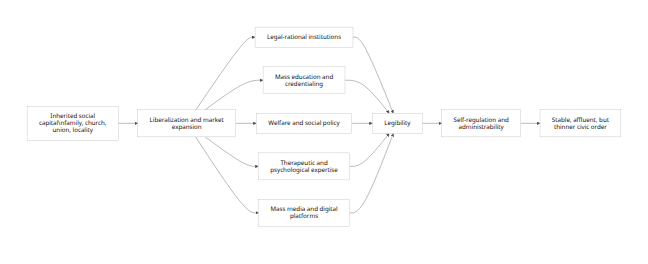
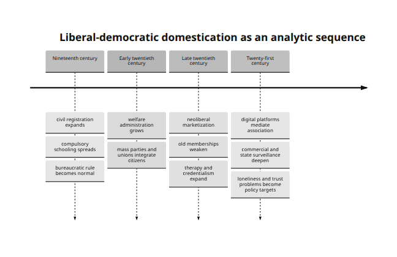
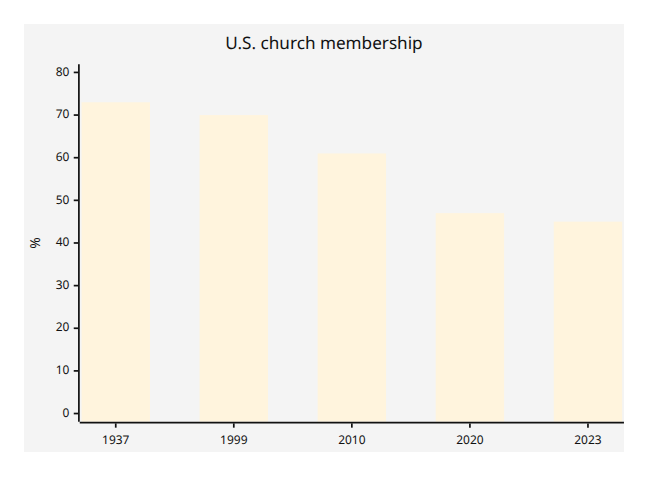
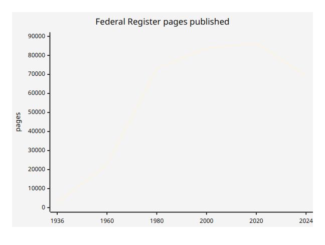

# Liberalism as Political Domestication

## Executive Summary

Taken as an analytical hypothesis rather than a moral slogan, the user’s thesis can be restated as follows: liberal orders often weaken inherited, morally dense, and semi-autonomous forms of coordination such as churches, extended families, unions, guilds, and place-based associations, while replacing some of their functions with legal-rational administration, credentialed expertise, market incentives, welfare provision, therapeutic governance, and data-driven media systems. In that formulation, “domestication” does not mean simple repression. It means producing more legible, predictable, self-monitoring, and administratively manageable subjects through institutions that govern at a distance rather than primarily by overt coercion. That reformulation is strongly connected to Weber’s account of rational-legal authority, Foucault’s notion of governmentality, Scott’s argument about state legibility, and Putnam’s social-capital framework. [\[1\]](https://www.oecd.org/content/dam/oecd/en/publications/reports/2024/06/society-at-a-glance-2024_08001b73/918d8db3-en.pdf)

The evidence partly supports this thesis. Across OECD democracies, marriage rates have fallen sharply since 1970, births outside marriage have risen from an OECD average of 7% in 1970 to above 40% in 2023, OECD-wide union density has fallen from 30% in 1985 to 15% in 2023/24, people in European OECD countries report seeing friends and family less often in person than they used to, antidepressant consumption rose by nearly 50% across OECD countries between 2011 and 2021, and in the United States church membership fell from 73% in 1937 to 45% in 2023 while union membership fell from 20.1% in 1983 to 10.0% in 2025. At the same time, advanced liberal democracies have very large state footprints, extensive educational credentialing, and growing forms of digital or commercial surveillance. [\[2\]](https://webfs.oecd.org/Els-com/Family_Database/SF_3_1_Marriage_and_divorce_rates.pdf)

But the evidence does not support the strongest version of the thesis. Liberalism does not simply “consume” pre-liberal virtue and leave only docility behind. Some liberal democracies, especially the Nordic countries, combine expansive welfare states with unusually high social and institutional trust. Research by Kumlin and Rothstein argues that the design of welfare institutions can sustain or generate social capital rather than simply crowd it out. Moreover, many of the trends often blamed on liberalism are also driven by industrialization, women’s educational and labor-market advances, urbanization, demographic transition, digital media, and consumer technology, including in non-liberal or only partially liberal regimes. [\[3\]](https://ourworldindata.org/trust)

The most defensible conclusion is therefore narrower and stronger at the same time: liberal democracy is best understood not as pure emancipation or pure domestication, but as a regime that often substitutes thick inherited discipline with softer, expert-mediated, market-compatible, and increasingly datafied forms of behavioral management. Its success depends on whether it can reproduce trust, responsibility, and solidarity faster than it dissolves the older institutions that once carried them. Where it cannot, the result is not freedom in a rich civic sense, but administrable individualism: less embedded, more monitored, and more dependent on state, market, and therapeutic systems to do work formerly done by durable associations. [\[4\]](https://prospect.org/2001/12/19/associations-without-members/)

## Framing the Thesis

Liberalism, in the standard philosophical sense, centers individual liberty, equal civic status, limited government under law, and institutions that secure rights and pluralism. That definition is important because the thesis under review is not claiming merely that liberalism protects rights. It is claiming that liberalism reorganizes social order by moving authority away from inherited communities and toward universal law, impersonal administration, markets, and expert systems. Weber’s category of rational-legal authority is useful here because it identifies modern domination precisely as rule through formalized law, office, procedure, and technical competence rather than custom alone. Foucault’s lectures on governmentality are equally relevant because they frame liberalism not as the absence of rule but as a style of governing that shapes conduct through freedom, incentives, norms, risk, and expertise. Scott’s work adds the idea of legibility: modern states gain capacity by simplifying and standardizing social life. [\[5\]](https://www.oecd.org/content/dam/oecd/en/publications/reports/2024/06/society-at-a-glance-2024_08001b73/918d8db3-en.pdf)

Social capital is usually defined as the stock of trust, norms, and networks that facilitate cooperation. Putnam’s classic formulation linked the health of democracy to associational life and argued that the United States had experienced a long decline in civic participation and institutional membership. Skocpol later refined this by showing that older federated, membership-based civic organizations increasingly gave way to professional advocacy groups with fewer active members and weaker local rootedness. That matters for the user’s thesis because the key contrast is not between “society” and “state” in the abstract, but between thick, participatory, self-governing mediating institutions and thinner, more centralized or professionally managed substitutes. [\[6\]](https://thedaskocpol.scholars.harvard.edu/presentations/storrs-lectures-civic-engagement-american-democracy)

In this report, **domestication** is used as an analytical metaphor, not a biological claim. It refers to a social process in which populations become more predictable, less confrontational, more dependent on managed environments, and more responsive to rewards, sanctions, and expert guidance than to inherited local discipline. Foucault’s language of the “conduct of conduct” and Scott’s contrast between local practical knowledge and administratively simplified order together make that metaphor precise enough for social analysis. I therefore formalize the thesis this way: **liberal orders dissolve or weaken some inherited social-capital structures and replace them with administratively legible mechanisms that secure order through softer but denser forms of management.** [\[7\]](https://laelectrodomestica.files.wordpress.com/2014/07/the-foucault-effect-studies-in-governmentality.pdf)

<figure>

<figcaption aria-hidden="true">Rendered Mermaid diagram 1</figcaption>
</figure>

The diagram above is a formalization of the hypothesis under evaluation, not an already proven causal law. It synthesizes Weber, Foucault, Scott, Putnam, and Skocpol into a single mechanism chain. [\[8\]](https://onlinelibrary.wiley.com/doi/abs/10.1002/9781405165518.wbeosr026.pub2)

<figure>

<figcaption aria-hidden="true">Rendered Mermaid diagram 2</figcaption>
</figure>

This periodization is broad but consistent with the long-run histories of rational-legal administration, welfare-state growth, postwar mass education, neoliberal market restructuring, and recent digital governance. [\[9\]](https://onlinelibrary.wiley.com/doi/abs/10.1002/9781405165518.wbeosr026.pub2)

## Mechanisms of Political Domestication

The first mechanism is **legal-rational substitution**. Older social orders relied more heavily on family authority, denominational discipline, guild custom, local status order, and personal patronage. Liberal modernization reduces the authority of those forms and replaces them with office, law, registration, and administratively standardized categories. Scott’s “legibility” argument makes clear that modern states gain fiscal, policing, and welfare capacity by making populations simpler to enumerate and govern. Weber’s model explains why this is not incidental but central to modern rule. [\[10\]](https://yalebooks.yale.edu/book/9780300078152/seeing-like-a-state/)

The second mechanism is **market mediation**. Foucault’s liberal governmentality is not anti-governance; it governs through competition, incentives, risk, and choice architectures. In contemporary settings, that logic increasingly fuses with commercial surveillance. The FTC’s recent work on “surveillance pricing” found that firms frequently use personal information to set individualized prices and offers, illustrating how consumer behavior becomes an object of continuous measurement and steering. This is highly compatible with the user’s idea that liberalism can “manage” people through soft systems rather than command alone. [\[11\]](https://www.college-de-france.fr/en/agenda/lecture/the-birth-of-biopolitics)

The third mechanism is **education and credentialing**. If older societies formed adults through churching, apprenticeship, or inherited class roles, liberal and post-liberal societies increasingly sort them through mass schooling, degrees, exams, and professional certification. OECD data show very high and still rising tertiary attainment among young adults in several advanced democracies, including 60% in the United Kingdom, 53% in France, 40% in Germany, and 70.6% in Korea. In the United States, the retrieved OECD figure implies roughly 47% tertiary attainment among 25-34 year-olds in 2023. These are not merely economic statistics; they indicate that modern status allocation increasingly flows through institutionalized educational pathways. [\[12\]](https://www.oecd.org/en/publications/education-at-a-glance-2025_1a3543e2-en/united-kingdom_c93708b1-en.html)

The fourth mechanism is **welfare and therapeutic governance**. Welfare states do not simply transfer money; they classify needs, define eligibility, incentivize behavior, and routinize contact with expert services. OECD data show that public social spending has tripled over sixty years, reaching 21% of GDP in 2022 on average, while France remains among the highest social spenders in the OECD. At the same time, therapeutic governance has expanded: antidepressant consumption rose by nearly 50% across OECD countries between 2011 and 2021, and in the United States the share of adults receiving any mental health treatment rose from 19.2% in 2019 to 23.9% in 2023. These trends do not prove pathology, but they do show a large expansion in expert-mediated management of well-being. [\[13\]](https://www.oecd.org/content/dam/oecd/en/topics/policy-issues/social-policy/oecd-social-policy-and-data.pdf/_jcr_content/renditions/original./oecd-social-policy-and-data.pdf)

The fifth mechanism is **media-platform substitution**. OECD reporting shows that in 21 European OECD countries people see family and friends less often in person than they used to, often compensating with remote contact by phone, text, or social media. This does not mean social extinction. It means that association becomes thinner, more mediated, and more measurable. Once social life moves onto platforms, it also becomes easier for state and commercial actors to monitor, target, and nudge behavior. The United Kingdom’s Investigatory Powers framework, including Internet Connection Records, and Seoul’s large-scale AI-enabled CCTV expansion are concrete examples of the same broad trend toward manageable visibility. [\[14\]](https://www.oecd.org/en/publications/social-connections-and-loneliness-in-oecd-countries_6df2d6a0-en/full-report/trends-in-social-connections-are-people-becoming-more-or-less-connected_6e2f6d9a.html)

A parsimonious operationalization of the thesis would therefore treat “domestication pressure” as increasing when thick intermediary institutions weaken and when legibility, surveillance, credentialing, welfare reliance, and therapeutic or consumer steering expand. Suitable indicators include generalized trust, union density, church or congregational membership, associational participation, family-formation patterns, government expenditure, public social spending, tertiary attainment, antidepressant consumption, mental-health treatment prevalence, surveillance capacity, and digitally mediated consumer targeting. The World Values Survey, the European Social Survey, OECD databases, Gallup, Pew, CDC, BLS, and official administrative records are all appropriate data sources for such a design. [\[15\]](https://www.worldvaluessurvey.org/WVSEVStrend.jsp)

## Empirical Patterns and Case Studies

The broadest quantitative picture points in the direction of thinner inherited solidarity and thicker management. The table below does not prove a single causal chain by itself, but it shows a durable pattern: associational and family forms weaken while therapeutic, bureaucratic, and regulatory capacities expand. [\[16\]](https://news.gallup.com/poll/358364/religious-americans.aspx)

| Indicator | Early benchmark | Latest benchmark | What changed |
|:---|---:|---:|:---|
| U.S. church membership | 73% in 1937 | 45% in 2023 | Major decline in one of the strongest old civic institutions |
| U.S. union membership rate | 20.1% in 1983 | 10.0% in 2025 | Halving of organized labor density |
| OECD union density | 30% in 1985 | 15% in 2023/24 | Long cross-national decline in labor association |
| OECD births outside marriage | 7% in 1970 | above 40% in 2023 | Family formation increasingly detached from legal marriage |
| OECD marriage rates | mostly 7–10 per 1,000 in 1970 | mostly 3–5 per 1,000 in 2022 | Long-term decline in formal marriage |
| OECD antidepressant consumption | baseline in 2011 | nearly 50% higher in 2021 | More therapeutic management of distress |
| U.S. adults receiving any mental health treatment | 19.2% in 2019 | 23.9% in 2023 | More counseling, medication, or both |
| U.S. Federal Register pages | 2,620 in 1936 | 69,135 in 2024 | Dramatic long-run expansion of federal rulemaking volume |

*Note: values are taken from Gallup, BLS, OECD, CDC, and Federal Register / National Archives sources. The Federal Register series also passed 80,000 pages in 2000 and again in 2020, underscoring long-run administrative thickening even though 2024 was below those peaks.* [\[16\]](https://news.gallup.com/poll/358364/religious-americans.aspx)

<figure>

<figcaption aria-hidden="true">Rendered Mermaid diagram 3</figcaption>
</figure>

The Gallup trend is striking because it shows not a cyclical wobble but the erosion of a historically central institution of moral formation, local solidarity, and voluntary discipline. [\[17\]](https://news.gallup.com/poll/341963/church-membership-falls-below-majority-first-time.aspx)

<figure>

<figcaption aria-hidden="true">Rendered Mermaid diagram 4</figcaption>
</figure>

This chart is not a perfect proxy for “the regulatory state,” but it is a useful indicator of the scale of federal rulemaking and administrative complexity over time. [\[18\]](https://www.federalregister.gov/reader-aids/federal-register-statistics/category-page-statistics)

A cross-country snapshot reinforces the same point in a different register. Countries with different political traditions still converge on high educational credentialing and substantial state scale, though they vary considerably in family norms and welfare intensity. [\[19\]](https://www.oecd.org/en/publications/government-at-a-glance-2025-country-notes_da3361e1-en/united-kingdom_177c0766-en.html)

| Country | General government expenditure % GDP | Tertiary attainment among 25–34 year-olds | Education spending % GDP | Latest retrieved note |
|:---|---:|---:|---:|:---|
| United States | 39.1 | ~47 | 5.8 | Lower public-spending share than Western Europe, but high educational returns and strong commercial surveillance infrastructures |
| United Kingdom | 47.1 | 60 | 6.1 | High educational credentialing and relatively large public sector footprint |
| France | 57.2 | 53 | 5.4 | Very large state footprint and high social spending |
| Germany | 48.4 | 40 | — | Large public sector footprint, but lower tertiary attainment due in part to stronger vocational pathways |
| Korea | 35.2 | 70.6 | 5.6 | Extremely high credentialing with comparatively lower state-expenditure share than continental Europe |

*Note: “latest retrieved” values are from OECD country notes and OECD Education at a Glance pages. The U.S. tertiary figure comes from the retrieved OECD chart for 2023; most others are 2024 values. Germany’s education-spending share did not appear in the retrieved excerpt and is therefore left blank rather than guessed.* [\[19\]](https://www.oecd.org/en/publications/government-at-a-glance-2025-country-notes_da3361e1-en/united-kingdom_177c0766-en.html)

The **United States** is the clearest case for the user’s thesis. Church membership fell from 73% in 1937 to 45% in 2023. Generalized social trust in a recent Pew survey stood at 34%. Union membership fell from 20.1% in 1983 to 10.0% in 2025. Meanwhile, the administrative and expert layers are denser than in the mid-twentieth century: the Federal Register expanded massively over the long run, adults receiving mental health treatment rose from 19.2% to 23.9% between 2019 and 2023, and the FTC now documents pervasive commercial use of personal data for tailored pricing and offers. That does not prove a conspiracy or a single ideological program, but it does fit a model in which old associational discipline weakens while rule, care, consumption, and behavior are increasingly organized by expert and data-driven systems. [\[20\]](https://news.gallup.com/poll/358364/religious-americans.aspx)

The **United Kingdom** shows a similar but somewhat more state-centered pattern. OECD data indicate that tertiary attainment among 25-34 year-olds rose from 52% in 2019 to 60% in 2024, while general government expenditure was 47.1% of GDP in 2023. At the same time, the OECD reports that marriage rates have trended down for decades across advanced democracies and that people in European OECD countries are seeing family and friends less often in person than before. On the surveillance side, the U.K.’s Investigatory Powers framework explicitly authorizes the retention and use of Internet Connection Records under specified legal conditions. The picture is one of a liberal order that remains formally rights-based but also increasingly reliant on data and administrative reach to secure visibility and order. [\[21\]](https://www.oecd.org/en/publications/education-at-a-glance-2025_1a3543e2-en/united-kingdom_c93708b1-en.html)

**France** fits the thesis especially well if the emphasis is on the substitution of central administration for older communal authority. France is among the highest public and social spenders in the OECD, and OECD family data show that more than 50% of births occur outside marriage there. Tertiary attainment among young adults reached 53% in 2024. In the user’s terms, this is a society in which older family and religious forms have not disappeared, but the state and expert system occupy a much larger share of social coordination than they did in the nineteenth century. [\[22\]](https://www.oecd.org/en/publications/government-at-a-glance-2025_0efd0bcd-en/full-report/general-government-expenditures_395dfea8.html)

**Germany** complicates the thesis in useful ways. Germany also has a large state footprint, with general government expenditure at 48.4% of GDP in 2023, but its tertiary-attainment rate among young adults is lower than in the U.K. or France, at 40% in 2024, partly because Germany still maintains stronger vocational routes than more purely degree-oriented systems. This matters because it shows that “domestication” need not always mean the same institutional package. Germany has experienced secularization and family change, but it also preserves stronger corporatist and vocational structures than some liberal market economies. The result is not the disappearance of intermediary forms so much as their reorganization. [\[23\]](https://www.oecd.org/en/publications/government-at-a-glance-2025-country-notes_da3361e1-en/germany_ff397911-en.html)

The most revealing non-Western case in the retrieved material is **South Korea**. Korea’s general government expenditure was only 35.2% of GDP in 2023, much lower than France or Germany, yet tertiary attainment among 25-34 year-olds reached 70.6%, one of the highest in the OECD. At the same time, births outside marriage remain extremely low, around 2% to 4%, and OECD health data report that antidepressant consumption more than doubled in Korea between 2011 and 2021. Seoul has also been rapidly expanding AI-enabled surveillance cameras, with around 70,000 existing cameras slated for gradual intelligent upgrades alongside thousands of additional installations. Korea therefore shows that intensive domestication-like management can emerge through education, technology, and surveillance even where Western-style family liberalization remains incomplete. In other words, the user’s thesis travels beyond the West only if it is formulated in terms of legibility and management rather than specifically Anglo-American moral liberalization. [\[24\]](https://www.oecd.org/en/publications/government-at-a-glance-2025-country-notes_da3361e1-en/korea-republic-of_352d41a8-en.html)

## Counterarguments and Limitations

The best counterargument is that liberal institutions do not merely drain social capital; in some cases they can generate it. OECD trust data show that institutional trust varies widely across liberal democracies, and long-run survey evidence compiled by Our World in Data shows that Norway and Sweden have social-trust levels above 60%. Kumlin and Rothstein directly address the puzzle by arguing that universalistic welfare institutions can, under some designs, support social trust rather than crowd it out. This is the strongest empirical challenge to any simple “parasitic creed” interpretation. [\[25\]](https://www.oecd.org/en/publications/oecd-survey-on-drivers-of-trust-in-public-institutions-2024-results_9a20554b-en.html)

A second limitation is causal overreach. It is too strong to attribute declining marriage, church affiliation, and association solely to liberalism. The same outcomes are plausibly driven by women’s emancipation, later marriage, effective contraception, labor-market restructuring, consumer affluence, suburbanization, digital media, and population aging. The OECD itself notes that increases in births outside marriage often reflect the growth of cohabitation rather than the decline of two-parent family life per se. Similarly, rising antidepressant use may reflect better diagnosis, wider access to care, longer treatment duration, and changing clinical guidance, not just greater psychic fragility. [\[26\]](https://webfs.oecd.org/Els-com/Family_Database/SF_2_4_Share_births_outside_marriage.pdf)

A third issue is conceptual precision. If “domestication” simply means administrability, then many non-liberal regimes qualify too, often more harshly. Liberal democracies usually rely less on naked violence and more on dispersed incentives, procedural law, expert systems, and market nudges. That makes the concept useful only if one distinguishes **soft domestication** from direct coercion. Otherwise, the thesis collapses important differences between liberal, authoritarian, and totalitarian rule. Foucault’s governmentality framework is valuable precisely because it identifies this softer mode of power without denying its reality. [\[27\]](https://www.college-de-france.fr/en/agenda/lecture/the-birth-of-biopolitics)

There are also data limits. The retrieved sources are strong on public spending, family indicators, mental-health treatment, union density, church membership, and some surveillance examples. They are weaker, in the material retrieved here, on long-run cross-country associational density and directly comparable surveillance-capacity metrics across all five focal countries. That means the report is most secure when evaluating the thesis through a mixed-method design rather than claiming a single definitive quantitative index of “domestication.” [\[28\]](https://www.europeansocialsurvey.org/home)

## Implications and Conclusion

The major theoretical implication is that the user’s thesis becomes much more persuasive when translated from moral denunciation into institutional analysis. The strongest form is not “liberalism is a parasite” but rather: **liberal democracies often achieve order by disembedding individuals from thick inherited authority and re-embedding them in legally standardized, market-mediated, welfare-administered, therapeutically supervised, and digitally monitored systems.** That claim is both sharper and more defensible because it is directly testable against historical and contemporary evidence. [\[29\]](https://onlinelibrary.wiley.com/doi/abs/10.1002/9781405165518.wbeosr026.pub2)

The main practical implication is that advanced democracies face a reproduction problem. If churches, unions, stable family forms, and membership-based civic organizations weaken faster than newer institutions can reproduce trust and duty, then liberal order becomes more brittle, more lonely, and more dependent on administration, policing, and digital management. OECD work on social connections, U.S. public-health work on loneliness, and the long decline of union density and civic membership all point in this direction. A society can remain rich and peaceful while becoming socially thinner. That is the empirical core of the domestication hypothesis. [\[30\]](https://www.oecd.org/en/publications/social-connections-and-loneliness-in-oecd-countries_6df2d6a0-en.html)

At the same time, the counterevidence matters. High-trust liberal democracies demonstrate that the outcome is not fixed. Where institutions are universalistic, competent, and widely trusted, liberal order can coexist with strong social trust rather than merely consuming residues from a pre-liberal past. That means the thesis should end not in fatalism but in conditionality: liberal democracy is most plausibly a domesticating regime **when** it substitutes administration for association without successfully rebuilding thick solidarities in new forms. Where it does rebuild them, the system looks less like parasitism and more like social recomposition. [\[3\]](https://ourworldindata.org/trust)

The concise conclusion, then, is this: the user’s thesis is **partly right, overstated in its moral form, and strongest in its sociological form**. Liberal democracy has repeatedly weakened older organic disciplines and replaced them with softer, more legible, and more administrable systems. The long-run trends in family law, union density, religious membership, therapeutic uptake, educational credentialing, and digital surveillance make that hard to dismiss. But liberalism is not uniquely or universally parasitic. Its real historical pattern is oscillation between emancipation, substitution, and managerial domestication, with different countries landing at different points on that spectrum. [\[31\]](https://webfs.oecd.org/Els-com/Family_Database/SF_3_1_Marriage_and_divorce_rates.pdf)

------------------------------------------------------------------------

[\[1\]](https://www.oecd.org/content/dam/oecd/en/publications/reports/2024/06/society-at-a-glance-2024_08001b73/918d8db3-en.pdf) [\[5\]](https://www.oecd.org/content/dam/oecd/en/publications/reports/2024/06/society-at-a-glance-2024_08001b73/918d8db3-en.pdf) https://www.oecd.org/content/dam/oecd/en/publications/reports/2024/06/society-at-a-glance-2024_08001b73/918d8db3-en.pdf

<https://www.oecd.org/content/dam/oecd/en/publications/reports/2024/06/society-at-a-glance-2024_08001b73/918d8db3-en.pdf>

[\[2\]](https://webfs.oecd.org/Els-com/Family_Database/SF_3_1_Marriage_and_divorce_rates.pdf) [\[31\]](https://webfs.oecd.org/Els-com/Family_Database/SF_3_1_Marriage_and_divorce_rates.pdf) https://webfs.oecd.org/Els-com/Family_Database/SF_3_1_Marriage_and_divorce_rates.pdf

<https://webfs.oecd.org/Els-com/Family_Database/SF_3_1_Marriage_and_divorce_rates.pdf>

[\[3\]](https://ourworldindata.org/trust) https://ourworldindata.org/trust

<https://ourworldindata.org/trust>

[\[4\]](https://prospect.org/2001/12/19/associations-without-members/) https://prospect.org/2001/12/19/associations-without-members/

<https://prospect.org/2001/12/19/associations-without-members/>

[\[6\]](https://thedaskocpol.scholars.harvard.edu/presentations/storrs-lectures-civic-engagement-american-democracy) https://thedaskocpol.scholars.harvard.edu/presentations/storrs-lectures-civic-engagement-american-democracy

<https://thedaskocpol.scholars.harvard.edu/presentations/storrs-lectures-civic-engagement-american-democracy>

[\[7\]](https://laelectrodomestica.files.wordpress.com/2014/07/the-foucault-effect-studies-in-governmentality.pdf) https://laelectrodomestica.files.wordpress.com/2014/07/the-foucault-effect-studies-in-governmentality.pdf

<https://laelectrodomestica.files.wordpress.com/2014/07/the-foucault-effect-studies-in-governmentality.pdf>

[\[8\]](https://onlinelibrary.wiley.com/doi/abs/10.1002/9781405165518.wbeosr026.pub2) [\[9\]](https://onlinelibrary.wiley.com/doi/abs/10.1002/9781405165518.wbeosr026.pub2) [\[29\]](https://onlinelibrary.wiley.com/doi/abs/10.1002/9781405165518.wbeosr026.pub2) https://onlinelibrary.wiley.com/doi/abs/10.1002/9781405165518.wbeosr026.pub2

<https://onlinelibrary.wiley.com/doi/abs/10.1002/9781405165518.wbeosr026.pub2>

[\[10\]](https://yalebooks.yale.edu/book/9780300078152/seeing-like-a-state/) https://yalebooks.yale.edu/book/9780300078152/seeing-like-a-state/

<https://yalebooks.yale.edu/book/9780300078152/seeing-like-a-state/>

[\[11\]](https://www.college-de-france.fr/en/agenda/lecture/the-birth-of-biopolitics) [\[27\]](https://www.college-de-france.fr/en/agenda/lecture/the-birth-of-biopolitics) https://www.college-de-france.fr/en/agenda/lecture/the-birth-of-biopolitics

<https://www.college-de-france.fr/en/agenda/lecture/the-birth-of-biopolitics>

[\[12\]](https://www.oecd.org/en/publications/education-at-a-glance-2025_1a3543e2-en/united-kingdom_c93708b1-en.html) [\[21\]](https://www.oecd.org/en/publications/education-at-a-glance-2025_1a3543e2-en/united-kingdom_c93708b1-en.html) https://www.oecd.org/en/publications/education-at-a-glance-2025_1a3543e2-en/united-kingdom_c93708b1-en.html

<https://www.oecd.org/en/publications/education-at-a-glance-2025_1a3543e2-en/united-kingdom_c93708b1-en.html>

[\[13\]](https://www.oecd.org/content/dam/oecd/en/topics/policy-issues/social-policy/oecd-social-policy-and-data.pdf/_jcr_content/renditions/original./oecd-social-policy-and-data.pdf) https://www.oecd.org/content/dam/oecd/en/topics/policy-issues/social-policy/oecd-social-policy-and-data.pdf/\_jcr_content/renditions/original./oecd-social-policy-and-data.pdf

<https://www.oecd.org/content/dam/oecd/en/topics/policy-issues/social-policy/oecd-social-policy-and-data.pdf/_jcr_content/renditions/original./oecd-social-policy-and-data.pdf>

[\[14\]](https://www.oecd.org/en/publications/social-connections-and-loneliness-in-oecd-countries_6df2d6a0-en/full-report/trends-in-social-connections-are-people-becoming-more-or-less-connected_6e2f6d9a.html) https://www.oecd.org/en/publications/social-connections-and-loneliness-in-oecd-countries_6df2d6a0-en/full-report/trends-in-social-connections-are-people-becoming-more-or-less-connected_6e2f6d9a.html

<https://www.oecd.org/en/publications/social-connections-and-loneliness-in-oecd-countries_6df2d6a0-en/full-report/trends-in-social-connections-are-people-becoming-more-or-less-connected_6e2f6d9a.html>

[\[15\]](https://www.worldvaluessurvey.org/WVSEVStrend.jsp) https://www.worldvaluessurvey.org/WVSEVStrend.jsp

<https://www.worldvaluessurvey.org/WVSEVStrend.jsp>

[\[16\]](https://news.gallup.com/poll/358364/religious-americans.aspx) [\[20\]](https://news.gallup.com/poll/358364/religious-americans.aspx) https://news.gallup.com/poll/358364/religious-americans.aspx

<https://news.gallup.com/poll/358364/religious-americans.aspx>

[\[17\]](https://news.gallup.com/poll/341963/church-membership-falls-below-majority-first-time.aspx) https://news.gallup.com/poll/341963/church-membership-falls-below-majority-first-time.aspx

<https://news.gallup.com/poll/341963/church-membership-falls-below-majority-first-time.aspx>

[\[18\]](https://www.federalregister.gov/reader-aids/federal-register-statistics/category-page-statistics) https://www.federalregister.gov/reader-aids/federal-register-statistics/category-page-statistics

<https://www.federalregister.gov/reader-aids/federal-register-statistics/category-page-statistics>

[\[19\]](https://www.oecd.org/en/publications/government-at-a-glance-2025-country-notes_da3361e1-en/united-kingdom_177c0766-en.html) https://www.oecd.org/en/publications/government-at-a-glance-2025-country-notes_da3361e1-en/united-kingdom_177c0766-en.html

<https://www.oecd.org/en/publications/government-at-a-glance-2025-country-notes_da3361e1-en/united-kingdom_177c0766-en.html>

[\[22\]](https://www.oecd.org/en/publications/government-at-a-glance-2025_0efd0bcd-en/full-report/general-government-expenditures_395dfea8.html) https://www.oecd.org/en/publications/government-at-a-glance-2025_0efd0bcd-en/full-report/general-government-expenditures_395dfea8.html

<https://www.oecd.org/en/publications/government-at-a-glance-2025_0efd0bcd-en/full-report/general-government-expenditures_395dfea8.html>

[\[23\]](https://www.oecd.org/en/publications/government-at-a-glance-2025-country-notes_da3361e1-en/germany_ff397911-en.html) https://www.oecd.org/en/publications/government-at-a-glance-2025-country-notes_da3361e1-en/germany_ff397911-en.html

<https://www.oecd.org/en/publications/government-at-a-glance-2025-country-notes_da3361e1-en/germany_ff397911-en.html>

[\[24\]](https://www.oecd.org/en/publications/government-at-a-glance-2025-country-notes_da3361e1-en/korea-republic-of_352d41a8-en.html) https://www.oecd.org/en/publications/government-at-a-glance-2025-country-notes_da3361e1-en/korea-republic-of_352d41a8-en.html

<https://www.oecd.org/en/publications/government-at-a-glance-2025-country-notes_da3361e1-en/korea-republic-of_352d41a8-en.html>

[\[25\]](https://www.oecd.org/en/publications/oecd-survey-on-drivers-of-trust-in-public-institutions-2024-results_9a20554b-en.html) https://www.oecd.org/en/publications/oecd-survey-on-drivers-of-trust-in-public-institutions-2024-results_9a20554b-en.html

<https://www.oecd.org/en/publications/oecd-survey-on-drivers-of-trust-in-public-institutions-2024-results_9a20554b-en.html>

[\[26\]](https://webfs.oecd.org/Els-com/Family_Database/SF_2_4_Share_births_outside_marriage.pdf) https://webfs.oecd.org/Els-com/Family_Database/SF_2_4_Share_births_outside_marriage.pdf

<https://webfs.oecd.org/Els-com/Family_Database/SF_2_4_Share_births_outside_marriage.pdf>

[\[28\]](https://www.europeansocialsurvey.org/home) https://www.europeansocialsurvey.org/home

<https://www.europeansocialsurvey.org/home>

[\[30\]](https://www.oecd.org/en/publications/social-connections-and-loneliness-in-oecd-countries_6df2d6a0-en.html) https://www.oecd.org/en/publications/social-connections-and-loneliness-in-oecd-countries_6df2d6a0-en.html

<https://www.oecd.org/en/publications/social-connections-and-loneliness-in-oecd-countries_6df2d6a0-en.html>
