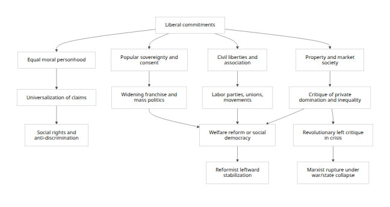
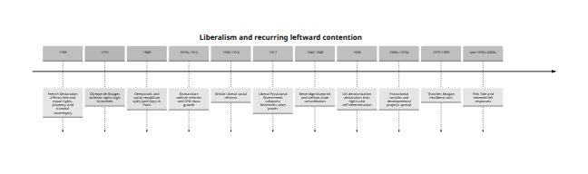

# Liberalism, Equality, and the Leftward Drift Thesis

## Executive summary

The claim that liberalism is inherently unstable because its own promises of equality push it leftward contains a **real but limited** truth. The limited truth is that liberalism is universalist: once it affirms that persons are equal bearers of rights and that government rests on consent rather than inherited status, it creates recurring pressure to widen the circle of inclusion and to ask whether merely formal equality is enough. That pressure helped drive expansions of suffrage, labor protection, welfare provision, anti-discrimination law, and social citizenship. The French Declaration’s language of free and equal rights was quickly extended by figures such as Olympe de Gouges; late-19th- and 20th-century liberalism increasingly argued that poverty, ignorance, disease, and private domination can be as freedom-limiting as old state privilege; and Rawlsian liberalism makes the “fair value” of political liberties and fair equality of opportunity central rather than optional. [\[1\]](https://avalon.law.yale.edu/18th_century/rightsof.asp)

The stronger version of the claim—that liberalism tends naturally toward **socialism or Marxism**, and is therefore “completed” by them—is not well supported. Marx himself treated liberal political emancipation as a major advance over feudalism, but also argued that it had to be **surpassed**, not simply fulfilled, because liberal rights and equality remained tied to “bourgeois” property relations and merely political emancipation. In the *Communist Manifesto*, Marx and Engels define communism not as the completion of liberal property-rights arguments but as the abolition of bourgeois private property; in the *Critique of the Gotha Programme*, Marx argues that equal right remains a “bourgeois” standard that must eventually be crossed. That is a relationship of genealogy and negation, not straightforward perfection. [\[2\]](https://plato.stanford.edu/entries/marx/)

Historically, liberal societies have more often moved toward **social liberalism, welfare capitalism, or social democracy** than toward revolutionary Marxism. Bismarckian social insurance, the British Liberal reforms of 1906–1914, Beveridge’s postwar settlement, and Scandinavian social democracy all show leftward expansion inside constitutional, electoral, and property-respecting frameworks. The revolutionary Marxist path was most likely not where liberal logic simply unfolded on its own, but where liberal states suffered **war, state collapse, weak legitimacy, class polarization, or imperial crisis**, as in Russia in 1917. [\[3\]](https://www.britannica.com/topic/history-of-Germany/Germany-from-1871-to-1918)

The best overall judgment, therefore, is this: **liberalism is not stable in the sense of being morally static**, because its commitments generate repeated pressures for broader inclusion and more substantive forms of equality. But it is also **not unstable in the deterministic sense** that it culminates in Marxism. Liberalism has its own internal brakes: property, consent, limited government, individual rights, value pluralism, rule of law, party competition, and constitutional reform. These mechanisms often redirect egalitarian pressure into reformist rather than revolutionary channels. [\[4\]](https://press-pubs.uchicago.edu/founders/documents/amendV_due_processs6.html)

A concise judgment on the core subclaims appears below.

| Subclaim | Assessment | Short reason |
|:---|:---|:---|
| Liberalism contains universal promises that generate pressure for broader equality | **Largely true** | Rights language, democratic inclusion, and anti-status principles repeatedly support claims for wider suffrage, labor rights, welfare, and anti-colonial self-determination. |
| Liberalism is therefore unstable in a strong sense | **Only partly true** | It is contestable and revision-prone, but it has durable institutional and philosophical stabilizers. |
| Liberalism tends specifically toward socialism/Marxism | **Sometimes, under crisis** | The stronger historical pattern is reformist social democracy, not revolutionary communism. |
| Communism/Marxism “perfects” liberalism | **Mostly false** | Marxism inherits and radicalizes some emancipatory themes, but rejects core liberal commitments to private property, pluralism, and limited government. |

Table synthesized from primary texts and major reference works. [\[5\]](https://avalon.law.yale.edu/18th_century/rightsof.asp)

## Scope and analytical frame

This report takes the scope exactly as specified: it focuses on **political and philosophical mechanisms**, not econometric tests or growth modeling; it is geographically global, but emphasizes **Europe and Anglophone cases**, with selected postcolonial examples where they illuminate the argument. Within that scope, “leftward expansion” is treated as a spectrum ranging from **social liberalism** and **social democracy** to **democratic socialism** and **Marxism-Leninism**. That distinction matters, because many liberal developments moved left without becoming anti-liberal regimes. [\[6\]](https://www.britannica.com/topic/liberalism)

Analytically, the claim can mean at least three different things. It can mean: first, a **moral** thesis, that equality before the law logically invites more substantive equality; second, an **institutional** thesis, that liberal freedoms of speech, association, and suffrage enable socialist organization; or third, a **historical** thesis, that liberal regimes in practice destabilize themselves and are then displaced by more radical left movements. The report treats these separately because they have different evidentiary standards and different historical records. [\[7\]](https://avalon.law.yale.edu/18th_century/rightsof.asp)

A further clarification is necessary. Liberalism is not one doctrine. Both the Stanford Encyclopedia and Britannica stress that liberalism includes related but competing traditions and that its historical development moved from suspicion of state power to, in many versions, willingness to use state power to remove obstacles to freedom. Any argument about “liberalism’s instability” therefore has to specify **which liberalism** is under discussion. [\[8\]](https://plato.stanford.edu/entries/liberalism/)

## Liberalism and its variants

Liberalism’s core commitments are remarkably stable across variants. The Declaration of the Rights of Man and of the Citizen states that persons are born free and equal in rights; that the end of political association is the preservation of liberty, property, security, and resistance to oppression; and that sovereignty resides in the nation. Locke similarly grounds lawful government in the consent of free and equal persons and makes the preservation of property a central end of government. Mill, from a different angle, centers the individual’s protected sphere by arguing that coercion is justified only to prevent harm to others. These are the main liberal constants: **individual rights, equality before law, property, and consent**. [\[9\]](https://avalon.law.yale.edu/18th_century/rightsof.asp)

At the same time, liberalism divides over what freedom requires. Classical liberalism ties freedom closely to non-interference, private property, market order, and limited government. The Stanford Encyclopedia notes that, for classical liberals, liberty and private property are “intimately related,” and that property is often treated as both a component and a protector of liberty. Britannica likewise describes classical liberals as seeing the state as the primary threat to freedom and limiting it mainly to rights-protection. [\[10\]](https://plato.stanford.edu/entries/liberalism/)

Social liberalism, by contrast, argues that freedom can be blocked not only by the state but also by poverty, disease, discrimination, ignorance, and private power. Britannica’s account of modern liberalism says that liberals increasingly treated such conditions as obstacles to the exercise of basic rights and autonomy, while the Stanford Encyclopedia’s discussion of positive liberty explicitly ties effective freedom to material capacity and resources. Rawls develops the same family of thought by insisting not only on equal basic liberties, but on the **fair value** of political liberties and fair equality of opportunity regardless of whether citizens were born rich or poor. [\[11\]](https://www.britannica.com/topic/liberalism)

Neoliberalism is not identical with either of those traditions. Britannica defines it as an ideology centered on free-market competition, limited state intervention, and freer trade and capital movement, while distinguishing it from modern liberalism. The Stanford Encyclopedia adds that neoliberal thinkers such as Hayek, Friedman, and Buchanan reassert the **rule of law**, equal treatment before law, and limits on administrative state expansion partly as arguments against both social-democratic liberalism and socialism. Yet even here the tradition is more flexible than polemics often assume: Hayek defended various welfare-state measures, including social insurance, a minimum income, and public health-related interventions. [\[12\]](https://www.britannica.com/money/neoliberalism)

The comparison below is the clearest way to see where the instability thesis gets its traction.

| Liberal variant | Primary conception of freedom | Equality emphasis | Property and markets | Typical state role | Relevance to the claim |
|----|:---|:---|----|:---|:---|
| Classical liberalism | Non-interference; protected private sphere | Formal legal equality and consent | Strong protection of property as liberty-protecting | Limited state for rights, law, and security | Weakest leftward pull; strongest resistance to redistribution |
| Social liberalism | Effective autonomy; freedom requires usable capacities | Formal equality plus fair opportunity and social conditions | Property accepted but regulated; markets can create domination | Active state to remove obstacles to freedom | Strongest liberal route to welfare, labor rights, and social democracy |
| Neoliberalism | Market freedom, rule of law, anti-arbitrariness | Equality before general rules, skepticism toward outcome equality | Strong market orientation; anti-discretionary administration | Limited but not zero state; safety net possible | Often a countermovement against leftward drift, but can generate new left reactions when inequality rises |

Table synthesized from SEP and Britannica entries on liberalism and neoliberalism. [\[13\]](https://plato.stanford.edu/entries/liberalism/)

## Why the claim has force

### The philosophical tensions inside liberalism

The instability thesis is strongest where liberalism’s own internal distinctions become visible. One fault line is **political versus social equality**. The French Declaration established equal legal citizenship, but it also elevated property and left the legislature as the main judge of its own actions. Britannica notes that, despite the framers’ limited aims, the Declaration’s principles could be “extended logically” toward political and even social democracy. Tocqueville, meanwhile, argued that the movement toward equality of conditions seemed historically irreversible, yet insisted that equality could ally with **despotism as well as liberty**. In other words, the pressure for greater equality is real, but its destination is indeterminate. [\[14\]](https://www.britannica.com/topic/Declaration-of-the-Rights-of-Man-and-of-the-Citizen)

A second tension is **formal versus substantive equality**. Liberal rights can establish equal legal standing while leaving large inequalities in the actual capacity to use those rights. The Stanford Encyclopedia’s discussion of positive freedom points precisely to this issue: the formally uncoerced but materially deprived person may still lack effective power to act. Rawls radicalizes the point from within the liberal tradition by insisting that political liberties must not merely exist on paper, but have fair value, and that citizens similarly endowed should have similar prospects regardless of wealth. That is the core philosophical route by which liberalism can move left without ceasing to be liberal. [\[15\]](https://plato.stanford.edu/entries/liberalism/)

A third tension is **rights versus redistribution**. Locke’s version of liberalism makes property and consent constitutive of legitimate authority: taxation without consent threatens the end of government itself. Nozick later sharpened that line by arguing that any patterned distribution will be undone by free exchanges, so liberty itself “upsets patterns.” Rawls, by contrast, allows inequality only when it benefits the least advantaged and openly says that justice as fairness favors either a property-owning democracy or a liberal democratic socialism. The result is not one liberal answer, but a structured dispute internal to liberalism over whether equality requires redistribution and how far it may go. [\[16\]](https://press-pubs.uchicago.edu/founders/documents/amendV_due_processs6.html)

Marx’s critique is powerful precisely because it presses on these liberal tensions. The SEP entry on Marx states that Marx saw liberal political emancipation as a major advance over feudal and religious domination, but also as something that had to be transcended in the direction of human emancipation. In the *Manifesto*, Marx and Engels present communism as abolishing **bourgeois** private property, and in the *Critique of the Gotha Programme* Marx argues that “equal right” remains bourgeois right because equal standards applied to unequal people still reproduce inequality. This is the classic formulation of the thought that liberal equality contains unresolved promises that point beyond itself. [\[17\]](https://plato.stanford.edu/entries/marx/)

### The main pathways from liberalism to leftward expansion

The first pathway is **moral universalization**. Once a regime proclaims that all are free and equal in rights, exclusion becomes harder to justify. The French Declaration’s universal language invited extension beyond the intentions of its authors; de Gouges’s 1791 declaration did exactly that by demanding equal citizenship rights for women, broader public participation, and stronger property and family claims for women. Similar dynamics recur in later civil rights, anti-discrimination, and social-rights movements. [\[18\]](https://avalon.law.yale.edu/18th_century/rightsof.asp)

The second pathway is **democratic incorporation**. Liberal institutions—press freedom, association, elections, and parliamentary representation—allow workers and subordinate groups to organize inside the system. That does not automatically make the system socialist, but it often makes it more egalitarian. The 1848 revolutions quickly revealed the split between a democratic republic and a “democratic and social” republic; the German SPD became Europe’s archetypal mass socialist party; and liberal and conservative governments alike increasingly adopted social legislation as workers entered politics. [\[19\]](https://www.britannica.com/event/Revolutions-of-1848)

The third pathway is **private-power critique**. Social liberals argue that domination can come from employers, monopolists, inherited wealth, or structurally unequal access to education and politics, not just from state officials. That thought was already visible in the transition from old to new liberalism, where property rights came to be seen by some liberals not simply as guardians of freedom but also as potential sources of unjust power. Rawls’s insistence on the fair value of political liberties is one sophisticated expression of this critique. [\[20\]](https://plato.stanford.edu/entries/liberalism/)

The fourth pathway is **crisis radicalization**. When liberal or quasi-liberal regimes cannot deliver peace, land, work, or legitimacy, socialist or communist movements can claim that only a deeper rupture will satisfy liberalism’s own unfulfilled promises. This was Lenin’s opportunity in 1917. The liberal Provisional Government was born after the tsar’s fall, but it failed to solve the core issues of war, land, and economic breakdown. Lenin’s April Theses therefore rejected support for the Provisional Government and pushed toward bank nationalization, soviet power, and control over production and distribution. Here, leftward movement came not from liberal logic alone, but from liberal failure under catastrophic strain. [\[21\]](https://www.britannica.com/topic/Russian-Provisional-Government)

The fifth pathway is **decolonizing universalism**. Liberal ideas of self-determination and equal personhood could be—and were—turned against empire. The UN’s 1960 Declaration on the Granting of Independence to Colonial Countries and Peoples states that colonial subjection is a denial of fundamental human rights and that all peoples have the right to determine their political status and pursue their economic, social, and cultural development. In several postcolonial contexts, that universalist and anti-imperial language fused with socialist programs of development and economic sovereignty, as in “African socialism.” [\[22\]](https://legal.un.org/avl/ha/dicc/dicc.html)

The mechanism map below summarizes the point.

<figure>

<figcaption aria-hidden="true">Rendered Mermaid diagram 1</figcaption>
</figure>

This diagram synthesizes the main pathways discussed in liberal, Marxist, and historical sources. [\[23\]](https://avalon.law.yale.edu/18th_century/rightsof.asp)

## Historical record

The historical record is mixed, and it is mixed in a way that matters for the thesis. The French Revolution is the clearest early example of liberal universalism generating wider demands. The 1789 Declaration fused equality, liberty, property, and national sovereignty; yet property remained “inviolable,” and rights were bounded by law and public order. Precisely because its language was universal, it became vulnerable to further universalization. De Gouges’s declaration in 1791 claimed the same natural and sacred rights for women, including equal public participation and stronger legal and property standing. In that sense, liberalism did contain seeds of further egalitarian expansion. But the French case does not show a straight line to Marxism. Rather, it shows that liberal rights language can mutate into competing democratic, nationalist, and social projects. [\[24\]](https://avalon.law.yale.edu/18th_century/rightsof.asp)

The Revolutions of 1848 deepen the point. Across Europe, liberal, democratic, nationalist, and social demands converged briefly and then split. In France, universal manhood suffrage arrived with the Second Republic, but the clash between the proponents of a democratic republic and a democratic-and-social republic ended in the June workers’ insurrection and repression. Across the continent, the immediate aftermath included the withdrawal of liberal-democratic concessions and intensified policing by regimes frightened by socialist proposals. This is strong evidence for the claim that liberal-democratic opening can generate left pressure; it is equally strong evidence that such pressure can produce reaction as easily as socialist advance. [\[25\]](https://www.britannica.com/event/Revolutions-of-1848)

Late-19th-century Europe points less toward Marxist completion than toward **reformist incorporation**. In imperial Germany, industrialization expanded the working class rapidly; by 1911 Bismarck’s welfare legislation covered approximately 13.2 million workers, but industrial workers still lacked full political rights and many voted for the socialist party. The German SPD became the largest single party in Reichstag voting strength by 1912. What this shows is not that liberalism inevitably becomes Marxism, but that liberal-capitalist states often respond to democratic pressure by combining repression, welfare, and selective inclusion, while socialist parties themselves often move into parliamentary competition rather than insurrection. [\[26\]](https://www.britannica.com/topic/history-of-Germany/Germany-from-1871-to-1918)

The British path is even clearer. Parliament’s own historical materials describe the Liberal reforms of 1906–1914 as early measures aimed at poverty, unemployment, sickness, low wages, and poor working conditions; those reforms were criticized at the time for not going far enough, yet Parliament also notes that they formed a starting point for a state-funded support network. Beveridge’s 1942 report then supplied the blueprint for postwar British social policy, on the explicit premise that philanthropy was insufficient and coherent state action was required. This is leftward development inside a recognizably liberal constitutional order, not a collapse into Marxism. [\[27\]](https://www.parliament.uk/about/living-heritage/transformingsociety/tradeindustry/industrycommunity/case-study-so-davies-and-workplace-compensation/workplace-compensation-legislation/early-life-in-mining-communities2/)

Long-run welfare-state data reinforce that interpretation. OECD and Our World in Data materials show that social expenditure became an increasingly central part of advanced capitalist democracies over the 20th century, and OECD data report high levels of public social spending across many member states in recent years. This broad pattern fits the idea that liberal-democratic systems often answer egalitarian pressure by institutionalizing welfare commitments rather than abandoning constitutional capitalism. [\[28\]](https://www.oecd.org/en/publications/is-the-european-welfare-state-really-more-expensive_5kg2d2d4pbf0-en.html)

Scandinavian and German social democracy add a final important distinction. Britannica describes social democracy as having originally aimed at a peaceful transition from capitalism to socialism through political processes, but also as having become, in many countries, a more moderate doctrine of regulation and welfare. The Swedish Social Democratic Party remained committed to an egalitarian society and governed Sweden for much of the period after 1932. In historical practice, then, the leftward development incubated by liberal-democratic politics often culminated in **social democracy**—a hybrid formation that keeps elections, rights, and pluralism—rather than Marxist abolition of liberal institutions. [\[29\]](https://www.britannica.com/topic/social-democracy)

Russia in 1917 is the strongest case for the claimant’s intuition, but also the clearest warning against overgeneralization. The Provisional Government began as a liberal-led government after imperial collapse. Soviets, however, emerged alongside it; Lenin condemned the Provisional Government as incapable of satisfying the urgent demands for peace, land, and social change; and by autumn the government had lost popular support. The Bolshevik path to power therefore illustrates how liberal or liberalizing regimes can be overrun by the revolutionary left when they govern amid war, state breakdown, and dual power. But that mechanism is crisis-specific. It is not the normal development of stable liberal orders. [\[21\]](https://www.britannica.com/topic/Russian-Provisional-Government)

Postcolonial politics partly revive the leftward logic, but on a different terrain. The UN decolonization framework explicitly links human rights, self-determination, and economic, social, and cultural development. In Africa, Britannica notes, anticolonial nationalism often gave way after independence to “African socialism” as a unifying and developmental program. This supports the thesis that universal egalitarian promises can move beyond strictly juridical equality toward economic transformation. Yet again, the outcomes were multiple: some regimes turned socialist, some nationalist-authoritarian, some developmentalist, and many blended liberal and illiberal elements. The path was not singular. [\[22\]](https://legal.un.org/avl/ha/dicc/dicc.html)

The neoliberal era shows the cycle continuing in reverse. From the late 1970s, Thatcherism and Reagan-era policy revived market-centered liberal arguments, weakened organized labor, privatized state assets, and reduced some social commitments. An IMF *Finance & Development* article later argued that some neoliberal policies increased inequality and thereby jeopardized durable expansion. In Latin America, left-leaning responses were visible in the Pink Tide that began in the late 1990s and early 2000s. Here again, liberal retrenchment did not end ideological struggle; it reactivated it. That supports the weaker instability thesis—that liberal orders generate recurrent left reactions—without proving the stronger thesis of necessary Marxist completion. [\[30\]](https://www.britannica.com/topic/Thatcherism)

A compact timeline helps situate the pattern.

<figure>

<figcaption aria-hidden="true">Rendered Mermaid diagram 2</figcaption>
</figure>

Timeline synthesized from primary documents and standard historical reference works. [\[31\]](https://avalon.law.yale.edu/18th_century/rightsof.asp)

The case-study comparison below compresses the main findings.

| Case | Initial liberal promise or opening | Leftward development | Outcome | What it shows |
|:---|:---|:---|:---|:---|
| French Revolution | Equal rights, liberty, property, sovereignty of the nation | Expansion of claims to women and broader democracy | Mixed: liberal, democratic, national, and proto-social trajectories | Universal rights create pressure beyond framers’ intentions |
| Europe in 1848 | Constitutionalism, suffrage, national self-rule | “Democratic and social” demands, workers’ insurrection | Split, repression, partial retention of reforms | Liberal openings can radicalize and also provoke reaction |
| Germany and Britain, late 19th to mid-20th century | Parliamentary competition and reform | Labor politics, welfare, social insurance, welfare-state building | Social democracy and welfare capitalism | Most common liberal-left trajectory is reformist, not Marxist |
| Russia, 1917 | Liberal Provisional Government after imperial collapse | Bolshevik call for soviet power, land, peace, nationalization | Revolutionary socialist seizure of power | Marxist outcome is likelier under war, collapse, and state failure |
| Postcolonial states | Universal self-determination and anti-colonial rights | Economic sovereignty, developmental socialism, African socialism | Diverse hybrids | Rights language often widened into socio-economic transformation |
| Neoliberal era | Market-centered liberal retrenchment | Left responses to inequality and deindustrialization | Pink Tide and renewed egalitarian politics | Retrenchment can regenerate left pressure |

Table synthesized from historical and official sources cited in this section. [\[32\]](https://www.britannica.com/topic/Declaration-of-the-Rights-of-Man-and-of-the-Citizen)

## Counterarguments and anti-socialist stabilizers

The strongest counterargument is philosophical rather than historical: **liberalism is not a monist doctrine of human perfection**, whereas Marxism often is. Isaiah Berlin’s liberalism is rooted in the distinction between negative and positive liberty, but more fundamentally in a defense of pluralism against monism and collectivism. The SEP entry emphasizes that Berlin’s target was not positive liberty as such, but its transformation into doctrines that justify overriding actual persons in the name of a higher collective self or a single true end. On that view, Marxism is not liberalism perfected; it is exactly the sort of monist politics liberal pluralism is designed to resist. [\[33\]](https://plato.stanford.edu/entries/berlin/)

A second counterargument is constitutional. Locke makes property and consent integral to political legitimacy, not provisional expedients on the way to collective ownership. His *Second Treatise* says the supreme power cannot take property without consent and that the end of government is the secure enjoyment of properties. This is a principled anti-socialist mechanism, not a temporary stage. It can be modified within liberalism, but abolishing it means leaving key liberal premises behind. [\[34\]](https://press-pubs.uchicago.edu/founders/documents/amendV_due_processs6.html)

A third counterargument is moral and institutional. Mill’s liberalism combines strong concern for individuality with distrust of paternalist or overbearing administration. He defends a protected area of self-regarding conduct and warns that states can turn people into “docile instruments” by substituting official action for individual development. This does not rule out all reform, but it does show that liberal arguments for autonomy can cut sharply against collectivist administration even when the ends are benevolent. [\[35\]](https://oll.libertyfund.org/quotes/j-s-mill-s-great-principle-was-that-over-himself-over-his-own-body-and-mind-the-individual-is-sovereign-1859)

A fourth counterargument comes from Rawls. Rawls pushes liberalism leftward more than classical liberals would accept, but he does so while preserving equal basic liberties, priority rules, constitutionalism, and an explicitly **political** rather than comprehensive liberalism. The SEP entry notes that justice as fairness can favor either a property-owning democracy or a liberal democratic socialism, while Rawls’s first principle bars sacrificing equal liberty for aggregate gains. This is a major reason the strong thesis fails: the most egalitarian liberal theories do not naturally become Marxism; they build a distinct liberal-left position instead. [\[36\]](https://plato.stanford.edu/entries/rawls/)

Neoliberal and libertarian arguments add a fifth stabilizer: **rule of law and limits on discretionary bureaucracy**. The SEP entry on neoliberalism states that neoliberals explicitly deploy the rule of law against social-democratic and socialist enlargement of the administrative state, on the ground that extensive discretionary planning invites arbitrary power. Hayek’s most famous formulation was that direct pursuit of a substantive distributive pattern destroys rule-of-law conditions. One does not have to agree with that argument to see its relevance: it is a standing liberal mechanism for resisting the slide from equality of status toward centralized economic control. [\[37\]](https://plato.stanford.edu/archives/fall2025/entries/neoliberalism/)

Finally, there is a historical counterargument. Tocqueville warned that democratizing equality does not naturally culminate in socialism; it may culminate in a mild but suffocating administrative despotism. His image of an “immense and tutelary power” governing a crowd of similar and equal men suggests that the danger latent in egalitarian mass democracy is not uniquely leftist. It may equally produce paternalism, technocracy, or depoliticized centralization. That point is important because it breaks the deterministic chain from equality to socialism. The chain does not exist in that simple form. [\[38\]](https://oll.libertyfund.org/quotes/tocqueville-warns-how-administrative-despotism-might-come-to-a-democracy-like-america-1840)

## Overall judgment and prioritized sources

The most defensible final judgment is that the claim is **too strong if stated as a necessity, but illuminating if restated as a recurrent tendency**. Liberalism does contain unresolved promises of equality, and those promises repeatedly generate demands for broader inclusion, social rights, and constraints on private domination. In that sense, liberalism is not morally at rest. But the assertion that communism or Marxism simply “perfects” liberalism is misleading. Marxism emerges from a critique of liberalism’s limits, yet it also rejects liberal pluralism, liberal property rights, liberal limits on power, and often liberal constitutionalism itself. Historically, the most common endpoint of liberal egalitarian development has been **social democracy or social liberalism**, not Soviet-style communism. [\[39\]](https://plato.stanford.edu/entries/marx/)

Put differently: liberalism is **expansionary**, **contestable**, and often **left-generating**, but not simply **self-cancelling**. Its universal rights claims make exclusions unstable; its institutions enable mobilization; and its failures can radicalize politics. Yet its own internal resources—rights, consent, pluralism, constitutional limits, rule of law, welfare reform, and electoral incorporation—also allow it to absorb egalitarian pressure without ceasing to be liberal. That is why liberal history is best read not as a one-way road to Marxism, but as a recurring struggle among **classical-liberal, social-liberal, social-democratic, neoliberal, and socialist** answers to the same problem: what equal freedom actually requires. [\[40\]](https://www.britannica.com/topic/liberalism)

### Prioritized sources

The sources below were the most important for assessing the claim.

| Type | Source | Why it matters |
|:---|:---|:---|
| Primary | Locke, *Second Treatise of Government* via University of Chicago Press | Canonical statements of consent, majority rule, property, and the end of government. [\[34\]](https://press-pubs.uchicago.edu/founders/documents/amendV_due_processs6.html) |
| Primary | *Declaration of the Rights of Man and of the Citizen* via Yale Avalon; Britannica commentary | Core revolutionary liberal text; shows both universal rights language and the centrality of property, law, and sovereignty. [\[41\]](https://avalon.law.yale.edu/18th_century/rightsof.asp) |
| Primary | J.S. Mill, *On Liberty* via Liberty Fund | Classic defense of individual sovereignty and anti-paternalist limits on state action. [\[35\]](https://oll.libertyfund.org/quotes/j-s-mill-s-great-principle-was-that-over-himself-over-his-own-body-and-mind-the-individual-is-sovereign-1859) |
| Primary / interpretive | Alexis de Tocqueville, *Democracy in America* via Liberty Fund and Britannica | Crucial for the tension between equality and liberty, and for the possibility of administrative despotism. [\[42\]](https://oll.libertyfund.org/pages/tocqueville-s-democracy-in-america) |
| Primary / scholarly | Isaiah Berlin via SEP | Best single source for the pluralist liberal rebuttal to monist “completion” narratives. [\[33\]](https://plato.stanford.edu/entries/berlin/) |
| Primary / scholarly | John Rawls via SEP | Shows how far liberalism can move toward equality without becoming Marxist. [\[43\]](https://plato.stanford.edu/entries/rawls/) |
| Primary / scholarly | Marx and Engels via SEP and Marxists Archive | Essential for the claim itself, because Marx explicitly treats liberal emancipation as real but insufficient and attacks bourgeois property and bourgeois right. [\[2\]](https://plato.stanford.edu/entries/marx/) |
| Major reference | SEP and Britannica entries on liberalism, neoliberalism, social democracy | Best synoptic sources for defining variants and situating disputes within the liberal tradition. [\[44\]](https://plato.stanford.edu/entries/liberalism/) |
| Official / historical | UK Parliament, OECD, IMF, UN materials | Ground the report’s institutional and historical claims about welfare states, neoliberalism, and decolonization. [\[45\]](https://www.parliament.uk/about/living-heritage/transformingsociety/livinglearning/coll-9-health1/coll-9-health/) |
| Historical reference | Britannica on 1848, Russian Revolution, SPD, SAP, African socialism, Pink Tide | Provides compact historically reliable case-study coverage across Europe and postcolonial contexts. [\[46\]](https://www.britannica.com/event/Revolutions-of-1848) |

### Open questions and limitations

This report did not attempt formal economic modeling of whether welfare expansion, redistribution, or market concentration systematically produce socialist outcomes. It also did not exhaust the enormous national literatures on every postcolonial case, Latin American dependency theory, or later welfare-state retrenchment. The broad conclusions are nevertheless high-confidence within the requested scope: liberalism’s universalism creates recurring egalitarian pressures, but the historical evidence supports **contested adaptation** far more strongly than **deterministic culmination in Marxism**. [\[47\]](https://www.britannica.com/topic/liberalism)

------------------------------------------------------------------------

[\[1\]](https://avalon.law.yale.edu/18th_century/rightsof.asp) [\[5\]](https://avalon.law.yale.edu/18th_century/rightsof.asp) [\[7\]](https://avalon.law.yale.edu/18th_century/rightsof.asp) [\[9\]](https://avalon.law.yale.edu/18th_century/rightsof.asp) [\[18\]](https://avalon.law.yale.edu/18th_century/rightsof.asp) [\[23\]](https://avalon.law.yale.edu/18th_century/rightsof.asp) [\[24\]](https://avalon.law.yale.edu/18th_century/rightsof.asp) [\[31\]](https://avalon.law.yale.edu/18th_century/rightsof.asp) [\[41\]](https://avalon.law.yale.edu/18th_century/rightsof.asp) https://avalon.law.yale.edu/18th_century/rightsof.asp

<https://avalon.law.yale.edu/18th_century/rightsof.asp>

[\[2\]](https://plato.stanford.edu/entries/marx/) [\[17\]](https://plato.stanford.edu/entries/marx/) [\[39\]](https://plato.stanford.edu/entries/marx/) https://plato.stanford.edu/entries/marx/

<https://plato.stanford.edu/entries/marx/>

[\[3\]](https://www.britannica.com/topic/history-of-Germany/Germany-from-1871-to-1918) [\[26\]](https://www.britannica.com/topic/history-of-Germany/Germany-from-1871-to-1918) https://www.britannica.com/topic/history-of-Germany/Germany-from-1871-to-1918

<https://www.britannica.com/topic/history-of-Germany/Germany-from-1871-to-1918>

[\[4\]](https://press-pubs.uchicago.edu/founders/documents/amendV_due_processs6.html) [\[16\]](https://press-pubs.uchicago.edu/founders/documents/amendV_due_processs6.html) [\[34\]](https://press-pubs.uchicago.edu/founders/documents/amendV_due_processs6.html) https://press-pubs.uchicago.edu/founders/documents/amendV_due_processs6.html

<https://press-pubs.uchicago.edu/founders/documents/amendV_due_processs6.html>

[\[6\]](https://www.britannica.com/topic/liberalism) [\[11\]](https://www.britannica.com/topic/liberalism) [\[40\]](https://www.britannica.com/topic/liberalism) [\[47\]](https://www.britannica.com/topic/liberalism) https://www.britannica.com/topic/liberalism

<https://www.britannica.com/topic/liberalism>

[\[8\]](https://plato.stanford.edu/entries/liberalism/) [\[10\]](https://plato.stanford.edu/entries/liberalism/) [\[13\]](https://plato.stanford.edu/entries/liberalism/) [\[15\]](https://plato.stanford.edu/entries/liberalism/) [\[20\]](https://plato.stanford.edu/entries/liberalism/) [\[44\]](https://plato.stanford.edu/entries/liberalism/) https://plato.stanford.edu/entries/liberalism/

<https://plato.stanford.edu/entries/liberalism/>

[\[12\]](https://www.britannica.com/money/neoliberalism) https://www.britannica.com/money/neoliberalism

<https://www.britannica.com/money/neoliberalism>

[\[14\]](https://www.britannica.com/topic/Declaration-of-the-Rights-of-Man-and-of-the-Citizen) [\[32\]](https://www.britannica.com/topic/Declaration-of-the-Rights-of-Man-and-of-the-Citizen) https://www.britannica.com/topic/Declaration-of-the-Rights-of-Man-and-of-the-Citizen

<https://www.britannica.com/topic/Declaration-of-the-Rights-of-Man-and-of-the-Citizen>

[\[19\]](https://www.britannica.com/event/Revolutions-of-1848) [\[25\]](https://www.britannica.com/event/Revolutions-of-1848) [\[46\]](https://www.britannica.com/event/Revolutions-of-1848) https://www.britannica.com/event/Revolutions-of-1848

<https://www.britannica.com/event/Revolutions-of-1848>

[\[21\]](https://www.britannica.com/topic/Russian-Provisional-Government) https://www.britannica.com/topic/Russian-Provisional-Government

<https://www.britannica.com/topic/Russian-Provisional-Government>

[\[22\]](https://legal.un.org/avl/ha/dicc/dicc.html) https://legal.un.org/avl/ha/dicc/dicc.html

<https://legal.un.org/avl/ha/dicc/dicc.html>

[\[27\]](https://www.parliament.uk/about/living-heritage/transformingsociety/tradeindustry/industrycommunity/case-study-so-davies-and-workplace-compensation/workplace-compensation-legislation/early-life-in-mining-communities2/) https://www.parliament.uk/about/living-heritage/transformingsociety/tradeindustry/industrycommunity/case-study-so-davies-and-workplace-compensation/workplace-compensation-legislation/early-life-in-mining-communities2/

<https://www.parliament.uk/about/living-heritage/transformingsociety/tradeindustry/industrycommunity/case-study-so-davies-and-workplace-compensation/workplace-compensation-legislation/early-life-in-mining-communities2/>

[\[28\]](https://www.oecd.org/en/publications/is-the-european-welfare-state-really-more-expensive_5kg2d2d4pbf0-en.html) https://www.oecd.org/en/publications/is-the-european-welfare-state-really-more-expensive_5kg2d2d4pbf0-en.html

<https://www.oecd.org/en/publications/is-the-european-welfare-state-really-more-expensive_5kg2d2d4pbf0-en.html>

[\[29\]](https://www.britannica.com/topic/social-democracy) https://www.britannica.com/topic/social-democracy

<https://www.britannica.com/topic/social-democracy>

[\[30\]](https://www.britannica.com/topic/Thatcherism) https://www.britannica.com/topic/Thatcherism

<https://www.britannica.com/topic/Thatcherism>

[\[33\]](https://plato.stanford.edu/entries/berlin/) https://plato.stanford.edu/entries/berlin/

<https://plato.stanford.edu/entries/berlin/>

[\[35\]](https://oll.libertyfund.org/quotes/j-s-mill-s-great-principle-was-that-over-himself-over-his-own-body-and-mind-the-individual-is-sovereign-1859) https://oll.libertyfund.org/quotes/j-s-mill-s-great-principle-was-that-over-himself-over-his-own-body-and-mind-the-individual-is-sovereign-1859

<https://oll.libertyfund.org/quotes/j-s-mill-s-great-principle-was-that-over-himself-over-his-own-body-and-mind-the-individual-is-sovereign-1859>

[\[36\]](https://plato.stanford.edu/entries/rawls/) [\[43\]](https://plato.stanford.edu/entries/rawls/) https://plato.stanford.edu/entries/rawls/

<https://plato.stanford.edu/entries/rawls/>

[\[37\]](https://plato.stanford.edu/archives/fall2025/entries/neoliberalism/) https://plato.stanford.edu/archives/fall2025/entries/neoliberalism/

<https://plato.stanford.edu/archives/fall2025/entries/neoliberalism/>

[\[38\]](https://oll.libertyfund.org/quotes/tocqueville-warns-how-administrative-despotism-might-come-to-a-democracy-like-america-1840) https://oll.libertyfund.org/quotes/tocqueville-warns-how-administrative-despotism-might-come-to-a-democracy-like-america-1840

<https://oll.libertyfund.org/quotes/tocqueville-warns-how-administrative-despotism-might-come-to-a-democracy-like-america-1840>

[\[42\]](https://oll.libertyfund.org/pages/tocqueville-s-democracy-in-america) https://oll.libertyfund.org/pages/tocqueville-s-democracy-in-america

<https://oll.libertyfund.org/pages/tocqueville-s-democracy-in-america>

[\[45\]](https://www.parliament.uk/about/living-heritage/transformingsociety/livinglearning/coll-9-health1/coll-9-health/) https://www.parliament.uk/about/living-heritage/transformingsociety/livinglearning/coll-9-health1/coll-9-health/

<https://www.parliament.uk/about/living-heritage/transformingsociety/livinglearning/coll-9-health1/coll-9-health/>
