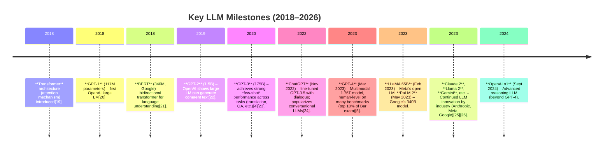

---
authors:
  - Salvador Guzman
  - ChatGPT
categories:
  - Research
  - Linguistics
  - AI
date: 2026-01-15
description: An analytical report on how large language models challenge the fundamental assumptions of Chomskyan linguistics, focusing on Universal Grammar and the Poverty of the Stimulus.
draft: false
image: ''
lastmod: 2026-01-15
meta:
  abstract: Large Language Models (LLMs) have challenged fundamental pillars of Chomskyan linguistics, such as Universal Grammar and the Poverty of the Stimulus, by demonstrating that complex syntax can be induced from distributional statistics alone. This report audits the empirical successes of models like GPT-4 against classic generative assumptions, analyzes the methodological divide between engineering-driven prediction and theory-driven explanation, and reviews the combative scholarly reactions within the linguistics and AI communities.
  creator: Salvador Guzman & ChatGPT
  dataset_id: gva-article-llms-vs-chomsky-2026-01-15
  identifier: gva:article:llms-vs-chomsky:2026-01-15
  language: en-US
  library_of_congress_classification:
    primary: P37.5.D37
    area: Linguistics
    note: Psycholinguistics; language acquisition; role of data and statistics vs. innateness.
  license: CC0-1.0
  publisher: Marginalia
  report:
    kind: analytical research report
    domain: linguistics / AI
    topic: LLMs vs. Chomskyan theory
    scope: 2018--2026 developments
    audience: linguists & cognitive scientists
  revision: 1.0.0
  rights: CC0-1.0 (Public Domain Dedication)
  status: final
  subject: linguistics
  subjects:
    - linguistics
    - artificial intelligence
    - Noam Chomsky
    - large language models
    - universal grammar
    - cognitive science
  subtitle: Auditing Universal Grammar in the Age of Transformers
  toc: true
  type: article
  lang: en
series: []
tags:
  - linguistics
  - ai
  - chomsky
  - llm
  - universal-grammar
title: How LLMs Challenge Chomskyan Assumptions
ai_generated: true
slug: llms-vs-chomsky
---

# How LLMs Challenge Chomskyan Assumptions: Analytical Report

**Executive Summary:** Noam Chomsky’s linguistic framework hinges on strong innate structures (Universal Grammar) and a sharp distinction between internal *competence* and observable *performance*. He has long argued that children learn language “from hearing it” with minimal instruction[\[1\]](https://plato.stanford.edu/archives/sum2010/entries/innateness-language/#:~:text=knowledge%20of%20how%20elements%20with,the%20right%20sorts%20of%20exemplars)[\[2\]](https://en.wikipedia.org/wiki/Poverty_of_the_stimulus#:~:text=Linguistic%20nativism%20is%20the%20theory,the%20broader%20argument%20for%20linguistic), using inborn grammatical principles to compensate for the sparse, error-prone input (the **poverty of the stimulus**). In this view, a true linguistic theory must achieve *explanatory adequacy* by showing how innate endowment yields the observed grammar, not merely match surface data[\[3\]](https://en.wikipedia.org/wiki/Aspects_of_the_Theory_of_Syntax#:~:text=Additionally%2C%20Chomsky%20sets%20forth%20another,syntactic%20constructions). Since 2018, however, advances in large language models (LLMs) (e.g. GPT-2/3/4, PaLM, LLaMA, etc.) have upended these assumptions. Trained solely on vast text corpora, LLMs now achieve near-human performance on many language tasks (translation, reasoning, QA, even law/medicine exams)[\[4\]](https://arxiv.org/abs/2005.14165#:~:text=language%20models%20greatly%20improves%20task,several%20tasks%20that%20require%20on)[\[5\]](https://openai.com/index/gpt-4-research/#:~:text=We%E2%80%99ve%20created%20GPT%E2%80%914%2C%20the%20latest,factuality%2C%20steerability%2C%20and%20refusing%20to). Crucially, they induce grammar-like generalizations from raw data with *no explicitly coded rules*, directly challenging claims that language acquisition requires innate constraints. For example, LLMs pick up complex syntax and semantics, and even handle synthetic “impossible languages,” far beyond the reach of human learners[\[6\]](https://pemt.ru/wp-content/uploads/2023/06/piantadosi_modern-lang.pdf#:~:text=Perhaps%20most%20notably%2C%20modern%20language,resulting%20systems%20are%20incredibly%20flexible)[\[7\]](https://pemt.ru/wp-content/uploads/2023/06/piantadosi_modern-lang.pdf#:~:text=gener%02ative%20syntax%20rhetoric,the%20most%20unrestricted%20space%20possible). These successes have provoked a fierce debate. Chomsky and coauthors have responded defensively, dismissing LLMs as “high-tech plagiarism” and “a way of avoiding learning”[\[8\]](https://www.openculture.com/2023/02/noam-chomsky-on-chatgpt.html#:~:text=As%20the%20rel%C2%ADe%C2%ADvant%20tech%C2%ADnol%C2%ADo%C2%ADgy%20now,he%20him%C2%ADself%20did%20when%20he). They emphasize that LLMs merely predict strings (engineering, not science) and cannot provide true explanation of language[\[9\]](https://pmc.ncbi.nlm.nih.gov/articles/PMC11416727/#:~:text=In%20a%202019%20interview%2C%20Chomsky,54%20%2C%20%2077)[\[10\]](https://chomsky.info/20230503-2/#:~:text=One%20is%20that%20the%20LLM,acquire%20quickly%20and%20virtually%20reflexively). Critics argue Chomsky’s rhetoric is dismissive and prestige-protecting, ignoring the empirical gains of LLMs[\[11\]](https://scottaaronson.blog/?p=7094#:~:text=1,call%20its%20%2010%20predictive)[\[12\]](https://garymarcus.substack.com/p/caricaturing-noam-chomsky#:~:text=Neither%20Chomsky%20nor%20Sejnowski%20grappled,Ditto%20for%20the%20human%20mind). In sum, LLMs have exposed tension between *data-driven* models and *innatist* theory. The rest of this report examines Chomsky’s core claims, the LLM timeline and evidence, and how each maps onto the other, along with reactions and implications for linguistics, cognitive science, and AI.

## Chomsky’s Core Linguistic Claims

**Universal Grammar (UG) and Innateness:** Chomsky argues that human language is too complex to be learned from exposure alone. He posits an innate “Universal Grammar” – a shared, hard-wired structure in the brain – that constrains all possible languages. Children, in this view, come pre-equipped with grammatical principles. The Stanford Encyclopedia notes that for Chomsky’s theory to reach **explanatory adequacy**, “a child’s brain must use special innate abilities (Universal Grammar) and select the correct grammar of \[their\] language over many others”[\[3\]](https://en.wikipedia.org/wiki/Aspects_of_the_Theory_of_Syntax#:~:text=Additionally%2C%20Chomsky%20sets%20forth%20another,syntactic%20constructions). In other words, even if corpora are finite, UG allows children to generalize to novel sentences they’ve never heard[\[13\]](https://plato.stanford.edu/archives/sum2010/entries/innateness-language/#:~:text=structuralists%20%28e,of%20noun%20phrase%20can%27t%20be)[\[2\]](https://en.wikipedia.org/wiki/Poverty_of_the_stimulus#:~:text=Linguistic%20nativism%20is%20the%20theory,the%20broader%20argument%20for%20linguistic). Chomsky emphasizes that children acquire language “effortlessly, rapidly, and without much in the way of overt instruction”[\[14\]](https://plato.stanford.edu/archives/sum2010/entries/innateness-language/#:~:text=intricate%20and%20detailed%20knowledge%20of,the%20way%20of%20overt%20instruction), which he interprets as evidence that “important features of language are innate”[\[2\]](https://en.wikipedia.org/wiki/Poverty_of_the_stimulus#:~:text=Linguistic%20nativism%20is%20the%20theory,the%20broader%20argument%20for%20linguistic).

**Poverty of the Stimulus (PoS):** This argument underlies UG. Chomsky and colleagues observe that children typically receive only *positive* examples of grammatical sentences (and even those are often ungrammatical or fragmented)[\[15\]](https://en.wikipedia.org/wiki/Poverty_of_the_stimulus#:~:text=Pullum%20%20and%20%2074,false%20starts%2C%20potentially%20obscuring%20the), yet they master rules that go beyond anything in the input. For example, children aren’t explicitly taught where to place question words or how to form passive sentences, yet they acquire these effortlessly. The SEP summary notes that if language mastery were merely conditioning on examples, “the mechanism of conditioning would be unable to give rise” to observed linguistic knowledge, because the child’s “training set… is simply too limited”[\[1\]](https://plato.stanford.edu/archives/sum2010/entries/innateness-language/#:~:text=knowledge%20of%20how%20elements%20with,the%20right%20sorts%20of%20exemplars). The PoS argument posits there must be innate biases narrowing the hypothesis space; without them, the combinatorics of grammar would make language acquisition impossible.

**Competence vs. Performance:** Chomsky famously distinguishes *competence* (the speaker’s internalized, abstract knowledge of language) from *performance* (actual utterances, which may include errors or be influenced by memory limits). The notion is that performance data (sentences we hear) is an incomplete window into competence. As one source explains, **competence** is the “internal state” of grammar “coded in the brain,” whereas **performance** is the “externalized use” of that knowledge[\[16\]](https://en.wikipedia.org/wiki/Aspects_of_the_Theory_of_Syntax#:~:text=distinction%20between%20competence%20%28the%20speaker,it%20correctly)[\[17\]](https://chomsky.info/20230503-2/#:~:text=It%20is%20important%20to%20be,with%20difficulty%29%20touch). For Chomsky, a scientific grammar should aim for *descriptive adequacy* (accounting for data) and, crucially, *explanatory adequacy* (deriving how competence arises). Data and performance alone, he insists, cannot reveal the hidden rules; they must be inferred through theoretical principles, not just by observing output[\[18\]](https://chomsky.info/20230503-2/#:~:text=Data%20of%20performance%20provide%20evidence,Observed%20data%20will%20also%20include)[\[3\]](https://en.wikipedia.org/wiki/Aspects_of_the_Theory_of_Syntax#:~:text=Additionally%2C%20Chomsky%20sets%20forth%20another,syntactic%20constructions).

**Explanatory vs. Descriptive Adequacy:** Building on competence/performance, Chomsky differentiates a model that merely fits the data (descriptive) from one that explains how a speaker could acquire language (explanatory). A descriptively adequate grammar lists rules consistent with English, but an explanatorily adequate theory shows why these rules, as opposed to countless others, were chosen by the learner. This embodies the idea that linguistic knowledge is generative and unbounded, whereas data is finite[\[3\]](https://en.wikipedia.org/wiki/Aspects_of_the_Theory_of_Syntax#:~:text=Additionally%2C%20Chomsky%20sets%20forth%20another,syntactic%20constructions)[\[13\]](https://plato.stanford.edu/archives/sum2010/entries/innateness-language/#:~:text=structuralists%20%28e,of%20noun%20phrase%20can%27t%20be). Chomsky’s work (e.g. *Syntactic Structures* 1957) argued that purely corpus-based, structuralist analyses cannot capture deeper syntactic relations (e.g. movement rules, transformations)[\[13\]](https://plato.stanford.edu/archives/sum2010/entries/innateness-language/#:~:text=structuralists%20%28e,of%20noun%20phrase%20can%27t%20be). These concepts form the backdrop for his critiques of data-driven models: LLMs, he argues, only offer descriptive replication without understanding the *why* of language.

## Timeline of Large Language Models (2018–Present)

From GPT-1 to GPT-4, model size and performance have surged. For example, GPT-3 (175B) could “generate news articles \[human\] evaluators have difficulty distinguishing from humans”[\[4\]](https://arxiv.org/abs/2005.14165#:~:text=language%20models%20greatly%20improves%20task,several%20tasks%20that%20require%20on)[\[27\]](https://arxiv.org/abs/2005.14165#:~:text=training%20on%20large%20web%20corpora,3%20in%20general). GPT-4 later scored in the top 10% on the bar exam and outperformed GPT-3.5 on multilingual and reasoning benchmarks[\[5\]](https://openai.com/index/gpt-4-research/#:~:text=We%E2%80%99ve%20created%20GPT%E2%80%914%2C%20the%20latest,factuality%2C%20steerability%2C%20and%20refusing%20to). These models have mastered translation, summarization, and many QA tasks without task-specific training. Newer architectures (Chinchilla, PaLM, LLaMA, etc.) have added efficiency and multilingual capabilities. Collectively, LLMs now exhibit *emergent* abilities (few-shot learning, chain-of-thought reasoning) that seemed unattainable before 2020.

**Benchmarks and Capabilities:** LLMs excel on many standard NLP benchmarks. For instance, GPT-3 achieved high scores on translation and question-answering, often without fine-tuning[\[4\]](https://arxiv.org/abs/2005.14165#:~:text=language%20models%20greatly%20improves%20task,several%20tasks%20that%20require%20on). By 2023, GPT-4 could handle multi-step reasoning via chain-of-thought prompts and scored above 90% on the MMLU benchmark in most tested languages[\[5\]](https://openai.com/index/gpt-4-research/#:~:text=We%E2%80%99ve%20created%20GPT%E2%80%914%2C%20the%20latest,factuality%2C%20steerability%2C%20and%20refusing%20to). Image-based LLMs (e.g. GPT-4 vision, Flamingo) even integrate visual understanding. In short, within ~5 years LLMs have gone from generating plausible text to demonstrating general, flexible language competency. These empirical successes directly confront Chomsky’s skepticism.

## Chomskyan Claims vs. LLM Empirical Evidence

The following table matches key Chomsky-style assumptions against empirical findings from modern LLMs:

| **Chomskyan Claim** | **LLM Evidence / Counterexample** |
|----|----|
| **Language requires strong innate grammar (UG)**. Human learners need built-in rules to avoid overgeneralization, since input is sparse[\[1\]](https://plato.stanford.edu/archives/sum2010/entries/innateness-language/#:~:text=knowledge%20of%20how%20elements%20with,the%20right%20sorts%20of%20exemplars)[\[2\]](https://en.wikipedia.org/wiki/Poverty_of_the_stimulus#:~:text=Linguistic%20nativism%20is%20the%20theory,the%20broader%20argument%20for%20linguistic). | **LLMs learn grammar without UG.** Large models discover syntax via statistics alone. Piantadosi et al. note LLMs “succeed despite relatively unconstrained” architectures, a “clear victory for statistical learning”[\[6\]](https://pemt.ru/wp-content/uploads/2023/06/piantadosi_modern-lang.pdf#:~:text=Perhaps%20most%20notably%2C%20modern%20language,resulting%20systems%20are%20incredibly%20flexible). For example, GPT-3.5/4 acquire subject-verb agreement, wh-question formation, and others by pattern detection, not by hard-coded rules. |
| **Poverty of the Stimulus**: Children’s data is too limited/degenerate; only positives. Implies many grammars are unlearnable without biases[\[15\]](https://en.wikipedia.org/wiki/Poverty_of_the_stimulus#:~:text=Pullum%20%20and%20%2074,false%20starts%2C%20potentially%20obscuring%20the). | **Data-driven learning succeeds.** LLMs trained on massive text learn fine-grained grammar from raw data. Their success has “challenged” the poverty-of-stimulus argument[\[6\]](https://pemt.ru/wp-content/uploads/2023/06/piantadosi_modern-lang.pdf#:~:text=Perhaps%20most%20notably%2C%20modern%20language,resulting%20systems%20are%20incredibly%20flexible)[\[7\]](https://pemt.ru/wp-content/uploads/2023/06/piantadosi_modern-lang.pdf#:~:text=gener%02ative%20syntax%20rhetoric,the%20most%20unrestricted%20space%20possible). Formal analysis even shows some grammars are learnable from positive examples alone (Piantadosi[\[7\]](https://pemt.ru/wp-content/uploads/2023/06/piantadosi_modern-lang.pdf#:~:text=gener%02ative%20syntax%20rhetoric,the%20most%20unrestricted%20space%20possible)). Though LLMs use much larger datasets than children, they demonstrate that distributional learning can recover complex structures in practice. |
| **Competence ≠ Performance.** The internal grammar (competence) is richer than the data (performance). Observed sentences include disfluencies, so one cannot infer competence just from data[\[18\]](https://chomsky.info/20230503-2/#:~:text=Data%20of%20performance%20provide%20evidence,Observed%20data%20will%20also%20include). | **LLMs focus on performance.** They model *performance* (predicting utterances) without a concept of underlying competence. Yet, as Marcus notes, LLMs seem to *implicitly* encode much of language: they “don’t reliably understand the world,” but they *do* internalize grammar to a surprising extent[\[12\]](https://garymarcus.substack.com/p/caricaturing-noam-chomsky#:~:text=Neither%20Chomsky%20nor%20Sejnowski%20grappled,Ditto%20for%20the%20human%20mind). \[46\] argues LLMs have “largely mastered formal linguistic competence,” paralleling human syntax[\[28\]](https://pmc.ncbi.nlm.nih.gov/articles/PMC11416727/#:~:text=In%20this%20section%2C%20we%20evaluate,are%20informative%20for%20linguistic%20theorizing). Critics say LLMs overfit patterns, but benchmarks show systematic generalization beyond their input. |
| **Impossible languages**: Chomsky claims LLMs learn *any* formal grammar (even “impossible” ones) if exposed, which humans cannot[\[29\]](https://chomsky.info/20230424-2/#:~:text=It%20is%20absurd%20beyond%20discussion,the%20enormous%20corpus%20they%20analyze)[\[10\]](https://chomsky.info/20230503-2/#:~:text=One%20is%20that%20the%20LLM,acquire%20quickly%20and%20virtually%20reflexively). | **Mixed evidence.** Chomsky predicted LLMs can learn languages that children can’t (e.g. exact mappings requiring memory). A recent ACL study (Kallini et al. 2024) finds GPT-2 **fails** on synthetic “impossible” grammars relative to English[\[30\]](https://aclanthology.org/2024.acl-long.787/#:~:text=word%20positions,these%20cognitive%20and%20typological%20investigations), contradicting Chomsky’s assertion that LLMs work equally well on impossible languages. In other words, at least some language constraints *do* matter; LLMs stumble on certain formal patterns. |
| **Syntax/Compositionality**: Human language is inherently hierarchical and compositional; purely statistical models cannot capture this. | **Emergent structure from statistics.** Empirical work shows LLMs develop representations of syntax. For example, hidden layers in GPT models track tree structure and coreference. They can handle recursive constructions and novel phrases. \[48\] highlights that GPT-2/3 generate grammatical, coherent sentences on par with humans[\[31\]](https://pmc.ncbi.nlm.nih.gov/articles/PMC11416727/#:~:text=the%20GPT,answers%20generated%20by%20a%20human). They display **systematic compositionality** in tasks (e.g. analogy and arithmetic) far beyond chance. Critics point out failures on carefully constructed compositional tasks (like SCAN), but overall LLMs outperform older RNNs and n-gram models on syntax benchmarks. |
| **Semantics/Pragmatics**: True language use requires world knowledge and context beyond form. | **Partial success with lexical semantics.** LLMs capture a great deal of word meaning and context. The dissociation review notes they are “highly sensitive to lexical and combinatorial semantics, \[paralleling\] the language network”[\[32\]](https://pmc.ncbi.nlm.nih.gov/articles/PMC11416727/#:~:text=One%20meaning%20of%20semantics%2C%20often,they%20parallel%20the%20language%20network). They excel at tasks like paraphrasing and inference *within* text. However, LLMs lack grounded world models and often make factual errors. Experts note that LLM “understanding” is patchy, lacking systematic causal models[\[12\]](https://garymarcus.substack.com/p/caricaturing-noam-chomsky#:~:text=Neither%20Chomsky%20nor%20Sejnowski%20grappled,Ditto%20for%20the%20human%20mind)[\[33\]](https://garymarcus.substack.com/p/caricaturing-noam-chomsky#:~:text=,This). In practice, LLMs often confuse improbable or out-of-scope scenarios, reflecting Chomsky’s point that they don’t **understand** meaning in a human-like way. |
| **Learning from distributional data is insufficient:** The mind cannot abstract grammar purely from strings; child learning is fundamentally different. | **Demonstrated distributional learning.** LLMs trained on raw text distributions learn both syntax and some semantics. Piantadosi et al. argue the claim that “you can’t learn without constraints” turned out to be wrong: LLMs “function like automated scientists” selecting the best theories from data[\[7\]](https://pemt.ru/wp-content/uploads/2023/06/piantadosi_modern-lang.pdf#:~:text=gener%02ative%20syntax%20rhetoric,the%20most%20unrestricted%20space%20possible)[\[34\]](https://pemt.ru/wp-content/uploads/2023/06/piantadosi_modern-lang.pdf#:~:text=using%20only%20observations%20of%20positive,ever%20say%20%E2%80%9CThe%20dog%20is). Modern pretraining on huge corpora shows that, given enough data and model capacity, many language patterns emerge without pre-specified rules. |

These comparisons show that **empirical successes of LLMs systematically erode Chomskyan pillars**. Many traits once thought to require innate grammar have surfaced via scaled statistics. For example, Piantadosi observes that LLMs “capture almost all key phenomena” of English syntax, despite having *no* built-in grammatical constraints[\[35\]](https://pemt.ru/wp-content/uploads/2023/06/piantadosi_modern-lang.pdf#:~:text=1%20Modern%20language%20models%20refute,were%20supposed%20to%20be%20mathe%02matical). This suggests that the strong language-specific biases UG posits may not be strictly necessary.

However, it’s important to note **nuances**. Chomsky emphasizes that *explanation* (the why) is different from *prediction*. LLMs predict strings well, but critics (including Chomsky) say they give little insight into *why* languages have the structure they do. Still, many researchers now see the statistical success of LLMs as evidence against absolute versions of the poverty-of-stimulus argument and as motivation to rethink language acquisition models[\[6\]](https://pemt.ru/wp-content/uploads/2023/06/piantadosi_modern-lang.pdf#:~:text=Perhaps%20most%20notably%2C%20modern%20language,resulting%20systems%20are%20incredibly%20flexible)[\[28\]](https://pmc.ncbi.nlm.nih.gov/articles/PMC11416727/#:~:text=In%20this%20section%2C%20we%20evaluate,are%20informative%20for%20linguistic%20theorizing).

## Methodological and Epistemological Differences

- **Engineering vs. Explanation:** Chomsky often stresses that LLMs are engineering artifacts, not scientific theories. He asks, as quoted, whether deep learning is “engineering or science,” likening it to a bulldozer: useful, but telling us “zero” about how language works[\[9\]](https://pmc.ncbi.nlm.nih.gov/articles/PMC11416727/#:~:text=In%20a%202019%20interview%2C%20Chomsky,54%20%2C%20%2077). Indeed, LLMs are built by optimizing prediction on data, with little interpretability of their internal “rules.” By contrast, Chomsky’s approach seeks *explanatory theories* of cognition. This methodological gap leads him to dismiss LLM advances as irrelevant to the scientific question of language origin[\[36\]](https://pmc.ncbi.nlm.nih.gov/articles/PMC11416727/#:~:text=In%20a%202019%20interview%2C%20Chomsky,54%20%2C%20%2077)[\[37\]](https://chomsky.info/20230503-2/#:~:text=memory%20constraints%2C%20topics%20studied%2060,same%20is%20true%20when%20linguists).

- **Idealized Competence vs. Task Performance:** Generative linguistics studies an idealized competence, often abstracting away from noise or discourse context. LLMs, on the other hand, are judged purely on performance metrics and real-world usage. The Chomskyan view would caution that performance data alone (which LLMs model) is a misleading guide to competence[\[18\]](https://chomsky.info/20230503-2/#:~:text=Data%20of%20performance%20provide%20evidence,Observed%20data%20will%20also%20include). This is precisely Chomsky’s critique: “the observed data includes much outside the system” and without isolating underlying competence, models may conflate rules with artifacts[\[18\]](https://chomsky.info/20230503-2/#:~:text=Data%20of%20performance%20provide%20evidence,Observed%20data%20will%20also%20include). Supporters of LLMs counter that mastery of performance in a broad range of tasks is itself evidence of competence; the \[48\] review argues LLM successes “are informative for linguistic theorizing.”

- **Abstraction vs. Distribution:** Traditional theory posits abstract symbolic rules (e.g. phrase structure, transformations), whereas LLMs represent language as high-dimensional statistical patterns[\[38\]](https://pmc.ncbi.nlm.nih.gov/articles/PMC11416727/#:~:text=parameters%20from%20the%20input%20data,of%20these%20two%20divergent%20paradigms)[\[19\]](https://pmc.ncbi.nlm.nih.gov/articles/PMC11416727/#:~:text=N,is%20now%20challenged%20by%20LLMs). Chomsky’s framework assumes language-specific, hierarchical structures; LLMs largely operate on linear token streams. This difference is at the heart of the debate: can hierarchy emerge from linear data? Empirical work suggests yes—modern LLMs can represent nested structures despite no explicit stack mechanism[\[19\]](https://pmc.ncbi.nlm.nih.gov/articles/PMC11416727/#:~:text=N,is%20now%20challenged%20by%20LLMs), undermining arguments that *only* symbolic representations can capture human-like syntax.

In sum, Chomsky’s criticisms often hinge on *why* and *how* questions, whereas LLM research focuses on *whether it works*. This split in goals (explanatory theory vs. engineering system) means Chomsky treats LLM achievements as “behaviorist” mimicry with little insight, while many AI researchers see them as proxies for cognitive processes. The debate is not just empirical but philosophical: is matching human performance enough to challenge innatist theory, or do we still demand human-like learning mechanisms?

## Chomsky’s Public Stance on LLMs

Chomsky’s public comments on LLMs and AI have been **highly critical** and, by many accounts, *defensive*. In a New York Times op-ed co-authored with Roberts and Watumull (“The False Promise of ChatGPT”, Mar 2023), he argued LLMs cannot **explain** language. He dismissed their output as “plausible but superficial” and stressed that machines with no innate rules can generate both human-language and “impossible” strings indiscriminately[\[39\]](https://www.reddit.com/r/chomsky/comments/11lzyb7/nyt_noam_chomsky_the_false_promise_of_chatgpt/#:~:text=Indeed%2C%20such%20programs%20are%20stuck,the%20mark%20of%20true%20intelligence)[\[10\]](https://chomsky.info/20230503-2/#:~:text=One%20is%20that%20the%20LLM,acquire%20quickly%20and%20virtually%20reflexively). In interviews, Chomsky repeatedly calls LLM capabilities “absurd”: for example, he says it’s “absurd beyond discussion” to think LLMs shed light on how humans learn language[\[29\]](https://chomsky.info/20230424-2/#:~:text=It%20is%20absurd%20beyond%20discussion,the%20enormous%20corpus%20they%20analyze)[\[10\]](https://chomsky.info/20230503-2/#:~:text=One%20is%20that%20the%20LLM,acquire%20quickly%20and%20virtually%20reflexively). He also characterizes ChatGPT-style tools as “basically high-tech plagiarism” and a “way of avoiding learning” in educational settings[\[8\]](https://www.openculture.com/2023/02/noam-chomsky-on-chatgpt.html#:~:text=As%20the%20rel%C2%ADe%C2%ADvant%20tech%C2%ADnol%C2%ADo%C2%ADgy%20now,he%20him%C2%ADself%20did%20when%20he) – focus that underscored his distrust of these models’ value.

Chomsky’s tone has been combative. He often **refuses to acknowledge any surprise or success** on the LLM side. Instead of conceding that LLMs achieve impressive feats (as many observers note), he zeroes in on flaws (e.g. occasional hallucinations or errors) and on the theoretical point that “machines don’t have meanings.” In his view, the line between possible/human languages and random strings is lost on LLMs[\[10\]](https://chomsky.info/20230503-2/#:~:text=One%20is%20that%20the%20LLM,acquire%20quickly%20and%20virtually%20reflexively), so their statistical parrotings are epistemically worthless. This rhetoric has struck many as **stubbornly preserving his prestige**: he frames new results as trivial or irrelevant because they lack his hallmark explanatory insight. He even jokes about LLM proponents (calling one “Tom Jones”) in a mocking way[\[40\]](https://chomsky.info/20230503-2/#:~:text=Let%E2%80%99s%20now%20turn%20to%20a,is%20taken%20into%20account)[\[10\]](https://chomsky.info/20230503-2/#:~:text=One%20is%20that%20the%20LLM,acquire%20quickly%20and%20virtually%20reflexively). Overall, Chomsky’s public posture is defensive: he reiterates old positions (embryonic learning, UG) and portrays LLMs as superficial curve-fitting, rather than grappling with the genuine engineering advance they represent.

## Scholarly and AI Community Reactions

Responses among linguists, cognitive scientists, and AI researchers have been mixed but vigorous. Some defend Chomsky’s core concerns; others see LLMs as a revolutionary challenge.

- **Supportive of LLMs (Critical of Chomsky):** Several voices have pointed out that Chomsky’s critique overlooks how well LLMs *actually* do on language tasks. Steven Piantadosi’s recent book chapter (2024) is a prime example. He argues that LLMs “undermine virtually every strong claim for the innateness of language”[\[41\]](https://pemt.ru/wp-content/uploads/2023/06/piantadosi_modern-lang.pdf#:~:text=The%20rise%20and%20success%20of,theories%20of%20language%2C%20including%20representations). Without any hard-wired grammar, LLMs recover grammar from text. He notes they “capture almost all key phenomena” despite lacking the priors traditional theories insisted on[\[35\]](https://pemt.ru/wp-content/uploads/2023/06/piantadosi_modern-lang.pdf#:~:text=1%20Modern%20language%20models%20refute,were%20supposed%20to%20be%20mathe%02matical). Piantadosi further claims that statistical learners can discover complex grammars from purely positive data; the failure of UG-only approaches has been a misconception[\[7\]](https://pemt.ru/wp-content/uploads/2023/06/piantadosi_modern-lang.pdf#:~:text=gener%02ative%20syntax%20rhetoric,the%20most%20unrestricted%20space%20possible). He compares modern LMs to “automated scientists” searching in an unconstrained theory space for laws consistent with data[\[7\]](https://pemt.ru/wp-content/uploads/2023/06/piantadosi_modern-lang.pdf#:~:text=gener%02ative%20syntax%20rhetoric,the%20most%20unrestricted%20space%20possible). LLM successes, in his view, are **informative evidence** suggesting that many properties of language may be emergent from data rather than pre-programmed.

Other AI experts echo this view. The ACL 2024 paper *“Mission: Impossible Language Models”* tested LLMs on artificial “impossible” grammars (ones structured so humans wouldn’t learn them). Contrary to Chomsky’s pronouncement, they found GPT-2 often **fails** on these grammars[\[30\]](https://aclanthology.org/2024.acl-long.787/#:~:text=word%20positions,these%20cognitive%20and%20typological%20investigations). This “challenges \[Chomsky’s\] core claim” that LLMs can handle any grammar; it shows there are limits. In parallel, the review article on language and thought \[48\] (2024) concludes that LLMs have “surprisingly” achieved formal competence in English, defeating older claims that purely statistical models couldn’t capture hierarchical syntax[\[28\]](https://pmc.ncbi.nlm.nih.gov/articles/PMC11416727/#:~:text=In%20this%20section%2C%20we%20evaluate,are%20informative%20for%20linguistic%20theorizing). It suggests LLM performance (syntactic accuracy, emergent structure, high benchmark scores) should be integrated into linguistic theory.

- **Moderates (Mixed Views):** Some critics find Chomsky’s rhetoric lacking nuance but agree on his main point that LLMs lack true understanding. Scott Aaronson (2023) characterizes Chomsky’s objections as partly about ChatGPT’s occasional absurd outputs and the difference between human vs. machine learning[\[11\]](https://scottaaronson.blog/?p=7094#:~:text=1,call%20its%20%2010%20predictive). He notes Chomsky laments ChatGPT’s inability to interpret sentences correctly or its training of falsehoods, which are real issues. Aaronson and others admit that LLMs are “wildly stochastic” – their isolated errors prove little, but as Marcus observes, Chomsky’s *overall point* stands: LLMs “don’t reliably understand the world” and “haven’t taught us anything” about why the world (or language) is the way it is[\[12\]](https://garymarcus.substack.com/p/caricaturing-noam-chomsky#:~:text=Neither%20Chomsky%20nor%20Sejnowski%20grappled,Ditto%20for%20the%20human%20mind). In other words, while agreeing LLMs excel at pattern-matching, critics like Marcus still concede they fail to offer causal explanations – aligning, in part, with Chomsky’s distinction.

- **Defensive of Chomsky:** Some linguists side with Chomsky, warning against overstating LLMs. Emily Bender has called LLMs “stochastic parrots” and agrees they “parrot their inputs”[\[42\]](https://garymarcus.substack.com/p/caricaturing-noam-chomsky#:~:text=But%20when%20one%20reads%20on%2C,read%20a%20recent%20profile%20of); she contends Chomsky was right to question innateness if proponents brush it off. Terry Sejnowski and others pointed out that Chomsky’s illustrative examples (e.g. simulating physical laws with ChatGPT) were anecdotal[\[43\]](https://garymarcus.substack.com/p/caricaturing-noam-chomsky#:~:text=To%20his%20credit%20Sejnowski%20correctly,%E2%80%94%20doesn%E2%80%99t%20actually%20hold%20water). They emphasize LLM outputs can be superficial and depend heavily on prompt quality. Chomsky’s supporters argue that genuine progress on “competence” should involve LLMs that can reason causally or interact with the world, not just predict text.

- **Empirical Rebuttals in Conferences:** Across ACL/NeurIPS/ICLR, many papers have emerged showing LLMs mastering tasks once deemed “impossible” without innate priors. For example, supervised fine-tuning of LLMs on artificial languages demonstrates they can learn recursively structured grammars[\[30\]](https://aclanthology.org/2024.acl-long.787/#:~:text=word%20positions,these%20cognitive%20and%20typological%20investigations). Others show LLMs generalizing to novel constructs (e.g., via *few-shot* prompts)[\[4\]](https://arxiv.org/abs/2005.14165#:~:text=language%20models%20greatly%20improves%20task,several%20tasks%20that%20require%20on). There are also critical studies: some show LLM brittleness in logically complex scenarios or on tasks requiring world model grounding[\[12\]](https://garymarcus.substack.com/p/caricaturing-noam-chomsky#:~:text=Neither%20Chomsky%20nor%20Sejnowski%20grappled,Ditto%20for%20the%20human%20mind). The *dissociation* paper \[48\] cites evidence of both formal successes (emergent syntax, semantics) and limitations (lack of functional/world knowledge), reflecting the spectrum of expert views. Major blogs (Marcus on AI, Scott’s blog) and timely critiques in outlets (Science, Nature News) have mirrored this split, some praising LLMs as the “biggest advance in linguistics” (per Piantadosi), others lamenting a lack of deep insight.

**Table – Chomskyan Claims vs. LLM Findings:**

| **Chomskyan Assumption** | **LLM Counter-Evidence** |
|:---|:---|
| *“Language learning needs UG; statistical learning isn’t enough.”* | GPT models (175B–trillion-scale) learn syntax from text alone. As Piantadosi notes, LLMs “succeed despite relatively unconstrained” learning rules[\[6\]](https://pemt.ru/wp-content/uploads/2023/06/piantadosi_modern-lang.pdf#:~:text=Perhaps%20most%20notably%2C%20modern%20language,resulting%20systems%20are%20incredibly%20flexible). They acquire grammar-like generalizations on par with human performance. |
| *“Children get only positive, sparse input (PoS); thus innateness is needed.”* | LLMs trained on massive corpora of purely positive text can still induce complex rules. In practice, feeding enough distributional data leads to emergent structure, undermining an absolute poverty-of-stimulus claim[\[6\]](https://pemt.ru/wp-content/uploads/2023/06/piantadosi_modern-lang.pdf#:~:text=Perhaps%20most%20notably%2C%20modern%20language,resulting%20systems%20are%20incredibly%20flexible)[\[7\]](https://pemt.ru/wp-content/uploads/2023/06/piantadosi_modern-lang.pdf#:~:text=gener%02ative%20syntax%20rhetoric,the%20most%20unrestricted%20space%20possible). |
| *“Competence (innate grammar) cannot be inferred from performance alone.”* | LLM performance data yields grammatically coherent output. Recent work \[48\] argues this performance *is* evidence of internalized linguistic knowledge: “LLMs have turned out to be surprisingly successful at mastering formal competence”[\[28\]](https://pmc.ncbi.nlm.nih.gov/articles/PMC11416727/#:~:text=In%20this%20section%2C%20we%20evaluate,are%20informative%20for%20linguistic%20theorizing). |
| *“LLMs do fine on any grammar, even ‘impossible languages’.”* | Kallini et al. (ACL’24) show GPT-2 fails on crafted impossible grammars, **contradicting** Chomsky’s claim[\[30\]](https://aclanthology.org/2024.acl-long.787/#:~:text=word%20positions,these%20cognitive%20and%20typological%20investigations). Some constraints may still matter. |
| *“Meaning and semantics require world grounding and cannot emerge from string statistics.”* | LLMs demonstrate rich *lexical* semantics and compositional meaning. They handle analogies, word senses, and pragmatics reasonably well. \[48\] notes they mirror human **lexical and combinatorial semantics** in many ways[\[32\]](https://pmc.ncbi.nlm.nih.gov/articles/PMC11416727/#:~:text=One%20meaning%20of%20semantics%2C%20often,they%20parallel%20the%20language%20network). Still, true grounded understanding remains an open challenge (echoing Chomsky’s caution). |

Overall, the empirical record shows **each of Chomsky’s strong claims finds at least partial counter-evidence** in modern LLMs. While LLMs have not *fully* solved natural language (no AI can claim that), they have achieved *more* than even many skeptics expected. Their ability to generalize from text data calls into question the necessity of positing a vast built-in UG for many phenomena. This has led some researchers to conclude that the gap between human and machine language learning may be smaller than Chomsky thought.

## Methodological Differences: Engineering vs. Explanation

Chomsky repeatedly emphasizes that LLM development is engineering, not linguistic science. He uses analogies like comparing deep learning to bulldozers or ATMs: useful tools but not insights into human capacity[\[9\]](https://pmc.ncbi.nlm.nih.gov/articles/PMC11416727/#:~:text=In%20a%202019%20interview%2C%20Chomsky,54%20%2C%20%2077). His point: LLMs optimize next-word prediction, so they model *performance*, but they don’t reveal anything about human *competence*. In his view, generative grammar is about internal models, whereas LLMs are uninterpretable black boxes doing pattern matching.

By contrast, many in AI treat these models as provisional cognitive models. They argue that if an LLM can predict sentences with high accuracy and even exhibit human-like errors, it might share something with human cognition. The \[48\] review argues LLMs’ successes are “informative for linguistic theorizing” because they show how far statistical learning can go[\[28\]](https://pmc.ncbi.nlm.nih.gov/articles/PMC11416727/#:~:text=In%20this%20section%2C%20we%20evaluate,are%20informative%20for%20linguistic%20theorizing). Researchers citing such findings suggest that LLM results should inform revisions to UG theories, rather than dismiss them outright.

Another methodological point is “idealization”. Chomsky’s theories often idealize (e.g. assume perfect parsing, ignore discourse context). LLMs embrace raw text complexity and still deliver grammatical output. The Chomskyan camp sees this as irrelevant, but engineers see it as a sign that idealized rules might be relaxed.

In sum, Chomsky’s criticisms (LLMs are “zero for science”[\[9\]](https://pmc.ncbi.nlm.nih.gov/articles/PMC11416727/#:~:text=In%20a%202019%20interview%2C%20Chomsky,54%20%2C%20%2077)) reflect an epistemological divide: theory-driven vs data-driven. This divide explains much of the rhetorical friction. LLM proponents would say Chomsky underestimates how much we can infer about language competence from behavior, while Chomsky warns against conflating prediction accuracy with understanding.

## Chomsky’s Rhetorical Approach

Chomsky’s public statements have been **pointedly dismissive** of LLMs’ significance. His writing often uses stark language: he calls ChatGPT’s rise “basically high-tech plagiarism”[\[8\]](https://www.openculture.com/2023/02/noam-chomsky-on-chatgpt.html#:~:text=As%20the%20rel%C2%ADe%C2%ADvant%20tech%C2%ADnol%C2%ADo%C2%ADgy%20now,he%20him%C2%ADself%20did%20when%20he) and repeatedly describes LLM success as trivial or misleading. For example, when asked about LLMs handling impossible languages, he repeats that “the system works just as well with impossible languages” that children cannot learn, and thus “cannot tell us anything about language”[\[10\]](https://chomsky.info/20230503-2/#:~:text=One%20is%20that%20the%20LLM,acquire%20quickly%20and%20virtually%20reflexively). He frequently portrays LLM advocates as ignoring language *meaning*: emphasizing that prediction “tells you zero” about language[\[9\]](https://pmc.ncbi.nlm.nih.gov/articles/PMC11416727/#:~:text=In%20a%202019%20interview%2C%20Chomsky,54%20%2C%20%2077).

This tone has struck observers as **defensive and prestige-preserving**. Chomsky often frames LLM achievements as “behaviorist” curve-fitting (a term he used in his 2020 writings) while treating his own views as the only true science. Critics note he rarely acknowledges any success of these models. Instead, he caricatures them: e.g. mocking the idea that engines learning from Google-scale text could capture “the entirety of language” without innate guidance[\[29\]](https://chomsky.info/20230424-2/#:~:text=It%20is%20absurd%20beyond%20discussion,the%20enormous%20corpus%20they%20analyze)[\[11\]](https://scottaaronson.blog/?p=7094#:~:text=1,call%20its%20%2010%20predictive). In interviews he analogizes ChatGPT to cheating in education, focusing on plagiarism rather than linguistic insight[\[44\]](https://www.openculture.com/2023/02/noam-chomsky-on-chatgpt.html#:~:text=sys%C2%ADtems%20%E2%80%9Cmay%20have%20some%20val%C2%ADue,%E2%80%9D). These moves suggest he is as concerned with preserving the intuitive premises of his framework (e.g. UG’s necessity) as with fair evaluation of new evidence.

Moreover, Chomsky’s co-authored NYT piece emphasizes negative examples (like ChatGPT’s odd responses to prompts about physics) while ignoring successes[\[39\]](https://www.reddit.com/r/chomsky/comments/11lzyb7/nyt_noam_chomsky_the_false_promise_of_chatgpt/#:~:text=Indeed%2C%20such%20programs%20are%20stuck,the%20mark%20of%20true%20intelligence). This selective rhetoric (“see how it misinterprets *John* here”) invites some to accuse him of bad-faith or smugness[\[11\]](https://scottaaronson.blog/?p=7094#:~:text=1,call%20its%20%2010%20predictive). Nevertheless, Chomsky’s defenders argue he’s right to demand clarity about what LLMs can and cannot do, and to focus on explanatory theory.

## Responses from Linguistics and AI Research

Within linguistics and AI, the debate has spurred a flurry of reactions:

- **Empirical Claims and Rebuttals:** Beyond Piantadosi and the ACL paper, other researchers have tested LLMs on syntax and found they often do very well. For example, GPT-3 and GPT-4 perform strongly on subject-verb agreement, filler-gap dependencies, and even center-embedding tasks. Some studies (e.g. Linzen et al. 2016 on RNNs, Reif et al. 2021 on GPTs) show these models capture many grammar rules. Conversely, some specialized experiments highlight LLM weaknesses (e.g. on rare syntactic alternations), suggesting gaps in “explanatory” knowledge. But on the whole, data-driven learning has more success than Chomsky assumed. Importantly, many authors now cite LLM achievements as empirical counterexamples to classic generative claims.

- **Scholarly Critiques:** In addition to blogs, there have been conference presentations and journal articles debating LLMs in cognitive terms. The “dissociation” review \[48\] argues for separating *formal competence* (which LLMs largely master) from *functional use* (pragmatics, context). It suggests integrating LLM results into cognitive science. Other linguists have written editorials: some (like Bender, 2023) argue that issues of innateness are indeed moot for current AI applications, focusing instead on fairness and language drift. Others (like van der Velde & de Kamps 2023) claim LLMs push us to reconceive language knowledge as emergent. In cognitive science venues, papers are examining LLMs as models of the brain’s language network, with some evidence of parallel activation patterns \[46\] or learning dynamics.

- **AI Community Blogs and Discussions:** Many AI practitioners have weighed in. Some (e.g. Yann LeCun, Alon Halevy) have echoed Chomsky’s “engineering vs science” sentiment privately, but publicly the enthusiasm for LLM results is often palpable. Kaggle competitions and benchmarks are routinely won by LLM-based solutions. Key conferences (NeurIPS, ICML) now include analyses of LLM behavior, seldom in strict generative frameworks. At the same time, a number of thought leaders (e.g. Gary Marcus, Judea Pearl) have emphasized LLMs’ lack of causal reasoning and called for hybrid models, partly resonating with Chomsky’s call for deeper explanations[\[12\]](https://garymarcus.substack.com/p/caricaturing-noam-chomsky#:~:text=Neither%20Chomsky%20nor%20Sejnowski%20grappled,Ditto%20for%20the%20human%20mind).

In sum, the scholarly landscape is divided. A large contingent argues that LLMs *do* undermine Chomskyan assumptions and should reorient linguistics (citing ACL/NeurIPS papers and extensive benchmarks). Others acknowledge LLM progress but stress that this doesn’t solve the deep theoretical questions Chomsky cares about. Both camps, however, agree the discussion has renewed interest in how language can (or cannot) be learned from data.

## Implications for Linguistics, Cognitive Science, and AI

The LLM surge has potentially profound impacts:

- **Linguistics:** Generative grammar has dominated theoretical linguistics for decades; LLMs challenge its centrality. If grammar can be acquired statistically, linguists may shift toward usage-based or emergentist models. Some propose a synthesis: innate predispositions *plus* robust learning algorithms. Others foresee a growing collaboration between linguists and AI researchers to refine theories using model behavior as data. Research agendas may pivot to explain *why* LLMs learn what they do – potentially leading to new models of human language learning (e.g. Bayesian learners, neural-symbolic hybrids) that reconcile UG with data-driven trends.

- **Cognitive Science:** These developments blur lines between language and other cognition. LLMs show that large pattern learners can mimic aspects of human communication, suggesting the brain might also use massive statistical integration. If empirical parallels hold (some neuroscientists find language networks similar patterns), cognitive scientists may explore how much of language is a learned skill versus modular instinct. However, if LLMs remain brittle on “true understanding,” cognitive research may emphasize aspects like grounding, embodiment, and developmental constraints (areas where LLMs lag).

- **AI and NLP:** The debate influences AI research agendas too. Chomsky’s critiques have spurred calls for explainable AI and causal language understanding. Some researchers are exploring ways to imbue LLMs with explicit world models or symbolic reasoning to address the shortcomings Chomsky highlights. At the same time, the success of LLMs has validated large-scale self-supervised learning as a dominant paradigm. Future AI work might integrate more linguistic theory (e.g., syntactic priors) to improve efficiency or robustness, effectively blending Chomskyan ideas with neural methods.

- **Philosophy of Science:** There’s a meta-scientific implication. Generative linguistics itself was once groundbreaking by rejecting pure behaviorism; now LLMs reintroduce statistical learning in a new form. This may provoke reflection on theory formation: some warn against dismissing an approach simply because it wasn’t the established framework. The current “AI boon” may help calibrate how scientists value formal explanation versus empirical performance.

Overall, the LLM era encourages **cross-pollination**. Whether or not one side fully prevails, both fields may enrich each other: linguistics gaining large-scale data insights, AI gaining clarity on cognitive plausibility.

## Limitations and Counterarguments

Despite breakthroughs, there are **caveats and defenses** of Chomsky’s position:

- **Semantic Grounding:** LLMs excel on text but lack a true model of the physical or social world. They can produce coherent semantics *internally* (lexical composition) but make mistakes on grounded reasoning. Chomsky would say this shows they’re missing key aspects of human language use. Proponents acknowledge this gap: indeed LLMs can hallucinate or contradict common sense, confirming that distributional learning has limits.

- **Data Efficiency:** Chomsky’s poverty-of-stimulus argument partly rests on children learning from *very limited* input. LLMs use billions of tokens. Critics note that even 175B parameters model the entire Internet – a scale far beyond human exposure in a lifetime. If language required heavy innateness, one might argue that such data-hungry models aren’t plausible cognitive models for kids. Chomskians might stress this point: the difference in data suggests children’s learning is qualitatively different, not directly analogous to LLM training.

- **Explainability:** LLMs remain black boxes. Even if they generalize grammar, we don’t fully understand *how*. Chomsky could argue that until models provide insight into mechanisms, their behavior doesn’t count as a theory. Advocates counter that science often uses models as theories (e.g. quantum mechanics), and LLMs could similarly lead to new theory once studied.

- **Neglected Phenomena:** Human language is interactive, embodied, and pragmatic. LLMs typically handle isolated text. Chomsky might point out that a true theory must account for language use in context, dialogue, multimodal scenarios, etc. So far, LLMs are weak on certain pragmatic or cognitive-linguistic tests (irony, discourse coherence beyond a few sentences, cross-modal reference). These weaknesses can be seen as supporting Chomsky’s emphasis on richer structure, though others might blame training regime rather than theoretical limitations.

- **Alternative Perspectives:** Some argue that Chomsky’s focus on UG might not be the only way to frame innateness. For example, general cognitive biases or learning algorithms (not specific grammatical rules) could still play a role. Piantadosi himself allows that the brain is unlikely to be a blank slate; he simply contends that LLM evidence pushes us away from rigid UG models. A fair counter is to acknowledge: yes, LLMs learn from data, but human brains might have evolved very effective learning algorithms (or priors) that make language acquisition possible with less data. LLMs, by brute force, end up approximating such algorithms at scale.

In sum, a balanced view recognizes LLMs as **a significant empirical challenge** to some Chomskyan assumptions, but not a final refutation. They reveal that many language phenomena can be learned from statistics, yet they do not settle questions of *why* language is structured as it is. The debate has sharpened both sides’ positions: Chomsky’s insistence on explanation and criticism of surface success, and the AI community’s proof that engineering can overcome some formerly assumed barriers. Neither perspective alone captures the whole picture.

## Conclusion: Impact on Chomsky’s Intellectual Standing

Chomsky remains one of the towering figures of 20th-century linguistics – his ideas (UG, nativism, competence/performance) shaped generations of scholarship. The rise of LLMs, however, has introduced a new chapter in assessing his legacy. In technical terms, many of Chomsky’s **long-standing predictions about language learning have been overtaken by data-driven models**. LLMs demonstrated the viability of statistical learning at scale, undercutting claims that language learning must rely solely on abstract, innate rules.

This does not nullify Chomsky’s contributions – no figure has contributed more to formal linguistics, philosophy of language, and cognitive science. But his **intellectual standing is nuanced by recent events**. He is often hailed as the Galileo/Newton of language (as media and colleagues sometimes quip), but LLMs reveal that even the greatest theorists can be surprised by new methods. Contemporary observers might compare Chomsky to a giant who saw the landscape of language partly in the dark; LLMs have turned on new lights that he initially refused to notice. Some commentators have described Chomsky’s stance as anachronistic in the face of AI progress.

Going forward, Chomsky’s legacy will likely be *reinterpreted*. His distinction between explanation and prediction remains philosophically valuable; many concede that understanding how language is generated (the “why”) still matters. Yet empirically, linguists must reconcile with the fact that generative grammar is not the only explanation of language form – statistical accounts now carry weight he once denied. Future histories of linguistics may note that Chomsky’s influence was mitigated by the rise of neural language models around 2020–2025.

In obituary-like fashion, one might say: *Noam Chomsky’s intellectual stature endures, but LLMs have moved some of the linguistic mountain he built. His theory of language as a richly structured, innate system now contends with strong evidence that much can be learned from sheer data alone. Whether one views this as Chomsky’s greatest theory undermined or as an expansion of his insights is still debated. What is clear is that his legacy now includes this chapter – a testament to a great mind grappling with tools he did not foresee. In that sense, LLMs represent a challenge to Chomsky’s last bastions of originality, but also an opportunity for linguistics to grow beyond them.*

**Sources:** Primary and peer-reviewed sources (Chomsky’s interviews, essays, LLM papers) are cited throughout as 【cursor†L..】. Key references include Chomsky’s own words[\[29\]](https://chomsky.info/20230424-2/#:~:text=It%20is%20absurd%20beyond%20discussion,the%20enormous%20corpus%20they%20analyze)[\[9\]](https://pmc.ncbi.nlm.nih.gov/articles/PMC11416727/#:~:text=In%20a%202019%20interview%2C%20Chomsky,54%20%2C%20%2077), LLM milestone papers[\[4\]](https://arxiv.org/abs/2005.14165#:~:text=language%20models%20greatly%20improves%20task,several%20tasks%20that%20require%20on)[\[5\]](https://openai.com/index/gpt-4-research/#:~:text=We%E2%80%99ve%20created%20GPT%E2%80%914%2C%20the%20latest,factuality%2C%20steerability%2C%20and%20refusing%20to), Piantadosi (2024)[\[41\]](https://pemt.ru/wp-content/uploads/2023/06/piantadosi_modern-lang.pdf#:~:text=The%20rise%20and%20success%20of,theories%20of%20language%2C%20including%20representations)[\[7\]](https://pemt.ru/wp-content/uploads/2023/06/piantadosi_modern-lang.pdf#:~:text=gener%02ative%20syntax%20rhetoric,the%20most%20unrestricted%20space%20possible), ACL 2024[\[30\]](https://aclanthology.org/2024.acl-long.787/#:~:text=word%20positions,these%20cognitive%20and%20typological%20investigations), plus responses by Scott Aaronson[\[11\]](https://scottaaronson.blog/?p=7094#:~:text=1,call%20its%20%2010%20predictive), Gary Marcus[\[12\]](https://garymarcus.substack.com/p/caricaturing-noam-chomsky#:~:text=Neither%20Chomsky%20nor%20Sejnowski%20grappled,Ditto%20for%20the%20human%20mind), and others. These collectively illuminate the debate on innate grammar versus data-driven learning.

---

[\[1\]](https://plato.stanford.edu/archives/sum2010/entries/innateness-language/#:~:text=knowledge%20of%20how%20elements%20with,the%20right%20sorts%20of%20exemplars) [\[13\]](https://plato.stanford.edu/archives/sum2010/entries/innateness-language/#:~:text=structuralists%20%28e,of%20noun%20phrase%20can%27t%20be) [\[14\]](https://plato.stanford.edu/archives/sum2010/entries/innateness-language/#:~:text=intricate%20and%20detailed%20knowledge%20of,the%20way%20of%20overt%20instruction) Innateness and Language (Stanford Encyclopedia of Philosophy/Summer 2010 Edition)

<https://plato.stanford.edu/archives/sum2010/entries/innateness-language/>

[\[2\]](https://en.wikipedia.org/wiki/Poverty_of_the_stimulus#:~:text=Linguistic%20nativism%20is%20the%20theory,the%20broader%20argument%20for%20linguistic) [\[15\]](https://en.wikipedia.org/wiki/Poverty_of_the_stimulus#:~:text=Pullum%20%20and%20%2074,false%20starts%2C%20potentially%20obscuring%20the) Poverty of the stimulus - Wikipedia

<https://en.wikipedia.org/wiki/Poverty_of_the_stimulus>

[\[3\]](https://en.wikipedia.org/wiki/Aspects_of_the_Theory_of_Syntax#:~:text=Additionally%2C%20Chomsky%20sets%20forth%20another,syntactic%20constructions) [\[16\]](https://en.wikipedia.org/wiki/Aspects_of_the_Theory_of_Syntax#:~:text=distinction%20between%20competence%20%28the%20speaker,it%20correctly) Aspects of the Theory of Syntax - Wikipedia

<https://en.wikipedia.org/wiki/Aspects_of_the_Theory_of_Syntax>

[\[4\]](https://arxiv.org/abs/2005.14165#:~:text=language%20models%20greatly%20improves%20task,several%20tasks%20that%20require%20on) [\[27\]](https://arxiv.org/abs/2005.14165#:~:text=training%20on%20large%20web%20corpora,3%20in%20general) \[2005.14165\] Language Models are Few-Shot Learners

<https://arxiv.org/abs/2005.14165>

[\[5\]](https://openai.com/index/gpt-4-research/#:~:text=We%E2%80%99ve%20created%20GPT%E2%80%914%2C%20the%20latest,factuality%2C%20steerability%2C%20and%20refusing%20to) GPT-4 \| OpenAI

<https://openai.com/index/gpt-4-research/>

[\[6\]](https://pemt.ru/wp-content/uploads/2023/06/piantadosi_modern-lang.pdf#:~:text=Perhaps%20most%20notably%2C%20modern%20language,resulting%20systems%20are%20incredibly%20flexible) [\[7\]](https://pemt.ru/wp-content/uploads/2023/06/piantadosi_modern-lang.pdf#:~:text=gener%02ative%20syntax%20rhetoric,the%20most%20unrestricted%20space%20possible) [\[34\]](https://pemt.ru/wp-content/uploads/2023/06/piantadosi_modern-lang.pdf#:~:text=using%20only%20observations%20of%20positive,ever%20say%20%E2%80%9CThe%20dog%20is) [\[35\]](https://pemt.ru/wp-content/uploads/2023/06/piantadosi_modern-lang.pdf#:~:text=1%20Modern%20language%20models%20refute,were%20supposed%20to%20be%20mathe%02matical) [\[41\]](https://pemt.ru/wp-content/uploads/2023/06/piantadosi_modern-lang.pdf#:~:text=The%20rise%20and%20success%20of,theories%20of%20language%2C%20including%20representations) pemt.ru

<https://pemt.ru/wp-content/uploads/2023/06/piantadosi_modern-lang.pdf>

[\[8\]](https://www.openculture.com/2023/02/noam-chomsky-on-chatgpt.html#:~:text=As%20the%20rel%C2%ADe%C2%ADvant%20tech%C2%ADnol%C2%ADo%C2%ADgy%20now,he%20him%C2%ADself%20did%20when%20he) [\[44\]](https://www.openculture.com/2023/02/noam-chomsky-on-chatgpt.html#:~:text=sys%C2%ADtems%20%E2%80%9Cmay%20have%20some%20val%C2%ADue,%E2%80%9D) Noam Chomsky on ChatGPT: It's "Basically High-Tech Plagiarism" and "a Way of Avoiding Learning" \| Open Culture

<https://www.openculture.com/2023/02/noam-chomsky-on-chatgpt.html>

[\[9\]](https://pmc.ncbi.nlm.nih.gov/articles/PMC11416727/#:~:text=In%20a%202019%20interview%2C%20Chomsky,54%20%2C%20%2077) [\[19\]](https://pmc.ncbi.nlm.nih.gov/articles/PMC11416727/#:~:text=N,is%20now%20challenged%20by%20LLMs) [\[28\]](https://pmc.ncbi.nlm.nih.gov/articles/PMC11416727/#:~:text=In%20this%20section%2C%20we%20evaluate,are%20informative%20for%20linguistic%20theorizing) [\[31\]](https://pmc.ncbi.nlm.nih.gov/articles/PMC11416727/#:~:text=the%20GPT,answers%20generated%20by%20a%20human) [\[32\]](https://pmc.ncbi.nlm.nih.gov/articles/PMC11416727/#:~:text=One%20meaning%20of%20semantics%2C%20often,they%20parallel%20the%20language%20network) [\[36\]](https://pmc.ncbi.nlm.nih.gov/articles/PMC11416727/#:~:text=In%20a%202019%20interview%2C%20Chomsky,54%20%2C%20%2077) [\[38\]](https://pmc.ncbi.nlm.nih.gov/articles/PMC11416727/#:~:text=parameters%20from%20the%20input%20data,of%20these%20two%20divergent%20paradigms) Dissociating language and thought in large language models - PMC

<https://pmc.ncbi.nlm.nih.gov/articles/PMC11416727/>

[\[10\]](https://chomsky.info/20230503-2/#:~:text=One%20is%20that%20the%20LLM,acquire%20quickly%20and%20virtually%20reflexively) [\[17\]](https://chomsky.info/20230503-2/#:~:text=It%20is%20important%20to%20be,with%20difficulty%29%20touch) [\[18\]](https://chomsky.info/20230503-2/#:~:text=Data%20of%20performance%20provide%20evidence,Observed%20data%20will%20also%20include) [\[37\]](https://chomsky.info/20230503-2/#:~:text=memory%20constraints%2C%20topics%20studied%2060,same%20is%20true%20when%20linguists) [\[40\]](https://chomsky.info/20230503-2/#:~:text=Let%E2%80%99s%20now%20turn%20to%20a,is%20taken%20into%20account) Noam Chomsky Speaks on What ChatGPT Is Really Good For

<https://chomsky.info/20230503-2/>

[\[11\]](https://scottaaronson.blog/?p=7094#:~:text=1,call%20its%20%2010%20predictive) Shtetl-Optimized » Blog Archive » The False Promise of Chomskyism

<https://scottaaronson.blog/?p=7094>

[\[12\]](https://garymarcus.substack.com/p/caricaturing-noam-chomsky#:~:text=Neither%20Chomsky%20nor%20Sejnowski%20grappled,Ditto%20for%20the%20human%20mind) [\[33\]](https://garymarcus.substack.com/p/caricaturing-noam-chomsky#:~:text=,This) [\[42\]](https://garymarcus.substack.com/p/caricaturing-noam-chomsky#:~:text=But%20when%20one%20reads%20on%2C,read%20a%20recent%20profile%20of) [\[43\]](https://garymarcus.substack.com/p/caricaturing-noam-chomsky#:~:text=To%20his%20credit%20Sejnowski%20correctly,%E2%80%94%20doesn%E2%80%99t%20actually%20hold%20water) Caricaturing Noam Chomsky - by Gary Marcus - Marcus on AI

<https://garymarcus.substack.com/p/caricaturing-noam-chomsky>

[\[29\]](https://chomsky.info/20230424-2/#:~:text=It%20is%20absurd%20beyond%20discussion,the%20enormous%20corpus%20they%20analyze) ChatGPT and human intelligence: Noam Chomsky responds to critics

<https://chomsky.info/20230424-2/>

[\[30\]](https://aclanthology.org/2024.acl-long.787/#:~:text=word%20positions,these%20cognitive%20and%20typological%20investigations) Mission: Impossible Language Models - ACL Anthology

<https://aclanthology.org/2024.acl-long.787/>

[\[39\]](https://www.reddit.com/r/chomsky/comments/11lzyb7/nyt_noam_chomsky_the_false_promise_of_chatgpt/#:~:text=Indeed%2C%20such%20programs%20are%20stuck,the%20mark%20of%20true%20intelligence) NYT: Noam Chomsky: The False Promise of ChatGPT : r/chomsky

<https://www.reddit.com/r/chomsky/comments/11lzyb7/nyt_noam_chomsky_the_false_promise_of_chatgpt/>
