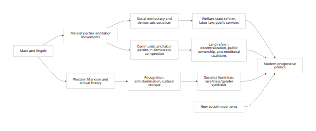
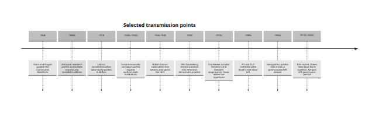

## Executive summary

The hypothesis can be **proven in a qualified historical and analytical
sense**. Modern progressive politics is not identical to Marxism, and
many of its contemporary forms are openly non-Marxist or post-Marxist.
But the connection is still strong, traceable, and non-accidental. The
best way to formalize it is to say that a substantial part of modern
progressive politics is a **mediated descendant** of Marxist and
Marx-adjacent socialist traditions: first through labor movements and
social democratic parties, then through welfare-state institution
building, then through Western Marxism, socialist feminism,
anti-colonial left politics, and labor-linked policy networks. In that
sense, the relationship is one of **genealogical inheritance plus
selective adaptation**, not one of simple identity.
[\[1\]](https://www.marxists.org/archive/marx/works/download/pdf/Manifesto.pdf?utm_source=chatgpt.com)

The strongest evidence appears where five things overlap: a
class-centered critique of capitalism; organizational continuity between
unions, socialist parties, and progressive movements; programmatic
continuity in redistribution, labor rights, public services, and public
ownership; rhetorical continuity centered on inequality, exploitation,
oligarchy, monopoly, and social rights; and intellectual continuity
through social-democratic, Marxist, critical-theory, and
socialist-feminist networks. Where three or more of those mechanisms are
present together, the connection is no longer a loose resemblance but a
historically grounded lineage. That threshold is clearly met in the
German SPD, British Labour, Swedish social democracy, the U.S.
democratic-socialist/progressive bloc around DSA and the Congressional
Progressive Caucus, Brazil's PT, Chile's left coalitions, and India's
CPI(M)-linked state-level left governance.
[\[2\]](https://www.spd.de/fileadmin/Dokumente/Beschluesse/Grundsatzprogramme/hamburger_programm_englisch.pdf)

The strongest substantive continuities are found in **welfare-state
politics, labor law, health care, education, progressive taxation,
corporate regulation, public planning, and public ownership or
quasi-public control**. Comparative political economy literature long
ago showed that welfare-state development was deeply tied to organized
labor and left parties, not merely to abstract national culture. Korpi's
power-resources framework and Esping-Andersen's decommodification
framework remain the most useful academic bridges between Marxian class
theory and modern progressive policymaking. OECD data still show the
scale of the institutional residue: public social spending averages
about one-fifth of GDP across the OECD, while union density and
bargaining coverage remain much higher in classic social-democratic
settings such as Sweden than in market-liberal systems such as the
United States.
[\[3\]](https://www.cambridge.org/core/journals/world-politics/article/power-resources-and-employercentered-approaches-in-explanations-of-welfare-states-and-varieties-of-capitalism-protagonists-consenters-and-antagonists/6B7688A17F6C7EF213F0E6D2ACE7130B)

The connection becomes more complex in the areas of **identity politics,
environmentalism, and NGO/think-tank activism**. Here the line of
descent is real but less direct. Black feminism, intersectionality, and
recognition-based politics did not simply "come from Marxism," but many
of their most influential formulations emerged in dialogue with
socialist feminism, anti-capitalist politics, and Western Marxist
critiques of domination. Likewise, today's climate-progressive agenda
often fuses ecological concerns with labor rights, industrial planning,
anti-monopoly politics, and public investment, as seen in the Green New
Deal. These are recognizably post-Keynesian, social-democratic, and
eco-socialist adaptations of older socialist repertoires rather than
straightforward repetitions of nineteenth-century Marxism.
[\[4\]](https://americanstudies.yale.edu/sites/default/files/files/Keyword%20Coalition_Readings.pdf)

The central conclusion, therefore, is this: **modern progressive
politics is best understood neither as a disguised form of pure Marxism
nor as wholly independent of Marxism**. It is better understood as a
broad political family in which some branches are directly Marxist, some
are social-democratic revisions of Marxism, some are liberal-left
formations heavily shaped by socialist institutions, and some are hybrid
movements that adopted Marxist categories without preserving Marxist end
goals. The continuity is strongest at the levels of institutions,
political economy, labor organization, and structural rhetoric, and
weakest where progressive politics shifted toward pluralist recognition
claims, civil-rights constitutionalism, and non-class social-movement
agendas.
[\[5\]](https://www.spd.de/fileadmin/Dokumente/Beschluesse/Grundsatzprogramme/hamburger_programm_englisch.pdf)

## Thesis, definitions, and method

The thesis of this report is deliberately precise: **there is a
formalizable connection between modern progressive politics and Marxism
because contemporary progressive politics inherits, translates, and
selectively revises core Marxist and socialist ideas through
identifiable historical mechanisms**. "Formalizable" here means that the
relationship can be stated as a testable argument rather than a cultural
impression. The argument is strongest if one defines the connection not
as complete doctrinal sameness, but as a pattern of durable transmission
across texts, organizations, personnel, policy programs, and
intellectual networks. If "proof" means mathematical necessity, no
historical question can be proven that way. If it means demonstrating a
robust causal-genealogical relationship with enough direct and indirect
evidence to make alternative explanations less convincing, then the
hypothesis is supported. [\[6\]](https://philpapers.org/rec/PRZCAS-3)

For purposes of this report, **Marxism** means the tradition stemming
from Marx and Engels that centers historical materialism, class
struggle, exploitation under wage labor, the concentration and
contradictions of capital, and the possibility of transcending
capitalism through social ownership or associated control over
production. The *Communist Manifesto* supplied the canonical language of
bourgeois society and class conflict; the *Critique of the Gotha
Programme* elaborated the transitional logic of socialism and communism;
and modern philosophical summaries still treat class, exploitation,
alienation, and historical change as the load-bearing concepts of the
tradition.
[\[7\]](https://www.marxists.org/archive/marx/works/download/pdf/Manifesto.pdf?utm_source=chatgpt.com)

For purposes of this report, **modern progressive politics** means the
contemporary cluster of center-left and left politics organized around
some combination of redistribution, universal or near-universal social
rights, labor protection, anti-discrimination, civil liberties,
feminism, racial justice, environmental sustainability, economic
regulation, and suspicion of concentrated private power. The
Congressional Progressive Caucus defines itself in terms of prioritizing
working people over corporate interests and supporting universal health
care, debt-free college, climate action, immigration reform, and social
equality. Comparable coalitions in Europe and Latin America articulate
similar bundles in the language of social justice, anti-neoliberalism,
state responsibility for rights, and inclusive democracy.
[\[8\]](https://progressives.house.gov/about-the-cpc)

The key analytical move is to distinguish **descent** from
**convergence**. Some progressive policies could arise without Marxism;
universal schooling, anti-poverty policy, and civil-rights reform also
have liberal, Christian-social, republican, feminist, and anti-colonial
lineages. A rigorous method therefore asks not whether progressives ever
support policies Marxists also support, but whether the relationship is
historically structured. The method used here combines conceptual
genealogy, comparative process tracing, and institutional analysis. In
practice, that means looking for five evidentiary markers: explicit
textual borrowing; organizational continuity; personnel circulation;
policy translation from socialist ideas into reformist law; and stable
rhetorical frames around class power, domination, and social rights.
[\[9\]](https://www.spd.de/fileadmin/Dokumente/Beschluesse/Grundsatzprogramme/hamburger_programm_englisch.pdf)

A useful methodological control is to ask what would count **against**
the hypothesis. The hypothesis would weaken if modern progressivism
consistently emerged in settings without labor-socialist institutions,
without left-class rhetoric, without unions, and without socialist
intellectual mediation. It would also weaken if the major progressive
parties explicitly rejected all socialist inheritance while pursuing
purely market-liberal egalitarianism. The evidence instead shows the
opposite: even where parties revised or moderated Marxism, they
generally did so from **inside** labor and socialist traditions rather
than from outside them. The SPD's current Hamburg Programme still says
the party draws from "Marxist analysis of society" alongside Judaism,
Christianity, Humanism, the Enlightenment, the women's movement, and new
social movements. That sentence is unusually valuable because it states
both continuity and pluralization at once.
[\[10\]](https://www.spd.de/fileadmin/Dokumente/Beschluesse/Grundsatzprogramme/hamburger_programm_englisch.pdf)

The geographic scope here is global but weighted toward the United
States, the United Kingdom, Western Europe, Latin America, and India, as
requested. The underlying evidence base is uneven. Western European
party archives and OECD labor/welfare data are strong; U.S. movement
sources are abundant but ideologically diffuse; Latin American and
Indian official materials are plentiful but often multilingual and less
standardized; and there is no single global dataset that directly
measures "Marxist influence" on modern progressive politics. Where
evidence is thinner, this report flags the limitation rather than
pretending there is a precision that does not exist.
[\[11\]](https://www.oecd.org/en/data/datasets/social-expenditure-database-socx.html)

## Mechanisms of transmission

The first mechanism is **ideological inheritance**. Social democracy and
democratic socialism emerged historically as revisions of Marxist
strategy, not as unrelated traditions. Przeworski's classic formulation
was that socialist movements confronted the choice of contesting
elections, broadening beyond the working class, and reforming rather
than abolishing capitalism; those decisions produced mass reformist
labor parties rather than revolutionary parties. The SPD's own history
page explicitly describes the 1959 Godesberg Program as a turning point
away from an allegedly inevitable development toward socialism and
toward reform-oriented democratic socialism, while the current Hamburg
Programme says the party remains rooted in the labor movement and in
Marxist social analysis. The result is not "Marxism unchanged," but
Marxism translated into parliamentary social democracy.
[\[12\]](https://philpapers.org/rec/PRZCAS-3)

The second mechanism is **policy translation**. Marxism in government
rarely survives as pure abolitionist doctrine inside democratic systems.
It reappears as policies that decommodify essential goods, subordinate
markets to collective goals, and reduce employers' discretionary power.
Korpi's power-resources approach ties welfare-state development to class
conflict and the organizational strength of labor. Esping-Andersen's
famous language of decommodification likewise describes welfare
institutions that reduce dependence on pure market income. OECD data
show how enduring those translated institutions became: public social
spending averages around 21% of GDP across the OECD, and in the
highest-spending cases exceeds 30% of GDP. The modern progressive
commitment to universal health care, public education, social insurance,
labor standards, and state-led industrial transition is best understood
as the reformist policy form of older socialist and labor demands.
[\[13\]](https://www.cambridge.org/core/journals/world-politics/article/power-resources-and-employercentered-approaches-in-explanations-of-welfare-states-and-varieties-of-capitalism-protagonists-consenters-and-antagonists/6B7688A17F6C7EF213F0E6D2ACE7130B)

The third mechanism is **organizational influence**. Where progressive
parties are structurally linked to unions, the historical connection to
Marxism and socialism is especially visible. Labour's own website says
the party was formed out of the trade union movement to give working
people a political voice. The Swedish Social Democratic Party's program
describes the labor movement as developing along union and political
lines in natural cooperation. The SPD states that it developed as part
of the labor movement and worked "together with the trade unions" to
build workers' rights and the welfare state. OECD data show that the
organizational foundation remains far stronger in social-democratic
systems than in liberal ones: union density is 65.9% in Sweden, 22% in
the UK, 14.1% in Germany, and 9.9% in the United States, while
bargaining coverage remains 88% in Sweden, 49% in Germany, 40.2% in the
UK, and only 11.1% in the U.S.
[\[14\]](https://labour.org.uk/about-us/affiliated-unions/)

The fourth mechanism is **rhetorical continuity**. Modern progressive
rhetoric frequently preserves socialist and Marxian patterns even when
it drops revolutionary language. The CPC says it prioritizes working
Americans over corporate interests; DSA says it rejects an order based
on private profit, alienated labor, and gross inequalities of wealth and
power; Sanders' issue and press materials frame politics around
billionaires, oligarchy, and working families; the Green New Deal
resolution links climate action to union jobs, monopoly power, rights,
and economic security; PT's statute defines the party as fighting to
eliminate exploitation, domination, oppression, inequality, injustice,
and misery in order to build democratic socialism; Boric's coalition
program says the market should cease being society's structuring
principle and the state should resume a primary role in guaranteeing
social rights and administering natural resources. These are not random
shared metaphors. They are a recurring anti-domination lexicon whose
deepest twentieth-century carriers were Marxist, socialist, and labor
traditions. [\[15\]](https://progressives.house.gov/about-the-cpc)

The fifth mechanism is **intellectual-network transmission**. Western
Marxism and critical theory widened the socialist critique from factory
exploitation alone to culture, legitimacy, ideology, and forms of
domination that were not exhausted by wage relations. The Stanford
Encyclopedia's critical-theory entry explicitly places the Frankfurt
School inside the Western European Marxist tradition. Black feminism and
intersectional theory then extended anti-domination analysis in a
different direction. The Combahee River Collective defined its politics
as opposed to racial, sexual, heterosexual, and class oppression,
embraced identity politics, and declared itself socialist because work
should serve the collective benefit of those who do it rather than the
profit of bosses. Crenshaw's foundational article on intersectionality
did not arise as orthodox Marxism, but it emerged from a radical Black
feminist critique of the limits of single-axis analysis. Fraser later
diagnosed a "post-socialist" shift from redistribution toward
recognition. The line of descent here is real but mediated: modern
progressive identity politics is not reducible to Marxism, yet major
parts of its most influential theory developed in ongoing argument with
socialist-feminist and Marxist categories.
[\[16\]](https://plato.stanford.edu/entries/critical-theory/)

  ------------------------------------------------------------------------------------------
                                  

  ------------------------------------------------------------------------------------------

The flow chart captures the main conclusion of the mechanism section:
the path from Marxism to modern progressivism is usually **indirect and
cumulative**, not linear. Social democracy, democratic socialism, the
New Left, socialist feminism, labor institutions, and anti-neoliberal
coalitions act as transmission belts. That is why the strongest "proof"
is rarely a single manifesto line; it is the combination of party
genealogy, union linkage, policy inheritance, and adapted rhetoric
across time.
[\[17\]](https://www.spd.de/fileadmin/Dokumente/Beschluesse/Grundsatzprogramme/hamburger_programm_englisch.pdf)

## Comparative case studies

The comparative evidence is strongest when examined through real
parties, movements, policies, and personnel across time. The table below
compresses the highest-confidence cases.

  ----------------------------------------------------------------------------------------------
  Case           Marxist or socialist  Organizational     Illustrative        Continuity
                 inheritance           bridge             policies and        judgment
                                                          rhetoric            
  -------------- --------------------- ------------------ ------------------- ------------------
  Germany SPD    Hamburg Programme     SPD describes      Workers' rights,    **Strong but
                 says SPD draws on     itself as part of  welfare state,      revised**
                 "Marxist analysis of  the labor movement reformist           
                 society"; party       and says it        democratic          
                 history page says     developed the      socialism, later    
                 Godesberg redefined   welfare state      incorporation of    
                 democratic socialism  together with      women's and new     
                 from inevitabilist    trade unions.      social movements.   
                 socialism to reform                                          
                 practice.                                                    

  United Kingdom Labour official site  Affiliated unions  NHS creation in     **Strong in
  Labour         says the party was    remain a           1948; Bank of       origin, moderated
                 formed out of the     structural part of England             in doctrine**
                 trade union movement; party life.        nationalization in  
                 historic Labour                          1946; labor-rights  
                 politics included                        link persists.      
                 common-ownership                                             
                 traditions and                                               
                 postwar                                                      
                 nationalization.                                             

  Sweden SAP and Swedish party program Dense union-party  Universalistic      **Very strong
  LO             locates the movement  cooperation        welfare state,      institutional
                 in union-political    through the labor  solidaristic wage   continuity**
                 cooperation;          movement.          setting, Meidner    
                 wage-earner funds                        funds to counter    
                 were proposed for                        concentrated        
                 "economic democracy."                    capital ownership.  

  United States  DSA rejects           Electoral          Medicare for All,   **Strong in
  DSA, Sanders,  private-profit order  coalitions, DSA    wealth tax, Green   factions, not
  CPC            and unequal           chapters, nurses'  New Deal, right to  hegemonic in the
                 wealth-power          unions,            organize, debt-free whole
                 structures; Sanders   labor-backed issue college,            center-left**
                 and the CPC frame     campaigns.         anti-monopoly       
                 politics as workers                      language.           
                 vs corporations and                                          
                 billionaires.                                                

  Brazil PT and  PT statute defines    Labor-party nexus  Bolsa Família,      **Strong origin,
  CUT            mission as building   developed with CUT participatory       moderated
                 democratic socialism  and later mass     budgeting, labor    governing form**
                 and eliminating       social coalitions. rights,             
                 exploitation and                         anti-poverty        
                 oppression.                              institutions,       
                                                          rights-based        
                                                          developmentalism.   

  Chile Frente   Boric coalition       Coalition between  Feminism,           **Strong
  Amplio and     program says market   Broad Front        ecological          anti-neoliberal
  Apruebo        should cease          parties, Communist transition, social  continuity, plural
  Dignidad       structuring society;  Party,             rights, stronger    ideological mix**
                 coalition included    student-movement   state role, labor   
                 the Communist Party   cadres, and a      reform,             
                 and anti-neoliberal   joint policy       public-resource     
                 left currents.        observatory.       administration.     

  India CPI(M)   CPI(M) explicitly     Party-linked mass  Land reform,        **Direct Marxist
  and Kerala     seeks socialism via   organizations and  decentralization,   continuity with
  left           people's democracy    state-level left   panchayat           democratic-state
  governance     and combines          governance.        strengthening,      adaptation**
                 parliamentary and                        pro-people policy,  
                 extra-parliamentary                      strong health       
                 struggle.                                outcomes in Kerala. 
  ----------------------------------------------------------------------------------------------

**Sources for the table:** Germany: Hamburg Programme and SPD history.
[\[10\]](https://www.spd.de/fileadmin/Dokumente/Beschluesse/Grundsatzprogramme/hamburger_programm_englisch.pdf)
United Kingdom: Labour affiliated unions page; NHS and Bank of England
official sources.
[\[18\]](https://labour.org.uk/about-us/affiliated-unions/) Sweden: SAP
program, party constitution, and wage-earner funds literature.
[\[19\]](https://library.fes.de/pdf-files/ialhi/90144/90144.pdf) United
States: DSA constitution, CPC official pages, Green New Deal text,
Sanders and Medicare for All materials.
[\[20\]](https://www.dsausa.org/about-us/constitution/) Brazil: PT
statute and principles, plus PT transformation literature and Bolsa
Família evidence. [\[21\]](https://pt.org.br/estrutura-partidaria/)
Chile: Frente Amplio principles, Apruebo Dignidad program, coalition
statement, and academic work on Chile's renewed left.
[\[22\]](https://frenteampliochile.cl/nosotros/nuestros-principios/)
India: CPI(M) programme and Kerala official health dashboard.
[\[23\]](https://cpim.org/party-programme/)

Germany is the clearest European example of **continuity through
revision**. The SPD's current Hamburg Programme explicitly says that
since Godesberg the party has seen itself as the people's party of the
left with roots in Judaism, Christianity, Humanism, Enlightenment,
Marxist social analysis, and labor-movement experience. That formulation
is exceptionally revealing. It does not deny Marxist inheritance; it
domesticates it inside a pluralist democratic left. The SPD's own
history page likewise says the 1959 Godesberg Program moved the party
away from the notion of an inevitable historical transition to socialism
and toward acceptance of private property where it serves the common
good. The connection to modern progressivism is therefore not that the
SPD stayed purely Marxist; it is that one of the core templates for
today's progressive center-left was built by **revising Marxism from
within**.
[\[10\]](https://www.spd.de/fileadmin/Dokumente/Beschluesse/Grundsatzprogramme/hamburger_programm_englisch.pdf)

The British Labour case shows the same pattern in a more institutionally
union-centered form. Labour's official site still says the party was
formed out of the trade union movement to give working people their own
political voice. Once in office, Labour translated socialist and labor
demands into concrete state-building: the Bank of England Act 1946
placed the central bank in public ownership and public control, while
Britain's NHS formally opened on 5 July 1948 as a universal public
health institution. Even if later Labour governments moved toward
market-friendly social democracy or Third Way moderation, the
foundational link between trade unions, democratic socialism, and
public-service universalism remained one of the most decisive channels
through which Marxism-adjacent politics entered mainstream progressive
governance. [\[24\]](https://labour.org.uk/about-us/affiliated-unions/)

Sweden is the strongest case of **institutionalized class compromise
with socialist roots**. The SAP's program says the Swedish labor
movement grew along trade-union and political lines whose cooperation
"was, and is, natural." That is already enough to mark modern Swedish
progressivism as inseparable from organized labor. The more radical edge
appeared in Rudolf Meidner's wage-earner funds, proposed through the LO
and defended as a means of developing "economic democracy," countering
concentrated ownership, and building collective capital. Even though the
final implementation was watered down, the episode is analytically
important: one of the most admired progressive welfare states in the
world did not merely regulate capitalism; at moments it explored
mechanisms for socializing ownership itself. That is a direct line from
Marxist concerns with capital concentration to reformist progressive
experiments.
[\[25\]](https://library.fes.de/pdf-files/ialhi/90144/90144.pdf)

The U.S. case is more fragmented, but it is still powerful. DSA's
constitution says it rejects an order based on private profit, alienated
labor, and gross inequalities of wealth and power. The CPC says it
prioritizes working Americans over corporate interests and supports
universal health care, debt-free college, climate action, and economic
equality. The Green New Deal resolution linked climate policy to a
ten-year national mobilization, high-quality union jobs, job guarantees,
higher education, the right to organize, health care, housing, and
freedom from monopoly domination. Jayapal, Dingell, and Sanders
introduced Medicare for All in 2023 with more than half of the
Democratic caucus cosponsoring the House bill, and Sanders later
proposed a 5% annual wealth tax on 938 billionaires, framed as a means
of funding direct payments and expanded Medicare benefits. The U.S.
progressive left therefore supplies strong evidence of policy
translation and rhetoric, even if the Democratic Party as a whole is not
socialist. [\[26\]](https://www.dsausa.org/about-us/constitution/)

Brazil's PT shows how a labor-socialist formation can be moderated by
electoral and governing pressures without losing the underlying lineage.
PT's official structure page quotes Article 1 of the party statute,
defining the party as a voluntary association committed to democracy,
solidarity, and transformations oriented toward eliminating
exploitation, domination, oppression, inequality, injustice, and misery,
with the goal of constructing democratic socialism. The party's
foundational principles predate formal party creation and explicitly
invoke a workers' party. Samuels and Hunter both describe the PT as
having moved from a more openly socialist identity toward
social-democratic or centrist governing forms, but they also emphasize
that this was a **transformation of a left mass party**, not its
replacement by a non-socialist formation. On the policy side, Bolsa
Família became one of the world's most influential anti-poverty
programs, while participatory budgeting in Porto Alegre became a
hallmark of democratic deepening associated with the Brazilian left.
Those policies are not "Marxist" in a doctrinaire sense, but they are
legible as reformist descendants of socialist commitments to
redistribution, participation, and labor-centered citizenship.
[\[27\]](https://pt.org.br/estrutura-partidaria/)

Chile demonstrates how modern progressive politics can arise from a
synthesis of student movements, democratic socialism, environmentalism,
feminism, and explicit communist alliance. Frente Amplio's principles
and Apruebo Dignidad's government program were explicit about justice,
anti-neoliberalism, ecological transition, and a stronger state role.
The program said the market should stop functioning as the structuring
principle of society and the state should regain a leading role in
guaranteeing social rights and administering natural resources. Apruebo
Dignidad also formally linked the Broad Front with the Communist Party
of Chile and created a joint policy observatory involving research
centers from both currents. Academic accounts of Chile's recent left
stress that part of the new left grew out of student mobilization while
also converging with the Communist Party and older left strands. This is
important because it shows both continuity and mutation: contemporary
Chilean progressivism is broader than Marxism, but in one of its most
consequential governing coalitions the Marxist connection is not hidden
at all.
[\[28\]](https://frenteampliochile.cl/nosotros/nuestros-principios/)

India's CPI(M) and the Kerala model show the clearest case of **direct
Marxist vocabulary coexisting with democratic adaptation**. The CPI(M)
programme explicitly says the party aims to guide workers, peasants, and
progressive democratic forces toward people's democracy as a step toward
socialism, and it says communist and left-led governments in Kerala,
West Bengal, and Tripura showed the way through land reform,
decentralization, revitalization of panchayats, and democratic rights.
The same program explicitly endorses combining parliamentary and
extra-parliamentary struggle and pursuing socialist transformation
through peaceful means where possible. In Kerala, the official health
dashboard reports an IMR of 5 in 2023 and life expectancy of 75.1 years
in 2019--23, the highest in India. The inferential point is not that
every positive social indicator in Kerala is "caused by Marxism," but
that one of the world's most durable democratic-communist governing
traditions translated class politics into decentralized,
public-service-heavy, pro-people statecraft with measurable outcomes.
[\[23\]](https://cpim.org/party-programme/)

  ------------------------------------------------------------------------------------------
                                  

  ------------------------------------------------------------------------------------------

The timeline matters because it reveals the structure of continuity.
Marxism's influence on modern progressivism did not travel in a straight
line from 1848 to the present. It moved through **workers' parties,
social democracy, welfare-state statecraft, critical theory, socialist
feminism, anti-neoliberal coalitions, and democratic-socialist
revival**. That is why countries and parties can look very different in
doctrinal terms while still sharing a common lineage.
[\[29\]](https://www.marxists.org/archive/marx/works/download/pdf/Manifesto.pdf?utm_source=chatgpt.com)

## Quantitative patterns, continuities, and divergences

The strongest quantifiable evidence of continuity lies in the
**institutional infrastructure of class politics**. Union density and
bargaining coverage remain far higher where labor movements historically
built social-democratic settlements than where progressivism developed
inside a market-liberal setting. This does not "prove Marxism" by
itself, but it shows the durability of the organizational terrain
through which Marxist and socialist ideas were historically translated
into mainstream progressive politics.
[\[30\]](https://www.oecd.org/content/dam/oecd/en/data/datasets/oecd-aias-ictwss/Germany.pdf)

  -----------------------------------------------------------------------
  Country               Union density          Adjusted What the numbers
                                             bargaining suggest
                                               coverage 
  ----------------- ----------------- ----------------- -----------------
  Sweden                        65.9%               88% Progressive
                                                        politics rests on
                                                        dense
                                                        labor-market
                                                        institutions and
                                                        sectoral
                                                        bargaining.

  United Kingdom                  22%             40.2% The labor link
                                                        remains
                                                        significant but
                                                        far weaker than
                                                        in classic Nordic
                                                        social democracy.

  Germany                       14.1%               49% Union membership
                                                        is lower, but
                                                        bargaining
                                                        institutions
                                                        still preserve a
                                                        labor-social
                                                        compromise.

  United States                  9.9%             11.1% Progressive
                                                        politics exists,
                                                        but class
                                                        organization is
                                                        much thinner and
                                                        more
                                                        factionalized.
  -----------------------------------------------------------------------

**Source note:** OECD/AIAS ICTWSS 2024 country notes for Sweden, the UK,
Germany, and the U.S.
[\[30\]](https://www.oecd.org/content/dam/oecd/en/data/datasets/oecd-aias-ictwss/Germany.pdf)

Voting research reinforces the same point. Arndt and colleagues describe
social democratic parties and unions as originating in the same
movement, with unions acting as the economic arm and parties as the
political arm of labor. Freeman's NBER paper found that union members in
the United States were more likely to vote Democratic than
demographically comparable nonunion voters. More recent work on Europe
finds that unions still help translate redistributive preferences into
left voting even amid immigration and cultural conflict. These are
measurable traces of the same underlying mechanism: organizational labor
power has historically carried Marxian and socialist concerns into
electoral progressive politics even where party ideologies later
moderated.
[\[31\]](https://centaur.reading.ac.uk/72615/1/Union%20members%20at%20the%20polls_submission17032016%20%281%29.pdf)

Policy adoption also shows patterned rather than accidental continuity.
The Green New Deal resolution tied decarbonization to public investment,
union jobs, participatory planning, anti-monopoly commercial rules, and
universal access to health care, housing, and education. The CPC claims
more than 100 members. Medicare for All in 2023 was introduced with more
than half of the Democratic caucus as House cosponsors. Sanders' 2026
wealth-tax bill targeted 938 billionaires and was framed as a direct
counter to concentrated private wealth. Those particulars matter because
they show contemporary progressivism repeatedly reaching for policy
forms long associated with socialist traditions: decommodification,
industrial planning, labor empowerment, and redistribution from capital
to social use.
[\[32\]](https://www.congress.gov/bill/116th-congress/house-resolution/109/text)

The welfare state is perhaps the broadest long-run residue of the
connection. The OECD's social-spending dashboard reports that public
social spending averages about 21% of GDP across OECD countries, with
some high-spending states exceeding 30% of GDP. Korpi's power-resources
theory and Esping-Andersen's decommodification framework explain why
this matters: welfare states are not just administrative conveniences;
they are historically sedimented outcomes of class organization,
left-party competition, and institutionalized attempts to reduce
workers' dependence on unfettered labor markets. That is why modern
progressive demands for universal childcare, public health insurance,
paid leave, public pensions, and labor-market regulation are
analytically closer to social democracy and reformist Marxian politics
than to classical laissez-faire liberalism.
[\[33\]](https://www.oecd.org/en/data/dashboards/social-expenditure-dashboard.html)

The deepest continuity is in **political economy**. Marxism's central
concern was not simply that poverty exists, but that capitalism gives
structurally disproportionate power to owners of capital. Modern
progressive politics still centers that concern, even when it no longer
calls for full abolition of capitalism. Progressive rhetoric against
billionaires, monopoly domination, corporate power, landlord extraction,
and privatization is recognizably downstream from Marxist and socialist
critiques of ownership and class rule. PT's statute speaks of
exploitation and domination; DSA rejects private-profit social order;
CPC frames corporate interests against working people; the Green New
Deal names monopoly domination; CPI(M) still speaks openly of monopoly
capitalism, landlordism, and socialist transformation; and Boric's
program seeks to displace the market as the organizing principle of
society. This is the most important substantive proof in the report:
modern progressive politics consistently recodes the Marxist problem of
class power into contemporary democratic language.
[\[34\]](https://pt.org.br/estrutura-partidaria/)

The most important divergences should be stated just as clearly. Many
modern progressive actors do **not** seek abolition of capitalism,
dictatorship of the proletariat, or comprehensive social ownership. The
SPD explicitly broke with historical inevitabilism and accepted private
property conditioned by the common good. Boric, in a widely read
interview, distinguished moving beyond neoliberalism from declaring the
immediate end of capitalism. The CPC is a caucus inside a
liberal-democratic party, not a socialist party-state project.
Intersectionality arose from Black feminist legal and movement critique,
not from class-reductionist Marxism. Environmentalism also draws from
scientific ecology, conservation, and indigenous politics, not only
socialist traditions. The connection to Marxism is therefore strongest
when progressivism addresses labor, redistribution, ownership, public
provision, and anti-monopoly politics, and weakest where it becomes a
broad liberal coalition around rights and recognition detached from
class organization.
[\[35\]](https://www.spd.de/programm/geschichte-der-spd-grundsatzprogramme)

A compact way to summarize the continuities and divergences is to map
policy families by the strength of Marxist inheritance.

  -----------------------------------------------------------------------
  Policy family           Strength of connection  Why
                          to Marxist lineage      
  ----------------------- ----------------------- -----------------------
  Unionization and        Very strong             Built directly through
  collective bargaining                           labor movements and
                                                  class organization.

  Welfare state and       Very strong             Core social-democratic
  social insurance                                translation of
                                                  decommodification and
                                                  labor power.

  Public ownership and    Strong                  Direct descendant of
  democratic control                              socialist concern with
                                                  ownership of
                                                  production, though
                                                  often softened.

  Universal health care   Strong                  Reformist
  and education                                   institutionalization of
                                                  social rights and
                                                  decommodification.

  Progressive taxation    Strong                  Modern democratic form
  and anti-monopoly                               of limiting
  regulation                                      concentrated capital
                                                  power.

  Identity politics and   Moderate, mediated      Developed partly
  intersectionality                               through socialist
                                                  feminism and
                                                  anti-capitalist
                                                  critique, but not
                                                  reducible to Marxism.

  Environmentalism and    Moderate, mediated      Eco-socialist and
  climate justice                                 labor-green traditions
                                                  matter, but so do
                                                  non-Marxist ecological
                                                  lineages.

  Civil-liberties and     Mixed                   Often compatible with
  rights pluralism                                socialist politics but
                                                  also deeply liberal and
                                                  republican in origin.
  -----------------------------------------------------------------------

The academic literature supports this hierarchy. Korpi and
Esping-Andersen make the strongest case for the labor--welfare-state
connection; Przeworski explains the reformist electoral turn of
socialist parties; Freeman and later union-voting work support the
union--left linkage; critical theory, socialist feminism, Crenshaw, and
Fraser explain why identity and recognition politics sit in a more
mediated relationship to Marxism. Taken together, the evidence suggests
that the proposition is strongest in political economy and weaker---but
still real---in cultural and identity-centered domains.
[\[36\]](https://www.cambridge.org/core/journals/world-politics/article/power-resources-and-employercentered-approaches-in-explanations-of-welfare-states-and-varieties-of-capitalism-protagonists-consenters-and-antagonists/6B7688A17F6C7EF213F0E6D2ACE7130B)

## Open questions and conclusion

Several limitations remain. There is no single cross-national database
that codes "Marxist influence" in party platforms, personnel networks,
funding structures, and enacted law at once. The evidence for Western
Europe and the United States is better standardized than for Latin
America and India. Some crucial official texts for Brazil and Chile are
in Portuguese or Spanish; they are essential to the cases, but they
limit perfectly even comparison with English-language archives.
Quantification is strongest for union density, bargaining coverage,
caucus size, and some programmatic sponsorship counts, but weaker for
measuring the relative causal weight of Marxism versus liberalism,
feminism, Christian democracy, anti-colonial nationalism, or green
thought inside any single movement. Those are real data gaps, not fatal
flaws.
[\[37\]](https://www.oecd.org/content/dam/oecd/en/data/datasets/oecd-aias-ictwss/OECD-AIAS-ICTWSS-v2-Codebook.pdf)

Even with those caveats, the report's main conclusion is firm. **Modern
progressive politics is historically and structurally connected to
Marxism.** The connection is not a slogan, not a conspiracy claim, and
not a claim of total equivalence. It is a historically traceable pattern
in which Marxist theory, socialist party formation, labor organization,
welfare-state construction, critical-theory revision, socialist-feminist
expansion, and anti-neoliberal coalition politics all helped produce the
repertoire now called "progressive." The proof is strongest where
official party documents, labor institutions, enacted policies, and
academic research all point in the same direction, as they do in the
SPD, Labour, Swedish social democracy, DSA/CPC politics, PT, Apruebo
Dignidad, and CPI(M)-linked governance.
[\[38\]](https://www.spd.de/fileadmin/Dokumente/Beschluesse/Grundsatzprogramme/hamburger_programm_englisch.pdf)

The best final formulation is therefore this: **modern progressive
politics is a broad, plural, and often moderate political formation
whose deepest institutional and political-economic layers are
substantially indebted to Marxist and socialist traditions, even when
its contemporary actors reject orthodox Marxism or define themselves
more narrowly as social democrats, democratic socialists, feminists,
anti-racists, greens, or progressives**. The continuity is strongest in
labor, welfare, redistribution, ownership, and anti-monopoly politics;
the divergences are greatest on revolution, class primacy, and the
end-state of capitalism; and the overall relationship is best captured
as one of **mediated inheritance rather than identity**. On that
qualified but rigorous standard, the hypothesis stands.
[\[39\]](https://www.cambridge.org/core/journals/world-politics/article/power-resources-and-employercentered-approaches-in-explanations-of-welfare-states-and-varieties-of-capitalism-protagonists-consenters-and-antagonists/6B7688A17F6C7EF213F0E6D2ACE7130B)

------------------------------------------------------------------------

[\[1\]](https://www.marxists.org/archive/marx/works/download/pdf/Manifesto.pdf?utm_source=chatgpt.com)
[\[7\]](https://www.marxists.org/archive/marx/works/download/pdf/Manifesto.pdf?utm_source=chatgpt.com)
[\[29\]](https://www.marxists.org/archive/marx/works/download/pdf/Manifesto.pdf?utm_source=chatgpt.com)
Manifesto of the Communist Party

<https://www.marxists.org/archive/marx/works/download/pdf/Manifesto.pdf?utm_source=chatgpt.com>

[\[2\]](https://www.spd.de/fileadmin/Dokumente/Beschluesse/Grundsatzprogramme/hamburger_programm_englisch.pdf)
[\[5\]](https://www.spd.de/fileadmin/Dokumente/Beschluesse/Grundsatzprogramme/hamburger_programm_englisch.pdf)
[\[9\]](https://www.spd.de/fileadmin/Dokumente/Beschluesse/Grundsatzprogramme/hamburger_programm_englisch.pdf)
[\[10\]](https://www.spd.de/fileadmin/Dokumente/Beschluesse/Grundsatzprogramme/hamburger_programm_englisch.pdf)
[\[17\]](https://www.spd.de/fileadmin/Dokumente/Beschluesse/Grundsatzprogramme/hamburger_programm_englisch.pdf)
[\[38\]](https://www.spd.de/fileadmin/Dokumente/Beschluesse/Grundsatzprogramme/hamburger_programm_englisch.pdf)
https://www.spd.de/fileadmin/Dokumente/Beschluesse/Grundsatzprogramme/hamburger_programm_englisch.pdf

<https://www.spd.de/fileadmin/Dokumente/Beschluesse/Grundsatzprogramme/hamburger_programm_englisch.pdf>

[\[3\]](https://www.cambridge.org/core/journals/world-politics/article/power-resources-and-employercentered-approaches-in-explanations-of-welfare-states-and-varieties-of-capitalism-protagonists-consenters-and-antagonists/6B7688A17F6C7EF213F0E6D2ACE7130B)
[\[13\]](https://www.cambridge.org/core/journals/world-politics/article/power-resources-and-employercentered-approaches-in-explanations-of-welfare-states-and-varieties-of-capitalism-protagonists-consenters-and-antagonists/6B7688A17F6C7EF213F0E6D2ACE7130B)
[\[36\]](https://www.cambridge.org/core/journals/world-politics/article/power-resources-and-employercentered-approaches-in-explanations-of-welfare-states-and-varieties-of-capitalism-protagonists-consenters-and-antagonists/6B7688A17F6C7EF213F0E6D2ACE7130B)
[\[39\]](https://www.cambridge.org/core/journals/world-politics/article/power-resources-and-employercentered-approaches-in-explanations-of-welfare-states-and-varieties-of-capitalism-protagonists-consenters-and-antagonists/6B7688A17F6C7EF213F0E6D2ACE7130B)
https://www.cambridge.org/core/journals/world-politics/article/power-resources-and-employercentered-approaches-in-explanations-of-welfare-states-and-varieties-of-capitalism-protagonists-consenters-and-antagonists/6B7688A17F6C7EF213F0E6D2ACE7130B

<https://www.cambridge.org/core/journals/world-politics/article/power-resources-and-employercentered-approaches-in-explanations-of-welfare-states-and-varieties-of-capitalism-protagonists-consenters-and-antagonists/6B7688A17F6C7EF213F0E6D2ACE7130B>

[\[4\]](https://americanstudies.yale.edu/sites/default/files/files/Keyword%20Coalition_Readings.pdf)
https://americanstudies.yale.edu/sites/default/files/files/Keyword%20Coalition_Readings.pdf

<https://americanstudies.yale.edu/sites/default/files/files/Keyword%20Coalition_Readings.pdf>

[\[6\]](https://philpapers.org/rec/PRZCAS-3)
[\[12\]](https://philpapers.org/rec/PRZCAS-3)
https://philpapers.org/rec/PRZCAS-3

<https://philpapers.org/rec/PRZCAS-3>

[\[8\]](https://progressives.house.gov/about-the-cpc)
[\[15\]](https://progressives.house.gov/about-the-cpc)
https://progressives.house.gov/about-the-cpc

<https://progressives.house.gov/about-the-cpc>

[\[11\]](https://www.oecd.org/en/data/datasets/social-expenditure-database-socx.html)
https://www.oecd.org/en/data/datasets/social-expenditure-database-socx.html

<https://www.oecd.org/en/data/datasets/social-expenditure-database-socx.html>

[\[14\]](https://labour.org.uk/about-us/affiliated-unions/)
[\[18\]](https://labour.org.uk/about-us/affiliated-unions/)
[\[24\]](https://labour.org.uk/about-us/affiliated-unions/)
https://labour.org.uk/about-us/affiliated-unions/

<https://labour.org.uk/about-us/affiliated-unions/>

[\[16\]](https://plato.stanford.edu/entries/critical-theory/)
https://plato.stanford.edu/entries/critical-theory/

<https://plato.stanford.edu/entries/critical-theory/>

[\[19\]](https://library.fes.de/pdf-files/ialhi/90144/90144.pdf)
[\[25\]](https://library.fes.de/pdf-files/ialhi/90144/90144.pdf)
https://library.fes.de/pdf-files/ialhi/90144/90144.pdf

<https://library.fes.de/pdf-files/ialhi/90144/90144.pdf>

[\[20\]](https://www.dsausa.org/about-us/constitution/)
[\[26\]](https://www.dsausa.org/about-us/constitution/)
https://www.dsausa.org/about-us/constitution/

<https://www.dsausa.org/about-us/constitution/>

[\[21\]](https://pt.org.br/estrutura-partidaria/)
[\[27\]](https://pt.org.br/estrutura-partidaria/)
[\[34\]](https://pt.org.br/estrutura-partidaria/)
https://pt.org.br/estrutura-partidaria/

<https://pt.org.br/estrutura-partidaria/>

[\[22\]](https://frenteampliochile.cl/nosotros/nuestros-principios/)
[\[28\]](https://frenteampliochile.cl/nosotros/nuestros-principios/)
https://frenteampliochile.cl/nosotros/nuestros-principios/

<https://frenteampliochile.cl/nosotros/nuestros-principios/>

[\[23\]](https://cpim.org/party-programme/)
https://cpim.org/party-programme/

<https://cpim.org/party-programme/>

[\[30\]](https://www.oecd.org/content/dam/oecd/en/data/datasets/oecd-aias-ictwss/Germany.pdf)
https://www.oecd.org/content/dam/oecd/en/data/datasets/oecd-aias-ictwss/Germany.pdf

<https://www.oecd.org/content/dam/oecd/en/data/datasets/oecd-aias-ictwss/Germany.pdf>

[\[31\]](https://centaur.reading.ac.uk/72615/1/Union%20members%20at%20the%20polls_submission17032016%20%281%29.pdf)
https://centaur.reading.ac.uk/72615/1/Union%20members%20at%20the%20polls_submission17032016%20%281%29.pdf

<https://centaur.reading.ac.uk/72615/1/Union%20members%20at%20the%20polls_submission17032016%20%281%29.pdf>

[\[32\]](https://www.congress.gov/bill/116th-congress/house-resolution/109/text)
https://www.congress.gov/bill/116th-congress/house-resolution/109/text

<https://www.congress.gov/bill/116th-congress/house-resolution/109/text>

[\[33\]](https://www.oecd.org/en/data/dashboards/social-expenditure-dashboard.html)
https://www.oecd.org/en/data/dashboards/social-expenditure-dashboard.html

<https://www.oecd.org/en/data/dashboards/social-expenditure-dashboard.html>

[\[35\]](https://www.spd.de/programm/geschichte-der-spd-grundsatzprogramme)
https://www.spd.de/programm/geschichte-der-spd-grundsatzprogramme

<https://www.spd.de/programm/geschichte-der-spd-grundsatzprogramme>

[\[37\]](https://www.oecd.org/content/dam/oecd/en/data/datasets/oecd-aias-ictwss/OECD-AIAS-ICTWSS-v2-Codebook.pdf)
https://www.oecd.org/content/dam/oecd/en/data/datasets/oecd-aias-ictwss/OECD-AIAS-ICTWSS-v2-Codebook.pdf

<https://www.oecd.org/content/dam/oecd/en/data/datasets/oecd-aias-ictwss/OECD-AIAS-ICTWSS-v2-Codebook.pdf>
