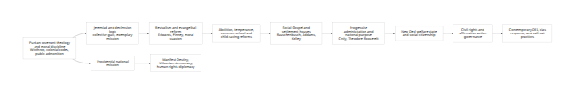

# Puritan Moral Psychology and the Genealogy of American Progressivism

## Executive summary

The thesis can be formalized in a serious, researchable way, but only if
it is stated carefully. The strongest version is **not** that modern
American progressivism is simply "Puritanism without God," or that every
progressive reform is a disguised return of seventeenth-century
Calvinism. The strongest defensible version is that a durable
**moral-political grammar** first institutionalized in New England
Puritanism remained available in American public life and was repeatedly
**translated** into new vocabularies, organizations, and policy
projects. That grammar includes covenantal mission, collective guilt and
declension, moralized authority, public scrutiny of conduct,
disciplinary institutions, exemplary national identity, and recurrent
hopes for social purification. In that sense, the continuity is best
understood as **genealogical and morphological**, not as a simple
doctrinal survival. [\[1\]](https://www.britannica.com/topic/Puritanism)

The evidence for continuity is strongest in three places. First, in
Puritan primary sources, New England's founders explicitly fused
religious covenant, public discipline, legal order, and collective moral
obligation. John Winthrop's "A Modell of Christian Charity," the
Massachusetts Body of Liberties, and Winthrop's "On Liberty" all frame
the community as a morally ordered body whose freedom exists through
covenant and subjection to rightful authority; the Robert Keayne case
shows the public censure of economic behavior in both church and civil
settings.
[\[2\]](https://history.hanover.edu/courses/excerpts/212winth.html)

Second, the key mediating chain runs through the eighteenth and
nineteenth centuries: the Great Awakenings, evangelical reform,
abolitionism, temperance, public schooling, the settlement movement, and
the Social Gospel. These movements did not preserve Puritan theology
unchanged. Rather, they **reworked** its habits of introspection,
testimony, discipline, and redemptive collective action into the idioms
of moral reform, social uplift, equality, and public administration.
Charles Finney's revivalism emphasized practical methods, moral action,
and reform; abolition and temperance made "moral suasion" central;
Walter Rauschenbusch explicitly argued for social salvation and the use
of politics and administration to realize a more just order; Jane Addams
and Florence Kelley carried moral concern into settlement work,
regulation, and "child-saving."
[\[3\]](https://nationalhumanitiescenter.org/tserve/nineteen/nkeyinfo/nevanrev.htm)

Third, by the Progressive Era and after, the older moral grammar was
increasingly lodged in **bureaucratic and professional institutions**.
Herbert Croly, Theodore Roosevelt, and the Progressive Party justified
enhanced state capacity in the name of the common good and "social and
industrial justice"; the New Deal turned economic security into a
quasi-right and built permanent administrative organs; the civil-rights
and affirmative-action era deepened federal moral oversight over public
and private institutions; and contemporary DEI programs, bias-response
systems, and call-out or cancellation practices often operate through
analogous patterns of injury-identification, ritualized acknowledgment,
educational remediation, and sanctions over status or speech. This last
link is real but the least stable: contemporary practices are intensely
contested, and since 2025 federal policy has itself turned sharply
against DEI, making the present moment one of conflict rather than
settled institutional consolidation.
[\[4\]](https://teachingamericanhistory.org/document/the-promise-of-american-life/)

The thesis is therefore plausible in a **qualified** form. It explains
recurring American tendencies toward redemptive politics, moralized
administration, institutional supervision of conduct, and national
mission. But it does **not** explain everything. Progressivism also
arose from Enlightenment universalism, republicanism, industrialization,
urban poverty, labor conflict, Black freedom struggles, women's
activism, social science, and rights-based constitutionalism. Moreover,
moralized politics is not uniquely progressive; it is a recurrent
feature of American political culture across left, center, and right.
The best conclusion is that American progressivism is **partly** a
secularized continuation of Puritan moral psychology, especially in its
institutional forms of reform, discipline, and exemplary mission, but it
is never reducible to that origin alone.
[\[5\]](https://www.jstor.org/stable/1520079)

## Scope, method, and core thesis

This report treats "Puritanism" primarily as the New England Calvinist
tradition of covenant theology, congregational discipline, moral
regulation, and providential mission, and "American progressivism" as a
broad cluster of reform movements and administrative practices, from
nineteenth-century evangelical reform through the Progressive Era, New
Deal liberalism, civil-rights governance, and parts of contemporary
social-justice politics. That leaves out many important traditions,
including Catholic social thought, Jewish social ethics, socialist and
labor traditions, and Black church and secular radical currents; those
omissions matter and are addressed later as limits rather than ignored.
[\[6\]](https://www.britannica.com/topic/Puritanism)

The core claim can be stated analytically as follows: **American
progressivism recurrently reproduces a sequence first consolidated in
Puritan New England**---collective covenant, diagnosis of public sin or
declension, testimony and confession, purification through discipline,
institution-building to enforce norms, and an exemplary mission for the
polity. Over time, this sequence was secularized by changing its
lexicon: sin became vice, then social problem, then injustice, bias,
inequity, or harm; sanctification became uplift, reform, citizenship,
therapy, or inclusion; church discipline became school discipline,
settlement supervision, regulatory inspection, personnel compliance, or
bias response; providential mission became national destiny, democratic
world-order, or human-rights diplomacy. The claim is an inference drawn
from the primary sources and institutional transitions below, not a
claim that later reformers consciously thought of themselves as
Puritans.
[\[7\]](https://history.hanover.edu/courses/excerpts/212winth.html)

This way of framing the topic fits, but also disciplines, a large
historiography. Perry Miller emphasized the enduring importance of
Puritan thought for American identity; Sacvan Bercovitch made the
"American jeremiad" central to understanding how dissent can be absorbed
into national mission; Robert Bellah argued that the United States
developed an elaborate civil religion alongside denominational religion.
At the same time, later scholars challenged overly totalizing or
exceptionalist versions of these claims, disputing whether Puritanism
can bear as much explanatory weight as Miller and Bercovitch once
assigned it.
[\[8\]](https://nationalhumanitiescenter.org/tserve/eighteen/ekeyinfo/legacy.htm)

A final methodological caution is necessary. Some links in this
genealogy are **direct** and organizational, as when evangelical
reformers founded societies, settlement houses, regulatory bodies, and
later administrative agencies. Others are **formal analogies** that
require inference, as with contemporary call-out or DEI practices. Where
the evidence is stronger, I treat it as historical continuity; where
weaker, I say explicitly that the relationship is analogical, contested,
or incomplete.
[\[9\]](https://www.loc.gov/exhibitions/join-in-voluntary-associations-in-america/about-this-exhibition/a-nation-of-joiners/changing-america/settlement-houses-hull-house/)

## Puritan foundations

New England Puritanism joined theology, social order, and political
authority from the outset. In "A Modell of Christian Charity," John
Winthrop described an explicitly hierarchical but mutually obligated
commonwealth: differences in wealth and status existed so that people
might exercise mercy, patience, obedience, and stewardship for the
"common good." The same sermon cast the migration itself as a covenant
with God whose breach would bring public shame and judgment. The
Massachusetts Body of Liberties and the later Laws and Liberties
similarly yoked civil law to scriptural authority; the legal code
protected liberties, but in cases of legal defect appealed directly to
"the word of God," and it criminalized idolatry, witchcraft, and
blasphemy as capital offenses.
[\[10\]](https://history.hanover.edu/courses/excerpts/212winth.html)

Winthrop's 1645 speech "On Liberty" makes the regime's logic unusually
explicit. He distinguished "natural" liberty---the liberty to do as one
wishes---from "civil or federal" liberty, which he also called moral
liberty. That liberty, he argued, exists only under authority and is "a
liberty to that only which is good, just, and honest." Here freedom is
not the absence of rule; it is the moral fruit of covenant and
disciplined subjection. That conception is central to the later American
tendency to treat authority as emancipatory when directed toward moral
improvement.
[\[11\]](https://teachingamericanhistory.org/document/on-liberty/)

Puritan practice also depended on public discipline and moral scrutiny.
The Robert Keayne case shows a merchant publicly investigated and
admonished for pricing practices judged oppressive. Teaching American
History's introduction correctly emphasizes that church and civil
authorities together defined acceptable economic behavior and enforced
communal standards. Even acquittal, in Winthrop's own understanding,
still called for humiliation before God, a revealing sign that guilt and
purification were not exhausted by legal innocence.
[\[12\]](https://teachingamericanhistory.org/document/admonishment-and-reconciliation-of-robert-keayne-with-the-church-1639-1640/)

Puritan inwardness mattered no less than public discipline. The broader
Puritan tradition stressed predestination, covenant, preaching, and the
need for intense self-examination; Jonathan Edwards's later resolutions
and life-writing show the persistence of shame-conscious introspection,
confession, and scrutiny of motive, even as eighteenth-century
revivalism shifted the register toward conversion and awakening. This
matters because later reform cultures repeatedly combined **internal
moral inventory** with **external social action**.
[\[13\]](https://www.britannica.com/topic/Puritanism)

The Puritan foundations relevant to later progressivism can be
summarized comparatively:

| Puritan structure | Early expression | Later progressive or liberal analogue | Evidence |
|---|---|---|---|
| Covenantal community | Collective covenant with God and public duty in Winthrop | "Contract with the people," social citizenship, rights plus obligation | [\[14\]](https://history.hanover.edu/courses/excerpts/212winth.html) |
| Moralized authority | Liberty exists through subjection to "good, just, and honest" rule | Expert administration justified as protecting welfare, equality, or inclusion | [\[15\]](https://teachingamericanhistory.org/document/on-liberty/) |
| Public discipline | Church/civil censure in Keayne case; scriptural law in colony codes | Inspection, compliance offices, bias reporting, regulatory enforcement | [\[16\]](https://teachingamericanhistory.org/document/admonishment-and-reconciliation-of-robert-keayne-with-the-church-1639-1640/) |
| Declension and jeremiad | Fear of covenant-breaking and collective shame | Reform rhetoric centered on national sin, hypocrisy, or failure to live ideals | [\[17\]](https://history.hanover.edu/courses/excerpts/212winth.html) |
| Confession and self-scrutiny | Humiliation before God, Edwardsian self-examination | Testimony, awareness-raising, apology, public acknowledgment of harm or bias | [\[18\]](https://history.hanover.edu/courses/excerpts/212winth.html) |
| Exemplary mission | "City upon a hill," providential errand | Manifest Destiny, democratic crusade, human-rights diplomacy | [\[19\]](https://nationalhumanitiescenter.org/tserve/nineteen/nkeyinfo/mandestiny.htm) |
| Purification | Restraint of corruption, vice, false worship | Campaigns against drink, labor exploitation, segregation, discriminatory institutions, and later exclusionary climates | [\[20\]](https://teachingamericanhistory.org/document/the-body-of-liberties-of-the-massachusetts-colony-in-new-england/) |

This table should not be read as proof of a single uninterrupted chain.
It shows something narrower and firmer: Puritan New England established
a repertoire of moral forms that later American reformers could inherit,
revise, and secularize.
[\[21\]](https://nationalhumanitiescenter.org/tserve/eighteen/ekeyinfo/legacy.htm)

## Genealogical trajectory

A classic connecting concept is the **American jeremiad**. Bercovitch's
influential formulation argued that a sermonic pattern of lament over
declension paradoxically worked to renew national mission rather than to
abandon it. Later readers praised the book as a landmark while also
criticizing its exceptionalist or overintegrative tendencies. Whatever
one makes of Bercovitch's strongest claims, the jeremiad is a useful
analytical bridge: it links Puritan covenant-breaking to later moral
reform movements that accuse America of betraying its promise in order
to demand stricter national fidelity.
[\[22\]](https://www.jstor.org/stable/jj.36075995)

The Enlightenment did not erase this grammar; it altered it.
Tocqueville's famous observation that Puritanism was "almost as much a
political theory as a religious doctrine" captures the crucial point: in
America, religious and republican idioms fused early. Robert Bellah
later described the resulting public tradition as a distinct "civil
religion." This helps explain why moral language could survive even
where confessional theology weakened: providence and covenant could be
translated into national destiny, rights, republic, democracy, and
public mission.
[\[23\]](https://www.aei.org/research-products/journal-publication/a-marriage-of-opposites-tocqueville-on-religion-and-democracy/)

The Second Great Awakening then democratized and activistized the moral
impulse. Britannica's overview and the National Humanities Center's
synthesis both stress that the awakening stimulated temperance, women's
activism, abolition, missions, and other reforms. Finney's revivalism is
especially important because he treated revival not as miracle but as
the effect of properly used means, and he pressed Christians to raise
the standard of conduct if they wished to convert the world. This is a
crucial mediator between Puritan inner discipline and Progressive-era
confidence in organized moral techniques.
[\[24\]](https://www.britannica.com/topic/Second-Great-Awakening)

The Social Gospel and settlement work pushed the translation further.
Rauschenbusch argued that the Kingdom of God required social as well as
individual salvation, and Teaching American History's introduction
captures how this meant using politics and administration to ameliorate
industrial society. Jane Addams's moral language of public duty,
sympathetic knowledge, and social ethics then moved reform into urban
institutions such as Hull-House, whose services ranged from childcare
and classes to labor and health campaigns. Here the old moral energy is
no longer primarily ecclesiastical; it has become civic,
social-scientific, and administrative.
[\[25\]](https://www.britannica.com/event/Social-Gospel)

The culmination of this trajectory in the Progressive Era is visible in
Croly, Theodore Roosevelt, and the Progressive Party. Croly's *Promise
of American Life* and Roosevelt's "New Nationalism" explicitly argued
for stronger national organization in the service of the common good;
the Progressive Party declared "social and industrial justice" the
nation's "supreme duty." That is not Puritan language, but it is
recognizably the same structure: a morally charged commonwealth, a
righteous national purpose, and authority justified by the need to
discipline private power and improve collective life.
[\[26\]](https://teachingamericanhistory.org/document/the-promise-of-american-life/)

The trajectory can be summarized in a timeline:

| Date | Node | Key actors | Genealogical significance | Sources |
|---|---|---|---|---|
| 1630 | Covenant commonwealth | John Winthrop | Community defined by covenant, mutual obligation, and exemplary mission | [\[27\]](https://history.hanover.edu/courses/excerpts/212winth.html) |
| 1641--1647 | Scriptural civil order | Massachusetts General Court | Civil liberty and law explicitly anchored to divine rule and public discipline | [\[28\]](https://teachingamericanhistory.org/document/the-body-of-liberties-of-the-massachusetts-colony-in-new-england/) |
| 1639--1645 | Public admonition and "moral" liberty | Robert Keayne, Winthrop | Economic conduct and liberty moralized and publicly supervised | [\[29\]](https://teachingamericanhistory.org/document/admonishment-and-reconciliation-of-robert-keayne-with-the-church-1639-1640/) |
| 1730s--1740s | Revival and introspection | Jonathan Edwards | Intensified self-scrutiny, awakening, and conversion-centered public religion | [\[30\]](https://www.ccel.org/e/edwards/sermons.html) |
| 1820s--1840s | Activist evangelical reform | Charles Finney and revival networks | Reform through organized means; moral action applied to society | [\[31\]](https://nationalhumanitiescenter.org/tserve/nineteen/nkeyinfo/nevanrev.htm) |
| 1830s--1850s | Moral suasion | Garrison, AASS, Grimké | Slavery attacked as collective sin through testimony, persuasion, and shame | [\[32\]](https://teachingamericanhistory.org/document/to-the-public/) |
| 1870s--1920s | Social Gospel | Rauschenbusch | Social salvation; politics and administration as moral instruments | [\[33\]](https://www.britannica.com/event/Social-Gospel) |
| 1889 onward | Settlement movement | Addams, Starr, Kelley | Moral reform embodied in neighborhood institutions and regulation | [\[34\]](https://www.loc.gov/exhibitions/join-in-voluntary-associations-in-america/about-this-exhibition/a-nation-of-joiners/changing-america/settlement-houses-hull-house/) |
| 1909--1912 | Progressive statism | Croly, Theodore Roosevelt, Progressive Party | National administrative capacity justified by welfare and justice | [\[35\]](https://teachingamericanhistory.org/document/the-promise-of-american-life/) |
| 1935--1944 | Welfare-state rights | FDR, Social Security Board | Economic security reframed as a right and administered by national institutions | [\[36\]](https://www.ssa.gov/history/35act.html) |
| 1947--1965 | Rights-state expansion | Truman committee, Brown, LBJ | Moral equality juridified and bureaucratized | [\[37\]](https://teachingamericanhistory.org/document/to-secure-these-rights-the-report-of-the-presidents-committee-on-civil-rights/) |
| 1965 onward | Affirmative-action governance | LBJ, EEOC, OFCCP | Nondiscrimination plus proactive remediation enforced through federal oversight | [\[38\]](https://www.archives.gov/federal-register/codification/executive-order/11246.html) |
| 2000s--2020s | DEI, bias response, call-out culture | Universities, HR systems, PEN America's critics and defenders | Harm-centered moral language, institutional monitoring, and contested discipline of speech/status | [\[39\]](https://www.smith.edu/your-campus/offices-services/equity-inclusion/policies-resources/bias-response-team) |

The institutional and conceptual flow looks like this:

The diagram simplifies a great deal, but the simplification is useful.
It shows that the deepest continuity is not doctrine but the migration
of a **moral technology**: diagnosing collective evil, building
institutions to correct it, and treating the nation as a vessel of
exemplary purpose.
[\[40\]](https://history.hanover.edu/courses/excerpts/212winth.html)

## Mechanisms of secularization and case studies

The main secularizing mechanisms are threefold. **Language** shifted
from sin, grace, and covenant to vice, uplift, justice, rights, welfare,
equity, and harm. **Rituals** shifted from sermon, testimony,
repentance, and church censure to public lectures, pledges, hearings,
inspections, professional reports, workshops, apology statements, and
compliance procedures. **Institutions** shifted from congregation and
magistracy to voluntary associations, schools, settlement houses,
regulatory boards, welfare agencies, civil-rights offices, HR
departments, and campus bias-response systems. The content changed, but
the form of morally charged collective correction often remained
recognizable.
[\[41\]](https://teachingamericanhistory.org/document/on-liberty/)

**Abolition.** The early abolitionist movement is one of the strongest
links because it kept overtly religious language while moving toward
public moral activism. William Lloyd Garrison called slavery a sin and
sought God's forgiveness for earlier moderation; the American
Anti-Slavery Society declaration pledged "moral suasion" and the "power
of love"; Grimké appealed to Christian women to influence law indirectly
through domestic and moral authority. The movement therefore preserved
guilt, denunciation, witness, and purification almost intact, while
building modern mobilizational forms---tracts, societies, lectures,
boycotts, and civil disobedience.
[\[42\]](https://teachingamericanhistory.org/document/to-the-public/)

**Temperance and Prohibition.** Temperance is the classic example of
moral reform turning into state moral regulation. Library of Congress
materials note that advocates argued on both religious and moral grounds
and used mass persuasion techniques to reshape behavior; contemporary
temperance addresses spoke of intoxicating drink as a "moral wrong"
requiring uncompromising assault. This is a direct continuation of
purification politics: a perceived source of disorder is identified,
public feeling is mobilized, and law is recruited to enforce moral
improvement.
[\[43\]](https://www.loc.gov/classroom-materials/mass-persuasion-campaigns/)

**Child-labor reform and the child-saving impulse.** Florence Kelley's
activism, the National Child Labor Committee, and associated inspection
regimes show how moral concern became investigative and administrative.
The Library of Congress traces Kelley from Hull-House to national
child-labor campaigns; the NCLC was founded to promote children's
rights, dignity, and education, and photography and inspection became
tools of conscience and enforcement. Historians such as Anthony Platt
later argued that such reforms also expanded social control over poor
and immigrant families. That duality---compassion plus supervision---is
exactly where a Puritan genealogy becomes especially persuasive.
[\[44\]](https://www.loc.gov/exhibits/jacob-riis/legacy.html)

**Settlement houses.** Hull-House, founded in 1889 by Jane Addams and
Ellen Gates Starr, acted as a moral-community institution in secular
form. The Library of Congress describes it as a center for community
services, literacy, citizenship training, labor advocacy, maternal and
child health, and cultural uplift. Addams's own intellectual formation,
as summarized by the Stanford Encyclopedia, retained a strong valuation
of moral action and public duty. In effect, settlement houses functioned
as urban neighborhood churches without orthodox doctrine: they diagnosed
suffering, formed consciences, and supervised everyday improvement
through organized care.
[\[45\]](https://www.loc.gov/exhibitions/join-in-voluntary-associations-in-america/about-this-exhibition/a-nation-of-joiners/changing-america/settlement-houses-hull-house/)

**Public schooling.** The common-school movement translated
religious-moral formation into civic formation. Britannica describes
Horace Mann as the major advocate of free and universal public
education; the Library of Congress notes that Mann saw education as a
vehicle for creating a common civic culture; the Supreme Court later
summarized the tradition by pointing out that, in Massachusetts,
sectarian teaching was barred from common schools through Mann's
efforts. In genealogical terms, the school became a secular institution
for moral and civic cultivation, replacing confessional orthodoxy with
disciplined citizenship.
[\[46\]](https://www.britannica.com/biography/Horace-Mann)

**The welfare state and the New Deal.** The New Deal marks a major
change in scale. The Social Security Act of 1935 created federal old-age
benefits, aid to dependent children, public-health provisions, and a
Social Security Board. FDR's 1944 "Second Bill of Rights" then argued
that freedom required economic security and independence. This
represented not merely charity but a nationalized moral claim about what
citizens are owed, enforced through durable administrative machinery.
The Puritan parallel here is weaker at the theological level, but strong
at the level of moralized commonwealth: collective righteousness is now
measured by whether the polity secures material conditions for dignified
life. [\[47\]](https://www.ssa.gov/history/35act.html)

**Civil rights and affirmative action.** Civil-rights reform is partly a
continuation and partly a transformation. It certainly drew on prophetic
Black Christianity and constitutional law, not just white Protestant
moralism. Still, it also fits the jeremiadic pattern: Brown declared
segregation "inherently unequal," Truman's *To Secure These Rights* cast
nondiscrimination as a democratic obligation, and LBJ's Howard
University speech argued that "freedom is not enough," calling for
socioeconomic remediation, not merely formal legal equality. Executive
Order 11246 then required federal contractors to take "affirmative
action," and agencies like EEOC and OFCCP institutionalized proactive
moral scrutiny of organizations. Here private institutions were
increasingly judged against collectively defined standards of fairness
and inclusion.
[\[48\]](https://teachingamericanhistory.org/document/brown-v-board-of-education-3/)

**Contemporary social justice, DEI, and cancel culture.** This is the
most contested case, but the analogies are visible. A strand of
contemporary social-justice theory explicitly treats compassion toward
suffering as the moral foundation of justice. In institutions, DEI
criteria have been defended as relevant to faculty evaluation by the
AAUP; bias-response systems such as Smith College's are designed to
track incidents, coordinate educational responses, and maintain
inclusive climate; PEN America's *Booklash* report warns that rhetoric
of "harm," public condemnations, and pressure campaigns can narrow the
space for debate; PEN's campus-speech work likewise argues that protest
should not become silencing. The point is not that DEI or call-out
culture is identical to Puritan church discipline. The point is that
contemporary practices often reproduce analogous structures:
identification of invisible moral offense, testimonial reporting,
institutional remediation, and pressure for acknowledgment or exclusion
based on perceived injury. Because federal policy after 2025 turned
explicitly against DEI, however, the current phase is best described as
a struggle over this grammar, not its uncontested triumph.
[\[49\]](https://journals.sagepub.com/doi/pdf/10.1177/0011392107084376)

## Political effects, state expansion, moral regulation, and empire

The domestic political effect of this genealogy is a recurrent
legitimation of **state or quasi-state expansion in the name of moral
improvement**. Teaching American History's overview of the Progressive
movement notes that reformers sought both more direct popular power and
more power for administrative experts to regulate social and economic
life. Roosevelt's "New Nationalism" and the Progressive Party platform
cast public authority as the instrument of welfare and justice. In this
respect, the Puritan echo is structural: authority becomes legitimate
not merely by consent or procedure, but by its role in disciplining
selfishness and securing the common good.
[\[50\]](https://teachingamericanhistory.org/introducing-the-election-of-1912-exhibit/)

This moralized expansion also often produced straightforward moral
regulation. Temperance culminated in Prohibition; child-saving and
juvenile justice subjected families and children to new supervision;
common schools standardized civic and behavioral norms; civil-rights and
affirmative-action offices extended scrutiny into workplaces and
campuses; and contemporary bias systems or DEI procedures frequently
assess conduct not only for legality but for its climate, symbolic
meaning, or indirect harm. That history helps explain why many of these
reforms oscillate between emancipation and tutelage. They protect, but
they also inspect.
[\[51\]](https://www.loc.gov/classroom-materials/mass-persuasion-campaigns/)

The imperial or foreign-policy dimension is real, though it is not
unique to progressivism. The National Humanities Center traces Manifest
Destiny back to a providential American mission and explicitly links it
to later imperial ventures in Hawaii and the Philippines. Wilson
secularized providential mission into democratic universalism---"the
world must be made safe for democracy"---while Carter tried to "infuse a
new morality" into diplomacy through human-rights policy. In both cases,
national power is justified by a morally exemplary task beyond the
nation's borders. That is not identical to seventeenth-century
Puritanism, but it very clearly preserves the older form of **collective
chosenness redirected into public mission**.
[\[52\]](https://nationalhumanitiescenter.org/tserve/nineteen/nkeyinfo/mandestiny.htm)

At the same time, the empire thesis requires restraint. Progressivism
was never unanimously imperial. Teaching American History's Philippines
materials note disagreements among progressives themselves, which means
that the moral-reform impulse could authorize either intervention or
criticism of intervention. Moreover, some of the strongest critics of
empire and violence have used the same jeremiadic language of national
betrayal. The genealogy therefore explains why moral mission can attach
so readily to empire; it does not prove that progressivism necessarily
or always expands empire.
[\[53\]](https://teachingamericanhistory.org/document/in-support-of-an-american-empire/)

## Counterarguments, limits, and alternative explanations

A strong counterargument is that this thesis overstates New England and
understates other lineages. Tocqueville, Bellah, and Bercovitch all
support the idea that public morality in America has a deep
Protestant-Puritan component. But later critics have argued that
accounts centered on Puritan continuity often flatten contingency and
overstate exceptional national coherence. That criticism is important:
progressivism was also shaped by republican constitutionalism,
Enlightenment rights discourse, industrial capitalism, urbanization,
immigration, labor militancy, and social science. These are not
secondary embellishments; they are constitutive causes.
[\[54\]](https://www.jstor.org/stable/1520079)

A second counterargument is that the most important intermediaries were
**not** Puritan but evangelical, Methodist, Baptist, or broadly
Protestant. The Second Great Awakening emphasized human agency,
repentance, and organized activism in ways that departed from older
Calvinist determinism. Finney in particular reduced revival to means and
methods rather than sacramental mystery. So if one wants a closer
religious ancestor of modern reformism, nineteenth-century revivalist
Protestantism may be more immediate than seventeenth-century Puritanism.
The answer is not to deny this; it is to say that revivalism itself
carried forward a transformed New England and Reformed inheritance.
[\[55\]](https://nationalhumanitiescenter.org/tserve/nineteen/nkeyinfo/nevanrev.htm)

A third limit is that much twentieth-century progressivism became
genuinely secular, technocratic, and therapeutic. New Deal
administration, rights enforcement, and contemporary organizational
governance often justify themselves in legal, scientific, managerial, or
psychological terms rather than theological or moralistic ones. Bellah's
concept of civil religion helps here: the sacred idiom did not
disappear, but it was dispersed into public myth and national ethics,
not always explicit doctrine. The continuity therefore often lies in
form and affect---mission, guilt, repair, regulation---rather than in
explicit belief. [\[56\]](https://www.jstor.org/stable/pdf/20027022.pdf)

A fourth counterargument is distributive: moralized politics is not
uniquely progressive. The same nation that built DEI offices also built
anti-DEI enforcement portals; the same moralized rhetoric of harm and
purity appears in book-banning campaigns, anti-vice law, anti-communism,
anti-pornography, and other right-coded crusades. PEN America's recent
reporting on book bans, educational censorship, and speech controversies
underscores that censorious moralism is now politically plural. So
"Puritan moral psychology" may explain an American style of politics
more generally than it explains progressivism in particular.
[\[57\]](https://pen.org/book-bans/)

The final limit is evidentiary. The links from Puritanism through
abolition, temperance, revivalism, Social Gospel, and Progressive reform
are historically strong. The links from those traditions to today's DEI
systems and call-out culture are plausible but more heterogeneous.
Contemporary practices vary sharply by sector, institution, and legal
regime, and since 2025 federal policy has shifted so rapidly that any
static description would mislead. The modern endpoint should therefore
be read as an evolving field of contest over inherited moral forms, not
as a settled destination.
[\[58\]](https://www.smith.edu/your-campus/offices-services/equity-inclusion/policies-resources/bias-response-team)

## Conclusions and bibliography

The most rigorous conclusion is this: **American progressivism is best
understood as a partly secularized continuation of a moral-political
repertoire first institutionalized by Puritan New England, then
repeatedly transformed by revivalism, reform Protestantism, social
Christianity, civic republicanism, social science, and administrative
law.** The continuity is strongest in the recurring sequence of
covenantal mission, diagnosis of collective sin, testimonial exposure,
purification, institution-building, and exemplary national purpose. It
is weaker in doctrine, anthropology, and specific policy content.
[\[59\]](https://history.hanover.edu/courses/excerpts/212winth.html)

If one wants a compact formula, it is this: **Puritanism supplied a
moral form; revivalism democratized it; reform movements socialized it;
the Progressive Era and New Deal bureaucratized it; the civil-rights
revolution juridified it; and contemporary social-justice institutions
psychologize and professionalize it.** That formula is historically
defensible so long as it is paired with the reminder that other
causes---capitalism, rights talk, labor conflict, Black struggle,
feminism, and social science---were equally indispensable.
[\[60\]](https://nationalhumanitiescenter.org/tserve/nineteen/nkeyinfo/nevanrev.htm)

**Open questions and limitations.** Two issues remain underdocumented in
open-source material. First, the exact mediating role of
eighteenth-century moral philosophy and common-sense Enlightenment
thought deserves a fuller treatment than could be supported here from
accessible sources. Second, the contemporary endpoint would benefit from
institution-by-institution archival work, because "DEI" and "cancel
culture" encompass highly varied practices. Those are genuine gaps, not
merely caveats. [\[61\]](https://www.jstor.org/stable/1520079)

**Selected research bibliography**

**Primary and official sources**

-   Winthrop, John. *A Modell of Christian Charity* (1630).
-   Winthrop, John. *On Liberty* (1645).
-   *The Body of Liberties of the Massachusetts Colony in New England*
    (1641).
-   *The Laws and Liberties of Massachusetts* (1647).
-   *Admonishment and Reconciliation of Robert Keayne with the Church*
    (1639--1640).
-   Edwards, Jonathan. *Resolutions*; *Sinners in the Hands of an Angry
    God*.
-   Garrison, William Lloyd. "To the Public" (1831).
-   *Declaration of Sentiments* of the American Anti-Slavery Society
    (1833).
-   Finney, Charles G. *Lectures on Revivals of Religion* (1835).
-   Rauschenbusch, Walter. *Christianity and the Social Crisis* (1907).
-   Addams, Jane. *Democracy and Social Ethics* (1902); *Twenty Years at
    Hull-House* (1910/1912).
-   Croly, Herbert. *The Promise of American Life* (1909).
-   Roosevelt, Theodore. "The New Nationalism" (1910).
-   *Progressive Party Platform* (1912).
-   *Social Security Act* (1935).
-   Roosevelt, Franklin D. 1944 State of the Union, "Second Bill of
    Rights."
-   *Brown v. Board of Education* (1954).
-   Johnson, Lyndon B. "To Fulfill These Rights" (1965).
-   Executive Order 11246 (1965).
-   AAUP. *Diversity, Equity, and Inclusion Criteria for Faculty
    Evaluation* (2024).
-   Pen America. *Booklash* (2023).
-   Smith College. Bias Response Team policy.

**Major secondary works**

-   Bellah, Robert N. "Civil Religion in America."
-   Bercovitch, Sacvan. *The American Jeremiad*.
-   Bercovitch, Sacvan. *The Puritan Origins of the American Self*.
-   Hatch, Nathan O. *The Democratization of American Christianity*.
-   Katznelson, Ira. *Fear Itself*.
-   Kloppenberg, James T. *Uncertain Victory*.
-   Miller, Perry. *Errand into the Wilderness*.
-   Miller, Perry. *The New England Mind*.
-   Morgan, Edmund S. *The Puritan Dilemma*.
-   Platt, Anthony M. *The Child Savers*.
-   Rodgers, Daniel T. *Atlantic Crossings*.
-   Rodgers, Daniel T. *Age of Fracture*.
-   Walzer, Michael. *The Revolution of the Saints*.
-   Wiebe, Robert H. *The Search for Order*.
-   Wyatt-Brown, Bertram. work on abolitionism, religion, and moral
    culture.

------------------------------------------------------------------------

[\[1\]](https://www.britannica.com/topic/Puritanism)
[\[6\]](https://www.britannica.com/topic/Puritanism)
[\[13\]](https://www.britannica.com/topic/Puritanism)
https://www.britannica.com/topic/Puritanism

<https://www.britannica.com/topic/Puritanism>

[\[2\]](https://history.hanover.edu/courses/excerpts/212winth.html)
[\[7\]](https://history.hanover.edu/courses/excerpts/212winth.html)
[\[10\]](https://history.hanover.edu/courses/excerpts/212winth.html)
[\[14\]](https://history.hanover.edu/courses/excerpts/212winth.html)
[\[17\]](https://history.hanover.edu/courses/excerpts/212winth.html)
[\[18\]](https://history.hanover.edu/courses/excerpts/212winth.html)
[\[27\]](https://history.hanover.edu/courses/excerpts/212winth.html)
[\[40\]](https://history.hanover.edu/courses/excerpts/212winth.html)
[\[59\]](https://history.hanover.edu/courses/excerpts/212winth.html)
https://history.hanover.edu/courses/excerpts/212winth.html

<https://history.hanover.edu/courses/excerpts/212winth.html>

[\[3\]](https://nationalhumanitiescenter.org/tserve/nineteen/nkeyinfo/nevanrev.htm)
[\[31\]](https://nationalhumanitiescenter.org/tserve/nineteen/nkeyinfo/nevanrev.htm)
[\[55\]](https://nationalhumanitiescenter.org/tserve/nineteen/nkeyinfo/nevanrev.htm)
[\[60\]](https://nationalhumanitiescenter.org/tserve/nineteen/nkeyinfo/nevanrev.htm)
https://nationalhumanitiescenter.org/tserve/nineteen/nkeyinfo/nevanrev.htm

<https://nationalhumanitiescenter.org/tserve/nineteen/nkeyinfo/nevanrev.htm>

[\[4\]](https://teachingamericanhistory.org/document/the-promise-of-american-life/)
[\[26\]](https://teachingamericanhistory.org/document/the-promise-of-american-life/)
[\[35\]](https://teachingamericanhistory.org/document/the-promise-of-american-life/)
https://teachingamericanhistory.org/document/the-promise-of-american-life/

<https://teachingamericanhistory.org/document/the-promise-of-american-life/>

[\[5\]](https://www.jstor.org/stable/1520079)
[\[54\]](https://www.jstor.org/stable/1520079)
[\[61\]](https://www.jstor.org/stable/1520079)
https://www.jstor.org/stable/1520079

<https://www.jstor.org/stable/1520079>

[\[8\]](https://nationalhumanitiescenter.org/tserve/eighteen/ekeyinfo/legacy.htm)
[\[21\]](https://nationalhumanitiescenter.org/tserve/eighteen/ekeyinfo/legacy.htm)
https://nationalhumanitiescenter.org/tserve/eighteen/ekeyinfo/legacy.htm

<https://nationalhumanitiescenter.org/tserve/eighteen/ekeyinfo/legacy.htm>

[\[9\]](https://www.loc.gov/exhibitions/join-in-voluntary-associations-in-america/about-this-exhibition/a-nation-of-joiners/changing-america/settlement-houses-hull-house/)
[\[34\]](https://www.loc.gov/exhibitions/join-in-voluntary-associations-in-america/about-this-exhibition/a-nation-of-joiners/changing-america/settlement-houses-hull-house/)
[\[45\]](https://www.loc.gov/exhibitions/join-in-voluntary-associations-in-america/about-this-exhibition/a-nation-of-joiners/changing-america/settlement-houses-hull-house/)
https://www.loc.gov/exhibitions/join-in-voluntary-associations-in-america/about-this-exhibition/a-nation-of-joiners/changing-america/settlement-houses-hull-house/

<https://www.loc.gov/exhibitions/join-in-voluntary-associations-in-america/about-this-exhibition/a-nation-of-joiners/changing-america/settlement-houses-hull-house/>

[\[11\]](https://teachingamericanhistory.org/document/on-liberty/)
[\[15\]](https://teachingamericanhistory.org/document/on-liberty/)
[\[41\]](https://teachingamericanhistory.org/document/on-liberty/)
https://teachingamericanhistory.org/document/on-liberty/

<https://teachingamericanhistory.org/document/on-liberty/>

[\[12\]](https://teachingamericanhistory.org/document/admonishment-and-reconciliation-of-robert-keayne-with-the-church-1639-1640/)
[\[16\]](https://teachingamericanhistory.org/document/admonishment-and-reconciliation-of-robert-keayne-with-the-church-1639-1640/)
[\[29\]](https://teachingamericanhistory.org/document/admonishment-and-reconciliation-of-robert-keayne-with-the-church-1639-1640/)
https://teachingamericanhistory.org/document/admonishment-and-reconciliation-of-robert-keayne-with-the-church-1639-1640/

<https://teachingamericanhistory.org/document/admonishment-and-reconciliation-of-robert-keayne-with-the-church-1639-1640/>

[\[19\]](https://nationalhumanitiescenter.org/tserve/nineteen/nkeyinfo/mandestiny.htm)
[\[52\]](https://nationalhumanitiescenter.org/tserve/nineteen/nkeyinfo/mandestiny.htm)
https://nationalhumanitiescenter.org/tserve/nineteen/nkeyinfo/mandestiny.htm

<https://nationalhumanitiescenter.org/tserve/nineteen/nkeyinfo/mandestiny.htm>

[\[20\]](https://teachingamericanhistory.org/document/the-body-of-liberties-of-the-massachusetts-colony-in-new-england/)
[\[28\]](https://teachingamericanhistory.org/document/the-body-of-liberties-of-the-massachusetts-colony-in-new-england/)
https://teachingamericanhistory.org/document/the-body-of-liberties-of-the-massachusetts-colony-in-new-england/

<https://teachingamericanhistory.org/document/the-body-of-liberties-of-the-massachusetts-colony-in-new-england/>

[\[22\]](https://www.jstor.org/stable/jj.36075995)
https://www.jstor.org/stable/jj.36075995

<https://www.jstor.org/stable/jj.36075995>

[\[23\]](https://www.aei.org/research-products/journal-publication/a-marriage-of-opposites-tocqueville-on-religion-and-democracy/)
https://www.aei.org/research-products/journal-publication/a-marriage-of-opposites-tocqueville-on-religion-and-democracy/

<https://www.aei.org/research-products/journal-publication/a-marriage-of-opposites-tocqueville-on-religion-and-democracy/>

[\[24\]](https://www.britannica.com/topic/Second-Great-Awakening)
https://www.britannica.com/topic/Second-Great-Awakening

<https://www.britannica.com/topic/Second-Great-Awakening>

[\[25\]](https://www.britannica.com/event/Social-Gospel)
[\[33\]](https://www.britannica.com/event/Social-Gospel)
https://www.britannica.com/event/Social-Gospel

<https://www.britannica.com/event/Social-Gospel>

[\[30\]](https://www.ccel.org/e/edwards/sermons.html)
https://www.ccel.org/e/edwards/sermons.html

<https://www.ccel.org/e/edwards/sermons.html>

[\[32\]](https://teachingamericanhistory.org/document/to-the-public/)
[\[42\]](https://teachingamericanhistory.org/document/to-the-public/)
https://teachingamericanhistory.org/document/to-the-public/

<https://teachingamericanhistory.org/document/to-the-public/>

[\[36\]](https://www.ssa.gov/history/35act.html)
[\[47\]](https://www.ssa.gov/history/35act.html)
https://www.ssa.gov/history/35act.html

<https://www.ssa.gov/history/35act.html>

[\[37\]](https://teachingamericanhistory.org/document/to-secure-these-rights-the-report-of-the-presidents-committee-on-civil-rights/)
https://teachingamericanhistory.org/document/to-secure-these-rights-the-report-of-the-presidents-committee-on-civil-rights/

<https://teachingamericanhistory.org/document/to-secure-these-rights-the-report-of-the-presidents-committee-on-civil-rights/>

[\[38\]](https://www.archives.gov/federal-register/codification/executive-order/11246.html)
https://www.archives.gov/federal-register/codification/executive-order/11246.html

<https://www.archives.gov/federal-register/codification/executive-order/11246.html>

[\[39\]](https://www.smith.edu/your-campus/offices-services/equity-inclusion/policies-resources/bias-response-team)
[\[58\]](https://www.smith.edu/your-campus/offices-services/equity-inclusion/policies-resources/bias-response-team)
https://www.smith.edu/your-campus/offices-services/equity-inclusion/policies-resources/bias-response-team

<https://www.smith.edu/your-campus/offices-services/equity-inclusion/policies-resources/bias-response-team>

[\[43\]](https://www.loc.gov/classroom-materials/mass-persuasion-campaigns/)
[\[51\]](https://www.loc.gov/classroom-materials/mass-persuasion-campaigns/)
https://www.loc.gov/classroom-materials/mass-persuasion-campaigns/

<https://www.loc.gov/classroom-materials/mass-persuasion-campaigns/>

[\[44\]](https://www.loc.gov/exhibits/jacob-riis/legacy.html)
https://www.loc.gov/exhibits/jacob-riis/legacy.html

<https://www.loc.gov/exhibits/jacob-riis/legacy.html>

[\[46\]](https://www.britannica.com/biography/Horace-Mann)
https://www.britannica.com/biography/Horace-Mann

<https://www.britannica.com/biography/Horace-Mann>

[\[48\]](https://teachingamericanhistory.org/document/brown-v-board-of-education-3/)
https://teachingamericanhistory.org/document/brown-v-board-of-education-3/

<https://teachingamericanhistory.org/document/brown-v-board-of-education-3/>

[\[49\]](https://journals.sagepub.com/doi/pdf/10.1177/0011392107084376)
https://journals.sagepub.com/doi/pdf/10.1177/0011392107084376

<https://journals.sagepub.com/doi/pdf/10.1177/0011392107084376>

[\[50\]](https://teachingamericanhistory.org/introducing-the-election-of-1912-exhibit/)
https://teachingamericanhistory.org/introducing-the-election-of-1912-exhibit/

<https://teachingamericanhistory.org/introducing-the-election-of-1912-exhibit/>

[\[53\]](https://teachingamericanhistory.org/document/in-support-of-an-american-empire/)
https://teachingamericanhistory.org/document/in-support-of-an-american-empire/

<https://teachingamericanhistory.org/document/in-support-of-an-american-empire/>

[\[56\]](https://www.jstor.org/stable/pdf/20027022.pdf)
https://www.jstor.org/stable/pdf/20027022.pdf

<https://www.jstor.org/stable/pdf/20027022.pdf>

[\[57\]](https://pen.org/book-bans/) https://pen.org/book-bans/

<https://pen.org/book-bans/>
