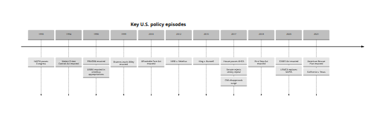

# Republicans as Moderating Opposition Without a Rival Order

## Executive summary

This report evaluates the thesis that, in the United States since the 1970s, Republicans often behave less like builders of a coherent rival governing order and more like a moderating or disciplining opposition inside a shared governing field: they block, bargain down, rhetorically stigmatize, litigate, or partially reverse Democratic initiatives, but frequently fail to replace them with an institutionally durable alternative. The strongest evidence for that thesis appears where Republicans win episodic political fights yet lose the long policy war: the Affordable Care Act survived total repeal despite years of unified Republican campaigning against it; much of the modern immigration-enforcement apparatus was hardened under bipartisan or Democratic administrations in response to Republican pressure and still structures policy; welfare reform’s 1996 block-grant architecture endured for decades; and many Trump-era regulatory rollbacks proved highly reversible because they relied on executive or administrative tools rather than durable legislation. [\[1\]](https://www.cbo.gov/publication/52939)

The thesis is weaker, however, if it is read literally or universally. Several of the requested cases are not “leftist” in any meaningful policy-science sense. NAFTA, Glass-Steagall repeal, and much of the punitive turn in criminal justice were neoliberal, market-liberal, or carceral settlements that Republicans often helped enact rather than merely moderate. In those cases, the better characterization is not that Republicans preserved “bad leftist policy,” but that they helped co-produce bipartisan governing settlements that moved Democrats rightward or into centrist triangulation. [\[2\]](https://clerk.house.gov/Votes/1993575)

Analytically, the thesis has **medium explanatory power**. It is strongest when applied to **rollback failure** and **policy durability**: U.S. veto points, policy feedbacks, judicial validation, and administrative routinization make repeal harder than obstruction. It is also useful for **rhetorical containment** and **electoral signaling**, where Republican issue ownership on crime, immigration, welfare, and fiscal restraint pushed Democrats to preemptively tack rightward. But it overstates the case if it implies that Republicans never build durable alternatives. Even recent evidence shows exceptions: Reuters noted that Trump’s first-term achievements with the most staying power included the 2017 tax law and his three Supreme Court appointments, which are durable forms of rival governance even where broader regulatory reversals were transient. [\[3\]](https://www.annualreviews.org/doi/pdf/10.1146/annurev.soc.25.1.441)

The best-supported reformulation of the thesis is therefore this: **Republicans frequently succeed at disciplining Democratic policy trajectories and raising the political price of leftward movement, but they often fail to convert episodic resistance into a fully institutionalized alternative order. The result is that many Democratic-led or bipartisan settlements become more centrist, punitive, or market-conforming than they otherwise would have been, while also becoming more durable once enacted.** [\[4\]](https://journals.sagepub.com/doi/10.1177/1354068895001001001)

## Scope and analytical approach

The geographic scope here is the United States, and the timeframe is the 1970s through the mid-2020s. Because there is no single official dataset that directly measures “rival governing order,” this report uses four observable proxies: durability after partisan turnover, repeal or replacement success, judicial and administrative entrenchment, and the persistence of beneficiary or enforcement infrastructures. The U.S. Policy Agendas Project is relevant in the background because it tracks issue attention across institutions since World War II, but the main empirical evidence here comes from congressional roll calls, presidential signing statements, CBO estimates, Supreme Court opinions, Census, HHS, DHS, BJS, GAO/CRS, USTR/USDA, Brookings, Pew, and major official statistical series. [\[5\]](https://www.comparativeagendas.net/us)

A core assumption should be stated explicitly: the phrase “bad leftist policies” is analytically imprecise. Several of the requested cases are better understood as bipartisan neoliberal reform, bipartisan punitive governance, or emergency macro-stabilization. That matters because the thesis is more persuasive as an argument about **co-governance, preemptive moderation, and repeal failure** than as an argument that Republicans simply preserve “leftism.” [\[6\]](https://clerk.house.gov/Votes/1993575)

There are also real data gaps. Public opinion trends are uneven across cases; policy durability lacks a universal metric; and some cases, especially “regulatory rollback,” work better as domain-level process cases than as a single statute. Where exact final-passage margins or a unified durability series were unavailable in the research gathered here, I use the most defensible official margin or proxy and flag the limitation. [\[7\]](https://www.everycrsreport.com/reports/R43992.html)

## Theoretical lenses

The first useful lens is **party competition under issue ownership and constrained responsiveness**. Issue-ownership research argues that parties emphasize issues on which voters trust them more, while agenda-setting work shows that executives and parties are constrained by public priorities and divided government. In U.S. practice, Republicans have often “owned” crime, immigration enforcement, taxes, or anti-bureaucratic rhetoric, which can induce Democrats to trim, preempt, or reframe their own agenda rather than openly polarize toward a more social-democratic program. [\[8\]](https://eprints.soton.ac.uk/396915/1/GreenJenningsBJPOLS_Postprint.pdf)

The second lens is **loyal opposition**. Political theory on loyal opposition emphasizes that an opposition party both contests office and operates inside the same constitutional order, which channels how conflict is expressed. On this view, Republicans need not be read as “fake opposition” to fit the thesis. They can be quite adversarial electorally while still functioning as an opposition whose practical role is to constrain, bargain over, and partially legitimate the same constitutional-policy order they criticize. [\[9\]](https://papers.ssrn.com/sol3/papers.cfm?abstract_id=3017316)

The third lens is **cartelization, capture, or domestication**. Katz and Mair’s cartel-party thesis holds that major parties can become state-linked organizations that compete but also share an interest in preserving the rules and resources of the existing system. “Domestication” is not the standard academic term, but it is a workable shorthand for cases where an opposition party is absorbed into the logic of an inherited governing regime rather than building a distinct counter-order. The best U.S. examples are not only social policy but also Clinton-era trade and finance, where Republicans often supplied votes or ideological cover for Democratic triangulation instead of constructing a separate institutional settlement. [\[10\]](https://journals.sagepub.com/doi/10.1177/1354068895001001001)

The fourth lens is **path dependence, policy feedback, and drift**. Historical institutionalist scholarship shows that once programs create beneficiaries, administrators, compliance industries, judicial precedents, and state-level routines, they acquire increasing returns and self-reinforcing feedbacks. Hacker’s and later scholarship on drift also show that stalemate changes policy outcomes even when statutes do not formally change. This is the deepest theoretical reason the thesis often looks plausible in the United States: obstruction is easier than replacement, and replacement is harder than campaign rhetoric implies. [\[11\]](https://www.annualreviews.org/doi/pdf/10.1146/annurev.soc.25.1.441)

## Mechanisms visible in the U.S. record

The mechanism of **procedural resistance without replacement** is clearest when Republicans can block, narrow, delay, litigate, or repeal at the margin but cannot legislate a workable substitute. The ACA is the cleanest example: Republicans opposed enactment, litigated the law, passed a House repeal bill in 2017, and still failed to enact a replacement despite unified government. CBO estimated that the 2017 repeal bill would increase the uninsured by 32 million in 2026 relative to current law, which raised the political cost of full repeal and helped turn the status quo into the safer governing option. [\[12\]](https://clerk.house.gov/Votes?CongressNum=115&Session=1st&page=46)

The mechanism of **rhetorical containment** works differently. Here Republicans do not necessarily stop Democratic initiatives; instead, they force Democrats to internalize Republican issue frames. In the 1990s that meant welfare, crime, and immigration. Clinton’s signing statements on welfare reform and immigration enforcement used language about work, responsibility, and the rule of law that reflected both Democratic triangulation and Republican pressure. In these cases, Republican opposition did not preserve “leftism”; it often made Democratic governance more punitive or more conditional. [\[13\]](https://www.presidency.ucsb.edu/documents/statement-signing-the-personal-responsibility-and-work-opportunity-reconciliation-act-1996)

The mechanism of **electoral signaling** is strongest where public salience favors the GOP’s issue profile. Pew found crime was a top national priority in the mid-1990s; immigration enforcement later split the parties sharply, with a 2011 Pew survey finding 55% of Republicans but only 22% of Democrats prioritizing stricter border security and enforcement over broader legalization aims. Under such conditions, Democratic leaders often moved preemptively toward harsher enforcement or more business-friendly compromise. [\[14\]](https://www.pewresearch.org/wp-content/uploads/sites/4/legacy-pdf/19940406.pdf)

The mechanism of **policy rollback failure** is the most important for durability. Once a policy has beneficiaries or an operating administrative apparatus, repeal becomes costly. That is why welfare reform’s structure lasted, why the ACA became harder to uproot once coverage expanded and courts upheld key components, why IIRIRA’s enforcement tools remained available for 2025 expedited-removal policy, and why even trade “reversals” such as USMCA mostly updated rather than fully repudiated NAFTA. [\[15\]](https://www.everycrsreport.com/reports/RL32760.html)

## Comparative case studies

The timeline below summarizes the key inflection points discussed in the table and narrative that follow. The enactment dates, roll calls, and Court decisions shown here are drawn from the official congressional, judicial, and agency sources cited throughout this section. [\[16\]](https://clerk.house.gov/Votes/1993575)

<figure>

<figcaption aria-hidden="true">Rendered Mermaid diagram 1</figcaption>
</figure>

| Case | Timeline and principal actors | Republican role | Outcome | Quantitative indicators |
|:---|:---|:---|:---|:---|
| Welfare reform | Clinton, Gingrich-era Congress, PRWORA in 1996. Clinton signed the law while calling it an opportunity to “end welfare as we know it.” [\[17\]](https://www.presidency.ucsb.edu/documents/statement-signing-the-personal-responsibility-and-work-opportunity-reconciliation-act-1996) | **Co-opting / disciplining.** Republicans forced Democratic triangulation on work requirements and block grants rather than building a distinct post-welfare order. [\[17\]](https://www.presidency.ucsb.edu/documents/statement-signing-the-personal-responsibility-and-work-opportunity-reconciliation-act-1996) | AFDC was replaced by TANF, and the block-grant framework endured into FY2024. [\[18\]](https://www.everycrsreport.com/reports/RL32760.html) | Senate conference report passed **78-21**; the assistance caseload peaked at **5.1 million families** in March 1994 and was about **1.0 million families / 2.8 million recipients** in Sept. 2023; TANF’s basic block grant was **47.3% below** its FY1997 real value by FY2023. [\[19\]](https://www.senate.gov/legislative/LIS/roll_call_votes/vote1042/vote_104_2_00262.htm) |
| Financial deregulation and Glass-Steagall repeal | Clinton administration and bipartisan Congress enacted Gramm-Leach-Bliley in 1999. [\[20\]](https://www.senate.gov/legislative/LIS/roll_call_votes/vote1061/vote_106_1_00354.htm) | **Co-production, not mere opposition.** Republicans helped ratify Democratic-era financial liberalization instead of constructing a rival order. OCC described GLBA as effectively repealing the key old barriers and as “ratifying” an already evolving system. [\[21\]](https://www.occ.gov/publications-and-resources/publications/economics/working-papers-archived/economic-working-paper-2000-5.html) | Universal-bank structure persisted; Dodd-Frank later imposed the Volcker Rule but did not restore the old separation. FCIC later treated the weakening of regulatory constraints as part of the crisis story, though the size of Glass-Steagall repeal’s causal role remains contested. [\[22\]](https://www.occ.gov/news-issuances/bulletins/2020/bulletin-2020-71.html) | Senate final conference vote **90-8**; earlier Senate passage was **54-44**. [\[20\]](https://www.senate.gov/legislative/LIS/roll_call_votes/vote1061/vote_106_1_00354.htm) |
| Affordable Care Act | Obama administration and Democratic Congress enacted ACA in 2010; major judicial challenges followed in 2012, 2015, and 2021; Republicans tried repeal again in 2017. [\[23\]](https://www.law.cornell.edu/supct/pdf/11-393.pdf) | **Blocking / litigating / rollback failure.** Republicans fought enactment unanimously, but failed to legislate a replacement after 2016. [\[24\]](https://clerk.house.gov/Votes?CongressNum=115&Session=1st&page=46) | The law survived. NFIB upheld the mandate as a tax; King preserved exchange subsidies on federal exchanges; California v. Texas rejected the later challenge for lack of standing. [\[25\]](https://www.law.cornell.edu/supct/pdf/11-393.pdf) | Enactment votes: House **219-212**, Senate **60-39**; Senate “skinny repeal” failed **49-51** in 2017; CBO estimated the 2017 repeal bill would raise the uninsured by **32 million** in 2026; uninsured rate fell from **16% in 2010** to **8.0% in 2023**; **24.2 million** people selected 2025 marketplace plans. [\[26\]](https://www.senate.gov/legislative/LIS/roll_call_votes/vote1151/vote_115_1_00179.htm) |
| Mass incarceration and criminal justice | Punitiveness accelerated from the 1970s through the 1994 Crime Bill; partial retrenchment came much later with the First Step Act in 2018. [\[27\]](https://www.nationalacademies.org/read/18613/chapter/4) | **Rhetorical containment / electoral signaling.** Republicans’ advantage on crime pushed Democrats into punitive convergence rather than a rival decarceral order. [\[28\]](https://www.pewresearch.org/wp-content/uploads/sites/4/legacy-pdf/19940406.pdf) | The carceral regime became durable, then only partially softened decades later. [\[29\]](https://bjs.ojp.gov/library/publications/correctional-populations-united-states-2022-statistical-tables) | Incarceration rose from **161 per 100,000** in 1972 to **767 per 100,000** in 2007; more than **1.827 million** people were incarcerated in prisons or jails at yearend 2022; First Step Act passed Senate **87-12** and House **358-36**. [\[30\]](https://www.nationalacademies.org/read/18613/chapter/4) |
| Trade policy and NAFTA | Clinton sought passage in 1993; USMCA replaced NAFTA in 2020. [\[31\]](https://clerk.house.gov/Votes/1993575) | **Co-opting and supplying votes.** Republicans furnished the decisive pro-trade coalition for a Democratic president instead of forcing a different trade order. [\[32\]](https://clerk.house.gov/Votes/1993575) | NAFTA endured for 26 years; USMCA substituted for it but preserved the basic North American trade architecture, including zero tariffs on all agricultural goods that already had zero tariffs under NAFTA. [\[33\]](https://ustr.gov/trade-agreements/free-trade-agreements/united-states-mexico-canada-agreement) | House **234-200**, with Republicans **132-43** in favor while Democrats split **102-156**; Senate **61-38**. Public opinion improved over time: in 2008, **44%** said free trade agreements like NAFTA were good for the country, and in 2018 **56%** said NAFTA had been good for the U.S. [\[34\]](https://clerk.house.gov/Votes/1993575) |
| Immigration enforcement | Clinton-era IIRIRA in 1996; enforcement expansion continued under later administrations; Secure Fence Act debated in 2006; DHS still used IIRIRA tools in 2025. [\[35\]](https://www.presidency.ucsb.edu/documents/statement-signing-the-omnibus-consolidated-appropriations-act-1997) | **Rhetorical containment / administrative entrenchment.** Republicans repeatedly pushed Democrats toward tougher enforcement, but often without producing a stable statutory replacement for broader immigration settlement. [\[36\]](https://www.presidency.ucsb.edu/documents/statement-signing-the-omnibus-consolidated-appropriations-act-1997) | Enforcement institutions became durable even while comprehensive reform repeatedly failed. IIRIRA’s expedited-removal authority still underwrote policy in 2025. [\[37\]](https://www.nafsa.org/regulatory-information/dhs-expands-expedited-removal-policy) | Clinton said the 1996 omnibus strengthened the rule of law by cracking down at the border and workplace; ICE reported **409,849** removals in FY2012; DOJ OLC noted in 2014 that DHS had resources to remove **fewer than 400,000** people annually out of about **11.3 million** undocumented residents; CBP reported **19,357** Border Patrol agents on a typical day in FY2022. [\[38\]](https://www.presidency.ucsb.edu/documents/statement-signing-the-omnibus-consolidated-appropriations-act-1997) |
| Regulatory rollbacks | Trump-era deregulation relied on executive action, CRA disapprovals, and agency reversals; Biden then reversed many Trump directives quickly. [\[39\]](https://www.everycrsreport.com/reports/R43992.html) | **Procedural resistance / shallow replacement.** Republicans often used regulatory rollback tools rather than congressional redesign, which made much of the project reversible. [\[40\]](https://www.gao.gov/legal/congressional-review-act/faqs-on-the-congressional-review-act) | The CRA can permanently nullify particular rules, but broad executive rollback efforts proved transitory when not anchored in statute. [\[41\]](https://www.gao.gov/legal/congressional-review-act/faqs-on-the-congressional-review-act) | Since enactment, the CRA had overturned **20** rules through the 117th Congress: **1** in 2001-02, **16** in 2017-18, **3** in 2021-22. Reuters reported that Biden signed roughly **40** executive orders in his first week, nearly **half** directly reversing Trump actions. [\[42\]](https://www.everycrsreport.com/reports/R43992.html) |
| COVID-era relief | Bipartisan CARES Act in 2020 under Trump; Democratic ARPA in 2021 under Biden. [\[43\]](https://www.senate.gov/legislative/LIS/roll_call_votes/vote1162/vote_116_2_00080.htm) | **Initial co-authorship, then partisan split.** Republicans heavily backed emergency stabilization in 2020, but opposed the larger 2021 follow-on. [\[44\]](https://www.senate.gov/legislative/LIS/roll_call_votes/vote1162/vote_116_2_00080.htm) | This is a partial counterexample to the thesis: many of the most egalitarian pandemic benefits were temporary and expired, so durability was weak. [\[45\]](https://www.census.gov/library/publications/2023/demo/p60-280.html) | CARES passed the Senate **96-0** and the House by voice vote; Treasury OIG says it provided **over \$2 trillion** in relief and CBO estimated about **\$1.7 trillion** in added deficits. ARPA passed **50-49** in the Senate and **220-211** in the House. The Census Bureau found SPM child poverty jumped from **5.2%** in 2021 to **12.4%** in 2022 after temporary benefits ended. [\[46\]](https://www.senate.gov/legislative/LIS/roll_call_votes/vote1162/vote_116_2_00080.htm) |

Several cases deserve short analytical emphasis beyond the table.

**Welfare reform** strongly supports the idea of Republican discipline without a distinct alternative welfare order. Republicans forced the terms of debate, Clinton absorbed much of the frame, and the resulting settlement proved durable not because Republicans later deepened it into a positive family-policy state, but because the block-grant structure itself became the standing regime. The evidence that only about 1.0 million families received TANF or MOE-funded assistance in September 2023, compared with a 5.1 million-family peak in 1994, shows how durable that settlement has been. [\[47\]](https://www.presidency.ucsb.edu/documents/statement-signing-the-personal-responsibility-and-work-opportunity-reconciliation-act-1996)

**The ACA** is the clearest case of rollback failure. Republicans won repeated midterm, state, and rhetorical victories against “Obamacare,” yet the statute survived enactment, judicial review, and a unified-government repeal attempt. Once coverage gains, exchange infrastructure, and Medicaid expansion were operating, the law became harder to remove than to denounce. That is exactly the pattern the thesis predicts. [\[48\]](https://www.law.cornell.edu/supct/pdf/11-393.pdf)

**Mass incarceration and immigration enforcement** support a modified version of the thesis. In both domains, Republicans did not preserve left policy; they shifted Democrats toward punitive or enforcement-first compromises. Crime and immigration became classic issue-ownership terrains on which Democrats often governed defensively. The result was not leftist durability but bipartisan durability of harder-line institutions. [\[49\]](https://www.pewresearch.org/wp-content/uploads/sites/4/legacy-pdf/19940406.pdf)

**NAFTA and Glass-Steagall repeal** are the strongest counterexamples to the “leftist durability” framing and the strongest support for the “extended governing circle” framing. They show Republicans not merely moderating Democrats but helping consummate Democratic triangulation. Those cases point to bipartisan elite convergence more than asymmetric conservative failure. [\[50\]](https://clerk.house.gov/Votes/1993575)

**COVID relief** is the most important negative case. The most redistributive, family-supportive pandemic measures were not made permanent, and Census data show child poverty rebounded sharply after temporary supports expired. This weakens any broad claim that once Democrats enact policy, Republicans invariably make it durable through ineffective opposition. Durability depends on design, visibility, statutory structure, and organized beneficiaries, not just on Republican behavior. [\[45\]](https://www.census.gov/library/publications/2023/demo/p60-280.html)

## Measurable outcomes and what they show

A compact way to judge the thesis is to compare whether Republican resistance produced durable reversals, durable alternatives, or simply durable inherited settlements.

| Domain | Did Republicans stop enactment? | Did Republicans build replacement institutions? | Did the resulting regime persist? | Net implication for thesis |
|:---|:---|:---|:---|:---|
| Welfare | No. They forced the terms of 1996 reform but did not prevent enactment. [\[51\]](https://www.senate.gov/legislative/LIS/roll_call_votes/vote1042/vote_104_2_00262.htm) | Not really; TANF persisted as a static block grant rather than as a broader Republican family-policy architecture. [\[52\]](https://www.everycrsreport.com/reports/RL32760.html) | Yes, strongly. [\[18\]](https://www.everycrsreport.com/reports/RL32760.html) | Strong support |
| ACA | No in 2010; no in 2017 repeal. [\[53\]](https://www.senate.gov/legislative/LIS/roll_call_votes/vote1151/vote_115_1_00179.htm) | No coherent replacement passed. [\[54\]](https://www.cbo.gov/publication/52939) | Yes, strongly. [\[55\]](https://www.law.cornell.edu/supct/pdf/11-393.pdf) | Strong support |
| Criminal justice | No; both parties enacted large punitive statutes. [\[56\]](https://www.nationalacademies.org/read/18613/chapter/4) | Mostly no, until late partial reform. [\[57\]](https://clerk.house.gov/Votes/2018448) | Yes, but it was a bipartisan punitive order rather than a Democratic-left one. [\[58\]](https://bjs.ojp.gov/library/publications/correctional-populations-united-states-2022-statistical-tables) | Medium support, with major qualification |
| Trade / NAFTA | No. Republicans were crucial to passage. [\[32\]](https://clerk.house.gov/Votes/1993575) | Not as a rival order; USMCA mostly updated NAFTA. [\[59\]](https://ustr.gov/trade-agreements/free-trade-agreements/united-states-mexico-canada-agreement) | Yes. [\[59\]](https://ustr.gov/trade-agreements/free-trade-agreements/united-states-mexico-canada-agreement) | Medium support for “co-governance,” weak support for “leftist durability” |
| Immigration enforcement | No. Enforcement statutes and apparatus expanded repeatedly. [\[60\]](https://www.presidency.ucsb.edu/documents/statement-signing-the-omnibus-consolidated-appropriations-act-1997) | No stable grand bargain; mostly pressure toward tougher administration. [\[61\]](https://www.justice.gov/olc/file/2014-11-19-dapa-daca-wd/dl) | Yes, strongly. [\[62\]](https://www.nafsa.org/regulatory-information/dhs-expands-expedited-removal-policy) | Strong support |
| Regulatory rollback | Temporarily, yes on specific rules. [\[63\]](https://www.everycrsreport.com/reports/R43992.html) | Usually not durably; much was reversible executive governance. [\[64\]](https://www.reuters.com/world/us/transitory-way-govern-biden-reverses-trumps-orders-with-stroke-pen-2021-01-27/) | Mixed: specific CRA reversals lasted, broader rollback oscillated. [\[41\]](https://www.gao.gov/legal/congressional-review-act/faqs-on-the-congressional-review-act) | Medium support |
| COVID relief | No on CARES; yes on resisting later permanent expansion. [\[65\]](https://www.senate.gov/legislative/LIS/roll_call_votes/vote1162/vote_116_2_00080.htm) | No durable replacement for temporary welfare expansion. [\[66\]](https://www.census.gov/library/publications/2023/demo/p60-280.html) | Weak persistence for redistributive pieces. [\[66\]](https://www.census.gov/library/publications/2023/demo/p60-280.html) | Weak support |

Three measurable patterns stand out.

First, **durability is highest where policies created infrastructures or constituencies**. The ACA now has exchange systems, insurer offerings, and millions of enrollees; IIRIRA created legal instruments that still structure removal policy; TANF created a standing state-administered block-grant regime. Those are classic policy-feedback dynamics. [\[67\]](https://www.annualreviews.org/doi/pdf/10.1146/annurev-polisci-012610-135202)

Second, **reversal rates are low when replacement imposes visible losses**. CBO’s repeal estimates made the political costs of ACA reversal legible. By contrast, where Republicans used the CRA on discrete late-term rules, reversal was easier because the target was narrower and the statute gives unusually strong tools. [\[68\]](https://www.cbo.gov/publication/52939)

Third, **judicial and administrative entrenchment matter as much as elections**. The ACA likely would not have endured in its present form without NFIB, King, and California v. Texas. Immigration enforcement has also been shaped by the executive branch’s acknowledged need to prioritize among millions of potentially removable people because institutional capacity is limited. These are not merely electoral stories; they are state-capacity stories. [\[69\]](https://www.law.cornell.edu/supct/pdf/11-393.pdf)

## Assessment of thesis strength, alternative explanations, and implications

The thesis is **substantially but not completely correct** if framed as an argument about **how Republican opposition often works under U.S. institutional conditions**. It correctly identifies four recurrent realities: Republicans often discipline Democratic agendas through issue ownership and stigma; they often force Democrats into preemptive moderation; they often fail to legislate durable replacements for policies they oppose; and the resulting settlements often persist because U.S. institutions reward entrenchment more than repeal. That is why the thesis fits welfare reform, ACA survival, immigration enforcement, and much of the rollback-reversibility story. [\[70\]](https://eprints.soton.ac.uk/396915/1/GreenJenningsBJPOLS_Postprint.pdf)

The thesis becomes overstated in three ways.

One, it confuses **Democratic-led** with **leftist**. NAFTA, Glass-Steagall repeal, and the 1990s carceral turn were not left expansions; they were broadly centrist, neoliberal, or punitive settlements. In those cases, Republicans were not passively extending Democratic governance. They were active co-authors of the policy regime. [\[71\]](https://clerk.house.gov/Votes/1993575)

Two, it understates **structural explanations**. U.S. separation of powers, bicameralism, federalism, judicial review, and bureaucratic continuity make repeal intrinsically hard. Policy-feedback scholarship predicts persistence even without especially weak Republican opposition. The “extended Democratic circle” language captures one political pattern, but path dependence and drift do much of the causal work. [\[72\]](https://www.annualreviews.org/doi/pdf/10.1146/annurev.soc.25.1.441)

Three, it misses **important exceptions** where Republicans did create durable alternatives. Even a Reuters summary of Trump’s first term identified the 2017 tax law and three Supreme Court appointments as his most enduring achievements. So the stronger claim is not that Republicans cannot build a rival order; it is that they do so selectively, and much less often than their rhetoric suggests in domains where statute, administration, and public dependence are already entrenched. [\[73\]](https://www.reuters.com/world/us/transitory-way-govern-biden-reverses-trumps-orders-with-stroke-pen-2021-01-27/)

The policy implication is straightforward. Any party that wants a true rival governing order must do more than oppose, litigate, or deregulate. It must pass legislation that creates implementing institutions, durable beneficiary coalitions, and legal rules that can survive partisan turnover. Relying on executive action, symbolic messaging, or partial rollback typically yields oscillation, not order. The ACA’s survival, the durability of immigration-enforcement tools from 1996, and the quick reversibility of many Trump-era directives all point in the same direction. [\[74\]](https://www.supremecourt.gov/opinions/20pdf/19-840_6jfm.pdf)

## Open questions and limitations

This report leaves some questions open. A stronger version would add a single harmonized dataset for repeal attempts and policy half-lives across domains, ideally combining congressional action, court outcomes, beneficiary counts, and administrative continuation. The U.S. Policy Agendas Project could also be mined more systematically to trace whether Republican issue ownership on crime, immigration, and welfare preceded Democratic preemption across decades, but that would require a dedicated extraction beyond the scope of the present synthesis. [\[75\]](https://www.comparativeagendas.net/us)

The biggest substantive limitation is conceptual. The requested case list mixes left-of-center social insurance, centrist globalization, deregulatory finance, punitive criminal law, and border enforcement. That mixture is analytically productive, but it means the final judgment is sharper if stated this way: **Republicans often moderate, redirect, and entrench Democratic or bipartisan governing settlements without consistently replacing them with a rival order; but the policies thereby made durable are often not leftist at all.** [\[76\]](https://clerk.house.gov/Votes/1993575)

------------------------------------------------------------------------

[\[1\]](https://www.cbo.gov/publication/52939) [\[54\]](https://www.cbo.gov/publication/52939) [\[68\]](https://www.cbo.gov/publication/52939) https://www.cbo.gov/publication/52939

<https://www.cbo.gov/publication/52939>

[\[2\]](https://clerk.house.gov/Votes/1993575) [\[6\]](https://clerk.house.gov/Votes/1993575) [\[16\]](https://clerk.house.gov/Votes/1993575) [\[31\]](https://clerk.house.gov/Votes/1993575) [\[32\]](https://clerk.house.gov/Votes/1993575) [\[34\]](https://clerk.house.gov/Votes/1993575) [\[50\]](https://clerk.house.gov/Votes/1993575) [\[71\]](https://clerk.house.gov/Votes/1993575) [\[76\]](https://clerk.house.gov/Votes/1993575) https://clerk.house.gov/Votes/1993575

<https://clerk.house.gov/Votes/1993575>

[\[3\]](https://www.annualreviews.org/doi/pdf/10.1146/annurev.soc.25.1.441) [\[11\]](https://www.annualreviews.org/doi/pdf/10.1146/annurev.soc.25.1.441) [\[72\]](https://www.annualreviews.org/doi/pdf/10.1146/annurev.soc.25.1.441) https://www.annualreviews.org/doi/pdf/10.1146/annurev.soc.25.1.441

<https://www.annualreviews.org/doi/pdf/10.1146/annurev.soc.25.1.441>

[\[4\]](https://journals.sagepub.com/doi/10.1177/1354068895001001001) [\[10\]](https://journals.sagepub.com/doi/10.1177/1354068895001001001) https://journals.sagepub.com/doi/10.1177/1354068895001001001

<https://journals.sagepub.com/doi/10.1177/1354068895001001001>

[\[5\]](https://www.comparativeagendas.net/us) [\[75\]](https://www.comparativeagendas.net/us) https://www.comparativeagendas.net/us

<https://www.comparativeagendas.net/us>

[\[7\]](https://www.everycrsreport.com/reports/R43992.html) [\[39\]](https://www.everycrsreport.com/reports/R43992.html) [\[42\]](https://www.everycrsreport.com/reports/R43992.html) [\[63\]](https://www.everycrsreport.com/reports/R43992.html) https://www.everycrsreport.com/reports/R43992.html

<https://www.everycrsreport.com/reports/R43992.html>

[\[8\]](https://eprints.soton.ac.uk/396915/1/GreenJenningsBJPOLS_Postprint.pdf) [\[70\]](https://eprints.soton.ac.uk/396915/1/GreenJenningsBJPOLS_Postprint.pdf) https://eprints.soton.ac.uk/396915/1/GreenJenningsBJPOLS_Postprint.pdf

<https://eprints.soton.ac.uk/396915/1/GreenJenningsBJPOLS_Postprint.pdf>

[\[9\]](https://papers.ssrn.com/sol3/papers.cfm?abstract_id=3017316) https://papers.ssrn.com/sol3/papers.cfm?abstract_id=3017316

<https://papers.ssrn.com/sol3/papers.cfm?abstract_id=3017316>

[\[12\]](https://clerk.house.gov/Votes?CongressNum=115&Session=1st&page=46) [\[24\]](https://clerk.house.gov/Votes?CongressNum=115&Session=1st&page=46) https://clerk.house.gov/Votes?CongressNum=115&Session=1st&page=46

<https://clerk.house.gov/Votes?CongressNum=115&Session=1st&page=46>

[\[13\]](https://www.presidency.ucsb.edu/documents/statement-signing-the-personal-responsibility-and-work-opportunity-reconciliation-act-1996) [\[17\]](https://www.presidency.ucsb.edu/documents/statement-signing-the-personal-responsibility-and-work-opportunity-reconciliation-act-1996) [\[47\]](https://www.presidency.ucsb.edu/documents/statement-signing-the-personal-responsibility-and-work-opportunity-reconciliation-act-1996) https://www.presidency.ucsb.edu/documents/statement-signing-the-personal-responsibility-and-work-opportunity-reconciliation-act-1996

<https://www.presidency.ucsb.edu/documents/statement-signing-the-personal-responsibility-and-work-opportunity-reconciliation-act-1996>

[\[14\]](https://www.pewresearch.org/wp-content/uploads/sites/4/legacy-pdf/19940406.pdf) [\[28\]](https://www.pewresearch.org/wp-content/uploads/sites/4/legacy-pdf/19940406.pdf) [\[49\]](https://www.pewresearch.org/wp-content/uploads/sites/4/legacy-pdf/19940406.pdf) https://www.pewresearch.org/wp-content/uploads/sites/4/legacy-pdf/19940406.pdf

<https://www.pewresearch.org/wp-content/uploads/sites/4/legacy-pdf/19940406.pdf>

[\[15\]](https://www.everycrsreport.com/reports/RL32760.html) [\[18\]](https://www.everycrsreport.com/reports/RL32760.html) [\[52\]](https://www.everycrsreport.com/reports/RL32760.html) https://www.everycrsreport.com/reports/RL32760.html

<https://www.everycrsreport.com/reports/RL32760.html>

[\[19\]](https://www.senate.gov/legislative/LIS/roll_call_votes/vote1042/vote_104_2_00262.htm) [\[51\]](https://www.senate.gov/legislative/LIS/roll_call_votes/vote1042/vote_104_2_00262.htm) https://www.senate.gov/legislative/LIS/roll_call_votes/vote1042/vote_104_2_00262.htm

<https://www.senate.gov/legislative/LIS/roll_call_votes/vote1042/vote_104_2_00262.htm>

[\[20\]](https://www.senate.gov/legislative/LIS/roll_call_votes/vote1061/vote_106_1_00354.htm) https://www.senate.gov/legislative/LIS/roll_call_votes/vote1061/vote_106_1_00354.htm

<https://www.senate.gov/legislative/LIS/roll_call_votes/vote1061/vote_106_1_00354.htm>

[\[21\]](https://www.occ.gov/publications-and-resources/publications/economics/working-papers-archived/economic-working-paper-2000-5.html) https://www.occ.gov/publications-and-resources/publications/economics/working-papers-archived/economic-working-paper-2000-5.html

<https://www.occ.gov/publications-and-resources/publications/economics/working-papers-archived/economic-working-paper-2000-5.html>

[\[22\]](https://www.occ.gov/news-issuances/bulletins/2020/bulletin-2020-71.html) https://www.occ.gov/news-issuances/bulletins/2020/bulletin-2020-71.html

<https://www.occ.gov/news-issuances/bulletins/2020/bulletin-2020-71.html>

[\[23\]](https://www.law.cornell.edu/supct/pdf/11-393.pdf) [\[25\]](https://www.law.cornell.edu/supct/pdf/11-393.pdf) [\[48\]](https://www.law.cornell.edu/supct/pdf/11-393.pdf) [\[55\]](https://www.law.cornell.edu/supct/pdf/11-393.pdf) [\[69\]](https://www.law.cornell.edu/supct/pdf/11-393.pdf) https://www.law.cornell.edu/supct/pdf/11-393.pdf

<https://www.law.cornell.edu/supct/pdf/11-393.pdf>

[\[26\]](https://www.senate.gov/legislative/LIS/roll_call_votes/vote1151/vote_115_1_00179.htm) [\[53\]](https://www.senate.gov/legislative/LIS/roll_call_votes/vote1151/vote_115_1_00179.htm) https://www.senate.gov/legislative/LIS/roll_call_votes/vote1151/vote_115_1_00179.htm

<https://www.senate.gov/legislative/LIS/roll_call_votes/vote1151/vote_115_1_00179.htm>

[\[27\]](https://www.nationalacademies.org/read/18613/chapter/4) [\[30\]](https://www.nationalacademies.org/read/18613/chapter/4) [\[56\]](https://www.nationalacademies.org/read/18613/chapter/4) https://www.nationalacademies.org/read/18613/chapter/4

<https://www.nationalacademies.org/read/18613/chapter/4>

[\[29\]](https://bjs.ojp.gov/library/publications/correctional-populations-united-states-2022-statistical-tables) [\[58\]](https://bjs.ojp.gov/library/publications/correctional-populations-united-states-2022-statistical-tables) https://bjs.ojp.gov/library/publications/correctional-populations-united-states-2022-statistical-tables

<https://bjs.ojp.gov/library/publications/correctional-populations-united-states-2022-statistical-tables>

[\[33\]](https://ustr.gov/trade-agreements/free-trade-agreements/united-states-mexico-canada-agreement) [\[59\]](https://ustr.gov/trade-agreements/free-trade-agreements/united-states-mexico-canada-agreement) https://ustr.gov/trade-agreements/free-trade-agreements/united-states-mexico-canada-agreement

<https://ustr.gov/trade-agreements/free-trade-agreements/united-states-mexico-canada-agreement>

[\[35\]](https://www.presidency.ucsb.edu/documents/statement-signing-the-omnibus-consolidated-appropriations-act-1997) [\[36\]](https://www.presidency.ucsb.edu/documents/statement-signing-the-omnibus-consolidated-appropriations-act-1997) [\[38\]](https://www.presidency.ucsb.edu/documents/statement-signing-the-omnibus-consolidated-appropriations-act-1997) [\[60\]](https://www.presidency.ucsb.edu/documents/statement-signing-the-omnibus-consolidated-appropriations-act-1997) https://www.presidency.ucsb.edu/documents/statement-signing-the-omnibus-consolidated-appropriations-act-1997

<https://www.presidency.ucsb.edu/documents/statement-signing-the-omnibus-consolidated-appropriations-act-1997>

[\[37\]](https://www.nafsa.org/regulatory-information/dhs-expands-expedited-removal-policy) [\[62\]](https://www.nafsa.org/regulatory-information/dhs-expands-expedited-removal-policy) https://www.nafsa.org/regulatory-information/dhs-expands-expedited-removal-policy

<https://www.nafsa.org/regulatory-information/dhs-expands-expedited-removal-policy>

[\[40\]](https://www.gao.gov/legal/congressional-review-act/faqs-on-the-congressional-review-act) [\[41\]](https://www.gao.gov/legal/congressional-review-act/faqs-on-the-congressional-review-act) https://www.gao.gov/legal/congressional-review-act/faqs-on-the-congressional-review-act

<https://www.gao.gov/legal/congressional-review-act/faqs-on-the-congressional-review-act>

[\[43\]](https://www.senate.gov/legislative/LIS/roll_call_votes/vote1162/vote_116_2_00080.htm) [\[44\]](https://www.senate.gov/legislative/LIS/roll_call_votes/vote1162/vote_116_2_00080.htm) [\[46\]](https://www.senate.gov/legislative/LIS/roll_call_votes/vote1162/vote_116_2_00080.htm) [\[65\]](https://www.senate.gov/legislative/LIS/roll_call_votes/vote1162/vote_116_2_00080.htm) https://www.senate.gov/legislative/LIS/roll_call_votes/vote1162/vote_116_2_00080.htm

<https://www.senate.gov/legislative/LIS/roll_call_votes/vote1162/vote_116_2_00080.htm>

[\[45\]](https://www.census.gov/library/publications/2023/demo/p60-280.html) [\[66\]](https://www.census.gov/library/publications/2023/demo/p60-280.html) https://www.census.gov/library/publications/2023/demo/p60-280.html

<https://www.census.gov/library/publications/2023/demo/p60-280.html>

[\[57\]](https://clerk.house.gov/Votes/2018448) https://clerk.house.gov/Votes/2018448

<https://clerk.house.gov/Votes/2018448>

[\[61\]](https://www.justice.gov/olc/file/2014-11-19-dapa-daca-wd/dl) https://www.justice.gov/olc/file/2014-11-19-dapa-daca-wd/dl

<https://www.justice.gov/olc/file/2014-11-19-dapa-daca-wd/dl>

[\[64\]](https://www.reuters.com/world/us/transitory-way-govern-biden-reverses-trumps-orders-with-stroke-pen-2021-01-27/) [\[73\]](https://www.reuters.com/world/us/transitory-way-govern-biden-reverses-trumps-orders-with-stroke-pen-2021-01-27/) https://www.reuters.com/world/us/transitory-way-govern-biden-reverses-trumps-orders-with-stroke-pen-2021-01-27/

<https://www.reuters.com/world/us/transitory-way-govern-biden-reverses-trumps-orders-with-stroke-pen-2021-01-27/>

[\[67\]](https://www.annualreviews.org/doi/pdf/10.1146/annurev-polisci-012610-135202) https://www.annualreviews.org/doi/pdf/10.1146/annurev-polisci-012610-135202

<https://www.annualreviews.org/doi/pdf/10.1146/annurev-polisci-012610-135202>

[\[74\]](https://www.supremecourt.gov/opinions/20pdf/19-840_6jfm.pdf) https://www.supremecourt.gov/opinions/20pdf/19-840_6jfm.pdf

<https://www.supremecourt.gov/opinions/20pdf/19-840_6jfm.pdf>
