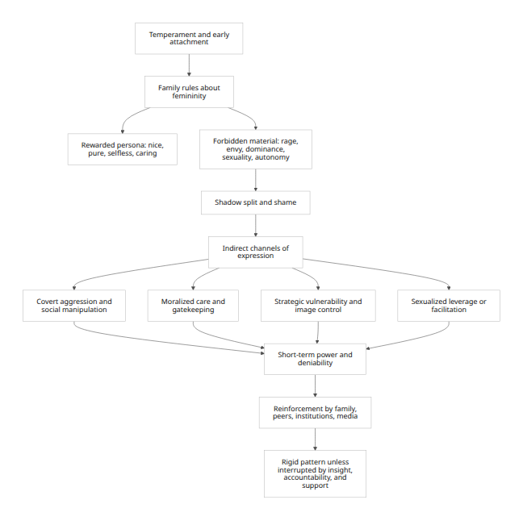
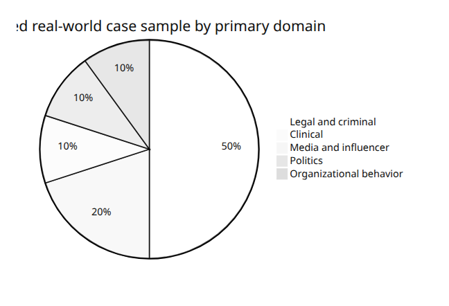
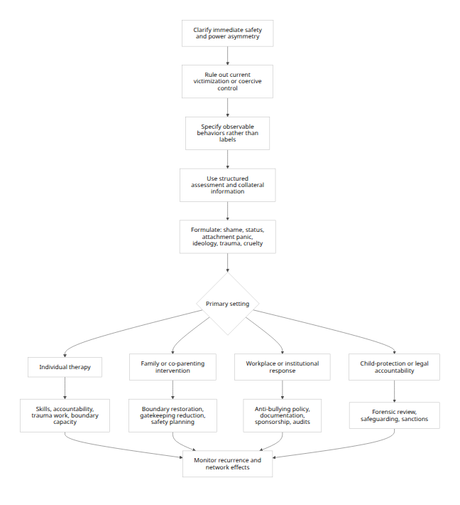

# The Female Shadow

## Executive summary

This report treats **“the female shadow”** as a **Jungian and interdisciplinary analytic lens**, not as a diagnosis and not as an essence of women. In Jungian terms, the shadow is the part of personality that the ego and social persona disown, repress, or split off; it contains not only guilt-laden and “inferior” material, but also disowned vitality, aggression, sexuality, assertiveness, creativity, and realism. A specifically **female** shadow is therefore best understood as the shadow as it is shaped by **feminine-role socialization**, patriarchy, and the rewards and punishments attached to being read as a woman in a given culture. [\[1\]](https://iaap.org/jung-analytical-psychology/short-articles-on-analytical-psychology/the-shadow/)

The strongest empirical translation of this idea into contemporary research is **not** “women are more manipulative,” but rather that under certain social pressures, disowned anger, envy, dominance, dependency, shame, and status needs may return in **indirect, morally coded, or relational forms**. These can include covert aggression, social exclusion, guilt induction, coercive caregiving, image management through suffering, gatekeeping, selective victimhood claims, or strategic use of institutional innocence. Research on aggression and emotional display sharply complicates stereotypes: boys and men show more physical aggression on average, but meta-analyses and cross-national data show **small, trivial, or inconsistent sex differences in indirect or relational aggression**, meaning these patterns are **not uniquely female** and should not be treated as such. [\[2\]](https://pubmed.ncbi.nlm.nih.gov/18826521/)

The formation of these dynamics is best explained through a layered model. Jungian shadow formation begins with repression into the unconscious. Contemporary psychology adds that girls and women are often penalized more for direct anger, dominance, and sexual agency; social role expectations and benevolent sexism reward care, purity, softness, and self-denial. When direct assertion is costly, aggression may be displaced into relational aggression or moralized control. Trauma, attachment disruption, coercive environments, class position, race, and institutional incentives further shape how power is pursued or disavowed. In organizations, for example, “queen bee” responses are better understood as **identity-threat adaptations inside male-dominated systems** than as proof that women are inherently hostile to women. [\[3\]](https://www.hks.harvard.edu/sites/default/files/wappp_files/pdfs/brescoll_emotion_workpalce.pdf)

Across the case material reviewed here, several recurrent patterns emerge. First, **status-protection through indirection**: rather than open confrontation, some actors mobilize gossip, exclusion, institutional complaints, reputational narratives, or victim scripts. Second, **care as domination**: caregiving or maternal authority can become possessive, exclusionary, or even medically abusive. Third, **moralization as camouflage**: envy, resentment, or status competition may be framed as purity, family values, healing, protection, or social responsibility. Fourth, **strategic vulnerability**: distress can become not only a real state but also, in some cases, an instrument for commanding attention, extracting resources, or delegating punishment to others. [\[4\]](https://www.child-encyclopedia.com/aggression/according-experts/development-indirect-aggression-school-entry)

The case review identifies at least ten real-world examples across clinical literature, criminal law, journalism, workplace research, politics, and media. These cases do **not** prove a female essence. What they do show is that when dark motives are routed through culturally legible feminine roles—good mother, victim, healer, helper, respectable woman, or exceptional woman in a male hierarchy—the resulting behavior can be unusually difficult to detect, because it often appears pro-social or vulnerable at first glance. [\[5\]](https://www.washco.utah.gov/departments/attorney/case-highlights-media/utah-vs-franke-hildebrandt/)

For clinicians, the key implication is to **assess functions, behaviors, and contexts rather than gendered labels**. There is no DSM or ICD diagnosis called “female shadow.” Evidence-based assessment should instead triangulate indirect aggression, trauma history, personality structure, coercive control, interpersonal dysfunction, sexism/internalized gender beliefs, and setting-specific behavior. For organizations and conflict systems, policies must name **covert** forms of aggression, gatekeeping, reputational sabotage, and exclusion—not only explicit hostility. Ethically, any use of the phrase “female shadow” must be constrained by a strong anti-essentialist warning: many of the patterns reviewed here are human, not female; many women are punished for open anger and thus misread when they defend themselves; and some apparently manipulative behaviors can be survival responses in coercive contexts. [\[6\]](https://www.appi.org/products/structured-clinical-interview-for-dsm-5-scid-5)

## Conceptual framing

Jung’s shadow refers to everything the conscious personality cannot easily admit about itself. In the classical analytic tradition, the shadow emerges in tension with the **persona**—the socially acceptable face one presents to others. The Society of Analytical Psychology describes the shadow as the hidden, repressed, often guilt-laden personality, but also notes that it contains normal instincts, realistic insights, creative impulses, and other valuable capacities. The IAAP similarly emphasizes that what gets pushed into shadow in childhood may include not only aggression and sexuality but also talent and vocation. For an analytic report on women, this means the most defensible meaning of “female shadow” is **not “what women are really like,”** but **what women may be forced to disown in order to remain acceptable within a feminine persona**. [\[7\]](https://www.thesap.org.uk/articles-on-jungian-psychology-2/about-analysis-and-therapy/the-shadow/)

Modern gender theory and psychology refine this substantially. Benevolent sexism idealizes women as pure, caring, nurturing, and complementary to men, while also positioning them as weak and in need of protection. This dual structure matters because it does not merely oppress from outside; it also teaches a repertoire of socially rewarded influence strategies. At the same time, when women display direct anger, observers often accord them less status than angry men, and women regulate anger into less antagonistic forms when they expect negative social consequences. In this sense, the “female shadow” is most intelligible as an interaction between **disowned motives** and **the social costs of owning them openly**. [\[8\]](https://ore.exeter.ac.uk/ndownloader/files/56829602)

A second conceptual correction is equally important: the evidence does **not** support a crude claim that women are categorically more relationally aggressive. Card and colleagues’ meta-analysis of 148 studies found large sex differences favoring boys in direct aggression but only **trivial** differences in indirect aggression; Lansford and colleagues found that across nine countries, boys were more physically aggressive, but no consistent gender differences emerged in relational aggression. The best contemporary position, then, is that the relevant question is not “Are women more manipulative?” but “Under what conditions are some forms of shadow more likely to become **indirect, relational, moralized, or care-coded**?” [\[9\]](https://pubmed.ncbi.nlm.nih.gov/18826521/)

The table below translates major Jungian ideas into modern empirical language.

| Jungian formulation | Contemporary research translation | Typical shadow-coded expression | Key caveat |
|:---|:---|:---|:---|
| Disowned aggression | Anger backlash; indirect or relational aggression | Exclusion, rumor, guilt induction, soft sabotage | Not uniquely female; sex differences in indirect aggression are small/inconsistent. [\[10\]](https://www.hks.harvard.edu/sites/default/files/wappp_files/pdfs/brescoll_emotion_workpalce.pdf) |
| Disowned power and dominance | Status incongruity; identity-threat adaptation; queen bee responses | Distancing from junior women, endorsement of hierarchy, reputational gatekeeping | Often a response to discrimination rather than a female essence. [\[11\]](https://ppw.kuleuven.be/cscp/documents/artikels-colette/the-queen-bee-phenomenon.pdf) |
| Disowned sexuality | Sexual instrumentality, grooming, coercion, or moral panic around sexuality | Sexual leverage, facilitation of abuse, purity policing | Must not be conflated with ordinary female sexuality. [\[12\]](https://www.justice.gov/usao-sdny/pr/ghislaine-maxwell-sentenced-20-years-prison-conspiring-jeffrey-epstein-sexually-abuse) |
| Disowned dependency and need for fusion | Attachment insecurity, enmeshment, gatekeeping, coercive caregiving | Possessive care, maternal gatekeeping, factitious care | Can arise from trauma, fear, or role overload as well as personality pathology. [\[13\]](https://www.frontiersin.org/journals/public-health/articles/10.3389/fpubh.2025.1723415/full) |
| Disowned shame and vulnerability | Strategic self-presentation under social constraint | Victimhood-as-power, fabricated suffering, public innocence | Some claims of harm are real; the task is evidence-based differentiation, not suspicion by default. [\[14\]](https://www.justice.gov/usao-edca/pr/sherri-papini-sentenced-18-months-prison-lying-federal-agents-about-being-kidnapped-and) |

## Formation pathways

A rigorous account of feminine shadow formation has to begin with **socialization**. Children learn early which affects are tolerable and which are costly. Research on indirect aggression notes that adults respond less negatively to indirect aggression than to physical aggression and may be less likely to intervene; it also notes that some highly socially intelligent children use indirect aggression to achieve influence and power. When girls are permitted less direct aggression but still have competitive, angry, erotic, or status-seeking impulses, those impulses may not disappear; they may become more **symbolic, deniable, and social-network based**. [\[15\]](https://www.child-encyclopedia.com/pdf/expert/aggression/according-experts/development-indirect-aggression-school-entry)

Patriarchy and benevolent sexism deepen this split. The incentive structure is not only prohibition but **reward**: self-sacrifice, purity, maternal devotion, and soothing emotional labor can all become currencies of worth. That makes the shadow especially likely to appear where moral superiority and care confer status. In some women, disowned envy may emerge as **moralized condemnation** of other women’s sexuality or ambition; disowned aggression may return as “just concern,” “standards,” “help,” or “protectiveness”; and disowned erotic power may be rerouted into selective withholding, triangulation, or facilitation. Benevolent sexism also explicitly casts women as uniquely caring and morally pure, which can make dark motives harder for observers—and for the person herself—to recognize. [\[16\]](https://ore.exeter.ac.uk/ndownloader/files/56829602)

Trauma adds another pathway. Contemporary research on coercive control documents that control itself predicts serious harms associated with violence, including post-separation violence and sexual assault, and systematic review work shows that exposure to coercive control is moderately associated with PTSD and depression. In development, early trauma or unstable attachment can turn control, splitting, manipulation, or fusion into survival strategies. Clinically, this is where the language of “manipulation” becomes inadequate: a behavior can be both coercive and historically adaptive. The task is not excuse, but **functional analysis**—what threat is being managed, by what tactic, at what cost to others? [\[17\]](https://files.santaclaracounty.gov/migrated/Coercive-Control-Article-Update-Review-Evan-Stark-Marianne-Hester.pdf)

A fourth pathway is **identity threat in institutions**. The queen bee literature shows that women leaders in male-dominated organizations may present themselves as more masculine, distance themselves from women below them, and legitimize the existing hierarchy. Crucially, this literature explicitly argues that queen bee behavior is **not a typically feminine response**; it is a response to discrimination and social identity threat. More recent work suggests that perspective-taking toward junior women can reduce self-group distancing in women managers. [\[18\]](https://ppw.kuleuven.be/cscp/documents/artikels-colette/the-queen-bee-phenomenon.pdf)

<figure>

<figcaption aria-hidden="true">

Rendered Mermaid diagram 1
</figcaption>

</figure>

The formation process above is best read as a **risk pathway**, not a destiny. Protective factors include secure attachment, permission for women to express non-destructive anger directly, organizational cultures that reduce identity threat, and socialization that does not equate femininity with self-erasure. [\[19\]](https://www.child-encyclopedia.com/aggression/according-experts/development-indirect-aggression-school-entry)

## Behavioral repertoire

Several of the user-requested labels are useful as **descriptive clusters**, but not all are standardized research constructs. Terms such as **covert aggression** and **relational aggression** are well established. Terms such as **moralizing envy**, **victimhood-as-power**, and **contempt for male vitality** are more interpretive and should therefore be used cautiously and anchored in observable behavior. [\[20\]](https://knowledge.lancashire.ac.uk/id/eprint/1284/)

The most empirically grounded shadow-coded tactic in this area is **indirect aggression**: aggression delivered through social manipulation that lets the aggressor avoid detection or retaliation. This can include exclusion, rumor-spreading, strategic silence, friendship withdrawal, or attacks on reputation. It is tempting to call this “female aggression,” but the literature specifically warns against that simplification; indirect aggression is not exclusively female, and its manifestations change with age and social setting. Among older adults, for example, respondents in one study reported using more indirect than direct strategies, especially when network structure made social manipulation efficient. [\[21\]](https://knowledge.lancashire.ac.uk/id/eprint/1284/)

**Emotional manipulation** is a broader category that often overlaps with coercive control and interpersonal dysfunction. It includes guilt induction, selective disclosure, martyrdom, intermittent warmth, strategic helplessness, and emotional blackmail. Here, a Jungian lens is useful because the person may consciously identify with virtue, love, or victimhood while unconsciously pursuing dominance, retaliation, or exclusivity. But the same behaviors can also reflect attachment panic, trauma, or role overload. Empirically, the safest language is to describe specific tactics and their relational function. [\[22\]](https://files.santaclaracounty.gov/migrated/Coercive-Control-Article-Update-Review-Evan-Stark-Marianne-Hester.pdf)

**Possessive care** is one of the clearest gendered shadow formations because patriarchal culture rewards women for caregiving while often obscuring the ways care can become coercive. Maternal gatekeeping research shows that beliefs about gender roles and motherhood can inhibit collaborative caregiving and paternal involvement. At the clinical extreme, factitious disorder imposed on another involves a caregiver—most often a mother in case-report data—recurrently falsifying illness in a dependent person. A recent systematic review of case reports found that most analyzed FDIA cases occurred in mother–child dyads, and a 2022 case report described a mother’s factitious disorder imposed on an infant that resulted in bilateral blindness. This is not “motherhood”; it is care turned into domination. [\[23\]](https://www.researchgate.net/publication/233421068_Maternal_Gatekeeping_Antecedents_and_Consequences)

**Victimhood-as-power** is especially important analytically because it sits at the intersection of gender norm, race, and institutional trust. Women can be genuinely victimized at very high rates; that is a foundational fact, and skepticism toward women’s reports has often been unjust. At the same time, public cases show that some women have mobilized threat narratives, illness narratives, or innocence narratives to shape institutions, obtain resources, or endanger others. The analytic point is not to disbelieve female victimization, but to recognize that vulnerability itself can become **performative capital** in some contexts. [\[24\]](https://www.who.int/news-room/fact-sheets/detail/violence-against-women)

**Sexual leverage** is the most difficult category because evidence is weaker and the risk of stereotype is highest. It should never be used as a euphemism for ordinary attractiveness, desire, or consensual erotic influence. In a narrow analytic sense, it refers to using sexualized access, desirability, or gendered reassurance instrumentally to obtain compliance, preserve exclusivity, recruit, facilitate abuse, or retaliate. Maxwell’s documented grooming conduct is a paradigmatic case of this, because the official record describes the assurance and comfort of an adult woman being used to normalize abuse. Female sexual coercion and perpetration also exist, but remain relatively understudied in comparison with male perpetration. [\[25\]](https://www.justice.gov/usao-sdny/pr/ghislaine-maxwell-sentenced-20-years-prison-conspiring-jeffrey-epstein-sexually-abuse)

Finally, the request’s phrase **“contempt for male vitality”** can be retained only as an interpretive term. It is not a validated scale or diagnosis. The most defensible translation is **hostility toward spontaneity, autonomy, sexuality, or embodied confidence in boys or men when those qualities threaten a fragile moral order, exclusivity claim, or caregiving monopoly**. In the case material below, this appears most clearly in punitive “purification” dynamics, coercive child-rearing, and anti-liberatory politics. It should be used narrowly and descriptively, not as a broad claim about women’s attitudes toward men. [\[26\]](https://www.washco.utah.gov/departments/attorney/case-highlights-media/utah-vs-franke-hildebrandt/)

| Behavioral tactic | Typical motive | Common trigger | Observable tactics | Likely outcome |
|:---|:---|:---|:---|:---|
| Covert or relational aggression | Status defense, shame avoidance, retaliation | Rivalry, exclusion, reputation threat | Gossip, freezing out, triangulation, selective alliance shifts | Invisible conflict, target confusion, deniable harm. [\[27\]](https://knowledge.lancashire.ac.uk/id/eprint/1284/) |
| Emotional manipulation | Control, reassurance, abandonment panic | Perceived withdrawal or loss of attachment | Guilt, martyrdom, intermittent warmth, strategic tears or helplessness | Dependency, compliance, chronic relational instability. [\[28\]](https://files.santaclaracounty.gov/migrated/Coercive-Control-Article-Update-Review-Evan-Stark-Marianne-Hester.pdf) |
| Moralizing envy | Status competition under virtue language | Exposure to another’s attractiveness, success, freedom | “Concern,” purity talk, reputational policing, spiritual or ethical condemnation | Self-righteous aggression that is socially rewarded. [\[29\]](https://academic.oup.com/jcmc/article/23/3/163/4962541) |
| Possessive care | Fusion, exclusivity, identity control | Child or partner autonomy; co-parent participation | Maternal gatekeeping, overprotection, fabricated illness, punitive “care” | Erosion of autonomy; in extreme cases abuse or medical harm. [\[30\]](https://www.researchgate.net/publication/233421068_Maternal_Gatekeeping_Antecedents_and_Consequences) |
| Sexual leverage | Instrumental influence, grooming, recruitment, exclusivity | Desire for access, status, or exploitation | Sexual reassurance, eroticized facilitation, normalization through intimacy | Compliance, abuse facilitation, exploitation. [\[31\]](https://www.justice.gov/usao-sdny/pr/ghislaine-maxwell-sentenced-20-years-prison-conspiring-jeffrey-epstein-sexually-abuse) |
| Victimhood-as-power | Resource extraction, grievance authority, delegated punishment | Exposure, accountability, conflict with stronger institution or person | False or exaggerated harm claims, distress performance, innocence framing | Sympathy, money, reputational reversal, institutional escalation. [\[32\]](https://www.justice.gov/usao-edca/pr/sherri-papini-sentenced-18-months-prison-lying-federal-agents-about-being-kidnapped-and) |
| Contempt for vitality | Order-maintenance, resentment of spontaneity or sexuality | Child play, male autonomy, rule-breaking, erotic freedom | Punitive austerity, moral purification, anti-pleasure discipline | Suppression of autonomy and embodied liveliness. [\[26\]](https://www.washco.utah.gov/departments/attorney/case-highlights-media/utah-vs-franke-hildebrandt/) |

## Cross-cultural and intersectional variation

An intersectional analysis is indispensable. Crenshaw’s foundational work showed that race and gender cannot be treated as additive categories; they create distinct positions of vulnerability and visibility. In practice, this means there is **no universal female shadow style**. The same behavior—say, anger, accusation, or care—will be interpreted differently depending on race, class, sexuality, age, religion, and institutional location. [\[33\]](https://blackwomenintheblackfreedomstruggle.voices.wooster.edu/wp-content/uploads/sites/210/2019/02/Crenshaw_mapping-the-margins1991.pdf)

Race is especially consequential for anger and innocence. Motro and colleagues found across two studies that expressions of anger by Black women are more likely to elicit internal attributions, worse performance evaluations, and reduced leadership assessments, because of the “angry Black woman” stereotype. This implies that some women—especially Black women—pay a disproportionate cost for open anger, while white femininity may in some contexts more easily access scripts of innocence, fragility, and institutional protection. The Amy Cooper case is analytically important not because it defines white women, but because it shows how whiteness plus femininity can be weaponized through a public threat call in a racially charged setting. [\[34\]](https://experts.arizona.edu/en/publications/race-and-reactions-to-womens-expressions-of-anger-at-work-examini/)

Class shifts the **channel** through which shadow gets enacted. In the present case sample, affluent or high-status actors often use organizational and symbolic systems—elite admissions, wellness branding, media, law, philanthropy, or “family values” politics—whereas lower-resource settings may route power through family dependence, neighborhood reputation, or intimate control. Respectability politics research further shows that norms of purity, conservatism, and controlled self-presentation police female sexuality and behavior across class positions, even when they originated in defensive strategies under oppression. [\[35\]](https://academic.oup.com/jcmc/article/23/3/163/4962541)

Cultural scripts matter as well. Marianismo research describes a cluster of expectations in Hispanic contexts that place women in family-centered, spiritually elevated, self-sacrificing roles. Such scripts are not inherently pathological, but they can create fertile ground for shadow forms built around martyrdom, indirect control, suffering as virtue, or gatekeeping around family roles. Similar dynamics can occur in religious traditionalisms of many kinds, including anti-feminist maternal politics and punitive purity discourses. [\[36\]](https://pmc.ncbi.nlm.nih.gov/articles/PMC5102330/)

Age changes the social technology of aggression. In childhood and adolescence, indirect aggression often operates through peer groups; some children use it strategically for power, and adults frequently under-detect it. In older adulthood, one study found more indirect than direct aggression, especially in larger and less-connected networks, suggesting that when direct confrontation becomes risky or less culturally acceptable, social manipulation may become more attractive. [\[37\]](https://www.child-encyclopedia.com/pdf/expert/aggression/according-experts/development-indirect-aggression-school-entry)

Sexuality and gender diversity further unsettle simple binaries. Recent review work argues that aggression research must move beyond cis-binary assumptions about gender identity, and coercive control research notes that controlling dynamics also occur in same-sex couples, even if patterns differ. This matters because the shadow framework should not be used to re-naturalize womanhood; the relevant issue is how a person’s **gendered position** shapes what must be disowned and what tactics remain socially legible. [\[38\]](https://www.annualreviews.org/content/journals/10.1146/annurev-psych-020124-115456?TRACK=RSS)

## Real-world cases

The following cases are chosen for breadth rather than sensationalism. Public legal cases use verified rulings, indictments, sentencing records, or official summaries. Clinical examples are included only where the report itself identifies a diagnostic or abuse framework. Several interpretations below are **analytic inferences** rather than official diagnoses; those are marked in language, not hidden. [\[39\]](https://www.justice.gov/usao-edca/pr/sherri-papini-sentenced-18-months-prison-lying-federal-agents-about-being-kidnapped-and)

<figure>

<figcaption aria-hidden="true">

Rendered Mermaid diagram 2
</figcaption>

</figure>

| Case | Domain and date | Verified facts | Shadow-coded reading | Outcome and source |
|:---|:---|:---|:---|:---|
| Mother–infant FDIA blindness case | Clinical, 2022 | A published case report described factitious disorder imposed by a mother on her infant, resulting in bilateral blindness. A broader 2025 systematic review found most analyzed FDIA case-report dyads were mother–child. | Extreme **possessive care**: caregiving turned into control and self-organization through medical drama. | Clinical detection of medical child abuse; diagnosis in case literature. [\[40\]](https://pmc.ncbi.nlm.nih.gov/articles/PMC9255364/) |
| Jodi Arias | Legal, killing in 2008; guilty verdict 2013; conviction affirmed 2020 | Court records state Arias initially denied being present, then claimed intruders, later admitted killing in self-defense; forensic evidence undermined her account; the jury found her guilty of premeditated first-degree murder after a 67-day trial, and the conviction was affirmed on appeal. | Rejection-triggered control, deception, impression management, and lethal retaliation after intimacy became unstable. This is an analytic reading, not a clinical diagnosis. | Life sentence; conviction affirmed. [\[41\]](https://www.azcourts.gov/Portals/0/OpinionFiles/Div1/2020/CR15-0302%20Arias%20OP.pdf) |
| Amy Cooper | Legal and journalism, 2020–2021 | Officially summarized news coverage records that Cooper threatened to tell police that “an African American man” was threatening her life, was charged with filing a false report, later completed a five-session restorative/educational program, and had the charge dismissed. | **Victimhood-as-power** through racialized feminine distress and delegated state force. | Charge dismissed after restorative program; case became emblematic of racialized innocence scripts. [\[42\]](https://abcnews.com/US/amy-cooper-charged-central-park-false-report-christian/story?id=71635157) |
| Sherri Papini | Legal and journalism, 2016; plea and sentencing 2022 | DOJ records show Papini pleaded guilty to mail fraud and making false statements; the plea agreement states she planned to run away and later made materially false statements to FBI agents about her disappearance. She was sentenced to 18 months. | Fabricated vulnerability as social and financial leverage; public victim script used to command institutions and resources. | Prison, supervised release, restitution. [\[43\]](https://www.justice.gov/usao-edca/pr/sherri-papini-sentenced-18-months-prison-lying-federal-agents-about-being-kidnapped-and) |
| Belle Gibson | Media and consumer law, 2017 | Australian court materials and summaries state Gibson falsely claimed brain cancer, rejected conventional treatment in favor of natural healing, and misrepresented charitable donations connected to her brand; authorities later secured a \$410,000 order. | **Moralizing suffering**: illness, wellness, and charity fused into a status brand. | Findings of misleading/deceptive and unconscionable conduct in relation to donations. [\[44\]](https://www.consumer.vic.gov.au/latest-news/annabelle-gibson-and-inkerman-road-nominees-pty-ltd-court-action) |
| Ruby Franke | Media/family influencer and criminal case, 2023–2024 | Washington County states Franke pleaded guilty to four counts of aggravated child abuse; her son escaped with duct tape on wrists and ankles, severe wounds, and malnourishment; children were deprived of food, beds, and contact, forced into labor, and abused under religious-extremist rationales. | **Possessive care plus punitive purification**: motherhood and moral order became vehicles for sadistic control. | Sentenced to four to thirty years; term length subject to Utah parole structures. [\[45\]](https://www.washco.utah.gov/departments/attorney/case-highlights-media/utah-vs-franke-hildebrandt/) |
| Ghislaine Maxwell | Criminal, guilty 2021; sentenced 2022 | DOJ states Maxwell was found guilty of conspiracy and trafficking-related offenses; from 1994 to 2004 she helped recruit, befriend, groom, reassure, and normalize abuse for underage girls, often identifying vulnerable victims and participating in a recruitment network. | Sexualized facilitation and adult-woman reassurance used as a grooming instrument. | Twenty-year sentence plus supervised release and fine. [\[46\]](https://www.justice.gov/usao-sdny/pr/ghislaine-maxwell-sentenced-20-years-prison-conspiring-jeffrey-epstein-sexually-abuse) |
| Lori Loughlin | Elite-status/celebrity legal case, 2020 | DOJ records show Loughlin pleaded guilty and was sentenced to two months in prison, supervised release, a fine, and community service for securing fraudulent admission of her daughters to USC as recruits. | Classed and maternal **status gatekeeping**: care fused with prestige competition and institutional manipulation. | Sentence entered in federal admissions-bribery case. [\[47\]](https://www.justice.gov/usao-ma/investigations-college-admissions-and-testing-bribery-scheme) |
| Phyllis Schlafly and STOP ERA | Politics, 1972–1982 | Historical sources show Schlafly argued the ERA would remove privileges such as exemption from the draft and custody preferences for mothers; she framed the amendment as anti-family and helped keep a focused anti-ERA coalition together as the amendment ultimately fell three states short by 1982. | Moralized protection and maternal politics mobilized against female emancipation; envy is not provable here, but **moralized status defense** is observable. | Major political realignment and defeat of the ERA deadline effort. [\[48\]](https://www.womenshistory.org/education-resources/biographies/phyllis-schlafly) |
| South African “queen bee” banking study | Organizational behavior, 2011 | A qualitative study interviewed 25 women executives and senior managers in South Africa’s five major retail banks and reported experiences consistent with queen bee behavior in a male-dominated sector. Later syntheses and experiments interpret this as a response to discrimination and show perspective-taking can reduce self-distancing. | Identity-threat adaptation: distancing from junior women to secure legitimacy in masculine hierarchies. | Organizational harm to mentoring, sponsorship, and women’s advancement. [\[49\]](https://www.econstor.eu/bitstream/10419/218470/1/sajbm-v42i4-0504.pdf) |

Taken together, the cases show recurring motives and triggers. The most common motives are **status preservation**, **shame management**, **exclusivity**, **identity control**, **resource extraction**, and **moral authority**. The most common triggers are rejection, exposure, rivalry, loss of admiration, threats to caregiving centrality, and institutional identity threat. Tactics cluster into three families: relational sabotage, coercive care, and strategic vulnerability. Outcomes range from hidden interpersonal damage to criminal prosecution, child abuse, public scandal, and organizational corrosion. [\[50\]](https://www.azcourts.gov/Portals/0/OpinionFiles/Div1/2020/CR15-0302%20Arias%20OP.pdf)

One especially important analytic lesson is that these tactics are often **mis-seen** at first. Indirect aggression can look like concern. Gatekeeping can look like devotion. Image-driven suffering can look like authenticity. Grooming by a woman can look like reassurance. The shadow becomes dangerous precisely where the persona is morally persuasive. [\[51\]](https://www.child-encyclopedia.com/aggression/according-experts/development-indirect-aggression-school-entry)

## Assessment and intervention

There is no validated scale titled **Female Shadow Inventory**. Clinicians and researchers must therefore operationalize the construct through its components: indirect aggression, coercive control, interpersonal dysfunction, trauma, sexist role beliefs, personality pathology, and context-specific tactics. Multi-method assessment is essential because self-report alone often misses covert tactics that are either ego-syntonic or strategically denied. [\[52\]](https://pure.ulster.ac.uk/en/publications/measuring-adult-indirect-aggression-the-development-and-psychomet-6/)

| Assessment target | Recommended indicator or tool | What it contributes | Main caution |
|----|:---|----|:---|
| Adult indirect aggression | Indirect Aggression Scale, aggressor and target versions | Measures social manipulation and covert interpersonal harm in adults | Affects are not visible from scores alone; use collateral data. [\[53\]](https://pure.ulster.ac.uk/en/publications/measuring-adult-indirect-aggression-the-development-and-psychomet-6/) |
| Workplace covert hostility | Negative Acts Questionnaire-Revised | Tracks person-oriented, work-related, and social exclusion bullying | Should be paired with climate and power analysis. [\[54\]](https://bmjopen.bmj.com/content/8/12/e024009) |
| Gender ideology and moralized role beliefs | Ambivalent Sexism Inventory | Separates hostile and benevolent sexism, useful for studying purity/protection scripts | Measures ideology, not behavior; avoid reifying scores. [\[55\]](https://www.researchgate.net/profile/Peter-Glick-2/publication/232548173_The_Ambivalent_Sexism_Inventory_Differentiating_Hostile_and_Benevolent_Sexism/links/0deec52092e61ddbae000000/The-Ambivalent-Sexism-Inventory-Differentiating-Hostile-and-Benevolent-Sexism.pdf) |
| Manipulative or exploitative traits | Short Dark Triad | Screens Machiavellianism, narcissism, psychopathy proxies | Not diagnostic; can over-pathologize if used without interview. [\[56\]](https://www2.psych.ubc.ca/~dpaulhus/research/DARK_TRAITS/ARTICLES/ASSESST.2014.with.Jones.pdf) |
| Narcissistic vulnerability and entitlement rage | Pathological Narcissism Inventory | Captures vulnerable and grandiose narcissistic dimensions | Best used for formulation, not moral labeling. [\[57\]](https://www.antoniocasella.eu/archipsy/Wright_2010.pdf) |
| Interpersonal dysfunction | Inventory of Interpersonal Problems | Maps recurring coping and relationship failures | Does not specify motive; combine with history and observation. [\[58\]](https://bpspsychub.onlinelibrary.wiley.com/doi/pdf/10.1111/j.2044-8260.1996.tb01159.x) |
| Trauma history | Childhood Trauma Questionnaire | Captures abuse, neglect, and underreporting through a denial scale | Trauma does not excuse abuse, but often clarifies function. [\[59\]](https://www.phenxtoolkit.org/protocols/view/210101) |
| Personality disorder differential diagnosis | SCID-5-PD or SCID-5-AMPD | Structured diagnostic interview for personality pathology | Needed because “female shadow” is not a diagnosis. [\[60\]](https://www.appi.org/products/structured-clinical-interview-for-dsm-5-scid-5) |
| Coercive caregiving / FDIA suspicion | Red-flag review of symptom patterns, multidisciplinary file audit | Symptoms appearing only with caregiver, and improvement when caregiver absent, are major warning signs in FDIA literature | Requires child-protection and medical coordination, not armchair diagnosis. [\[61\]](https://www.frontiersin.org/journals/public-health/articles/10.3389/fpubh.2025.1723415/full) |

The most defensible intervention principle is **sequence**: first establish safety and power asymmetry, then assess behavior patterns, then formulate motive and function, then intervene at the appropriate level. This matters because a target of coercive control may look contradictory, manipulative, or emotionally volatile while actually responding to trauma. Conversely, a high-functioning perpetrator may look selfless, maternal, or morally upright while covertly harming others. [\[62\]](https://files.santaclaracounty.gov/migrated/Coercive-Control-Article-Update-Review-Evan-Stark-Marianne-Hester.pdf)

<figure>

<figcaption aria-hidden="true">

Rendered Mermaid diagram 3
</figcaption>

</figure>

For **clinical work**, the core recommendation is not “do shadow work” in a romanticized sense, but conduct a disciplined formulation. The APA’s 2024 borderline personality disorder guideline emphasizes evidence-based assessment, person-centered treatment planning, and psychosocial intervention. Where emotion dysregulation, relational volatility, impulsive retaliation, or black-and-white thinking are prominent, DBT and related structured approaches remain relevant because they build emotion regulation, distress tolerance, and interpersonal effectiveness without absolving coercive behavior. [\[63\]](https://www.psychiatry.org/news-room/news-releases/updated-borderline-personality-disorder-guideline)

For **schools and youth settings**, relational aggression should be named directly rather than minimized as “drama.” The child-development literature warns that adults often underreact to indirect aggression, and intervention research has developed programs specifically targeting relational aggression. The practical lesson is that prevention should include social exclusion, rumor, humiliation, and status-based digital behavior—not only physical aggression. [\[64\]](https://www.child-encyclopedia.com/pdf/expert/aggression/according-experts/development-indirect-aggression-school-entry)

For **families**, the most important intervention target is the boundary between care and control. When maternal gatekeeping, enmeshment, or purity-based discipline is present, work should focus on restoring differentiation, shared caregiving competence, and the child’s independent reality-testing. In suspected FDIA or emotional abuse, routine psychotherapy alone is insufficient; multidisciplinary safeguarding is required. [\[65\]](https://www.researchgate.net/publication/233421068_Maternal_Gatekeeping_Antecedents_and_Consequences)

For **organizations**, the queen bee literature suggests that simply promoting a small number of women without changing the culture can reproduce hierarchy rather than transform it. Policies should explicitly prohibit social exclusion, reputational sabotage, and covert withholding of support; promotion systems should audit sponsorship and advancement, not just intent; and experiments suggest that perspective-taking interventions can reduce self-group distancing among women managers. [\[66\]](https://ppw.kuleuven.be/cscp/documents/artikels-colette/the-queen-bee-phenomenon.pdf)

For **public discourse and journalism**, the task is symmetrical accountability. It is wrong to romanticize women as incapable of cruelty, manipulation, grooming, or abuse; it is equally wrong to use a few public cases to license misogynistic generalization. Reporting and analysis should distinguish proven facts, allegations, diagnosis, and interpretive reading. [\[67\]](https://www.justice.gov/usao-sdny/pr/ghislaine-maxwell-sentenced-20-years-prison-conspiring-jeffrey-epstein-sexually-abuse)

## Ethical limits and references

The ethical risk in this topic is obvious: a report on the “female shadow” can collapse into gender stereotyping, pop-pathology, or confirmation bias. The only defensible way to use the term is as a **non-essentialist, context-sensitive heuristic**. Women are not naturally more manipulative; direct and indirect aggression differ by context; many women are punished for direct assertion and therefore pushed toward coded forms; and some women accused of manipulation are actually surviving coercion, racism, or chronic invalidation. A responsible framework therefore asks four questions each time: **What is the behavior? What function does it serve? What context shaped it? Who is being harmed?** [\[68\]](https://pubmed.ncbi.nlm.nih.gov/18826521/)

There are also methodological limits. Jungian shadow theory is interpretive and clinically rich, but only partly operationalizable. Several phrases requested in the prompt—especially **moralizing envy**, **victimhood-as-power**, and **contempt for male vitality**—do not exist as standardized diagnostic variables. They are useful only when translated into specific, observable patterns and held under strong evidentiary discipline. Public case studies, moreover, are always vulnerable to media distortion. In the tables above, official records and peer-reviewed studies were prioritized where possible, and where inference was unavoidable it was marked as inference. [\[69\]](https://www.thesap.org.uk/articles-on-jungian-psychology-2/about-analysis-and-therapy/the-shadow/)

### Open questions and limitations

Several questions remain open. We still lack a unified empirical construct connecting Jungian shadow dynamics with validated measures of gendered indirect aggression. Cross-cultural evidence remains thinner for adult women than for children and adolescents. Sexuality and queer/femme expressions of shadow are under-theorized in the mainstream literature. And although organizational studies increasingly document context-driven self-group distancing among women, more research is needed on how race, class, and nationality alter those dynamics. [\[70\]](https://pubmed.ncbi.nlm.nih.gov/23935227/)

### Selected references

Jungian foundations: Society of Analytical Psychology, *The Jungian Shadow*; International Association of Analytical Psychology, *The Shadow*. [\[7\]](https://www.thesap.org.uk/articles-on-jungian-psychology-2/about-analysis-and-therapy/the-shadow/)

Gender and social norms: Glick and Fiske’s ambivalent sexism framework; benevolent sexism review discussing women as pure, caring, and dependent. [\[55\]](https://www.researchgate.net/profile/Peter-Glick-2/publication/232548173_The_Ambivalent_Sexism_Inventory_Differentiating_Hostile_and_Benevolent_Sexism/links/0deec52092e61ddbae000000/The-Ambivalent-Sexism-Inventory-Differentiating-Hostile-and-Benevolent-Sexism.pdf)

Anger backlash: Brescoll, “Can an Angry Woman Get Ahead?”; women’s anger linked to lower status conferral than men’s anger. [\[71\]](https://www.hks.harvard.edu/sites/default/files/wappp_files/pdfs/brescoll_emotion_workpalce.pdf)

Race and anger: Motro et al., *Race and Reactions to Women’s Expressions of Anger at Work*. [\[72\]](https://experts.arizona.edu/en/publications/race-and-reactions-to-womens-expressions-of-anger-at-work-examini/)

Intersectionality: Crenshaw, *Mapping the Margins*. [\[33\]](https://blackwomenintheblackfreedomstruggle.voices.wooster.edu/wp-content/uploads/sites/210/2019/02/Crenshaw_mapping-the-margins1991.pdf)

Aggression research: Card et al., meta-analysis of direct and indirect aggression; Lansford et al., nine-country relational and physical aggression study; Encyclopedia on Early Childhood Development entry on indirect aggression. [\[2\]](https://pubmed.ncbi.nlm.nih.gov/18826521/)

Indirect aggression in adults and aging: Archer on adult indirect aggression; Walker, Richardson, and Green on older adults’ indirect aggression. [\[73\]](https://knowledge.lancashire.ac.uk/id/eprint/1284/)

Trauma and coercive control: Stark and Hester, *Coercive Control: Update and Review*; Lohmann et al., meta-analysis on coercive control and mental health. [\[17\]](https://files.santaclaracounty.gov/migrated/Coercive-Control-Article-Update-Review-Evan-Stark-Marianne-Hester.pdf)

Queen bee and identity threat: Derks, Van Laar, and Ellemers; Derks et al. 2016 review; Bosak et al. 2025 on perspective-taking and self-group distancing. [\[74\]](https://ppw.kuleuven.be/cscp/documents/artikels-colette/derksvanlaarellemersdegroot2011ps.pdf)

Maternal gatekeeping and enmeshment: Gaunt on maternal gatekeeping; Hann-Morrison on maternal enmeshment; Delgado-Herrera et al. on gender roles and motherhood beliefs. [\[75\]](https://www.researchgate.net/publication/233421068_Maternal_Gatekeeping_Antecedents_and_Consequences)

FDIA and medical child abuse: Wang et al. 2025 systematic review; 2022 case report of maternal FDIA causing infant blindness; New Zealand literature scan on medical child abuse. [\[76\]](https://www.frontiersin.org/journals/public-health/articles/10.3389/fpubh.2025.1723415/full)

Assessment tools: SCID-5-PD or SCID-5-AMPD; Childhood Trauma Questionnaire; Indirect Aggression Scale; Negative Acts Questionnaire-Revised; Ambivalent Sexism Inventory; Short Dark Triad; Pathological Narcissism Inventory; Inventory of Interpersonal Problems. [\[77\]](https://www.appi.org/products/structured-clinical-interview-for-dsm-5-scid-5)

Evidence-based treatment guidance: APA 2024 BPD guideline; DBT evidence review; relational aggression intervention review. [\[78\]](https://www.psychiatry.org/news-room/news-releases/updated-borderline-personality-disorder-guideline)

Case materials: Arizona Court of Appeals in *State v. Arias*; DOJ on Sherri Papini; Manhattan DA reporting via ABC and NPR on Amy Cooper; Australian Consumer Affairs and court summaries on Belle Gibson; Washington County Utah on Ruby Franke; DOJ on Ghislaine Maxwell; DOJ college admissions case page for Lori Loughlin; National Women’s History Museum and Retro Report on Phyllis Schlafly and STOP ERA. [\[79\]](https://www.azcourts.gov/Portals/0/OpinionFiles/Div1/2020/CR15-0302%20Arias%20OP.pdf)

------------------------------------------------------------------------

[\[1\]](https://iaap.org/jung-analytical-psychology/short-articles-on-analytical-psychology/the-shadow/) https://iaap.org/jung-analytical-psychology/short-articles-on-analytical-psychology/the-shadow/

<https://iaap.org/jung-analytical-psychology/short-articles-on-analytical-psychology/the-shadow/>

[\[2\]](https://pubmed.ncbi.nlm.nih.gov/18826521/) [\[9\]](https://pubmed.ncbi.nlm.nih.gov/18826521/) [\[68\]](https://pubmed.ncbi.nlm.nih.gov/18826521/) https://pubmed.ncbi.nlm.nih.gov/18826521/

<https://pubmed.ncbi.nlm.nih.gov/18826521/>

[\[3\]](https://www.hks.harvard.edu/sites/default/files/wappp_files/pdfs/brescoll_emotion_workpalce.pdf) [\[10\]](https://www.hks.harvard.edu/sites/default/files/wappp_files/pdfs/brescoll_emotion_workpalce.pdf) [\[71\]](https://www.hks.harvard.edu/sites/default/files/wappp_files/pdfs/brescoll_emotion_workpalce.pdf) https://www.hks.harvard.edu/sites/default/files/wappp_files/pdfs/brescoll_emotion_workpalce.pdf

<https://www.hks.harvard.edu/sites/default/files/wappp_files/pdfs/brescoll_emotion_workpalce.pdf>

[\[4\]](https://www.child-encyclopedia.com/aggression/according-experts/development-indirect-aggression-school-entry) [\[19\]](https://www.child-encyclopedia.com/aggression/according-experts/development-indirect-aggression-school-entry) [\[51\]](https://www.child-encyclopedia.com/aggression/according-experts/development-indirect-aggression-school-entry) https://www.child-encyclopedia.com/aggression/according-experts/development-indirect-aggression-school-entry

<https://www.child-encyclopedia.com/aggression/according-experts/development-indirect-aggression-school-entry>

[\[5\]](https://www.washco.utah.gov/departments/attorney/case-highlights-media/utah-vs-franke-hildebrandt/) [\[26\]](https://www.washco.utah.gov/departments/attorney/case-highlights-media/utah-vs-franke-hildebrandt/) [\[45\]](https://www.washco.utah.gov/departments/attorney/case-highlights-media/utah-vs-franke-hildebrandt/) https://www.washco.utah.gov/departments/attorney/case-highlights-media/utah-vs-franke-hildebrandt/

<https://www.washco.utah.gov/departments/attorney/case-highlights-media/utah-vs-franke-hildebrandt/>

[\[6\]](https://www.appi.org/products/structured-clinical-interview-for-dsm-5-scid-5) [\[60\]](https://www.appi.org/products/structured-clinical-interview-for-dsm-5-scid-5) [\[77\]](https://www.appi.org/products/structured-clinical-interview-for-dsm-5-scid-5) https://www.appi.org/products/structured-clinical-interview-for-dsm-5-scid-5

<https://www.appi.org/products/structured-clinical-interview-for-dsm-5-scid-5>

[\[7\]](https://www.thesap.org.uk/articles-on-jungian-psychology-2/about-analysis-and-therapy/the-shadow/) [\[69\]](https://www.thesap.org.uk/articles-on-jungian-psychology-2/about-analysis-and-therapy/the-shadow/) https://www.thesap.org.uk/articles-on-jungian-psychology-2/about-analysis-and-therapy/the-shadow/

<https://www.thesap.org.uk/articles-on-jungian-psychology-2/about-analysis-and-therapy/the-shadow/>

[\[8\]](https://ore.exeter.ac.uk/ndownloader/files/56829602) [\[16\]](https://ore.exeter.ac.uk/ndownloader/files/56829602) https://ore.exeter.ac.uk/ndownloader/files/56829602

<https://ore.exeter.ac.uk/ndownloader/files/56829602>

[\[11\]](https://ppw.kuleuven.be/cscp/documents/artikels-colette/the-queen-bee-phenomenon.pdf) [\[18\]](https://ppw.kuleuven.be/cscp/documents/artikels-colette/the-queen-bee-phenomenon.pdf) [\[66\]](https://ppw.kuleuven.be/cscp/documents/artikels-colette/the-queen-bee-phenomenon.pdf) https://ppw.kuleuven.be/cscp/documents/artikels-colette/the-queen-bee-phenomenon.pdf

<https://ppw.kuleuven.be/cscp/documents/artikels-colette/the-queen-bee-phenomenon.pdf>

[\[12\]](https://www.justice.gov/usao-sdny/pr/ghislaine-maxwell-sentenced-20-years-prison-conspiring-jeffrey-epstein-sexually-abuse) [\[25\]](https://www.justice.gov/usao-sdny/pr/ghislaine-maxwell-sentenced-20-years-prison-conspiring-jeffrey-epstein-sexually-abuse) [\[31\]](https://www.justice.gov/usao-sdny/pr/ghislaine-maxwell-sentenced-20-years-prison-conspiring-jeffrey-epstein-sexually-abuse) [\[46\]](https://www.justice.gov/usao-sdny/pr/ghislaine-maxwell-sentenced-20-years-prison-conspiring-jeffrey-epstein-sexually-abuse) [\[67\]](https://www.justice.gov/usao-sdny/pr/ghislaine-maxwell-sentenced-20-years-prison-conspiring-jeffrey-epstein-sexually-abuse) https://www.justice.gov/usao-sdny/pr/ghislaine-maxwell-sentenced-20-years-prison-conspiring-jeffrey-epstein-sexually-abuse

<https://www.justice.gov/usao-sdny/pr/ghislaine-maxwell-sentenced-20-years-prison-conspiring-jeffrey-epstein-sexually-abuse>

[\[13\]](https://www.frontiersin.org/journals/public-health/articles/10.3389/fpubh.2025.1723415/full) [\[61\]](https://www.frontiersin.org/journals/public-health/articles/10.3389/fpubh.2025.1723415/full) [\[76\]](https://www.frontiersin.org/journals/public-health/articles/10.3389/fpubh.2025.1723415/full) https://www.frontiersin.org/journals/public-health/articles/10.3389/fpubh.2025.1723415/full

<https://www.frontiersin.org/journals/public-health/articles/10.3389/fpubh.2025.1723415/full>

[\[14\]](https://www.justice.gov/usao-edca/pr/sherri-papini-sentenced-18-months-prison-lying-federal-agents-about-being-kidnapped-and) [\[32\]](https://www.justice.gov/usao-edca/pr/sherri-papini-sentenced-18-months-prison-lying-federal-agents-about-being-kidnapped-and) [\[39\]](https://www.justice.gov/usao-edca/pr/sherri-papini-sentenced-18-months-prison-lying-federal-agents-about-being-kidnapped-and) [\[43\]](https://www.justice.gov/usao-edca/pr/sherri-papini-sentenced-18-months-prison-lying-federal-agents-about-being-kidnapped-and) https://www.justice.gov/usao-edca/pr/sherri-papini-sentenced-18-months-prison-lying-federal-agents-about-being-kidnapped-and

<https://www.justice.gov/usao-edca/pr/sherri-papini-sentenced-18-months-prison-lying-federal-agents-about-being-kidnapped-and>

[\[15\]](https://www.child-encyclopedia.com/pdf/expert/aggression/according-experts/development-indirect-aggression-school-entry) [\[37\]](https://www.child-encyclopedia.com/pdf/expert/aggression/according-experts/development-indirect-aggression-school-entry) [\[64\]](https://www.child-encyclopedia.com/pdf/expert/aggression/according-experts/development-indirect-aggression-school-entry) https://www.child-encyclopedia.com/pdf/expert/aggression/according-experts/development-indirect-aggression-school-entry

<https://www.child-encyclopedia.com/pdf/expert/aggression/according-experts/development-indirect-aggression-school-entry>

[\[17\]](https://files.santaclaracounty.gov/migrated/Coercive-Control-Article-Update-Review-Evan-Stark-Marianne-Hester.pdf) [\[22\]](https://files.santaclaracounty.gov/migrated/Coercive-Control-Article-Update-Review-Evan-Stark-Marianne-Hester.pdf) [\[28\]](https://files.santaclaracounty.gov/migrated/Coercive-Control-Article-Update-Review-Evan-Stark-Marianne-Hester.pdf) [\[62\]](https://files.santaclaracounty.gov/migrated/Coercive-Control-Article-Update-Review-Evan-Stark-Marianne-Hester.pdf) https://files.santaclaracounty.gov/migrated/Coercive-Control-Article-Update-Review-Evan-Stark-Marianne-Hester.pdf

<https://files.santaclaracounty.gov/migrated/Coercive-Control-Article-Update-Review-Evan-Stark-Marianne-Hester.pdf>

[\[20\]](https://knowledge.lancashire.ac.uk/id/eprint/1284/) [\[21\]](https://knowledge.lancashire.ac.uk/id/eprint/1284/) [\[27\]](https://knowledge.lancashire.ac.uk/id/eprint/1284/) [\[73\]](https://knowledge.lancashire.ac.uk/id/eprint/1284/) https://knowledge.lancashire.ac.uk/id/eprint/1284/

<https://knowledge.lancashire.ac.uk/id/eprint/1284/>

[\[23\]](https://www.researchgate.net/publication/233421068_Maternal_Gatekeeping_Antecedents_and_Consequences) [\[30\]](https://www.researchgate.net/publication/233421068_Maternal_Gatekeeping_Antecedents_and_Consequences) [\[65\]](https://www.researchgate.net/publication/233421068_Maternal_Gatekeeping_Antecedents_and_Consequences) [\[75\]](https://www.researchgate.net/publication/233421068_Maternal_Gatekeeping_Antecedents_and_Consequences) https://www.researchgate.net/publication/233421068_Maternal_Gatekeeping_Antecedents_and_Consequences

<https://www.researchgate.net/publication/233421068_Maternal_Gatekeeping_Antecedents_and_Consequences>

[\[24\]](https://www.who.int/news-room/fact-sheets/detail/violence-against-women) https://www.who.int/news-room/fact-sheets/detail/violence-against-women

<https://www.who.int/news-room/fact-sheets/detail/violence-against-women>

[\[29\]](https://academic.oup.com/jcmc/article/23/3/163/4962541) [\[35\]](https://academic.oup.com/jcmc/article/23/3/163/4962541) https://academic.oup.com/jcmc/article/23/3/163/4962541

<https://academic.oup.com/jcmc/article/23/3/163/4962541>

[\[33\]](https://blackwomenintheblackfreedomstruggle.voices.wooster.edu/wp-content/uploads/sites/210/2019/02/Crenshaw_mapping-the-margins1991.pdf) https://blackwomenintheblackfreedomstruggle.voices.wooster.edu/wp-content/uploads/sites/210/2019/02/Crenshaw_mapping-the-margins1991.pdf

<https://blackwomenintheblackfreedomstruggle.voices.wooster.edu/wp-content/uploads/sites/210/2019/02/Crenshaw_mapping-the-margins1991.pdf>

[\[34\]](https://experts.arizona.edu/en/publications/race-and-reactions-to-womens-expressions-of-anger-at-work-examini/) [\[72\]](https://experts.arizona.edu/en/publications/race-and-reactions-to-womens-expressions-of-anger-at-work-examini/) https://experts.arizona.edu/en/publications/race-and-reactions-to-womens-expressions-of-anger-at-work-examini/

<https://experts.arizona.edu/en/publications/race-and-reactions-to-womens-expressions-of-anger-at-work-examini/>

[\[36\]](https://pmc.ncbi.nlm.nih.gov/articles/PMC5102330/) https://pmc.ncbi.nlm.nih.gov/articles/PMC5102330/

<https://pmc.ncbi.nlm.nih.gov/articles/PMC5102330/>

[\[38\]](https://www.annualreviews.org/content/journals/10.1146/annurev-psych-020124-115456?TRACK=RSS) https://www.annualreviews.org/content/journals/10.1146/annurev-psych-020124-115456?TRACK=RSS

<https://www.annualreviews.org/content/journals/10.1146/annurev-psych-020124-115456?TRACK=RSS>

[\[40\]](https://pmc.ncbi.nlm.nih.gov/articles/PMC9255364/) https://pmc.ncbi.nlm.nih.gov/articles/PMC9255364/

<https://pmc.ncbi.nlm.nih.gov/articles/PMC9255364/>

[\[41\]](https://www.azcourts.gov/Portals/0/OpinionFiles/Div1/2020/CR15-0302%20Arias%20OP.pdf) [\[50\]](https://www.azcourts.gov/Portals/0/OpinionFiles/Div1/2020/CR15-0302%20Arias%20OP.pdf) [\[79\]](https://www.azcourts.gov/Portals/0/OpinionFiles/Div1/2020/CR15-0302%20Arias%20OP.pdf) https://www.azcourts.gov/Portals/0/OpinionFiles/Div1/2020/CR15-0302%20Arias%20OP.pdf

<https://www.azcourts.gov/Portals/0/OpinionFiles/Div1/2020/CR15-0302%20Arias%20OP.pdf>

[\[42\]](https://abcnews.com/US/amy-cooper-charged-central-park-false-report-christian/story?id=71635157) https://abcnews.com/US/amy-cooper-charged-central-park-false-report-christian/story?id=71635157

<https://abcnews.com/US/amy-cooper-charged-central-park-false-report-christian/story?id=71635157>

[\[44\]](https://www.consumer.vic.gov.au/latest-news/annabelle-gibson-and-inkerman-road-nominees-pty-ltd-court-action) https://www.consumer.vic.gov.au/latest-news/annabelle-gibson-and-inkerman-road-nominees-pty-ltd-court-action

<https://www.consumer.vic.gov.au/latest-news/annabelle-gibson-and-inkerman-road-nominees-pty-ltd-court-action>

[\[47\]](https://www.justice.gov/usao-ma/investigations-college-admissions-and-testing-bribery-scheme) https://www.justice.gov/usao-ma/investigations-college-admissions-and-testing-bribery-scheme

<https://www.justice.gov/usao-ma/investigations-college-admissions-and-testing-bribery-scheme>

[\[48\]](https://www.womenshistory.org/education-resources/biographies/phyllis-schlafly) https://www.womenshistory.org/education-resources/biographies/phyllis-schlafly

<https://www.womenshistory.org/education-resources/biographies/phyllis-schlafly>

[\[49\]](https://www.econstor.eu/bitstream/10419/218470/1/sajbm-v42i4-0504.pdf) https://www.econstor.eu/bitstream/10419/218470/1/sajbm-v42i4-0504.pdf

<https://www.econstor.eu/bitstream/10419/218470/1/sajbm-v42i4-0504.pdf>

[\[52\]](https://pure.ulster.ac.uk/en/publications/measuring-adult-indirect-aggression-the-development-and-psychomet-6/) [\[53\]](https://pure.ulster.ac.uk/en/publications/measuring-adult-indirect-aggression-the-development-and-psychomet-6/) https://pure.ulster.ac.uk/en/publications/measuring-adult-indirect-aggression-the-development-and-psychomet-6/

<https://pure.ulster.ac.uk/en/publications/measuring-adult-indirect-aggression-the-development-and-psychomet-6/>

[\[54\]](https://bmjopen.bmj.com/content/8/12/e024009) https://bmjopen.bmj.com/content/8/12/e024009

<https://bmjopen.bmj.com/content/8/12/e024009>

[\[55\]](https://www.researchgate.net/profile/Peter-Glick-2/publication/232548173_The_Ambivalent_Sexism_Inventory_Differentiating_Hostile_and_Benevolent_Sexism/links/0deec52092e61ddbae000000/The-Ambivalent-Sexism-Inventory-Differentiating-Hostile-and-Benevolent-Sexism.pdf) https://www.researchgate.net/profile/Peter-Glick-2/publication/232548173_The_Ambivalent_Sexism_Inventory_Differentiating_Hostile_and_Benevolent_Sexism/links/0deec52092e61ddbae000000/The-Ambivalent-Sexism-Inventory-Differentiating-Hostile-and-Benevolent-Sexism.pdf

<https://www.researchgate.net/profile/Peter-Glick-2/publication/232548173_The_Ambivalent_Sexism_Inventory_Differentiating_Hostile_and_Benevolent_Sexism/links/0deec52092e61ddbae000000/The-Ambivalent-Sexism-Inventory-Differentiating-Hostile-and-Benevolent-Sexism.pdf>

[\[56\]](https://www2.psych.ubc.ca/~dpaulhus/research/DARK_TRAITS/ARTICLES/ASSESST.2014.with.Jones.pdf) https://www2.psych.ubc.ca/~dpaulhus/research/DARK_TRAITS/ARTICLES/ASSESST.2014.with.Jones.pdf

<https://www2.psych.ubc.ca/~dpaulhus/research/DARK_TRAITS/ARTICLES/ASSESST.2014.with.Jones.pdf>

[\[57\]](https://www.antoniocasella.eu/archipsy/Wright_2010.pdf) https://www.antoniocasella.eu/archipsy/Wright_2010.pdf

<https://www.antoniocasella.eu/archipsy/Wright_2010.pdf>

[\[58\]](https://bpspsychub.onlinelibrary.wiley.com/doi/pdf/10.1111/j.2044-8260.1996.tb01159.x) https://bpspsychub.onlinelibrary.wiley.com/doi/pdf/10.1111/j.2044-8260.1996.tb01159.x

<https://bpspsychub.onlinelibrary.wiley.com/doi/pdf/10.1111/j.2044-8260.1996.tb01159.x>

[\[59\]](https://www.phenxtoolkit.org/protocols/view/210101) https://www.phenxtoolkit.org/protocols/view/210101

<https://www.phenxtoolkit.org/protocols/view/210101>

[\[63\]](https://www.psychiatry.org/news-room/news-releases/updated-borderline-personality-disorder-guideline) [\[78\]](https://www.psychiatry.org/news-room/news-releases/updated-borderline-personality-disorder-guideline) https://www.psychiatry.org/news-room/news-releases/updated-borderline-personality-disorder-guideline

<https://www.psychiatry.org/news-room/news-releases/updated-borderline-personality-disorder-guideline>

[\[70\]](https://pubmed.ncbi.nlm.nih.gov/23935227/) https://pubmed.ncbi.nlm.nih.gov/23935227/

<https://pubmed.ncbi.nlm.nih.gov/23935227/>

[\[74\]](https://ppw.kuleuven.be/cscp/documents/artikels-colette/derksvanlaarellemersdegroot2011ps.pdf) https://ppw.kuleuven.be/cscp/documents/artikels-colette/derksvanlaarellemersdegroot2011ps.pdf

<https://ppw.kuleuven.be/cscp/documents/artikels-colette/derksvanlaarellemersdegroot2011ps.pdf>
